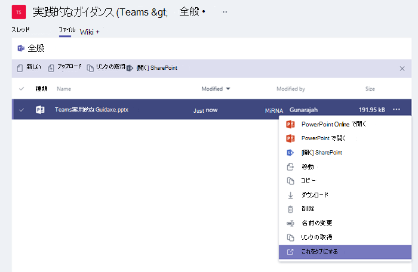

Microsoft Teams で組み込みタブとカスタム タブを使用する
==================================================

タブを使用すると、チーム メンバーがチャネル内の専用キャンバス上でサービスにアクセスすることができます。この機能では、提供されているツールやデータを使って直接に作業でき、チャネルの状況に応じてそれらのツールやデータについての会話することができます。すべての新しいチャネルには、次の画像に示す 2 つのタブが既定で用意されます。

-   会話

-   ファイル

1.  所有者とチーム メンバーは各チャネルにタブを追加して、クラウド サービスとの統合を図ることができます。

2.  Excel、PowerPoint、Word、PDF ファイルをタブに変換するには、まず最初に [**ファイル**] タブにアップロードする必要があります。既にアップロードしているファイルは、次に示すように単一のクリックでタブに変換できます。

    

3.  交換される情報の安全性を確保するため、Web サイト や URL は **https 接頭辞** で始まる必要があります。

4.  チーム メンバーがチャネルにカスタム タブを追加しようとすると、詳細な手順が提供されます。

5.  チャネルにカスタム タブを追加すると、**タブの会話**が作成され、チーム メンバーはそこでコンテンツに関する集中的なディスカッションを行うことができます。

    

6.  ユーザーが最も必要とするデータや頻繁に使用するデータに簡単にアクセスし管理できるようにするために、追加のタブを導入できます。たとえば、Power BI レポート、ダッシュボード、トレーニング ビデオを公開する [Microsoft Stream](https://go.microsoft.com/fwlink/?linkid=855785) ビデオ チャネルをタブとして追加できます。

    

カスタム タブを開発する
-------------------

組み込みタブに加え、独自のタブを簡単に設計して開発できます。Microsoft Teams に統合し、コミュニティのメンバーと共有することもできます。

Microsoft Developer Network には、独自のタブの設計と作成に関する[詳細な手順](https://go.microsoft.com/fwlink/?linkid=855786)が提供されています。Microsoft が開発した[サンプルのタブ](https://go.microsoft.com/fwlink/?linkid=855787)をダウンロードして展開してください。

