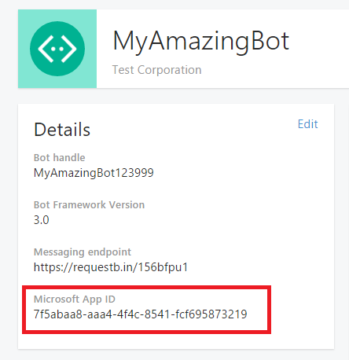

Microsoft Teams でプライベートのチャットやチャネルのボットを追加する
==========================================================
> [!IMPORTANT]
> [!INCLUDE [new-teams-sfb-admin-center-notice](includes/new-teams-sfb-admin-center-notice.md)]

ボットとは、クエリに応答したり、ユーザーが興味を持っている詳細や常に情報を得ていたい詳細について更新や通知を行う自動プログラムのことです。 ボットは、ユーザーが Microsoft Teams でのチャットの会話を通じて、タスク管理、スケジュール、ポーリングなどのクラウドサービスを操作できるようにします。 Microsoft Teams のボットは、 [Microsoft ボットフレームワーク](https://go.microsoft.com/fwlink/?linkid=854370)上に構築されています。 このフレームワークを使用して開発されたボットは、Microsoft Teams で簡単に有効にすることができます。 詳細については、[組織のMicrosoft Teams 設定の管理](enable-features-office-365.md)を参照してください。

現在、Microsoft Teams は、チーム内のプライベート チャットとチャネルにおけるボットをサポートしています。管理者は、Office 365 テナント内でのボットの使用可否を管理できます。

コミュニティにより開発されたボットは、Microsoft Teams 内で利用できます。 ボットを機能させるには、ボットの機能とサイド ローディングをテナント レベルで有効にする必要があります。 ボットはプライベート チャットまたはチャネルにおいて使用できます。 チャネルの場合、チーム所有者またはメンバーがボットを追加できます。

詳細については、[アプリとサービス](https://support.office.com/article/Apps-and-services-cc1fba57-9900-4634-8306-2360a40c665b)の「ボットの使用」セクションを参照してください。 

> [!IMPORTANT]
> テスト以外の理由で、[GUID] にボットを追加することはお勧めしません。 これにより、ボットの機能が大幅に制限されます。 製品使用中のボットは、アプリの一部として Teams に追加する必要があります。 「[ボットを作成](https://docs.microsoft.com/microsoftteams/platform/concepts/bots/bots-create)して、 [Microsoft Teams のボットをテストしてデバッグする](https://docs.microsoft.com/microsoftteams/platform/concepts/bots/bots-test)」を参照してください。

Microsoft Teams のカスタム ボットの作成
--------------------------------------

Microsoft ボット フレームワークを使用して、LOB アプリケーションに統合されるボットを簡単に作成できます。独自のボットを作成および公開する方法については、[Creating and Testing a bot for Microsoft Teams](https://go.microsoft.com/fwlink/?linkid=854371) のガイダンスを参照してください。

ボットを作成してボットのフレームワークに登録すると、それを公開することを選択できます。 公開しない場合、ボットはプライベートのままになります。 ボットを使う前にログインするようユーザーに要求することもできます。 ログインを要求することで、ボットのアプリケーション ID が既知のものになった場合でも組織の従業員のみがそのボットにアクセスできるようにできます。 ボットを使った Active Directory でユーザー認証を実行する方法のコード例については、GitHub の[*AuthBot*](https://go.microsoft.com/fwlink/?linkid=854372) をご覧ください。

ボットはチームへの展開前に [Bot Framework Emulator](https://go.microsoft.com/fwlink/?linkid=854373) を使用してテストできます。

プライベート チャット用の独自のボットのサイド ロード
---------------------------------------

1. ボットを作成したら、作成したボットの **アプリケーションの設定** に移動し、**アプリの設定**の **MicrosoftAppId**設定の値をコピーします。

2.  Microsoft Teams の [**チャット**] ウィンドウで [**Add chat icon (チャット アイコンの追加)**] を選択します。 [**To: (相手)**] にはボットの [**Microsoft App ID (Microsoft アプリ ID)**] を貼り付けます。 ![チャットを追加するアイコンと、[Microsoft App ID (Microsoft アプリ ID)] が強調表示された [To (相手)] 行が含まれているチャット ウィンドウのスクリーンショット。](media/Add_bots_for_private_chats_and_channels_in_Microsoft_Teams_image6.png)

3.  アプリ ID は [**ボット名**] になります。この手順の実行後にボットとのチャット会話を開始できます。

チャンネルのボットをサイド ローディングする
-----------------------------------

ここでは、ボットを同僚と共有する場合の、さまざまなチームのチャネルにボットを追加する方法を紹介します。

1. [ボットのアプリ パッケージを作成](https://docs.microsoft.com/microsoftteams/platform/concepts/apps/apps-upload)したら、Teams を開き、サイド ローディングするボットのチームを参照します。
2. **[アプリ Studio](https://docs.microsoft.com/microsoftteams/platform/get-started/get-started-app-studio)**、アプリを Microsoft Teams に追加します。
3. App Studio で、[**マニフェスト**エディター] タブの
4. ボットを追加するには、[機能] で [ボット] を選択し、既存のボットを追加するように選択します。ドロップダウンから既存のボットを選択するか、既存のボットの Id を入力するオプションが表示されます。

5. アプリ パッケージの場所を参照、選択し、**開く**を選択します。
6. ボットの名前を選択します ([範囲] セクションの [チーム] チェックボックスを忘れずに確認してください)。
7. [テストと配布] オプションを選択します。
8. ポップアップが表示されるダイアログボックスで、ボットを接続するチームを選択します。

これにより、お客様のボットが Microsoft チームのチームで利用できるようになります。
