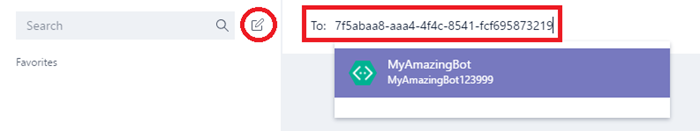

Microsoft のチームで非公開チャットとチャネルのコンポーネントを追加します。Add bots for private chats and channels in Microsoft Teams
==========================================================

コンポーネントをクエリに応答するか、他の更新プログラムが自動に通知を受け取るか興味を持ったユーザーの詳細についての通知。コンポーネントには、操作するタスクの管理、スケジュール、および Microsoft チームでチャットを行うを通じて、ポーリングなどのクラウド サービスにユーザーができるようにします。Microsoft チーム ロボットでは、 [Microsoft 結果 Framework](https://go.microsoft.com/fwlink/?linkid=854370)構築されます。チームが Microsoft には、このフレームワークを使用して開発されたコンポーネントが簡単に有効にすることができます。詳細については、 [Office 365 の組織で Microsoft チームを有効にする機能](enable-features-office-365.md)を参照してください。Bots are automated programs that respond to queries or give updates and notifications about details users find interesting or want to stay informed about. Bots allow users to interact with cloud services like task management, scheduling, and polling, through chat conversations in Microsoft Teams. Bots for Microsoft Teams are built on the [Microsoft Bot Framework](https://go.microsoft.com/fwlink/?linkid=854370). The bots that are developed using this framework can be enabled easily for Microsoft Teams. For more information, see [Enable Microsoft Teams features in your Office 365 organization](enable-features-office-365.md).

現時点では、Microsoft チームは、プライベート チャット チーム内でのチャンネルでコンポーネントをサポートします。管理者は、コンポーネントの使用を許可または Office 365 のテナント内の禁止かどうかを制御できます。Currently, Microsoft Teams support bots in private chats and channels within a team. Administrators can control whether the use of bots is allowed or prohibited within the Office 365 tenant.

コミュニティが開発したコンポーネントは、Microsoft チーム内で利用できます。ユーザー設定のコンポーネントが機能するは、テナント レベルでは、結果の機能と結果のサイドの読み込みを有効にする必要があります。プライベート チャットまたはチャンネルのコンポーネントを使用できます。チャンネルのチームの所有者またはメンバーは、コンポーネントを追加できます。Bots developed by the community can be leveraged within Microsoft Teams. The bot’s functionality and bot’s side loading must be enabled on the tenant level for custom bots to be functional. Bots can be used in private chats or in channels. For channels, team owners or members can add bots.

詳細については、[アプリとサービス](https://support.office.com/en-us/article/Apps-and-services-cc1fba57-9900-4634-8306-2360a40c665b)の「を使用するロボット」を参照してください。For more information, see the section "Using bots" in [Apps and services](https://support.office.com/en-us/article/Apps-and-services-cc1fba57-9900-4634-8306-2360a40c665b). 

 

Microsoft チームのユーザー設定のコンポーネントを作成します。Create custom bots for Microsoft Teams
--------------------------------------

簡単に作成できますに統合する結果 LOB アプリケーションに Microsoft 結果フレームワークを使用します。開発し、独自のコンポーネントを発行する方法については[、結果をチームが Microsoft のテストの作成と](https://go.microsoft.com/fwlink/?linkid=854371)ガイダンスを参照してください。You can easily create a bot that integrates in to your LOB applications, using the Microsoft Bot Framework. Please refer to [Creating and Testing a bot for Microsoft Teams](https://go.microsoft.com/fwlink/?linkid=854371) guidance to learn how you can develop and publish your own bots.

結果を作成して結果フレームワークに登録すると、それを公開することもできます。公開しない場合、結果はプライベートは残ります。ユーザーが、結果を使用する前にログインを要求することもできます。必要なログインでは、結果のアプリケーションの ID がわかっている場合でも、組織の従業員のみが、結果にアクセスできることを確認します。コンポーネントを使用して、Active Directory に対してユーザーを認証する方法については、GitHub [*AuthBot*](https://go.microsoft.com/fwlink/?linkid=854372)を参照してください。When you create a bot and register it with the Bot Framework, you can choose to publish it. If you don't publish it, the bot remains private. You can also require your users to log in before using the bot. Requiring login makes sure only employees of your organization can access the bot, even if the bot's application ID becomes known. See [*AuthBot*](https://go.microsoft.com/fwlink/?linkid=854372) on GitHub for a code example of how to authenticate users against your Active Directory using bots.

コンポーネントをテストするには、チームに展開する前に、[結果 Framework エミュレーター](https://go.microsoft.com/fwlink/?linkid=854373)を使用します。Bots can be tested using the [Bot Framework Emulator](https://go.microsoft.com/fwlink/?linkid=854373) before they are deployed into your Teams.

サイド プライベート通話用の独自の結果を読み込むSide load your own bot for private chat
---------------------------------------

1.  結果を作成した後は、開発すると、結果の**結果のダッシュ ボード**[ページ](https://go.microsoft.com/fwlink/?linkid=854374)に移動し、[の**詳細について**は、[ **Microsoft アプリケーションの ID**をコピーします。![が強調表示された Microsoft アプリケーション id を結果の詳細] ページのスクリーン ショット。](media/Add_bots_for_private_chats_and_channels_in_Microsoft_Teams_image5.png)After you have created your bot, go to the **Bot Dashboard** [page](https://go.microsoft.com/fwlink/?linkid=854374) for the bot you developed, and then under **Details**, copy the **Microsoft App ID**. 

2.  Microsoft チーム内で**[チャット**] ウィンドウで、[**チャットの追加] アイコン**を選択します。用**に**結果の**Microsoft アプリ ID**を貼り付けます。![追加チャットのアイコンで、[チャット] ウィンドウと Microsoft アプリ id が強調表示されている行のスクリーン ショット。](media/Add_bots_for_private_chats_and_channels_in_Microsoft_Teams_image6.png)From within Microsoft Teams, on the **Chat** pane, select the **Add chat icon**. For **To**, paste your bot's **Microsoft app ID**. 

3.  アプリ ID**結果名**に解決され、その結果に、会話を行うことができます。The app ID will resolve to your **bot name,** and then you can initiate a chat conversation with that bot.
