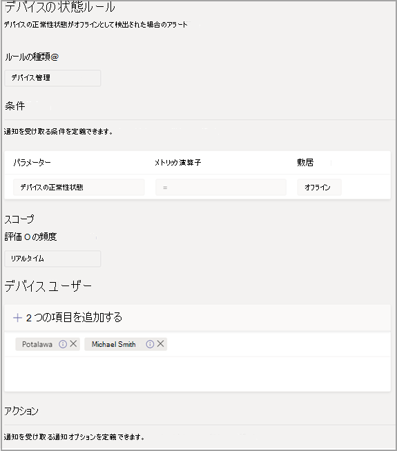
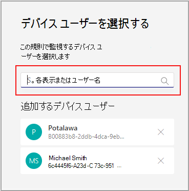

# Microsoft Teams デバイスの正常性の監視

Microsoft Teams 管理センターのデバイス正常性監視では、さまざまな Teams デバイスの正常性を積極的に監視することができます。 デバイスのオフライン状態を監視し、組織内の監視対象デバイスがオフラインの場合に通知をリアルタイムで受信します。  

開始する前に、テナントにチーム/チャネルの作成権限が必要です。 [詳細については、次の情報を参照してください](https://docs.microsoft.com/microsoft-365/solutions/manage-creation-of-groups?view=o365-worldwide)。

## デバイス状態ルールを構成する

1. Microsoft Teams 管理センターの左側のナビゲーションで、[通知と通知&**選択**  >  **します**。

   ![管理センターの [ルール] セクション](../media/select-rules.png)

2. [ルール **] ページで** 、[デバイスの **状態] ルールを選択します**。

3. 通知を有効にするための状態ルールを構成するデバイスを選択します。

    

## ルールの構成を解釈する

|フィールド |説明  |
|--------|-------------|
|**ルールの種類**   |デバイスの状態ルールは、効果的に管理するのに役立ちます。 Teams デバイス。デバイス管理の種類として分類されます。 今後、他の関連する機能を監視するために、デバイス管理の種類のルールが追加される予定です (例には、デバイスの不健康なデバイスとサインイン状態が含まれる場合があります)。|
|**状態**   |デバイスがオフラインの場合は、デバイスの正常性を監視できます。 Teams[管理](https://docs.microsoft.com/microsoftteams/devices/device-management)センターでのデバイス管理の詳細について説明します。 |
|**対象**   |ルールの評価頻度を指定することで、デバイスの正常性状態を監視する頻度を指定できます。 既定では、オフラインになる場合、チーム のデバイスはほぼリアルタイムで監視されます。 |
|**デバイス ユーザー**   |サインインしているユーザーに基づいてデバイスを選び、積極的にオフラインでの監視が必要なデバイスを指定できます。 詳細については、「構成 [のデバイスを選択する](#select-devices-for-configuration) 」を参照してください。 |
|**アクション**  > **チャネル通知**   |[アクション] セクションでは、通知を受け取るチーム チャネルを指定できます。 現在、管理者通知と通知 **という名前の** 既定のチームと **MonitoringAlerts** という名前のチャネルが作成され、通知が配信されます。     テナントのグローバル管理者と Teams 管理者は、この既定のチームに自動的に追加されます。|
|**アクション**  > **Webhook**   |外部 Webhook で通知を受け取る (オプション) JSON 通知ペイロードが送信される Webhook セクションで外部パブリック Webhook URL を指定します。      Webhook を介して通知ペイロードを組織内の他のシステムと統合し、カスタム ワークフローを作成できます。   

**Webhook の JSON ペイロード スキーマ:**   
<pre lang="json">{      "type": "object",     "properties": {        "AlertTitle": { "type": "string "} ,       "DeviceLoggedInUserId": { "type": "string" } ,       "DeviceId": { "type": "string" } ,        "MetricValues": {              "type": "object",             "properties": {                   "DeviceHealthStatus": { "type": "string"}              }         } ,        "RuleName": { "type": "string"} ,        "RuleDescription": { "type": "string"} ,        "RuleFrequency": { "type": "string"} ,        "RuleType": { "type": "string"} ,        "TenantId": { "type": "string"} ,         "RuleCondition": { "type": "string"} ,         "AlertRaisedAt": { "type": "string"}      }  } </pre>   

  **JSON ペイロードの例**:    <pre lang="JSON">    {        "AlertTitle":"*sample_device_name* of *User_Name* has become offline",       "DeviceLoggedInUserId": *User_GUID* ,       "DeviceId": *Device_GUID* ,        "MetricValues": {           DeviceHealthStatus": "offline"              },                  "RuleName": "Device state rule" ,        "RuleDescription": ":"Alerts when device health status is detected as offline" ,        "RuleFrequency": "Real-time" ,        "RuleType": "Device Management" ,        "TenantId": *Tenant_GUID* ,         "RuleCondition": "DeviceHealthStatus = Offline" ,         "AlertRaisedAt": "2020-02-28T12:49:06Z"      }  </pre>   

## 構成するデバイスを選択する

1. 監視する Teams デバイスを選択するには、それらのデバイスにサインインしているユーザーを選択します。 [デバイス **ユーザー]** セクションから **[追加] を選択** します。

2. デバイスの正常性状態を監視する 1 人または複数のユーザーを選択する

   

   選択したユーザーのリストが [デバイス ユーザー **] セクションに表示** されます。 ユーザーを追加または削除して、このリストを変更できます。

選択したユーザーのリストで使用されるサインイン デバイスはすべて、オフライン正常性状態を監視します。

## Teams クライアントの通知

通知は、管理者通知および通知チームの **自動作成 MonitoringAlerts** **チャネルで配信** されます。

デバイスのオフライン通知には、次の情報が含まれる場合があります。

- オフラインのデバイス名。
- オフライン デバイスのユーザー。
- デバイスがオフラインになった時刻。 (現在、時刻は UTC で表示されます)。
- 通知を発生したルールの種類。
- 通知が発生する理由。
