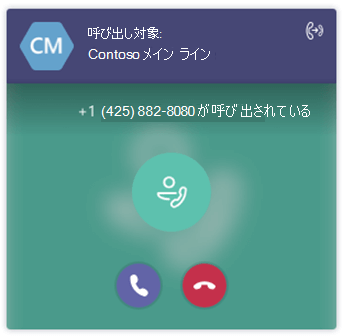

自動応答および通話キューの通話に Teams から直接応答する
===========================================================

Teams ユーザーは、クラウドの自動応答および通話キューを Teams クライアントから直接受信および応答できます。

## 自動応答および通話キューとは

クラウドの自動応答は、組織に対して通話を行うときに、人間のオペレーターの代わりに再生される一連の音声メッセージまたは音声ファイルを提供します。 自動応答により、発信者はメニュー システムを介して、通話、電話機のキーパッド (DTMF) を使用したユーザーの特定、音声認識を使用した音声入力を行うことができます。

クラウド通話キューには、誰かが組織の電話番号に電話をかけた際に流れる挨拶メッセージ、通話を自動的に保留する機能、および保留中に電話をかけてきた方に音楽を流し、その間に通話への対応が可能な次の電話エージェントを探す機能が含まれています。1 つまたは複数の通話キューを組織のために作成できます。

## 自動応答または通話キューの通話を処理する

ユーザーは、通話に応答する前に、着信通話と自動応答または通話キューを区別できます。 各通話には、発信者の名前や番号に加えて、発信者が連絡しようとしている人に関する情報が含まれ、ユーザーに発信者に対応するためのより良いコンテキストを提供します。

次の図は、自動応答または通話キューからの着信通話がユーザーにどのように表示されるかを示しています。

自動応答または通話キューの通話に応答すると、ユーザーは他の通話と同様に処理できます&#x2014。別のユーザーを追加したり、会議を行ったり、別の相手に転送したりできます。 また、自動応答通話はユーザーの構成に基づいて転送されます。

> [!NOTE] 
> 通話キューの呼び出しは、ユーザーの構成に基づいて転送されません。 これは、エージェントが通話に応答でき、発信者に予期しない転送がされない限り、発信者がキューに留まるようにするためです。

## サポートされるクライアント

自動応答および通話キューの通話は、次のクライアントで利用できます。

-    Microsoft Teams Windows クライアント (バージョン 32 および 64 ビット)
-    Microsoft Teams Mac クライアント
-    Microsoft Teams iPhone アプリ
-    Microsoft Teams Android アプリ

## Microsoft Teams の自動応答と通話キューのサポートを構成する

Microsoft Teams で自動応答および通話キューの通話を受信するには、相互運用性ポリシーおよびアップグレード ポリシーを構成する必要があります。 「[Teams を Skype for Business と一緒に使用する組織の移行と相互運用性](migration-interop-guidance-for-teams-with-skype.md)」を確認してください。 自動応答や通話キューが設定されておらず、設定したい場合は、「[クラウドの自動応答をセットアップする](create-a-phone-system-auto-attendant.md)」および「[クラウドの通話キューを作成する](create-a-phone-system-call-queue.md)」を参照してください。

## 関連トピック

-    [Microsoft 365 または Office 365 の電話システムとは](what-is-phone-system-in-office-365.md)
-    [クラウドの通話キューを作成する](create-a-phone-system-call-queue.md)
-    [クラウドの自動応答とは](what-are-phone-system-auto-attendants.md)
-    [クラウドの自動応答をセットアップする](create-a-phone-system-auto-attendant.md)

