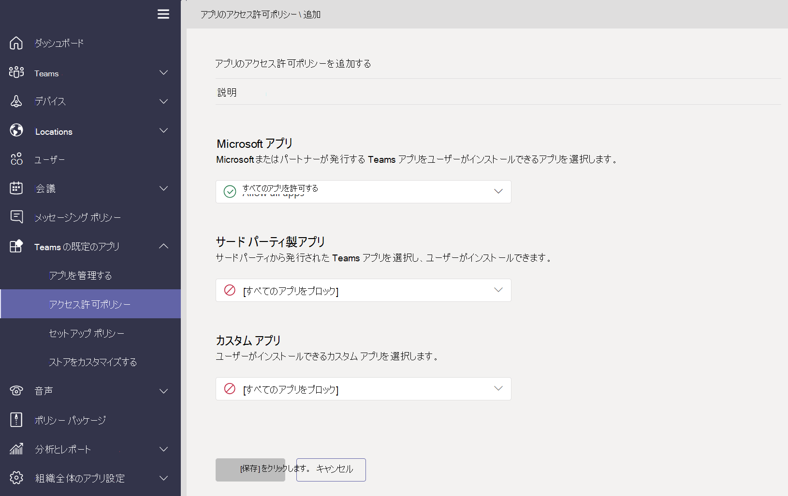

# Microsoft Teams でアプリ ポリシーを管理するManage app policies in Microsoft Teams

アプリ ポリシーは、Microsoft Teams でアプリケーションを制御するために使用されます。App policies are used to control applications in Microsoft Teams.

## アプリのアクセス許可ポリシーApp permission policies

**アプリのアクセス許可ポリシーは** 、ユーザーが利用できるアプリを制御するために使用されます。**App permission policies** are used to control what apps are available to your users. 管理者は、ユーザーが Teams アプリ ストアからインストールする特定のアプリを許可またはブロックできます。As an admin, you can allow or block specific apps that your users install from the Teams app store. [アプリのアクセス許可ポリシーは](teams-app-permission-policies.md) 、Microsoft Teams 管理センターを通じて管理されます。[App permission policies](teams-app-permission-policies.md) are managed through the Microsoft Teams admin center.

## アプリケーションの設定ポリシーApp setup policies

**アプリ セットアップ ポリシーを使用** すると、ユーザーの代わりにアプリケーションをピン留めしてインストールし、組織のこれらの設定を制御できます。**App setup policies** enable you to pin and install applications on behalf of your users and control these settings for your organization. [アプリセットアップ ポリシーは](teams-app-setup-policies.md) 、Teams 管理センターで管理されます。[App setup policies](teams-app-setup-policies.md) are managed in the Teams admin center.

## カスタム アプリ ポリシーCustom app policies

カスタム アプリ ポリシーを使用して、カスタム アプリを Teams にアップロード **できるユーザーを制御できます**。You can control who can upload custom apps to Teams with **custom app policies**. [カスタム アプリの設定とポリシーは](teams-custom-app-policies-and-settings.md) 、Microsoft Teams 管理センターを通じて管理されます。[Custom app settings and policies](teams-custom-app-policies-and-settings.md) are managed through the Microsoft Teams admin center.

## 関連トピックRelated topics

* [Teams のカスタム アプリのポリシーと設定を管理するManage custom app policies and settings in Teams](teams-custom-app-policies-and-settings.md)
* [Teams のアプリのセットアップ ポリシーを管理するManage app setup policies in Teams](teams-app-setup-policies.md)
* [Teams のアプリのアクセス許可ポリシーを管理するManage app permission policies in Teams](teams-app-permission-policies.md)
* [ポリシーを使用して Teams を管理するManage Teams with policies](manage-teams-with-policies.md)
