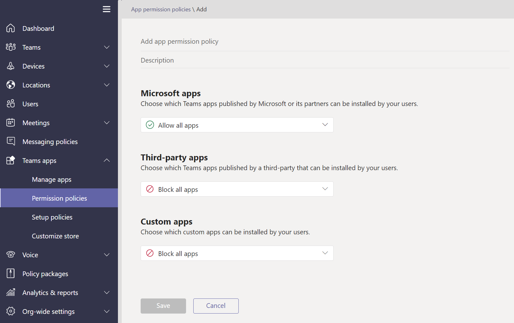

# アプリ ポリシーを管理する Microsoft TeamsManage app policies in Microsoft Teams

アプリ ポリシーは、アプリケーションの管理に使用Microsoft Teams。App policies are used to control applications in Microsoft Teams.

## アプリのアクセス許可ポリシーApp permission policies

**アプリのアクセス許可ポリシーは** 、ユーザーが使用できるアプリを制御するために使用されます。**App permission policies** are used to control what apps are available to your users. 管理者は、ユーザーがアプリ ストアからインストールする特定のアプリを許可Teamsできます。As an admin, you can allow or block specific apps that your users install from the Teams app store. [アプリのアクセス許可ポリシーは](teams-app-permission-policies.md)、管理センター Microsoft Teams管理されます。[App permission policies](teams-app-permission-policies.md) are managed through the Microsoft Teams admin center.

## アプリケーションの設定ポリシーApp setup policies

**アプリセットアップ ポリシーを使用** すると、ユーザーに代わってアプリケーションをピン留めしてインストールし、組織のこれらの設定を制御できます。**App setup policies** enable you to pin and install applications on behalf of your users and control these settings for your organization. [アプリのセットアップ ポリシー](teams-app-setup-policies.md)は、管理センター Teams管理されます。[App setup policies](teams-app-setup-policies.md) are managed in the Teams admin center.

## カスタム アプリ ポリシーCustom app policies

カスタム アプリ ポリシー を使用して、カスタム アプリをアップロードTeams **を制御できます**。You can control who can upload custom apps to Teams with **custom app policies**. [カスタム アプリの設定とポリシーは](teams-custom-app-policies-and-settings.md)、管理センター Microsoft Teams管理されます。[Custom app settings and policies](teams-custom-app-policies-and-settings.md) are managed through the Microsoft Teams admin center.

## 関連トピックRelated topics

* [Teams のカスタム アプリのポリシーと設定を管理するManage custom app policies and settings in Teams](teams-custom-app-policies-and-settings.md)
* [Teams のアプリのセットアップ ポリシーを管理するManage app setup policies in Teams](teams-app-setup-policies.md)
* [Teams のアプリのアクセス許可ポリシーを管理するManage app permission policies in Teams](teams-app-permission-policies.md)
* [ポリシー Teamsを管理するManage Teams with policies](manage-teams-with-policies.md)
