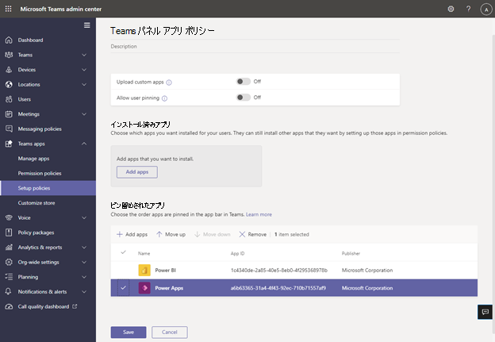

# Teams パネルでの Microsoft Teams アプリ/基幹業務 (LOB) アプリのサポート

Teams パネルでは、 [Teams アプリ/基幹業務 (LOB) アプリの](/microsoftteams/platform/overview)サポートが追加されています。 これにより、企業は組織のニーズを満たすためにパネルに追加のエクスペリエンスを追加できます。 このリリースでは、静的 Web コンテンツがサポートされています。

> [!IMPORTANT]
> この機能は、Teams パネル デバイスを更新した後にのみ使用できます。 Teams パネル内でアプリをサポートするには、Teams アプリ バージョン 1449/1.0.97.2021070601 以降が必要です。

## Teams パネルでの Teams アプリ エクスペリエンス

*Teams パネルのホーム画面には、アプリのナビゲーション オプションが含まれています。赤のスクリーンショットで囲まれています。これらはアイコンの例であり、使用できない場合があることに注意してください。*

*エンド ユーザーがいずれかのアプリ アイコンをタップすると、前のスクリーンショットに Teams アプリの画面が表示されます。スクリーンショットの灰色の四角形は、アプリがTeams パネルに表示される場所です。アプリ バーは固定されており、Teams パネル アプリの一部です。*

## Teams 管理センターで Teams パネル アプリを設定および管理する

Microsoft Teams アプリは、重要な情報、一般的なツール、信頼できるプロセスを、ユーザーが収集、学習、作業する場所に提供します。 Teams アプリは [、統合された機能を通じて機能します](/microsoftteams/platform/concepts/capabilities-overview)。 IT 管理者は、組織の Teams パネル デバイスに含めるアプリを選択し、 [Teams 管理センター](https://admin.teams.microsoft.com/)を使用してアクセス許可をカスタマイズできます。

Teams パネルで Teams アプリを使用し、組織のニーズに基づいてユーザー エクスペリエンスをカスタマイズできるようになりました。 ユーザーがアクセスして使用できる Web アプリを決定し、アプリ ビューに優先順位を付けることができます。 現時点では、ボットやメッセージング機能などの一部のオプションはサポートされていません。 [Teams アプリの](/microsoftteams/platform/overview)詳細と、[Microsoft Teams でデバイスを管理する方法について説明します](/microsoftteams/devices/device-management)。

## Teams 管理センターの Teams パネルでアプリを管理する

**注**: Teams [管理センター](https://admin.teams.microsoft.com/)にアクセスするには、グローバル管理者または Teams サービス管理者である必要があります。

エンド ユーザーは、Teams パネルにアプリを表示できますが、インストールすることはできません。 管理者は、Teams 管理センターを使用して、組織のすべての Teams アプリを表示および管理できます。 [Microsoft Teams 管理センターでアプリを管理](/microsoftteams/manage-apps)する方法の詳細については、**アプリの管理** に関するページを参照してください。 Teams 管理センター内の **[アプリの管理** ] ページでは、 [カスタム アプリ](/microsoftteams/manage-apps#publish-a-custom-app-to-your-organizations-app-store)をアップロードすることもできます。

アプリを設定したら、 [アプリのアクセス許可ポリシー](/microsoftteams/teams-app-permission-policies) と [アプリセットアップ ポリシー](/microsoftteams/teams-app-setup-policies) を使用して、組織内の特定のルーム アカウントのアプリ エクスペリエンスを構成できます。

## アプリセットアップ ポリシーを使用して Teams パネルにアプリをピン留めする

Teams にはさまざまなアプリを表示する機能が用意されているため、管理者は組織にとって最も重要なアプリを決定し、クイック アクセスのために Teams パネル **の [ホーム** ] 画面にのみピン留めできます。 ピン留めされたアプリが 5 つ以上ある場合、またはピン留めされていないアプリがある場合は、[ **その他** ] 画面に表示されます。 Microsoft では、Teams パネル専用のアプリ セットアップ ポリシーでカスタム ポリシーを作成することをお勧めします。

Teams パネルに表示されるピン留めされたアプリを管理するには、組織の Teams 管理センターにサインインし、[**Teams アプリ** \> **] [セットアップ ポリシー** \> **] [新しいポリシー**\>の選択または作成 **] [ピン留めされたアプリ**] に移動します。

*この画像に含まれるアプリは例に過ぎません。使用できない場合があります。*

Microsoft では、Teams パネルで最適な Teams アプリ エクスペリエンスを得るには、[ **カスタム アプリのアップロード]** と [ **ユーザーのピン留め** ] をオフにすることをお勧めします。

アプリのピン留めの詳細については、「 [アプリのセットアップ ポリシーを管理する](/microsoftteams/teams-app-setup-policies)」を参照してください。

## Teams パネルでアプリの表示順序を管理する

*この画像に含まれるアプリは例に過ぎません。使用できない場合があります。*

Teams パネルにアプリを表示する順序を管理するには、組織の Teams 管理センターにサインインし、[**Teams アプリ** \> **] [セットアップ ポリシー**\>] [**ポリシー** \> **の選択] [固定されたアプリ:** **移動/下へ]** の順に移動します。

## 会議室リソース アカウントへのセットアップ ポリシーの割り当て

セットアップ ポリシーを作成した後、管理者は Teams パネルにサインインする会議室リソース アカウントにこのポリシーを割り当てる必要があります。 詳細については、「 [ユーザーとグループにポリシーを割り当てる](/microsoftteams/assign-policies-users-and-groups)」を参照してください。

## よくあるご質問 (FAQ)

### Teams パネルが新しいアプリセットアップポリシーまたは更新されたアプリ設定ポリシーを取得するまでにどのくらいの時間がかかりますか?

Teams 管理センターで新しいポリシーを編集または割り当てた後、変更が有効になるまでに最大 24 時間かかることがあります。 管理者は、パネルからサインアウト/サインインを試み、 **設定** アイコンをタップし、[ **ホーム** ] 画面に戻ってポリシーの更新を試みることができます。

### [その他] 画面でのアプリの順序は何ですか?

[ **その他** のアプリ] ページに、ピン留めされたアプリが最初に表示されます。 その後、インストールされているその他のアプリはアルファベット順に表示されます。

### ボット アプリが Teams パネルに表示されないのはなぜですか?

現時点では、静的タブ Web コンテンツのみがサポートされています。

### 予定表やタスクなどのネイティブ Teams アプリが Teams パネルに表示されないのはなぜですか?

予定表やタスクなどのネイティブ Teams アプリは、Teams パネルには表示されません。

### Teams 管理センターの [セットアップ ポリシー] セクションで、インストールされているアプリとピン留めされたアプリの違いは何ですか?

Teams パネルの場合、Microsoft ではピン留めされたアプリを使用することをお勧めします。そのため、管理者は目的のアプリを選択して順序を並べ替えることができます。

**メモ：** 一部のアプリでは、アプリのピン留めをサポートしていません。 アプリのピン留め機能を有効にするには、アプリ開発者にお問い合わせください。

### Teams アプリセットアップ ポリシー セクションのインストール済みアプリまたはピン留めされたアプリの一部ではないにもかかわらず、他のアプリが [その他] 画面に表示されるのはなぜですか?

以前に他のアプリ ポリシーを使用してアプリをインストールしていた場合、または Teams パネルで使用される会議室リソース アカウントの Teams デスクトップ/Web クライアントに手動でインストールした場合、管理者は Teams の会議室リソース アカウントにサインインし、アプリを右クリックして [ **アンインストール**] を選択してアプリを手動でアンインストールする必要がある場合があります。

### [ピン留めされたアプリの追加] ウィンドウにアプリが見つからないのはなぜですか?

アプリのセットアップ ポリシーを使用して、すべてのアプリを Teams にピン留めできるわけではありません。 一部のアプリでは、この機能がサポートされていない場合があります。 ピン留めできるアプリを見つけるには、**[ピン留めされたアプリの追加]** ウィンドウでアプリを検索します。 詳細については、「 [アプリセットアップ ポリシーの使用」の FAQ](/microsoftteams/teams-app-setup-policies#why-cant-i-find-an-app-in-the-add-pinned-apps-pane) を参照してください。

### [ユーザーのピン留め] をオフにした後、セットアップ ポリシー パネルに [ユーザーのピン留め] ポップアップが表示されるのはなぜですか?

*この画像に含まれるアプリは例に過ぎません。使用できない場合があります。*

この動作は、共有スペース内のデバイスに対して想定され、意図しないアプリのピン留めを防ぐのに役立ちます。
