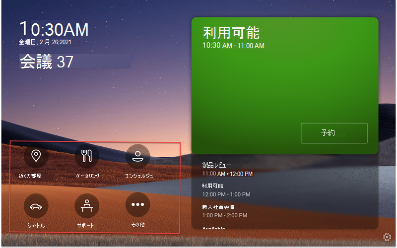
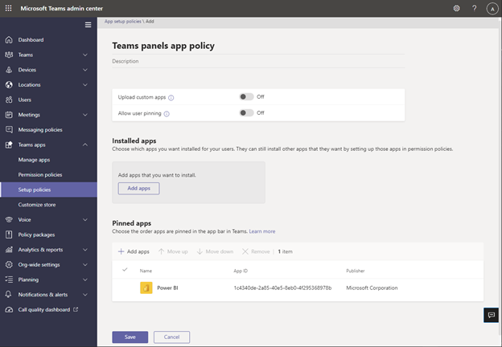

# Teams パネルでのMicrosoft Teams アプリ/基幹業務 (LOB) アプリのサポート

Teams パネルでは、[Teams アプリ/基幹業務 (LOB) アプリの](/microsoftteams/platform/overview)サポートが追加されています。 これにより、企業は組織のニーズを満たすためにパネルに追加のエクスペリエンスを追加できます。 このリリースでは、静的 Web コンテンツがサポートされています。

> [!IMPORTANT]
> この機能は、Teams パネル デバイスを更新した後でのみ使用できます。 Teams パネル内でアプリをサポートするには、Teams アプリ バージョン 1449/1.0.97.2021070601 以降が必要です。

## Teams パネルでのアプリエクスペリエンスのTeams

 

*Teams パネルのホーム画面には、アプリのナビゲーション オプションが含まれています。赤のスクリーンショットに示されています。これらはアイコンの例であり、使用できない場合があることに注意してください。*

*エンドユーザーがいずれかのアプリ アイコンをタップすると、前のスクリーンショットにTeamsアプリ画面が表示されます。スクリーンショットの灰色の四角形は、アプリがTeams パネルに表示される場所です。アプリ バーは固定されており、Teams パネル アプリの一部です。*

## Teams管理センターでTeams パネル アプリを設定および管理する 

Microsoft Teams アプリは、重要な情報、一般的なツール、信頼できるプロセスを、ユーザーが集まり、学び、働く場所に提供します。 Teams アプリは[、統合された機能を通じて機能します](/microsoftteams/platform/concepts/capabilities-overview)。 IT 管理者は、組織のTeams パネル デバイスに含めるアプリを選択し、[Teams管理センター](https://admin.teams.microsoft.com/)を使用してアクセス許可をカスタマイズできます。

Teams パネルでTeams アプリを使用し、組織のニーズに基づいてユーザー エクスペリエンスをカスタマイズできるようになりました。 ユーザーがアプリ ビューにアクセスして使用し、優先順位を付けることができる Web アプリを決定できます。 現時点では、ボットやメッセージング機能などの一部のオプションはサポートされていません。 [Teams アプリ](/microsoftteams/platform/overview)の詳細と[、Microsoft Teamsでデバイスを管理する方法](/microsoftteams/devices/device-management)について説明します。

## Teams管理センターのTeams パネルでアプリを管理する

**注**: Teams 管理センターにアクセスするには、グローバル管理者または [Teams サービス管理者](https://admin.teams.microsoft.com/)である必要があります。

エンド ユーザーは、Teams パネルにアプリを表示できますが、インストールすることはできません。 管理者は、Teams管理センターを使用して、組織のすべてのTeams アプリを表示および管理できます。 [Microsoft Teams管理センターでアプリを管理](/microsoftteams/manage-apps)する方法の詳細については、[**アプリの管理**] ページを参照してください。 Teams管理センター内の [**アプリの管理**] ページでは、[カスタム アプリ](/microsoftteams/manage-apps#publish-a-custom-app-to-your-organizations-app-store)をアップロードすることもできます。

アプリを設定した後、 [アプリのアクセス許可ポリシー](/microsoftteams/teams-app-permission-policies) と [アプリセットアップ ポリシー](/microsoftteams/teams-app-setup-policies) を使用して、組織内の特定のルーム アカウントに対するアプリ エクスペリエンスを構成できます。

## アプリセットアップ ポリシーを使用してTeams パネルにアプリをピン留めする

Teamsにはさまざまなアプリを表示する機能があるため、管理者は組織にとって最も重要なアプリを決定し、すばやくアクセスできるようにTeams パネル **のホーム** 画面に対してのみアプリをピン留めできます。 ピン留めされたアプリまたはピン留めされていないアプリが 5 つ以上ある場合は、[ **その他** ] 画面に表示されます。 Microsoft では、Teams パネル専用のカスタム アプリセットアップ ポリシーを作成することをお勧めします。

 

Teams パネルに表示されるピン留めされたアプリを管理するには、組織のTeams管理センターにサインインし、**Teams アプリ** \> **のセットアップ ポリシー** \> **の選択または新しいポリシー** \> **のピン留めアプリ** の作成に移動します。

 

*この画像に含まれるアプリは例に過ぎません。使用できない場合があります。*

Teams パネルで最適 **なTeams アプリ** エクスペリエンスを実現するために、カスタム アプリと **ユーザー ピン留め** アップロードオフにすることをお勧めします。

アプリのピン留めの詳細については、「 [アプリセットアップ ポリシーの管理」を](/microsoftteams/teams-app-setup-policies)参照してください。

## Teams パネルでアプリの表示順序を管理する 

*この画像に含まれるアプリは例に過ぎません。使用できない場合があります。*

Teams パネルにアプリが表示される順序を管理するには、組織のTeams管理センターにサインインし、**Teams アプリ** \> **のセットアップ ポリシー**\>に移動して、ポリシー  \>固定アプリ **を選択** します。

## 会議室リソース アカウントへのセットアップ ポリシーの割り当て

セットアップ ポリシーを作成した後、管理者は、Teams パネルにサインインするルーム リソース アカウントにこのポリシーを割り当てる必要があります。 詳細については、「 [ユーザーとグループにポリシーを割り当てる」を](/microsoftteams/assign-policies-users-and-groups)参照してください。

## よくあるご質問 (FAQ)

### Teams パネルが新しいアプリまたは更新されたアプリセットアップ ポリシーを取得するのにどのくらいの時間がかかりますか?

Teams管理センターで新しいポリシーを編集または割り当てた後、変更が有効になるまでに最大 24 時間かかることがあります。 管理者は、パネルからサインアウト/サインインを試み、**設定** アイコンをタップし、**ホーム** 画面に戻ってポリシーの更新を試みることができます。

### [その他] 画面のアプリの順序は何ですか?

[ **その他** のアプリ] ページで、ピン留めされたアプリが最初に表示されます。 その後、インストールされているその他のアプリはすべてアルファベット順で表示されます。

### ボット アプリがTeams パネルに表示されないのはなぜですか?

現時点では、静的タブの Web コンテンツのみがサポートされています。

### 予定表やタスクなどのネイティブ Teams アプリがTeams パネルに表示されないのはなぜですか?

予定表やタスクなどのネイティブ Teams アプリは、Teams パネルには表示されません。

### Teams管理センターの [セットアップ ポリシー] セクションで、インストールされているアプリとピン留めされたアプリの違いは何ですか?

Teams パネルの場合、管理者は目的のアプリを選択して順序を変更できるように、ピン留めされたアプリを使用することをお勧めします。

**メモ：** 一部のアプリでは、アプリのピン留めをサポートしていません。 アプリのピン留め機能を有効にするには、アプリ開発者にお問い合わせください。

### Teams アプリセットアップ ポリシー セクションのインストール済みアプリまたはピン留めされたアプリの一部ではないにもかかわらず、他のアプリが [その他] 画面に表示されるのはなぜですか?

Teams パネルで使用されているルーム リソース アカウントのTeams デスクトップ/Web クライアントにアプリが以前にインストールされていた場合、管理者はTeamsのルーム リソース アカウントにサインインし、アプリを右クリックしてアプリを手動でアンインストールしてから、[**アンインストール]** を選択する必要がある場合があります。

### [ピン留めされたアプリの追加] ウィンドウでアプリが見つからないのはなぜですか?

アプリのセットアップ ポリシーを使用して、すべてのアプリをTeamsにピン留めできるわけではありません。 一部のアプリでは、この機能がサポートされていない場合があります。 ピン留めできるアプリを見つけるには、[ピン留めされたアプリの **追加]** ウィンドウでアプリを検索します。 詳細については、「 [アプリセットアップ ポリシーの操作」の FAQ](/microsoftteams/teams-app-setup-policies#why-cant-i-find-an-app-in-the-add-pinned-apps-pane) を参照してください。

### [ユーザーのピン留め] をオフにした後、セットアップ ポリシー パネルに [ユーザーピン留め] ポップアップが表示されるのはなぜですか?

*この画像に含まれるアプリは例に過ぎません。使用できない場合があります。* 

この動作は、共有空間内のデバイスに対して想定され、意図しないアプリのピン留めを防ぐのに役立ちます。
