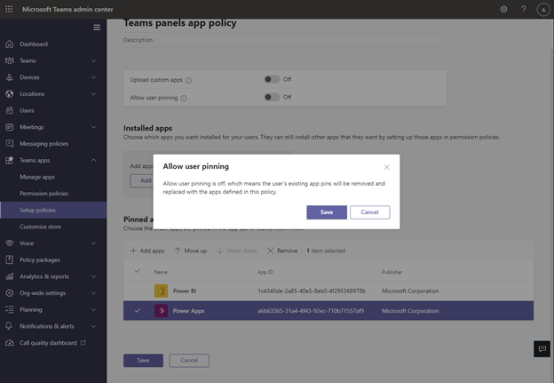

# Microsoft Teamsパネルでのアプリ/Line of Business (LOB) Teamsサポート

Teamsパネルでは、TEAMS/Line of Business (LOB) アプリのサポートが追加されています。 これにより、企業は、組織のニーズを満たすためにパネルに追加のエクスペリエンスを追加できます。 このリリースでは、静的 Web コンテンツがサポートされています。

> [!IMPORTANT]
> この機能は、パネル デバイスTeams更新した後にのみ使用できます。 Teams パネル内でアプリをサポートするには、Teams アプリ バージョン 1449/1.0.97.2021070601 以降が必要です。

## 管理センターでTeamsパネル アプリをTeams管理する 

Microsoft Teamsアプリは、重要な情報、一般的なツール、信頼できるプロセスを、ユーザーが収集、学習、作業する場所に提供します。 Teamsアプリは統合[された機能で動作します](/platform/concepts/capabilities-overview)。 IT 管理者は、組織の Teams パネル デバイスに含めるアプリを選択し、Teams 管理センターを介してアクセス許可をカスタマイズできます。

これで、ユーザー パネルTeamsアプリTeams、組織のニーズに基づいてユーザー エクスペリエンスをカスタマイズできます。 ユーザーがアプリ ビューにアクセスして使用し、優先度を設定できる Web アプリを決定できます。 ボットやメッセージング機能など、一部のオプションは現時点ではサポートされていません。 アプリの詳細とTeamsでデバイスを管理する方法についてMicrosoft Teams。

## 管理センターのTeamsパネルでアプリTeams管理する

**注**: 管理センターにアクセスするには、グローバル管理者または Teamsサービス管理者Teams必要があります。

エンド ユーザーは、ユーザーパネルにアプリを表示できますが、インストールTeamsできます。 管理者は、管理センターから組織Teamsアプリを表示およびTeamsできます。 [アプリの管理] ページを使用して、Microsoft Teams管理センターでアプリを管理する方法 **について詳しくは、ご覧** ください。 管理 **センター内の**[アプリのTeams] ページでは、カスタム アプリを [アップロードすることもできます](/manage-apps#publish-a-custom-app-to-your-organizations-app-store)。

アプリを設定した後、アプリのアクセス許可ポリシーとアプリセットアップ ポリシーを使用して、組織内の特定のルーム アカウントのアプリ エクスペリエンスを構成できます。

## アプリセットアップ ポリシーを使用Teamsパネルにアプリをピン留めする

Teamsにはさまざまなアプリを表示する機能が用意されていますので、管理者は組織にとって最も重要なアプリを決定し、Teams パネルのホーム画面でのみピン留めしてすばやくアクセスできます。 ピン留めされたアプリまたはピン留めされていないアプリが 5 つ以上ある場合は、[その他] 画面に **表示** されます。 Microsoft では、ユーザー設定パネル専用のカスタム アプリセットアップ ポリシー Teams勧めします。

 

Teams パネルに表示される固定アプリを管理するには、組織の Teams 管理センターにサインインし **、[Teams** アプリのセットアップ ポリシー] [新しいポリシーのピン留めされたアプリを選択または作成する] に移動します。 \>  \>  \> 

 

Microsoft では、カスタム アプリのアップロード **をオフ** にし、ユーザーのピン留めを許可して、Teamsのアプリ エクスペリエンスをTeams勧めします。 

アプリのピン留めについて詳しくは、「アプリセットアップ [ポリシーの管理」をご覧ください](/teams-app-setup-policies)。

## アプリの表示順序を管理する (Teamsパネル) 

![ユーザー インターフェイス内の [アプリ] セクションのスクリーンショット。](media/appsetup3.png) 

Teams パネルにアプリを表示する順序を管理するには、組織の Teams 管理センターにサインインし **、[Teams** アプリのセットアップ ポリシー] [ポリシーピン留めされたアプリを選択します。 \>  \>  \>  

## セットアップ ポリシーをルーム リソース アカウントに割り当てる

セットアップ ポリシーを作成した後、管理者は、このポリシーを、管理者パネルにサインインするルーム リソース アカウントに割り当てるTeamsがあります。 詳細については、「ユーザーとグループに [ポリシーを割り当てる」を参照してください](/assign-policies-users-and-groups)。

## よくあるご質問 (FAQ)

### 新しいまたは更新されたアプリのセットアップ Teamsを取得するには、パネルにどのくらいの時間が必要ですか?

管理センターで新しいポリシーを編集または割り当Teams、変更を有効にするには最大 24 時間かかる場合があります。 管理者は、パネルからサインアウト/サインインを試み **、設定** アイコンをタップし、ホーム画面に戻ってポリシーを更新できます。

### [その他] 画面のアプリの順序は何ですか?

[その他 **のアプリ** ] ページで、ピン留めされたアプリが最初に表示されます。 その後、インストールされている他のアプリはアルファベット順に表示されます。

### ボット アプリがデバイス パネルに表示されないTeams。

現時点では、静的タブの Web コンテンツだけがサポートされています。

### カレンダーやタスクTeamsなど、ネイティブ アプリがアプリ パネルに表示されないTeams。

予定表Teamsタスクなどのネイティブ アプリは、ユーザーパネルTeamsされません。

### 管理センター Teams[セットアップ ポリシー] セクションで、インストールされているアプリとピン留めされたアプリの違いは何ですか?

パネルTeams、ピン留めされたアプリの使用をお勧めします。そのため、管理者は目的のアプリを選択し、順序を変更できます。

**注:** 一部のアプリでは、アプリのピン留めがサポートされていません。 アプリのピン留め機能を有効にするには、アプリ開発者にお問い合わせください。

### [アプリのセットアップ ポリシー] セクションのインストール済みアプリまたはピン留めされたアプリの一部ではない場合でも、他のアプリが [その他] 画面Teams表示される理由

Teams パネルで使用されるルーム リソース アカウントの Teams デスクトップ/Web クライアントにアプリが以前にインストールされている場合、管理者は Teams のルーム リソース アカウントにサインインし、アプリを右クリックして手動でアンインストールし、[アンインストール] を選択する必要があります。 

### [ピン留めされたアプリの追加] ウィンドウにアプリが見当たらない理由

アプリセットアップ ポリシーを使用して、Teamsにピン留めできるアプリはありません。 一部のアプリでは、この機能がサポートされていない場合があります。 ピン留めできるアプリを検索するには、[ピン留めされたアプリの追加 **] ウィンドウでアプリを検索** します。 詳細については、「アプリセットアップ ポリシー [の操作」の FAQ を参照してください](/teams-app-setup-policies#why-cant-i-find-an-app-in-the-add-pinned-apps-pane)。

### [ユーザーのピン留めを許可する] をオフにした後、セットアップ ポリシー パネルに "ユーザーピン留めを許可する" ポップアップが表示される理由

 

この動作は、共有領域内のデバイスで予期される動作であり、意図しないアプリのピン留めを防ぐのに役立ちます。
