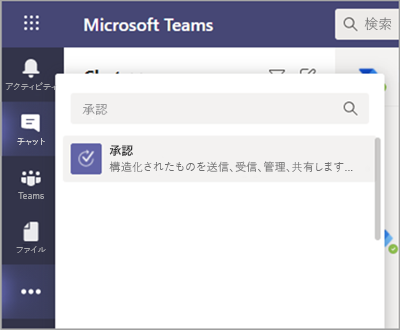
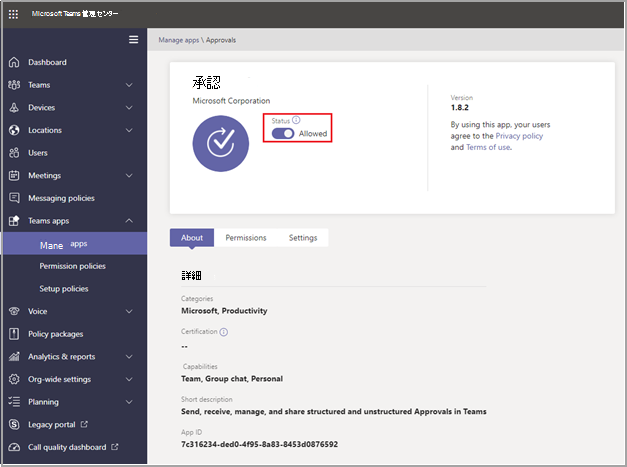

# Teams 承認アプリの可用性Teams Approvals app availability

[!INCLUDE [preview-feature](includes/preview-feature.md)]

承認アプリは、すべての Microsoft Teams ユーザーの個人用アプリとして使用できます。The Approvals app is available as a personal app for all Microsoft Teams users.
承認アプリは、監査、コンプライアンス、責任、ワークフローを Teams の構造化された承認と非構造化承認の両方に表示する簡単な方法を提供します。The Approvals app provides a simple way to bring auditing, compliance, accountability, and workflows to both structured and unstructured Approvals in Teams.

 

ユーザーは承認アプリをピン留めして、メニュー バーに保存できます。Users can pin the Approvals app to save it to the menu bar.

 ![[ピン] オプションが表示された承認アプリ](media/approvalApp-pin.png)

承認アプリから最初に作成された承認は、既定の Common Data Service (CDS) 環境での承認ソリューションのプロビジョニングをトリガーします。The first approval created from the Approvals app will trigger the provisioning of the Approval Solution in the default Common Data Service (CDS) environment. 承認アプリから作成された承認は、既定の CDS 環境に保存されます。Approvals created from the Approvals app will be stored in the default CDS environment.

この記事では、承認アプリの要件とロールについて説明します。This article describes the Approvals app requirements and roles.

## 必要なアクセス許可とライセンスRequired permissions and licenses

承認アプリを使用するには、次のアイテムに対するアクセス許可が必要です。To use the Approvals app, you need permission for the following items:

- Microsoft CDS データベースを作成する権限。Permissions to create a Microsoft CDS database.

- アカウント [のflow.microsoft.com](https://flow.microsoft.com/)An account on [flow.microsoft.com](https://flow.microsoft.com/)

- ターゲット環境の管理者ロール。Administrator Role in the target environment.

- [Power Automate、Office](https://docs.microsoft.com/power-automate/get-started-approvals)365、または Dynamics 365 のライセンス。License for a [Power Automate](https://docs.microsoft.com/power-automate/get-started-approvals), an Office 365, or a Dynamics 365.

## CDS 付きストレージStorage with CDS

共通データ モデル (CDM) は、CDS のビジネス アプリケーションや分析アプリケーションで使用される共有データ言語です。The Common Data Model (CDM) is the shared data language used by business and analytical applications in the CDS. Microsoft とパートナーが公開する標準化された拡張データ スキーマのセットで構成され、アプリケーションやビジネス プロセス全体でデータとその意味の一貫性を保ちます。It consists of a set of a standardized, extensible data schemas published by Microsoft and our partners that enables consistency of data and its meaning across applications and business processes. Microsoft Power [Platform の共通データ モデルの詳細については、以下を参照してください](https://docs.microsoft.com/power-automate/get-started-approvals)。Learn more about the [Common Data Model of the Microsoft Power Platform](https://docs.microsoft.com/power-automate/get-started-approvals).

承認ワークフローの [詳細については、以下を参照してください](https://docs.microsoft.com/power-automate/modern-approvals)。Learn more about the [Approval workflow](https://docs.microsoft.com/power-automate/modern-approvals).

## 承認 Teams アプリのアクセス許可Approvals Teams app permissions

承認チーム アプリでは、次の機能にアクセスできます。The Approvals Teams app lets you access the following features:

- 指定したメッセージとデータを受信します。Receive messages and data that you provide to it.

- メッセージと通知を送信します。Send you messages and notifications.

- Teams が提供するヘッダーなしで個人用アプリとダイアログを表示します。Render personal apps and dialogs without a Teams-provided header.

- 名前、メール アドレス、会社名、優先する言語などのプロファイル情報にアクセスします。Access your profile information such as your name, email address, company name, and preferred language.

- チャネルでチーム メンバーが提供するメッセージとデータを受信します。Receive messages and data that team members provide to it in a channel.

- チャネルでメッセージと通知を送信します。Send messages and notifications in a channel.

- チームの情報にアクセスします。Access your team's information:
  - チーム名team name
  - チャネル リストchannel list
  - リスト (チーム メンバーの名前とメール アドレス)roster (team member's names and email addresses).

- チームの情報を使用して、チームに連絡します。Use the team's information to contact them.

## 承認アプリを無効にするDisable the Approvals app

承認アプリは既定で使用できます。The Approvals app is available by default. Teams 管理センターでアプリを無効にできます。You can disable the app in the Teams admin center.

  1. Teams 管理センターにサインインします。Sign in to the Teams admin center.

  2. Teams アプリ **を展開し、[** アプリの **管理] を選択します**。Expand **Teams apps** and select **Manage apps**.

  3. 承認アプリを検索します。Search for the Approvals app.

![[Teams アプリ] と [アプリの管理] が>管理センターのナビゲーションを表示する](media/manage-approval-apps.png)

  4. [承認] を選択します。Select Approvals.

  5. トグルを選択して、組織のアプリを無効にします。Select the toggle to disable the app for your organization.

## アイテム保持ポリシーRetention policy

承認アプリから作成された承認は既定の CDS 環境に保存されます。現時点ではバックアップはサポートされていません。Approvals created from the Approvals App are stored in the default CDS environment, which doesn’t support backups at this time. 環境をバックアップおよび復元 [する方法の詳細については、Power Platform \| Microsoft Docs を参照してください](https://docs.microsoft.com/power-platform/admin/backup-restore-environments)。Learn more about how to [Back up and restore environments - Power Platform \| Microsoft Docs](https://docs.microsoft.com/power-platform/admin/backup-restore-environments).

## 監査Auditing

承認アプリは、Microsoft 365 セキュリティ/コンプライアンス センター内の監査イベントをログに記録します。The Approvals App logs audit events within the Microsoft 365 Security and Compliance Center. 監査ログを表示できます。You can view the audit log.

1. M365 コンプライアンス サイトに移動します。Go to the M365 Compliance Site.

2. [監査] **セクションを選択** します。Select the **Audit** section.

3. Microsoft Teams の承認アクティビティ **の下でアクティビティを検索します**。Search for activities under **Microsoft Teams approvals activities**.

次のアクティビティを検索できます。You can search for the following activities:

- 新しい承認要求を作成するCreate new approval request

- 承認要求の詳細を表示するView approval request details

- 承認された承認要求Approved approval request

- 承認要求が却下されましたRejected approval request

- 承認要求が取り消されましたCanceled approval request

- 共有承認要求Shared approval request

- 承認要求に添付されたファイルFile attached to approval request

- 再割り当てされた承認要求Reassigned approval request

- 承認要求に電子署名が追加されましたAdded e-signature to approval request

Flow 内で他の監査承認にアクセスするには、プライマリ承認エンティティの承認、承認要求、承認応答の既定の環境で監査を有効にして構成します。For access to more auditing approvals within Flow, enable and configure auditing in the default environment for the primary approval entities Approval, Approval Request, and Approval Response. 作成、更新、削除の操作は、承認レコードの監査可能なイベントです。Create, update, and delete operations are auditable events for Approval records. セキュリティとコンプライアンスの [データとユーザー アクティビティの監査について詳しくは、Power Platform Microsoft Docs をご \| 覧ください](https://docs.microsoft.com/power-platform/admin/audit-data-user-activity)。Learn more about [Audit data and user activity for security and compliance - Power Platform \| Microsoft Docs](https://docs.microsoft.com/power-platform/admin/audit-data-user-activity).

監査は [、Microsoft 365](https://support.office.com/article/go-to-the-office-365-security-compliance-center-7e696a40-b86b-4a20-afcc-559218b7b1b8?ui=en-US&rs=en-US&ad=US)セキュリティ/コンプライアンス センターでさらにカスタマイズできます。Auditing can be customized further in the [Microsoft 365 Security and Compliance Center](https://support.office.com/article/go-to-the-office-365-security-compliance-center-7e696a40-b86b-4a20-afcc-559218b7b1b8?ui=en-US&rs=en-US&ad=US).

1. 事前に構成されたレポートを使用するには、Office 365 セキュリティ/コンプライアンスにサインインします。To use the preconfigured reports, sign in to Office 365 Security and Compliance.

2. [検索 **と調査&選択します**。Select **Search & investigation**.

3. 監査ログを検索し **、[Dynamics 365 アクティビティ] タブを選択** します。Search the Audit log and select the **Dynamics 365 activities** tab.

[Microsoft Dataverse とモデル駆動型アプリのアクティビティ ログの詳細については、Power Platform を参照してください](https://docs.microsoft.com/power-platform/admin/enable-use-comprehensive-auditing)。Learn more about [Microsoft Dataverse and model-driven apps activity logging - Power Platform](https://docs.microsoft.com/power-platform/admin/enable-use-comprehensive-auditing).

## セキュリティSecurity

Teams 承認アプリから、ユーザーは新しい承認を作成し、送信および受信した承認を表示するアクセス権を持っています。From the Teams Approval App, users have access to create new Approvals and view Approvals that they have sent and received. 他のユーザーが作成した承認へのアクセス権は、ユーザーが回答者または要求の閲覧者ではない限り、アクセスできません。Users won't have access to Approvals that are created by others unless they're either a responder or a viewer of the request.

> [!Note]
> 承認が作成されたチャットまたはチャネルの一部である場合、ユーザーにはリクエストの閲覧者の役割が与えられる。A user will be given a viewer role of a request if they are part of the chat or channel where the approval was created. 承認が作成された際にロールが与えらなかった場合、要求に対してアクションを実行することはできません。They won't have the ability to take action on the request if they weren't given that role when the approval was created.
