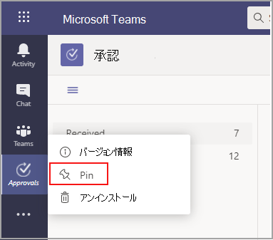

# Teams 承認アプリの利用の可否

Microsoft Teams ユーザーは、個人用アプリとして承認アプリを利用することができます。
承認アプリは、Teams 内の構造化された承認と構造化されていない承認の両方に対して、監査、コンプライアンス、説明責任、およびワークフローを簡単にする方法を提供します。 

 

ユーザーは承認アプリをピン留めしてメニュー バーに保存できます。

 

承認アプリから最初の承認が作成されると、既定の共通データ サービス (CDS) 環境にて承認ソリューションがプロビジョニングされます。 承認アプリから作成された承認は、既定の CDS 環境に保存されます。

この記事では、承認アプリの要件と役割について説明します。

## 必要なアクセス許可とライセンス

承認アプリを使用するには、次のアイテムに対する権限が必要です。

- Microsoft CDS データベースを作成する権限。

- [flow.microsoft.com](https://flow.microsoft.com/) のアカウント 

- ターゲット環境における管理者の役割。

- [Power Automate](https://docs.microsoft.com/power-automate/get-started-approvals)、Office 365、または Dynamics 365 のライセンス。

## CDS を使用するストレージ

共通データ モデル (CDM) は、CDS のビジネス アプリケーションや分析アプリケーションで使用される共有データ言語です。 これは、Microsoft とそのパートナーによって公開された、一連の標準化された拡張可能なデータ スキーマで構成されており、アプリケーションとビジネス プロセス全体でデータとその意味の一貫性を実現します。 [Microsoft Power Platform の共通データ モデル](https://docs.microsoft.com/power-automate/get-started-approvals)の詳細については、以下をご覧ください。

[承認ワークフロー](https://docs.microsoft.com/power-automate/modern-approvals)の詳細。

## Teams アプリの権限の承認

Teams アプリの承認では、次の機能にアクセスできます。

- メッセージやデータを受信します。

- メッセージと通知を送信します。

- Teams が提供するヘッダーを必要とすることなく、個人用アプリとダイアログをレンダリングします。

- [名前]、[電子メールアドレス]、[会社名]、[優先する言語] などの個人用プロフィール情報にアクセスします。

- チーム メンバーがチャネルで提供するメッセージとデータを受信します。

- チャネルでメッセージと通知を送信する。

- チームの情報にアクセスする:
  - チーム名
  - チャネル リスト
  - 名簿 (チーム メンバーの名前とメール アドレス)。

- チームの情報を使用してメンバーに連絡します。

## 承認アプリを無効にする

承認アプリは既定で利用可能です。 Teams 管理センターでアプリを無効にできます。

  1. Teams 管理センターにサインインします。

  2. ［**Teams アプリ**］ を開き、［**アプリの管理**］ を選択します。

  3. 承認アプリを検索します。

![強調表示されている [Teams アプリ] > [アプリの管理] を使用して、管理センター ナビゲーションを表示する](media/manage-approval-apps.png)

  4. [承認] を選択します。

  5. 切り替えを選択して、組織のアプリを無効にします。

## アイテム保持ポリシー

承認アプリから作成された承認は既定の CDS 環境に保存されます。現時点では、バックアップはサポートされません。 詳細については、「[環境のバックアップと復元の方法Power Platform \|Microsoft Docs](https://docs.microsoft.com/power-platform/admin/backup-restore-environments)」をご覧ください。

## 監査

承認アプリは、Microsoft 365 セキュリティ/コンプライアンス センター内の監査イベントをログに記録します。 監査ログを表示できます。

1. Microsoft 365 コンプライアンス センターにアクセスします。

2. [**監査**］ セクションを選択 します。

3. 「**Microsoft Teams の承認アクティビティ**」からアクティビティを検索します。

次のアクティビティを検索できます。

- 新しい承認要求を作成する

- 承認要求の詳細を表示する

- 承認要求が承認されました

- 承認要求が拒否されました

- 承認要求がキャンセルされました

- 共有された承認要求

- 承認要求に添付されているファイル

- 再割り当てされた承認要求

- 電子署名が追加された承認要求

フロー内の他の監査承認にアクセスするには、プライマリ承認エンティティの承認、承認要求、承認応答の既定の環境において、監査を有効にして構成します。 作成、更新、および削除の操作は、承認レコードにて監査可能なイベントです。 詳細については、「[セキュリティとコンプライアンスのための監査データとユーザー アクティビティ - Power Platform \|Microsoft Docs](https://docs.microsoft.com/power-platform/admin/audit-data-user-activity)」をご覧ください。

監査は、「[Microsoft 365 セキュリティとコンプライアンス センター](https://support.office.com/article/go-to-the-office-365-security-compliance-center-7e696a40-b86b-4a20-afcc-559218b7b1b8?ui=en-US&rs=en-US&ad=US)」にてさらにカスタマイズできます。

1. 構成済みのレポートを使用するには、「Microsoft 365 のセキュリティとコンプライアンス」にサインインします。

2. 「**検索と調査**」を選択します。

3. 監査ログを検索し、[**Dynamics 365 アクティビティ**］を選択 します。

詳細については、「[Microsoft Dataverse モデルベース アプリ アクティビティ ログ - Power Platform](https://docs.microsoft.com/power-platform/admin/enable-use-comprehensive-auditing)」を参照してください。

## セキュリティ

ユーザーは、Teams 承認アプリから新しい承認を作成することができ、自分が送受信した承認を表示することができます。 ユーザーは、要求の回答者または閲覧者ではない限り、他のユーザーが作成した承認にはアクセスできません。

> [!Note]
> ユーザーが、承認の作成されたチャットまたはチャネルの一部である場合、要求の閲覧者の役割が与えられます。 承認が作成された際に、その役割が与えられなかった場合は、要求に対してアクションを実行することはできません。
