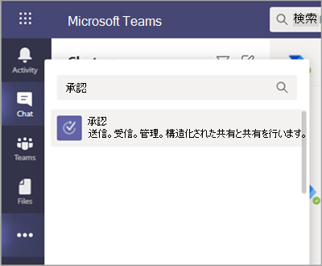

# Teams 承認アプリの利用の可否

Microsoft Teams ユーザーは、個人用アプリとして承認アプリを利用することができます。
承認アプリは、Teams 内の構造化された承認と構造化されていない承認の両方に対して、監査、コンプライアンス、説明責任、およびワークフローを簡単にする方法を提供します。 

 

ユーザーは承認アプリをピン留めしてメニュー バーに保存できます。

 

承認アプリから最初の承認が作成されると、既定の共通データ サービス (CDS) 環境にて承認ソリューションがプロビジョニングされます。 承認アプリから作成された承認は、既定の CDS 環境に保存されます。

この記事では、承認アプリの要件と役割について説明します。

> [!NOTE]
> この機能は、High (GCCH) Government Community Cloud国防総省 (DOD) ユーザーにはまだリリースされていません。

## 必要なアクセス許可とライセンス

承認アプリを展開するには、次のアイテムに対する権限が必要です。

- Microsoft CDS データベースを作成する権限。

- [flow.microsoft.com](https://flow.microsoft.com/) のアカウント 

- ターゲット環境における管理者の役割。

- [Power Automate](/power-automate/get-started-approvals)、Office 365、または Dynamics 365 のライセンス。

- ユーザーが新しい承認テンプレートを設定するには、Microsoft Forms のライセンスが必要です。

承認アプリを使用するには、Power Automate のライセンスが必要です。最初の承認割り当てで、ターゲット環境に [承認ユーザー] ロールにアカウントが自動的に追加されます。

## CDS を使用するストレージ

共通データ モデル (CDM) は、CDS のビジネス アプリケーションや分析アプリケーションで使用される共有データ言語です。 これは、Microsoft とパートナーによって発行された、標準化された拡張可能なデータ スキーマのセットで構成され、アプリケーションやビジネス プロセス全体でデータとその意味の一貫性を実現します。 [Microsoft Power Platform の共通データ モデル](/power-automate/get-started-approvals)の詳細については、以下をご覧ください。

[承認ワークフロー](/power-automate/modern-approvals)の詳細。

テンプレートから作成された承認は、タイトル、詳細、テンプレート ID などのデータを引き続き CDS に保存します。 承認要求で送信される応答は Forms に保存されます。  [Microsoft Forms のデータの保存場所](https://support.microsoft.com/office/data-storage-for-microsoft-forms-97a34e2e-98e1-4dc2-b6b4-7a8444cb1dc3#:~:text=Where%20data%20is%20stored%20for%20Microsoft%20Forms.%20Microsoft,European-based%20tenants%20is%20stored%20on%20servers%20in%20Europe)の詳細。

>[!Note]
>Microsoft Forms サイトで Forms テンプレートを削除すると、承認テンプレートが破損し、ユーザーは要求を開始できなくなります。 ユーザーが Microsoft Forms で削除された承認テンプレートを開こうとすると、"CDB TableNotFound" というエラーが表示されます。

組織スコープのテンプレートは、テナントとチーム スコープのテンプレートの同じ有効期間を共有し、チームの同じ有効期間を共有します。 そのため、チームを完全に削除すると、関連するテンプレートも削除されます。

## Teams アプリの権限の承認

Teams アプリの承認では、次の機能にアクセスできます。

- メッセージやデータを受信します。

- メッセージと通知を送信します。

- Teams が提供するヘッダーを必要とすることなく、個人用アプリとダイアログをレンダリングします。

- [名前]、[電子メールアドレス]、[会社名]、[優先する言語] などの個人用プロフィール情報にアクセスします。

- チーム メンバーがチャネルで提供するメッセージとデータを受信します。

- チャネルでメッセージと通知を送信する。

- チームの情報にアクセスする:
  - チーム名
  - チャネル リスト
  - 名簿 (チーム メンバーの名前とメール アドレス)。

- チームの情報を使用してメンバーに連絡します。

承認テンプレートのアクセス許可

- すべてのチーム所有者は、所有するチームの承認テンプレートを作成できます。

- 管理者が初めて組織全体のテンプレートを作成すると、グローバルおよび Teams サービス管理者を含む、テナントのすべての管理者に対して新しい Azure Active Directory (AAD) グループが自動的に作成されます。 これらの管理者はグループの所有者として追加され、組織のテンプレートを共同管理できます。 チームの作成後に組織に新しい管理者をグループ所有者として手動で追加する必要があります。そのため、組織全体のテンプレートを管理する権限は同じです。

> [!Note]
> 管理者がグループを削除した場合、Azure Active Directory (AAD) ポータル内でグループを復元して、すべての関連データを復元できます。 1 か月後、または管理者がごみ箱内でこのグループを削除すると、関連するデータはすべて失われる可能性があります。

## 承認アプリを無効にする

承認アプリは既定で利用可能です。 Teams 管理センターでアプリを無効にできます。

  1. Teams 管理センターにサインインします。

  2. [アプリの **管理Teams アプリ**  >  **] に移動します**。

  3. 承認アプリを検索します。

     ![強調表示されている [Teams アプリ] > [アプリの管理] を使用して、管理センター ナビゲーションを表示する。](media/manage-approval-apps.png)

  4. [ **承認] を選択します**。

  5. 切り替えを選択して、組織のアプリを無効にします。

     :::image type="content" alt-text="承認アプリの詳細を表示する。" source="media/approvals-details-new.png" lightbox="media/approvals-details-new.png":::

## アイテム保持ポリシー

承認アプリから作成された承認は、現時点ではバックアップをサポートしない既定の CDS 環境に格納されます。 詳細については、「[環境のバックアップと復元の方法Power Platform \|Microsoft Docs](/power-platform/admin/backup-restore-environments)」をご覧ください。

Forms に保存されているデータは、チーム所有者が Microsoft Forms Web アプリの **[削除されたフォーム]** タブからクリーンアップするまで削除されません。

## データの制限事項

Microsoft Forms の現在の機能に基づいて、各チームには最大 400 個の承認テンプレートを含めることができ、各テンプレートは 最大 50,000 件の要求を収集できます。

## 監査

承認アプリは、Microsoft 365 セキュリティ/コンプライアンス センター内の監査イベントをログに記録します。監査ログを表示できます。

1. Microsoft 365 コンプライアンス センターにアクセスします。

2. [**監査**］ セクションを選択 します。

3. 「**Microsoft Teams の承認アクティビティ**」からアクティビティを検索します。

次のアクティビティを検索できます。

- 新しい承認要求を作成する

- 承認要求の詳細を表示する

- 承認要求が承認されました

- 承認要求が拒否されました

- 承認要求がキャンセルされました

- 共有された承認要求

- 承認要求に添付されているファイル

- 再割り当てされた承認要求

- 電子署名が追加された承認要求

- 電子署名要求を表示する

- 電子署名要求を確認する

- 電子署名要求がキャンセルされました

- 新しいテンプレートを作成する

- 既存のテンプレートを編集する

- テンプレートの有効化/無効化

- テンプレートを表示する

フロー内の他の監査承認にアクセスするには、プライマリ承認エンティティの承認、承認要求、承認応答の既定の環境において、監査を有効にして構成します。 作成、更新、および削除の操作は、承認レコードにて監査可能なイベントです。 詳細については、「[セキュリティとコンプライアンスのための監査データとユーザー アクティビティ - Power Platform \|Microsoft Docs](/power-platform/admin/audit-data-user-activity)」をご覧ください。

監査は、「[Microsoft 365 セキュリティとコンプライアンス センター](https://support.office.com/article/go-to-the-office-365-security-compliance-center-7e696a40-b86b-4a20-afcc-559218b7b1b8?ui=en-US&rs=en-US&ad=US)」にてさらにカスタマイズできます。

1. 構成済みのレポートを使用するには、「Microsoft 365 のセキュリティとコンプライアンス」にサインインします。

2. 「**検索と調査**」を選択します。

3. 監査ログを検索し、[**Dynamics 365 アクティビティ**］を選択 します。

詳細については、「[Microsoft Dataverse モデルベース アプリ アクティビティ ログ - Power Platform](/power-platform/admin/enable-use-comprehensive-auditing)」を参照してください。

## セキュリティ

ユーザーは、Teams 承認アプリから新しい承認を作成することができ、自分が送受信した承認を表示することができます。 ユーザーは、要求の回答者または閲覧者ではない限り、他のユーザーが作成した承認にはアクセスできません。

> [!Note]
> ユーザーが、承認の作成されたチャットまたはチャネルの一部である場合、要求の閲覧者の役割が与えられます。 承認が作成された際に、その役割が与えられなかった場合は、要求に対してアクションを実行することはできません。

## 承認における電子署名の統合

承認アプリの電子署名機能を使用するには、使用する特定の電子署名プロバイダーのライセンスが必要です。 組織のライセンスを取得するには、プロバイダーのサイトに移動する必要があります。
### 電子署名プロバイダーを有効または無効にする

Teams 管理センターを使用して、承認アプリでユーザーが利用できるサード パーティの電子署名プロバイダーを制御できます。 既定では、承認アプリで電子署名プロバイダーが有効になります。 電子署名プロバイダーを無効にすると、ユーザーは承認を作成するときに、そのプロバイダーにアクセスできます。 また、ユーザーは、そのプロバイダーを使用して作成された電子署名要求を表示することはできません。

1. 管理センターの左側のナビゲーションTeamsアプリの管理Teams **に**  >  **移動します**。
2. [承認] アプリを検索し、それを選択します。
3. [設定]**タブ** に移動し、次のいずれかの操作を行います。

    - Adobe Sign を有効または無効にするには、トグルを [オン] または [オフ]**に****切り替えます**。
    - DocuSign を有効または無効にするには、トグルを [オン] または [オフ] **に** 切り **替えます**。
4. [送信] **を選択します**。

承認アプリから作成された電子署名の承認は、選択したプロバイダーのクラウド環境に保存されています。 電子署名に関するデータをエクスポートするには、プロバイダーのサイトに移動する必要があります。 電子署名契約の保存、エクスポート、保持の詳細については、プロバイダーのドキュメントを参照してください。
