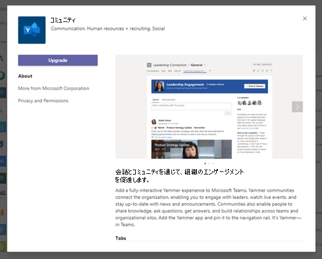

# Microsoft Teams でアプリを更新する

ほとんどの場合、アプリ開発者がアプリの更新プログラムを発行すると、ユーザーの新しいバージョンが自動的に表示されます。 ただし、完了するためにユーザーの受け入れを<a href="/microsoftteams/platform/resources/schema/manifest-schema" target="_blank">Microsoft Teamsマニフェスト</a>にはいくつかの更新があります。

* ボットが追加または削除されました
* 既存のボットの "botId" プロパティが変更されました
* 既存のボットの "isNotificationOnly" プロパティが変更されました
* ボットの SupportsCalling、SupportsVideo、および SupportsFiles 機能が追加されました
* メッセージング拡張機能が追加されました
* 新しいコネクタが追加されました
* "webApplicationInfo" 内のプロパティが変更されました

> [!NOTE] 
> 更新プロセスは、Microsoft アプリ、カスタム アプリ、およびサード パーティ製アプリのすべてのアプリ更新プログラムに適用されます。 

## 関連項目

[アプリを管理する](manage-apps.md)
