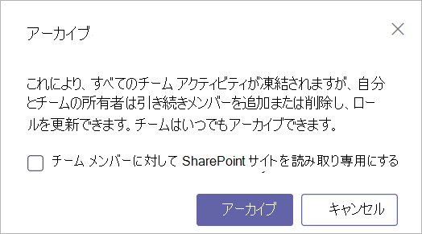

アーカイブまたはマイクロソフトのチームでチームの削除Archive or delete a team in Microsoft Teams
===========================================

時間の経過と共にマイクロソフトのチームで作成したチームが使用でなくなったことがありますか、アーカイブまたはチーム プロジェクトの末尾を削除することができます。Over time, a team created in Microsoft Teams might fall out of use or you might want to archive or delete a team at the end of a project. マイクロソフト チームの管理者である場合は、アーカイブまたは不要になったとしているチームを削除するには、この資料の手順に従います。If you are a Microsoft Teams admin, follow the steps in this article to archive or delete a team that is no longer needed. チームを整理するとそのチームのすべてのアクティビティが停止するしますが、も追加またはメンバーを削除して役割を更新およびチャネル、ファイル、およびチャットでチームのすべてのアクティビティを表示できます。When you archive a team, all activity for that team ceases, but you can still add or remove members and update roles and you can still view all the team activity in channels, files, and chats. チームを削除すると、関連付けられているチャネル、ファイル、およびチャットでチームの活動も削除されます。When you delete a team, team activity in associated channels, files, and chats is also deleted. 

> [!IMPORTANT]
> アーカイブされたチームが再アクティブ化することができます、ですが、削除されたチームの削除を取り消すことはできません。Archived teams can be reactivated, but you can’t undelete a team that has been deleted. チームは最初に、アーカイブを検討し、チームは必要がなくなったことを確認するまで、削除を延期します。Consider archiving the team first, and postpone the deletion until you're sure that you no longer need the team.

## チームをアーカイブします。Archive a team

チームをアーカイブするのにはこれらの手順に従います。Follow these steps to archive a team.

1. マイクロソフトのチーム管理センターでは、**チーム**を選択します。In the Microsoft Teams admin center, select **Teams**.
2. チームを選択するには、チーム名をクリックします。Select a team by clicking the team name.
3. **アーカイブ**を選択します。Select **Archive**. 次のメッセージが表示されます。The following message will appear.

    

4. 読み取り専用で、チームの SharePoint サイトを作成したい場合は、チェック ボックスを選択します。If you would like to make the SharePoint site for the team read-only, select the check box.
5. チームをアーカイブする**アーカイブ**を選択します。Select **Archive** to archive the team. チームのステータスは、**アーカイブ**に変更されます。The team’s status will change to **Archived**.

## アーカイブされたチームをアクティブにします。Make an archived team active

再度アクティブにするには、アーカイブ済みのチームは、これらの手順に従います。Follow these steps to make an archived team active again.

1. マイクロソフトのチーム管理センターでは、**チーム**を選択します。In the Microsoft Teams admin center, select **Teams**.
2. チームを選択するには、チーム名をクリックします。Select a team by clicking the team name.
3. **Unarchive**を選択します。Select **Unarchive**. チームのステータスは、**作業中**に変更されます。The team’s status will change to **Active**.

## チームを削除します。Delete a team

チーム行う必要はありません、将来的に場合、は、それではなく、アーカイブを削除できます。If the team will not be required in the future, then you can delete it rather than archiving it. チームを削除するのにはこれらの手順に従います。Follow these steps to delete a team.

1.  マイクロソフトのチーム管理センターでは、**チーム**を選択します。In the Microsoft Teams admin center, select **Teams**.
2.  チームを選択するには、チーム名をクリックします。Select a team by clicking the team name.
3.  **削除**を選択します。Select **Delete**. 確認メッセージが表示されます。A confirmation message will appear.
4.  チームを完全に削除する**削除**をクリックします。Select **Delete** to permanently delete the team.

