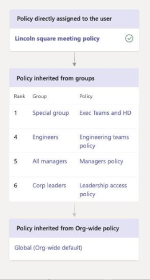

# <a name="assign-policies-to-your-users-in-microsoft-teams"></a>Microsoft Teams でユーザーにライセンスを割り当てる

管理者は、ポリシーを使って、組織内のユーザーが利用できる Teams 機能を制御することができます。 たとえば、通話ポリシー、会議ポリシー、メッセージポリシーなどは、ほんの少しだけ名前にします。

組織によって、独自のニーズとユーザー設定のポリシーを持つさまざまな種類のユーザーが、それらのニーズに応じてさまざまなユーザーのセットに対してポリシー設定を調整できます。

組織内のポリシーを簡単に管理できるように、Teams には、ユーザーにポリシーを割り当てるためのいくつかの方法が用意されています。 ポリシーは、個別に、またはバッチの割り当てを通じて、またはユーザーがメンバーになっているグループに直接割り当てることができます。 ポリシーパッケージを使用して、同じようなロールを持つ組織内のユーザーにポリシーの事前設定されたコレクションを割り当てることもできます。 選択するオプションは、管理しているポリシーの数と、割り当てられているユーザーの数によって異なります。 組織内の最大ユーザー数に適用されるようにグローバルな (組織全体の既定の) ポリシーを設定することによって、専用のポリシーを必要とするユーザーにのみポリシーを割り当てる必要があります。

この記事では、ユーザーにポリシーを割り当てることができるさまざまな方法について説明します。また、どのような場合に使用するかについての推奨されるシナリオ

## <a name="which-policy-takes-precedence"></a>どのポリシーが優先されますか?

ユーザーには、ポリシーの種類ごとに1つの有効なポリシーがあります。 ユーザーに直接ポリシーが割り当てられている可能性があります。また、同じ種類のポリシーが割り当てられた1つ以上のグループのメンバーでもあります。 これらの種類のシナリオでは、どのポリシーが優先されますか。  ユーザーの有効なポリシーは、次のように、優先順位の規則に従って決定されます。

ユーザーに直接ポリシーが割り当てられている場合 (個別に、またはバッチ割り当てによって)、ポリシーが優先されます。 次の例では、ユーザーの有効なポリシーは、ユーザーに直接割り当てられている Lincoln Square 会議ポリシーです。



ユーザーに特定の種類のポリシーが直接割り当てられていない場合、そのユーザーがメンバーになっているグループに割り当てられているポリシーが優先されます。 ユーザーが複数のグループのメンバーである場合は、指定したポリシーの種類に対して最も優先順位が高い[グループ割り当て](#group-assignment-ranking)を持つポリシーが優先されます。

この例では、ユーザーの有効なポリシーは Exec Teams と HD ポリシーで、ユーザーがメンバーになっている他のグループとの相対的な割り当ての順位が高く、同じポリシーの種類のポリシーも割り当てられます。  


ユーザーが直接ポリシーを割り当てられていない場合や、ポリシーが割り当てられているグループのメンバーでない場合、ユーザーはそのポリシーの種類に対してグローバル (組織全体の既定の) ポリシーを取得します。 次に例を示します。


詳細については、「[優先順位規則](#precedence-rules)」を参照してください。

## <a name="ways-to-assign-policies"></a>ポリシーを割り当てる方法

ここでは、ユーザーにポリシーを割り当てる方法の概要と、それぞれの推奨されるシナリオについて説明します。 詳細については、リンクをクリックしてください。

個々のユーザーまたはグループにポリシーを割り当てる前に、組織内の最大ユーザー数に適用されるように[、グローバル (組織全体の既定) ポリシーを設定](#set-the-global-policies)します。  グローバルポリシーが設定されたら、専用のポリシーを必要とするユーザーにのみポリシーを割り当てる必要があります。

|操作  |もし。。。  | 使用するのは...
|---------|---------|----|
|[個々のユーザーにポリシーを割り当てる](#assign-a-policy-to-individual-users)    | チームを初めて使い始めたり、少数のユーザーに1つまたはいくつかのポリシーを割り当てる必要があります。 |Skype for Business Online PowerShell モジュールの Microsoft Teams 管理センターまたは PowerShell コマンドレット
| [ポリシーパッケージを割り当てる](#assign-a-policy-package)   | 同じロールまたは類似のロールを持つ組織内の特定のユーザーのセットに、複数のポリシーを割り当てる必要があります。 たとえば、学校の教師に教育 (教師) ポリシーパッケージを割り当てることで、チャット、通話、会議、および教育 (第2章) ポリシーパッケージへのフルアクセスを学生に許可し、プライベート通話のような特定の機能を制限することができます。  |Teams PowerShell モジュールの Microsoft Teams 管理センターまたは PowerShell コマンドレット|
|[ユーザーのバッチにポリシーを割り当てる](#assign-a-policy-to-a-batch-of-users)   | 多数のユーザーにポリシーを割り当てる必要があります。 たとえば、組織内の数百または数千のユーザーに一度にポリシーを割り当てる必要があるとします。  |Teams PowerShell モジュールの Microsoft Teams 管理センターまたは PowerShell コマンドレット|
|[グループにポリシーを割り当てる](#assign-a-policy-to-a-group) |ユーザーのグループメンバーシップに基づいてポリシーを割り当てる必要があります。 たとえば、セキュリティグループまたは配布リストのすべてのユーザーにポリシーを割り当てる必要があるとします。| Teams PowerShell モジュールの Microsoft Teams 管理センターまたは PowerShell コマンドレット|
| [ユーザーのバッチにポリシーパッケージを割り当てる](#assign-a-policy-package-to-a-batch-of-users)|同じロールまたは類似のロールを持つ組織内のユーザーのバッチに複数のポリシーを割り当てる必要があります。 たとえば、バッチの割り当てを使用して学校のすべての教師に教育 (教師) ポリシーパッケージを割り当てることで、チャット、通話、会議へのフルアクセスを許可したり、教育機関 (第1の学生) ポリシーパッケージを第2の学生に割り当てることができます。|Teams PowerShell モジュールの PowerShell コマンドレット|
| グループにポリシーパッケージを割り当てる (近日公開)   | ||

## <a name="set-the-global-policies"></a>グローバルポリシーを設定する

次の手順に従って、ポリシーの種類ごとにグローバル (組織全体の既定) ポリシーを設定します。

### <a name="using-the-microsoft-teams-admin-center"></a>Microsoft Teams 管理センターの使用

1. Microsoft Teams 管理センターの左のナビゲーションで、更新するポリシーの種類の [ポリシー] ページに移動します。 たとえば、**チーム**の  >  **チームポリシー**、**会議**  >  **会議のポリシー**、**メッセージングポリシー**、**音声**  >  **通話のポリシー**などです。
2. [**グローバル (組織全体の既定)** ] ポリシーを選択して、現在の設定を表示します。
3. 必要に応じてポリシーを更新し、[**適用**] を選択します。

### <a name="using-powershell"></a>PowerShell を使用する場合

PowerShell を使用してグローバルポリシーを設定するには、グローバル識別子を使用します。  まず、現在のグローバルポリシーを確認して、変更する設定を決定します。

```powershell
Get-CsTeamsMessagingPolicy -Identity Global
 
Identity                      : Global
Description                   :
AllowUrlPreviews              : True
AllowOwnerDeleteMessage       : False
AllowUserEditMessage          : True
AllowUserDeleteMessage        : True
AllowUserChat                 : True
AllowRemoveUser               : True
AllowGiphy                    : True
GiphyRatingType               : Moderate
AllowMemes                    : True
AllowImmersiveReader          : True
AllowStickers                 : True
AllowUserTranslation          : False
ReadReceiptsEnabledType       : UserPreference
AllowPriorityMessages         : True
ChannelsInChatListEnabledType : DisabledUserOverride
AudioMessageEnabledType       : ChatsAndChannels
Expand (20 lines) Collapse 
```

次に、必要に応じてグローバルポリシーを更新します。  変更する設定の値のみを指定する必要があります。 
 
```powershell
Set-CsTeamsMessagingPolicy -Identity Global -AllowUserEditMessage $false
```

## <a name="assign-a-policy-to-individual-users"></a>個々のユーザーにポリシーを割り当てる

個々のユーザーに、または一度に少数のユーザーにポリシーを割り当てるには、次の手順を実行します。

### <a name="using-the-microsoft-teams-admin-center"></a>Microsoft Teams 管理センターの使用

ユーザーにポリシーを割り当てるには、次の操作を行います。

1. Microsoft Teams 管理センターの左側のナビゲーションで、**[ユーザー]** に移動してユーザーをクリックします。
2. ユーザー名の左側をクリックしてユーザーを選択し、[**編集を設定する**] をクリックします。
3. 割り当てるポリシーを選択し、[**適用**] をクリックします。

または、次の操作も実行できます。

1. Microsoft Teams 管理センターの左側のナビゲーションで、[ポリシー] ページに移動します。
2. ポリシー名の左側をクリックして、割り当てるポリシーを選択します。
3. [**ユーザーを管理**] を選択します。
4. [**ユーザーを管理**] ウィンドウで、表示名またはユーザー名でユーザーを検索し、名前を選択して [**追加**] を選びます。 追加するユーザーごとに、この手順を繰り返します。
5. ユーザーの追加が完了したら、[**適用**] を選択します。

### <a name="using-powershell"></a>PowerShell を使用する場合

各ポリシーの種類には、管理用の独自のコマンドレットのセットがあります。 指定した ```Grant-``` ポリシーの種類に対してコマンドレットを使用して、ポリシーを割り当てます。 たとえば、コマンドレットを使用して、 ```Grant-CsTeamsMeetingPolicy``` Teams 会議ポリシーをユーザーに割り当てることができます。 これらのコマンドレットは、Skype for business Online PowerShell モジュールに含まれており、 [skype For business コマンドレットのリファレンス](https://docs.microsoft.com/powershell/skype/intro?view=skype-ps)に記載されています。

 [Skype For Business Online PowerShell モジュール](https://www.microsoft.com/en-us/download/details.aspx?id=39366)をダウンロードしてインストールし (まだインストールしていない場合)、次を実行して Skype For business online に接続してセッションを開始します。

```powershell
Import-Module SkypeOnlineConnector
$Cred = Get-Credential
$CSSession = New-CsOnlineSession -Credential $Cred
Import-PSSession -Session $CSSession
```

この例では、Student Meeting ポリシーという名前の Teams 会議ポリシーを、Reda という名前のユーザーに割り当てています。

```powershell
Grant-CsTeamsMeetingPolicy -Identity reda@contoso.com -PolicyName "Student Meeting Policy"
```

詳細については、「PowerShell を使用した[ポリシーの管理](teams-powershell-managing-teams.md#manage-policies-via-powershell)」を参照してください。

## <a name="assign-a-policy-package"></a>ポリシーパッケージを割り当てる

Teams のポリシーパッケージは、組織内で同じまたは類似の役割を持つユーザーに割り当てることができる定義済みのポリシーおよびポリシー設定のコレクションです。 各ポリシーパッケージは、ユーザーロールに基づいて設計されています。定義済みのポリシーとポリシー設定が含まれており、その役割の一般的なアクティビティをサポートします。 ポリシーパッケージの例としては、教育機関 (教師) パッケージと医療 (臨床労働者) パッケージがあります。

ポリシーパッケージをユーザーに割り当てると、パッケージ内のポリシーが作成され、ユーザーのニーズに合わせてパッケージ内の各ポリシーの設定をカスタマイズすることができます。

ポリシーパッケージの詳細については、「[チームで](manage-policy-packages.md)ポリシーパッケージを管理する」を参照してください。

## <a name="assign-a-policy-to-a-batch-of-users"></a>ユーザーのバッチにポリシーを割り当てる

### <a name="using-the-microsoft-teams-admin-center"></a>Microsoft Teams 管理センターの使用

ユーザーに一括してポリシーを割り当てるには、次の操作を行います。

1. Microsoft Teams 管理センターの左側のナビゲーションで、[**ユーザー**] を選択します。
2. ポリシーを割り当てるユーザーを検索するか、ビューをフィルター処理して、目的のユーザーを表示します。
3. [**&#x2713;** (チェックマーク)] の列からユーザーを選択します。 すべてのユーザーを選択するには、表の上部にある [&#x2713; (チェックマーク)] をクリックします。
4. [**設定の編集**] をクリックし、必要な変更を行い、[**適用**] をクリックします。

ポリシーの割り当ての状態を表示するには、[**適用**] をクリックしてポリシーの割り当てを提出した後、[**ユーザー** ] ページの上部に表示されるバナーで、[**アクティビティログ**] をクリックします。 または、Microsoft Teams 管理センターの左のナビゲーションで [**ダッシュボード**] に移動し、[**アクティビティログ**] の下の [**詳細の表示**] をクリックします。 アクティビティログには、過去30日間の Microsoft Teams 管理センターを通じて、20人を超えるユーザーのバッチに対するポリシーの割り当てが表示されます。 詳細については、「[アクティビティログでポリシーの割り当てを表示](activity-log.md)する」を参照してください。

### <a name="using-powershell"></a>PowerShell を使用する場合

> [!NOTE]
> 現時点では、PowerShell を使用したバッチポリシーの割り当ては、すべての Teams ポリシーの種類では使用できません。 サポートされているポリシーの種類の一覧については、「 [CsBatchPolicyAssignmentOperation](https://docs.microsoft.com/powershell/module/teams/new-csbatchpolicyassignmentoperation) 」を参照してください。
 
バッチポリシーが割り当てられている場合は、スクリプトを使わずに、一度に多くのユーザーにポリシーを割り当てることができます。 コマンドレットを使用して、 ```New-CsBatchPolicyAssignmentOperation``` ユーザーと割り当てるポリシーのバッチを送信します。 割り当てはバックグラウンド操作として処理され、各バッチに対して操作 ID が生成されます。 その後、コマンドレットを使用して、 ```Get-CsBatchPolicyAssignmentOperation``` バッチ内の課題の進捗状況と状態を追跡することができます。

ユーザーは、オブジェクト Id またはセッション開始プロトコル (SIP) アドレスで指定できます。 ユーザーの SIP アドレスは、ユーザープリンシパル名 (UPN) またはメールアドレスと同じ値になることが多いが、これは必須ではないことに注意してください。 ユーザーが UPN またはメールを使用して指定されているが、その SIP アドレスとは異なる値を持っている場合、ユーザーに対してポリシーの割り当ては失敗します。 バッチに重複したユーザーが含まれている場合、それらの重複は一括処理される前にバッチから削除され、バッチ内の残りのユーザーに対してのみ表示されます。 

バッチには最大5000ユーザーを含めることができます。 最善の結果を得るには、一度に複数のバッチを送信しないようにします。 さらに多くのバッチを送信する前に、バッチ処理を完了することを許可します。

#### <a name="install-and-connect-to-the-microsoft-teams-powershell-module"></a>Microsoft Teams PowerShell モジュールをインストールして接続する

[Microsoft Teams PowerShell モジュール](https://www.powershellgallery.com/packages/MicrosoftTeams)をインストールするには、次を実行します。 バージョン1.0.5 以降をインストールしていることを確認してください。

```powershell
Install-Module -Name MicrosoftTeams
```

Teams に接続してセッションを開始するには、次を実行します。

```powershell
Connect-MicrosoftTeams
```

メッセージが表示されたら、管理者の資格情報を使用してサインインします。

#### <a name="install-and-connect-to-the-azure-ad-powershell-for-graph-module-optional"></a>Graph モジュール用 Azure AD PowerShell をインストールして接続する (オプション)

また、組織内のユーザーのリストを取得できるように[、AZURE Ad PowerShell For Graph モジュール](https://docs.microsoft.com/powershell/azure/active-directory/install-adv2)(まだインストールしていない場合) をダウンロードしてインストールし、azure ad に接続することもできます。

Azure AD に接続するには、次を実行します。

```powershell
Connect-AzureAD
```

メッセージが表示されたら、Teams への接続に使用したのと同じ管理者資格情報を使用してサインインします。

#### <a name="assign-a-policy-to-a-batch-of-users"></a>ユーザーのバッチにポリシーを割り当てる

この例では、コマンドレットを使用して、 ```New-CsBatchPolicyAssignmentOperation``` HR アプリセットアップポリシーという名前のアプリセットアップポリシーを、Users_ids のテキストファイルに記載されているユーザーのバッチに割り当てます。

```powershell
$user_ids = Get-Content .\users_ids.txt
New-CsBatchPolicyAssignmentOperation -PolicyType TeamsAppSetupPolicy -PolicyName "HR App Setup Policy" -Identity $users_ids -OperationName "Example 1 batch"
```

この例では、Azure AD に接続してユーザーのコレクションを取得し、その SIP アドレスを使用して指定された一連のユーザーに対して、新しい採用メッセージポリシーという名前のメッセージポリシーを割り当てます。

```powershell
Connect-AzureAD
$users = Get-AzureADUser
New-CsBatchPolicyAssignmentOperation -PolicyType TeamsMessagingPolicy -PolicyName "New Hire Messaging Policy" -Identity $users.SipProxyAddress -OperationName "Example 2 batch"
```

詳細については、「 [New-CsBatchPolicyAssignmentOperation](https://docs.microsoft.com/powershell/module/teams/new-csbatchpolicyassignmentoperation)」を参照してください。

#### <a name="get-the-status-of-a-batch-assignment"></a>バッチ割り当ての状態を取得する

バッチ割り当ての状態を取得するには、次を実行します。 OperationId は、指定された ```New-CsBatchPolicyAssignmentOperation``` バッチのコマンドレットによって返される操作 ID です。

```powershell
$Get-CsBatchPolicyAssignmentOperation -OperationId f985e013-0826-40bb-8c94-e5f367076044 | fl
```

出力にエラーが発生したことが示された場合は、次を実行して、プロパティのエラーに関する詳細情報を取得し ```UserState``` ます。

```powershell
Get-CsBatchPolicyAssignmentOperation -OperationId f985e013-0826-40bb-8c94-e5f367076044 | Select -ExpandProperty UserState
```

詳細については、「 [Get-CsBatchPolicyAssignmentOperation](https://docs.microsoft.com/powershell/module/teams/get-csbatchpolicyassignmentoperation)」を参照してください。

## <a name="assign-a-policy-to-a-group"></a>グループにポリシーを割り当てる

グループにポリシーを割り当てると、セキュリティグループまたは配布リストなどのユーザーグループにポリシーを割り当てることができます。 ポリシーの割り当ては、優先順位の規則に従ってグループのメンバーに伝達されます。 メンバーがグループに追加またはグループから削除されると、それに応じて継承されたポリシーの割り当てが更新されます。

グループへのポリシーの割り当ては、最大5万ユーザーのグループに推奨されますが、大規模なグループでも動作します。

ポリシーを割り当てると、そのポリシーはすぐにグループに割り当てられます。 ただし、グループのメンバーへのポリシー割り当ての反映はバックグラウンド操作として実行され、グループのサイズによっては時間がかかる場合があることに注意してください。 ポリシーがグループから割り当てられていない場合、またはグループからメンバーが追加または削除されている場合は、同じことが当てはまります。

### <a name="what-you-need-to-know-about-policy-assignment-to-groups"></a>グループへのポリシーの割り当てについて知っておくべきこと

作業を始める前に、優先順位の規則とグループの割り当ての順位を理解することが重要です。

#### <a name="precedence-rules"></a>優先順位ルール

特定のポリシーの種類に対して、ユーザーの有効なポリシーは、次のように決定されます。

- ユーザーに直接割り当てられているポリシーは、グループに割り当てられているものと同じ種類の他のポリシーよりも優先されます。 つまり、ユーザーに特定の種類のポリシーが直接割り当てられている場合、そのユーザーはグループから同じ種類のポリシーを継承しません。 これは、ユーザーが直接割り当てられた特定の種類のポリシーを持っている場合にも、グループから同じ種類のポリシーを継承できるようにするために、そのポリシーをユーザーから削除する必要があることを意味します。
- ユーザーに直接割り当てられているポリシーがなく、2つ以上のグループのメンバーである場合は、ユーザーは、ランクが最も高いグループの割り当てのポリシーを継承しています。
- ユーザーが、ポリシーが割り当てられているグループのメンバーでない場合、そのポリシーの種類に対するグローバル (組織全体の既定) ポリシーがユーザーに適用されます。

ポリシーが割り当てられているグループにユーザーが追加または削除された場合、ポリシーがグループから割り当てられていない場合、またはユーザーに直接割り当てられているポリシーが削除された場合、ユーザーの有効なポリシーは、次の規則に従って更新されます。

#### <a name="group-assignment-ranking"></a>グループの割り当てのランク付け
 
グループにポリシーを割り当てるときは、グループの割り当ての順位を指定します。 ユーザーが2つ以上のグループのメンバーであり、各グループに同じ種類のポリシーが割り当てられている場合に、ユーザーが有効なポリシーとしてどのポリシーを継承するかを決定するために使用されます。

グループの割り当ての順位は、同じ種類の他のグループ割り当てと相対的に異なります。 たとえば、2つのグループに通話ポリシーを割り当てる場合は、1つの割り当ての順位を1に設定して、ランクを1に設定します。 グループの割り当てのランクは、継承に関する他のグループメンバーシップよりも、どのグループメンバーシップが重要であるかを示します。
 
たとえば、2つのグループがあり、従業員とストアマネージャーが保存されているとします。 どちらのグループにもチームの通話ポリシーが割り当てられ、従業員の通話ポリシーとストアマネージャーの通話ポリシーがそれぞれ保存されます。 両方のグループに参加しているストアマネージャーの場合、管理者としての役割は従業員としての役割よりも関連しているため、ストア管理者グループに割り当てられている通話ポリシーの順位は高くする必要があります。

|化 |チーム呼び出しポリシー名  |[ランク]|
|---------|---------|---|
|ストアマネージャー   |ストアマネージャーの通話ポリシー         |1|
|従業員の保存    |従業員の通話ポリシーの保存      |2|

ランクを指定しない場合、ポリシーの割り当てには最も優先順位が設定されます。 

### <a name="using-the-microsoft-teams-admin-center"></a>Microsoft Teams 管理センターの使用

> [!NOTE]
> 現時点では、Microsoft Teams 管理センターを使用したグループへのポリシーの割り当ては、Teams の通話ポリシー、Teams の通話パークポリシー、チームポリシー、Teams live イベントポリシー、teams 会議ポリシー、および Teams のメッセージングポリシーでのみ利用できます。 その他のポリシーの種類については、PowerShell を使用します。

1. Microsoft Teams 管理センターの左のナビゲーションで、[ポリシーの種類] ページに移動します。 たとえば、[会議の**Meetings**  >  **ポリシー**] に移動します。
2. [**グループポリシーの割り当て**] タブを選択します。
3. [**グループの追加**] を選択し、[**ポリシーをグループに割り当てる**] ウィンドウで、次の操作を行います。
    1. ポリシーを割り当てるグループを検索して追加します。
    2. グループの割り当ての順位を設定します。
    3. 割り当てるポリシーを選択します。 
    4. [**適用**] を選びます。

グループポリシーの割り当てを削除するには、[ポリシー] ページの [**グループポリシーの割り当て**] タブで、グループの割り当てを選択し、[**削除**] を選択します。

グループの割り当ての順位を変更するには、最初にグループポリシーの割り当てを削除する必要があります。 次に、上記の手順に従って、ポリシーをグループに割り当てます。

### <a name="using-powershell"></a>PowerShell を使用する場合

> [!NOTE]
> 現在、PowerShell を使用したグループへのポリシーの割り当ては、すべてのチームポリシーの種類では使用できません。 サポートされているポリシーの種類の一覧については、「[新しい-CsGroupPolicyAssignment](https://docs.microsoft.com/powershell/module/teams/new-csgrouppolicyassignment) 」を参照してください。

#### <a name="install-and-connect-to-the-microsoft-teams-powershell-module"></a>Microsoft Teams PowerShell モジュールをインストールして接続する

詳細な手順については、「 [Teams PowerShell をインストール](teams-powershell-install.md)する」を参照してください。

#### <a name="assign-a-policy-to-a-group"></a>グループにポリシーを割り当てる

```New-CsGroupPolicyAssignment```グループにポリシーを割り当てるには、コマンドレットを使用します。 オブジェクト Id、SIP アドレス、またはメールアドレスを使用して、グループを指定できます。

この例では、 ```New-CsGroupPolicyAssignment``` コマンドレットを使用して、[小売マネージャー] 会議ポリシーという名前の Teams 会議ポリシーを割り当てランキング1のグループに割り当てます。

```powershell
New-CsGroupPolicyAssignment -GroupId d8ebfa45-0f28-4d2d-9bcc-b158a49e2d17 -PolicyType TeamsMeetingPolicy -PolicyName "Retail Managers Meeting Policy" -Rank 1
```

詳細については、「[新しい-CsGroupPolicyAssignment](https://docs.microsoft.com/powershell/module/teams/new-csgrouppolicyassignment)」を参照してください。

#### <a name="get-policy-assignments-for-a-group"></a>グループのポリシー割り当てを取得する

```Get-CsGroupPolicyAssignment```グループに割り当てられているすべてのポリシーを取得するには、コマンドレットを使用します。 グループは、その SIP アドレスまたはメールアドレスがポリシーの割り当てに使用されていた場合でも、常にグループ Id によって一覧表示されることに注意してください。

この例では、特定のグループに割り当てられているすべてのポリシーを取得します。

```powershell
Get-CsGroupPolicyAssignment -GroupId e050ce51-54bc-45b7-b3e6-c00343d31274
```

この例では、Teams 会議ポリシーが割り当てられているすべてのグループを返します。

```powershell
Get-CsGroupPolicyAssignment -PolicyType TeamsMeetingPolicy
```

詳細については、「 [CsGroupPolicyAssignment の取得](https://docs.microsoft.com/powershell/module/teams/get-csgrouppolicyassignment)」を参照してください。

#### <a name="remove-a-policy-from-a-group"></a>グループからポリシーを削除する

```Remove-CsGroupPolicyAssignment```グループからポリシーを削除するには、コマンドレットを使用します。 グループからポリシーを削除すると、そのグループに割り当てられている同じ種類の他のポリシーの優先順位が更新されます。 たとえば、ランクが2のポリシーを削除した場合、ランクが3と4のポリシーは、新しいランク付けを反映して更新されます。 次の2つの表は、この例を示しています。

ここでは、Teams 会議ポリシーのポリシー割り当てと優先度の一覧を示します。

|グループ名  |ポリシー名  |[ランク]|
|---------|---------|---------|
|売上    |営業ポリシー       | 1        |
|西部地域     |西部地域ポリシー         |2         |
|課    |部門ポリシー         |3         |
|Microsoft   |子会社のポリシー        |4         |

西部地域グループから西部地域ポリシーを削除すると、ポリシーの割り当てと優先順位が次のように更新されます。

|グループ名  |ポリシー名  |[ランク]|
|---------|---------|---------|
|売上    |営業ポリシー       | 1        |
|課    |部門ポリシー         |2         |
|Microsoft   |子会社のポリシー        |3        |

この例では、グループから Teams の会議ポリシーを削除します。

```powershell
Remove-CsGroupPolicyAssignment -PolicyType TeamsMeetingPolicy -GroupId f985e013-0826-40bb-8c94-e5f367076044
```

詳細については、「 [CsGroupPolicyAssignment の削除](https://docs.microsoft.com/powershell/module/teams/remove-csgrouppolicyassignment)」を参照してください。

#### <a name="change-a-policy-assignment-for-a-group"></a>グループのポリシー割り当てを変更する

> [!NOTE]
> この ```Set-CsGroupPolicyAssignment``` コマンドレットは間もなく利用可能になります。 グループポリシーの割り当てを変更するときに、グループから現在のポリシーの割り当てを削除して、新しいポリシーの割り当てを追加することができます。

グループにポリシーを割り当てると、コマンドレットを使用し ```Set-CsGroupPolicyAssignment``` て、グループのポリシー割り当てを次のように変更できます。

- 順位を変更する
- 指定したポリシーの種類のポリシーを変更する
- 指定したポリシーの種類とランク付けのポリシーを変更する

この例では、グループの Teams のコールパークポリシーを、SupportCallPark という名前のポリシーに変更し、割り当てのランク付けを3に変更します。

```powershell
Set-CsGroupPolicyAssignment -GroupId 566b8d39-5c5c-4aaa-bc07-4f36278a1b38 -PolicyType TeamsMeetingPolicy -PolicyName SupportCallPark -Rank 3
```

詳細については、「 [CsGroupPolicyAssignment を設定](https://docs.microsoft.com/powershell/module/teams/set-csgrouppolicyassignment)する」を参照してください。


#### <a name="change-the-effective-policy-for-a-user"></a>ユーザーの有効なポリシーを変更する

直接ポリシーを割り当てられているユーザーの有効なポリシーを変更する方法の例を次に示します。

まず、コマンドレットをパラメーターと共に使用して、 ```Get-CsUserPolicyAssignment``` ```PolicySource``` ユーザーに関連付けられている Teams 会議ブロードキャストポリシーの詳細を取得します。 詳細については、「 [CsUserPolicyAssignment](https://docs.microsoft.com/powershell/module/teams/get-csuserpolicyassignment)」を参照してください。

```powershell
Get-CsUserPolicyAssignment -Identity daniel@contoso.com -PolicyType TeamsMeetingBroadcastPolicy | select -ExpandProperty PolicySource
```

出力には、ユーザーが [従業員イベント] という名前の Teams 会議ブロードキャストポリシーが直接割り当てられていることが示されます。これは、ユーザーが所属するグループに割り当てられているベンダーライブイベントという名前のポリシーに優先されます。

```console
AssignmentType PolicyName         Reference
-------------- ----------         ---------
Direct         Employee Events
Group          Vendor Live Events 566b8d39-5c5c-4aaa-bc07-4f36278a1b38
```

次に、ユーザーから従業員のイベントポリシーを削除します。 つまり、ユーザーは、そのユーザーに直接割り当てられた Teams 会議ブロードキャストポリシーを持っておらず、ユーザーが所属するグループに割り当てられているベンダーのライブイベントポリシーを継承します。 

この操作を行うには、Skype for Business PowerShell モジュールの次のコマンドレットを使用します。

```powershell
Grant-CsTeamsMeetingBroadcastPolicy -Identity daniel@contoso.com -PolicyName $null
```

この操作を行うには、Teams PowerShell モジュールの次のコマンドレットを使用します。これには、指定したユーザーの一覧が $users バッチポリシーの割り当てによって行われます。

```powershell
New-CsBatchPolicyAssignmentOperation -OperationName "Assigning null at bulk" -PolicyType TeamsMeetingBroadcastPolicy -PolicyName $null -Identity $users  
```

## <a name="assign-a-policy-package-to-a-batch-of-users"></a>ユーザーのバッチにポリシーパッケージを割り当てる

バッチポリシーパッケージの割り当てでは、スクリプトを使わずに、一度に多くのユーザーにポリシーパッケージを割り当てることができます。 コマンドレットを使用して、 ```New-CsBatchPolicyPackageAssignmentOperation``` 割り当てるユーザーのバッチと、割り当てるポリシーパッケージを送信します。 割り当てはバックグラウンド操作として処理され、各バッチに対して操作 ID が生成されます。 その後、コマンドレットを使用して、 ```Get-CsBatchPolicyAssignmentOperation``` バッチ内の課題の進捗状況と状態を追跡することができます。

ユーザーは、オブジェクト Id またはセッション開始プロトコル (SIP) アドレスで指定できます。 ユーザーの SIP アドレスは、ユーザープリンシパル名 (UPN) またはメールアドレスと同じ値になることが多いが、これは必須ではないことに注意してください。 ユーザーが UPN またはメールを使用して指定されているが、その SIP アドレスとは異なる値を持っている場合、ユーザーに対してポリシーの割り当ては失敗します。 バッチに重複したユーザーが含まれている場合、それらの重複は一括処理される前にバッチから削除され、バッチ内の残りのユーザーに対してのみ表示されます。 

バッチには最大5000ユーザーを含めることができます。 最善の結果を得るには、一度に複数のバッチを送信しないようにします。 さらに多くのバッチを送信する前に、バッチ処理を完了することを許可します。

### <a name="install-and-connect-to-the-microsoft-teams-powershell-module"></a>Microsoft Teams PowerShell モジュールをインストールして接続する

[Microsoft Teams PowerShell モジュール](https://www.powershellgallery.com/packages/MicrosoftTeams)をインストールするには、次を実行します (まだインストールされていない場合)。 バージョン1.0.5 以降をインストールしていることを確認してください。

```powershell
Install-Module -Name MicrosoftTeams
```

Teams に接続してセッションを開始するには、次を実行します。

```powershell
Connect-MicrosoftTeams
```

メッセージが表示されたら、管理者の資格情報を使用してサインインします。

### <a name="assign-a-policy-package-to-a-batch-of-users"></a>ユーザーのバッチにポリシーパッケージを割り当てる

この例では、 ```New-CsBatchPolicyPackageAssignmentOperation``` コマンドレットを使用して、Education_PrimaryStudent ポリシーパッケージをユーザーのバッチに割り当てます。

```powershell
New-CsBatchPolicyPackageAssignmentOperation -Identity 1bc0b35f-095a-4a37-a24c-c4b6049816ab,user1@econtoso.com,user2@contoso.com -PackageName Education_PrimaryStudent
```

詳細については、「 [New-CsBatchPolicyAssignmentOperation](https://docs.microsoft.com/powershell/module/teams/new-csbatchpolicyassignmentoperation)」を参照してください。

### <a name="get-the-status-of-a-batch-assignment"></a>バッチ割り当ての状態を取得する

バッチ割り当ての状態を取得するには、次を実行します。 OperationId は、指定された ```New-CsBatchPolicyAssignmentOperation``` バッチのコマンドレットによって返される操作 ID です。

```powershell
$Get-CsBatchPolicyAssignmentOperation -OperationId f985e013-0826-40bb-8c94-e5f367076044 | fl
```

出力にエラーが発生したことが示された場合は、次を実行して、プロパティのエラーに関する詳細情報を取得し ```UserState``` ます。

```powershell
Get-CsBatchPolicyAssignmentOperation -OperationId f985e013-0826-40bb-8c94-e5f367076044 | Select -ExpandProperty UserState
```

詳細については、「 [Get-CsBatchPolicyAssignmentOperation](https://docs.microsoft.com/powershell/module/teams/get-csbatchpolicyassignmentoperation)」を参照してください。 

## <a name="related-topics"></a>関連項目

[Teams での PowerShell の概要](teams-powershell-overview.md)
