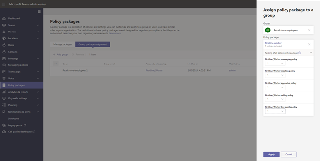

# <a name="assign-policy-packages-to-users-and-groups"></a>ユーザーとグループにポリシー パッケージを割り当てる

この記事では、ユーザーとグループにポリシー パッケージを割り当てるさまざまな方法についてMicrosoft Teams。 この記事を読む前に、「ポリシーの割り当て - [Teams」を参照してください](policy-assignment-overview.md)。

> [!NOTE]
> カスタム ポリシー パッケージの割り当てを受け取るには、各ユーザーに Advanced Communications アドオンが必要です。 詳細については、「Advanced [Communications add-on for Microsoft Teams」を参照してください](/microsoftteams/teams-add-on-licensing/advanced-communications)。

## <a name="assign-a-policy-package-to-users"></a>ポリシー パッケージをユーザーに割り当てる

Teams のポリシー パッケージは、組織内で同じまたは類似の役割を持つユーザーに割り当てることができる定義済みのポリシーおよびポリシー設定のコレクションです。 各ポリシー パッケージは、ユーザーの役割に合わせて設計されており、その役割の一般的なアクティビティをサポートする定義済みのポリシーおよびポリシー設定が含まれています。 ポリシー パッケージの例としては、教育機関 (教師) パッケージと医療機関 (医療従事者) パッケージがあります。 詳細については、「[Teams でポリシー パッケージを管理する](manage-policy-packages.md)」を参照してください。

### <a name="assign-a-policy-package-to-one-user"></a>ポリシー パッケージを 1 人のユーザーに割り当てる

1. 管理センターの左側のMicrosoft Teams、[ユーザー] に移動し、ユーザーを選択します。
2. ユーザーのページで 、[ポリシー]を選択し、[ポリシーパッケージ] の横にある [編集] を **選択します**。
3. [ポリシー パッケージ **の割り** 当て] ウィンドウで、割り当てるパッケージを選択し、[保存] を **選択します**。


### <a name="assign-a-policy-package-to-multiple-users"></a>ポリシー パッケージを複数のユーザーに割り当てる

1. Microsoft Teams 管理センターの左側のナビゲーションで **[ポリシー パッケージ]** に移動し、パッケージ名の左側をクリックして、割り当てるポリシー パッケージを選択します。
2. **[ユーザーを管理する]** を選択します。
3. [**ユーザーを管理**] ウィンドウで、表示名またはユーザー名でユーザーを検索し、名前を選択して [**追加**] を選びます。 追加するユーザーごとに、この手順を繰り返します。
4. ユーザーの追加が完了したら、**[保存]** を選択します。


## <a name="assign-a-policy-package-to-a-group"></a>ポリシー パッケージをグループに割り当てる

グループにポリシー パッケージを割り当てると、セキュリティ グループや配布リストなど、ユーザーのグループに複数のポリシーを割り当てることができます。 ポリシーの割り当ては、優先規則に従ってグループのメンバーに反映されます。 グループのメンバーが追加または削除されると、それに応じて継承されたポリシーの割り当てが更新されます。

グループへのポリシー パッケージの割り当ては、最大 50,000 人のユーザーのグループに対して推奨されますが、大規模なグループでも機能します。

ポリシー パッケージを割り当てると、そのポリシーはすぐにグループに割り当てられます。 ただし、グループのメンバーへのポリシー割り当ての反映はバックグラウンド操作として実行され、グループのサイズによっては時間がかかる場合があります。 ポリシーがグループから割り当てられていない場合、またはグループからメンバーが追加または削除された場合も同じです。

> [!IMPORTANT]
> 開始する前に、 (優先順位[ルール)](assign-policies-users-and-groups.md#precedence-rules)と ( グループ割り当てランク付け ) を理解[することが重要です](assign-policies-users-and-groups.md#group-assignment-ranking)。 この記事の前の「(グループへのポリシー割り当てについて知る必要があるも[の)」](assign-policies-users-and-groups.md#what-you-need-to-know-about-policy-assignment-to-groups)の概念を必ず読んで理解してください。

### <a name="assign-a-policy-package-to-a-group-of-users-in-the-admin-center"></a>管理センターでユーザーのグループにポリシー パッケージを割り当てる

1. Teams 管理センターにサインインします。
2. 左側のナビゲーションで、ポリシー パッケージ ページに移動します。
3. グループ ポリシーの割り当て タブを選択します。
4. [ **グループの追加]** を選択し、[グループにポリシー パッケージを割り当てる] ウィンドウで、次の操作を行います。

    a. ポリシー パッケージを割り当てるグループを検索して追加します。

    b. ポリシー パッケージを選択します。

    c. ポリシーの種類ごとにランク付けを設定します。

    d. **[適用]** を選択します。



5. 特定のポリシーの種類のランク付けを管理するには、特定のポリシー ページに移動します。
6. ポリシー パッケージをグループに再割り当てするには、最初にグループ ポリシーの割り当てを削除します。 次に、上記の手順に従って、ポリシー パッケージをグループに割り当てします。

### <a name="work-with-powershell"></a>PowerShell を使用する

#### <a name="get-the-teams-powershell-module"></a>PowerShell モジュールTeams取得する

段階的なガイダンスについては、「[Teams PowerShell をインストールする](teams-powershell-install.md)」を参照してください。

#### <a name="assign-a-policy-package-to-a-group-of-users"></a>ポリシー パッケージをユーザーのグループに割り当てる

[Grant-CsGroupPolicyPackageAssignment](https://docs.microsoft.com/powershell/module/teams/grant-csgrouppolicypackageassignment)コマンドレットを使用して、ポリシー パッケージをグループに割り当てる。 オブジェクト ID、SIP アドレス、または電子メール アドレスを使用して、グループを指定できます。 ポリシー パッケージを割り当てるときに、ポリシー パッケージのポリシーの種類ごとに[(](assign-policies-users-and-groups.md#group-assignment-ranking)グループ割り当てのランク付け ) を指定します。

この例では、Education_Teacher ポリシー パッケージをグループに割り当て、TeamsAppSetupPolicy と TeamsMeetingBroadcastPolicy には 1 のランク付け、TeamsMeetingPolicy には 2 のランク付けを行います。

```powershell
Grant-CsGroupPolicyPackageAssignment -GroupId "dae90bb4-120f-4a3e-a15d-30f142e79f69" -PackageName "Education_Teacher" -PolicyRankings "TeamsAppSetupPolicy, 1", "TeamsMeetingBroadcastPolicy, 1", "TeamsMeetingPolicy, 2"
```

## <a name="assign-a-policy-package-to-a-batch-of-users"></a>ポリシー パッケージをユーザーのバッチに割り当てる

バッチ ポリシー パッケージの割り当てを使用すると、スクリプトを使用せずに、多数のユーザー セットに同時にポリシー パッケージを割り当てることができます。 [New-CsBatchPolicyAssignmentOperation](https://docs.microsoft.com/powershell/module/teams/new-csbatchpolicyassignmentoperation) コマンドレットを使用して、割り当てる一群のユーザーおよびポリシー パッケージを送信します。 割り当てはバックグラウンド操作として処理され、各バッチの操作 ID が生成されます。 その後、[Get-CsBatchPolicyAssignmentOperation](https://docs.microsoft.com/powershell/module/teams/get-csbatchpolicyassignmentoperation) コマンドレットを使用して、バッチの割り当ての進捗状況と状態を追跡できます。

ユーザーをオブジェクト ID またはセッション開始プロトコル (SIP) アドレスで指定します。 ユーザーの SIP アドレスの値は、多くの場合、ユーザー プリンシパル名 (UPN) またはメール アドレスと同じですが、これは必須ではありません。 ユーザーが UPN またはメールを使用して指定されていても、その値が SIP アドレスとは異なる場合、そのユーザーのポリシー割り当ては失敗します。 バッチのユーザーが重複している場合、処理前に重複がバッチから削除され、バッチに残っている一意のユーザーにのみステータスが提供されます。

バッチには最大 5,000 人のユーザーが含まれる。 最適な結果を得る場合は、一度に複数のバッチを送信しない。 さらにバッチを送信する前に、バッチが処理を完了できるようにします。

### <a name="use-the-teams-powershell-module"></a>PowerShell モジュールTeams使用する

以下を実行して、(まだインストールされていない場合は) [Microsoft Teams PowerShell モジュール](https://www.powershellgallery.com/packages/MicrosoftTeams) をインストールします。 バージョン 1.0.5 以降をインストールしていることを確認します。

```powershell
Install-Module -Name MicrosoftTeams
```

以下を実行して Teams に接続しセッションを開始します。

```powershell
Connect-MicrosoftTeams
```

メッセージが表示されたら、管理者の資格情報を使用してサイン インします。

### <a name="assign-policy-packages-to-a-batch-of-users"></a>ポリシー パッケージをユーザーのバッチに割り当てる

この例では、[New-CsBatchPolicyAssignmentOperation](https://docs.microsoft.com/powershell/module/teams/new-csbatchpolicyassignmentoperation) コマンドレットを使用して、ユーザーのバッチに Education_PrimaryStudent ポリシー パッケージを割り当てます。

```powershell
New-CsBatchPolicyPackageAssignmentOperation -Identity 1bc0b35f-095a-4a37-a24c-c4b6049816ab,user1@econtoso.com,user2@contoso.com -PackageName Education_PrimaryStudent
```

### <a name="see-the-status-of-a-batch-assignment"></a>バッチ割り当ての状態を確認する

以下を実行して、バッチ割り当ての状態を取得します。ここで、OperationId は、特定のバッチの ```New-CsBatchPolicyAssignmentOperation``` コマンドレットによって返される操作 ID です。

```powershell
$Get-CsBatchPolicyAssignmentOperation -OperationId f985e013-0826-40bb-8c94-e5f367076044 | fl
```

エラーが発生したことが出力に示されている場合は、次のコマンドを実行して、```UserState``` プロパティにあるエラーに関する詳細情報を取得します。

```powershell
Get-CsBatchPolicyAssignmentOperation -OperationId f985e013-0826-40bb-8c94-e5f367076044 | Select -ExpandProperty UserState
```

詳細については、[Get-CsBatchPolicyAssignmentOperation](https://docs.microsoft.com/powershell/module/teams/get-csbatchpolicyassignmentoperation) を参照してください。

## <a name="related-topics"></a>関連トピック

- [ポリシー Teamsを管理する](manage-teams-with-policies.md)
- [アプリケーションでポリシー パッケージを管理Microsoft Teams](manage-policy-packages.md)
- [Teams PowerShell の概要](teams-powershell-overview.md)
- [グループでポリシーを割りTeams - 使用を開始する](policy-assignment-overview.md)
