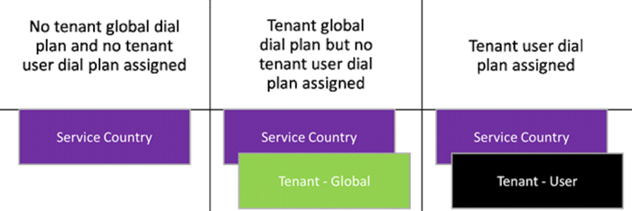

Microsoft のチームで電話会議に関する実用的なガイダンスPractical guidance for Audio Conferencing in Microsoft Teams
============================================================

Office 365 で音声会議には、任意の電話から自分のチーム会議に参加することができます。Audio Conferencing in Office 365 allows participants to join your Teams meetings from any telephone.

ここでは、Office 365 で[音声会議](https://go.microsoft.com/fwlink/?linkid=858992)を表示します。Here's what you get with [Audio Conferencing](https://go.microsoft.com/fwlink/?linkid=858992) in Office 365.

この実用的なガイドは、Office 365 FastTrack 顧客歩フレームワークと計画、配信、および音声会議実装に向けて正常ビジネスを操作するためには、ビジョン化トラック、オンボードとドライブの値の 3 つのフェーズ結果。This practical guidance takes you through the Office 365 FastTrack customer journey framework and its three phases, Envision, Onboard, and Drive Value, to help you plan, deliver, and operate an Audio Conferencing implementation towards succesful business outcomes.

> [!TIP]
> この実用的なガイドでのアクティビティとキー ディスカッションごとに出力する例提供します。ここで説明する例ヒント吹き出し内囲まれ、再利用できるテンプレートとして使用します。については、計画プロセスの一環としてを完了する必要がある (追加) するには、"TBA"が表示されます。In this practical guidance, we are providing example outputs for each activity and key discussion. The examples throughout this document are enclosed inside TIP callouts and they serve as a template that you can reuse. You'll see "TBA" (to be added) for information that you need to complete as part of your planning process.

想定Envision 
=========

Envision フェーズ基盤は、Office 365 のお客様の旅し、電話会議などのすべてのワークロードに適用します。The Envision phase provides the foundation for the Office 365 customer journey and is applicable to all workloads such as Audio Conferencing.

このフェーズで関連性の高いプロジェクト関係者の組み立て、最終的に提供すると、ビジネスの目標はキャプチャされます。In this phase, business goals are captured, with relevant project stakeholders assembled, to ultimately deliver:

-   ビジネスを含む、成功の高度なプランの場合、主要関係者、目標とキー結果 (OKRs)、重要な成功の評価指標 (KSIs)、リスク、環境の評価、導入準備ができて、および運用プランを使用します。A high-level success plan that contains business use cases, key stakeholders, objectives and key results (OKRs), key success indicators (KSIs), risks, environmental assessment, adoption readiness, and operational plan.

-  目的の最終状態を達成するために詳細な電話会議技術的実装計画します。A detailed Audio Conferencing technical implementation plan to achieve the desired end state.

電話会議のビジネス ユース ケースを定義します。Define business use cases for Audio Conferencing
------------------------------------------------

電話会議には、会議への追加のエントリ ポイントが組織が用意されています (でのアドホックへとスケジュールされた) により、会議の出席者への参加 PSTN (公衆交換電話網) でダイヤルインして従来 land 線、PBX、または携帯電話を使用します。Audio Conferencing provides organizations with additional entry points to any meetings (adhoc and scheduled) by allowing meeting participants to join via PSTN (public switched telephone network) by dialing in using traditional land line, PBX, or mobile phones.

これは、は、参加者、開催者はない場合、コンピューターの前またはデータ接続が使用できないか、音声の通信をサポートする出所がいる場合に便利です: など、モバイル データの場所にリモート領域の場合、または無料、一般向けに接続されている場合帯域幅の制限] で、または簡単にアクセスできるテレフォニー両端のシートを使用して、会議にダイヤルイン会議の参加者を使いたい場合は、サービスを Wi-fi します。This is useful when the organizer or participants are not in front of a computer, or when data connections are unavailable or unreliable to support voice communications—such as when in a remote area with spotty mobile data coverage, or if connected to a free, public Wi-Fi service with limited bandwidth, or when meeting participants prefer to dial in to the meeting using telephony endpoint readily accessible to them.

この手順で主要なプロジェクト関係者は、電話会議の実装をサポートするビジネス ユース ケースを定義します。In this step, core project stakeholders will define business use cases that support the implementation of Audio Conferencing.

ビジネスの使用例を定義して、予定、測定可能なビジネスの結果をドキュメントし、次のとおりになっています。Business use cases are meant to define and document the expected and measurable business outcomes, and include the following:

-   現在のビジネス プロセスの説明Description of current business process
-   定義された既存のビジネス プロセスの課題Challenges with existing business process defined
-   技術がどのように役立つこれらの課題How technology can help overcome these challenges
-   このような問題を解決する場合、明確なビジネスの結果The expected and measurable business outcomes if these challenges are overcome

> [!TIP]
> 完成したビジネス ユース ケースの例を次に示します。The following is an example of a completed business use case:
>|         |
>|---------|
>|**現在のビジネス プロセスの説明****Description of current business process** 現在、Contoso は、会議の会議の内部と外部の関係者に関連する会議の議事録、課金対象現行ローカル テレフォニー プロバイダーによって提供 PSTN 会議サービスに依存しています。Contoso currently relies on PSTN conferencing services provided by the incumbent local telephony provider chargeable by meeting minutes for internal meetings and meetings involving external parties.|
>|**既存のビジネス プロセスの課題****Challenges with existing business process** Contoso に費やすほぼ USD 100万件の会議の内部で発生したコストの 75% で、現在の PSTN 会議サービスの年間します。Contoso spends roughly USD 1 million per year for the current PSTN conferencing service, with 75% of the cost incurred for internal meetings. モダンなコミュニケーションとコラボレーション プラットフォーム チームを採用する組織の計画には、PSTN 会議サービスによってホストされている会議に参加するために、従来のテレフォニー エンドポイントの使用は無効です。The use of traditional telephony endpoints to join the meetings hosted by the PSTN conferencing service is not aligned with the plan for the organization to adopt Teams as modern communications and collaboration platform.|
>|**技術がこれらの課題を解決する方法****How technology can overcome these challenges** モダンな通信、コラボレーション プラットフォームとして Microsoft チームの採用により、内部ユーザーは、主に最適化されたヘッドセット搭載し、会議室デバイスは、その Pc を使用して会議に参加する必要があります。音声会議サービスを利用できるは、外部参加者をサポートするか、PC のオーディオの使用がない内部の参加者の高い状況をサポートするされます。With the adoption of Microsoft Teams as modern communications and collaboration platform, internal users are expected to primarily join meetings using their PCs equipped with optimized headsets and meeting room devices. Audio Conferencing service will be available to support external participants or to support situations where the use of PC audio is not favorable for the internal participants.|
>|**想定される、明確なビジネスの結果****Expected, measurable, business outcomes** チームへの移行はモダンな通信、コラボレーション プラットフォームで電話会議サービスと組み合わせて使用大幅にコストを削減 Contoso ポイントに PSTN 会議サービスを提供すると、のみの約 20% を費やす予定です、既存の PSTN 会議サービスの年間のコスト。The move to Teams as modern communications and collaboration platform, combined with Audio Conferencing service, will greatly reduce the cost to deliver the PSTN conferencing service to the point that Contoso is expected to only spend approximately 20% of the annual cost of the existing PSTN conferencing service.|

ビジネス ユース ケースを定義するには、ほかの Envision フェーズでは、次の手順に移動すると、必要があります使用することもわかりやすくするための周囲。In addition to defining your business use cases, as you move into the next step of the Envision phase, you should also get clarity around:
- 組織のスコープとorganizational scope, and
- プロジェクトのスケジュールproject timelines

主要関係者を特定します。Identify key stakeholders
-------------------------

前の手順で定義されているビジネス ユース ケース、電話会議の実装の組織の範囲が含まれ、包括的な利害関係者マトリックス、適切なプロジェクトに参加する人を追加するのに完了すると、基にします。The business use cases defined in the previous step will include organizational scope of Audio Conferencing implementation, and based on that, the comprehensive stakeholder matrix can be completed to include the right people to be involved in the project.

> [!TIP]
> プロジェクト関係者を文書に使用できる関係者マトリックス テンプレートの例を以下に示します。Below is an example of stakeholder matrix template that you can use to document the project stakeholders:
>|役割Role  |説明Description  |名前、連絡先情報、場所Name, contact information, location  |
>|---------|---------|---------|
>|プロジェクトのエグゼクティブ スポンサーProject Executive Sponsor|<ul><li>最高の権限とプロジェクトおよびプロジェクトの目標に対する配信の責任Ultimate authority and accountability for the project and delivery on project objectives</li><li>プロジェクトの進行してエスカレート問題の解決方法します。Help resolve issues escalated by Project Lead</li><li>プロジェクトの目標の社内スポンサー コミュニケーションSponsors communication within the company about project goals</li><li>ユーザーの責任において重要な戦略的な決定を行うResponsible for making key strategic decisions</li><li>必要なリソースと予算の空き時間情報を担当します。Responsible for availability of required resources and budget</li><li>主要なビジネス レビュー (QBR)Leading Quarterly Business Reviews (QBR)</li><li>購入と認識キャンペーンの残存作業時間のサポートBuy-In and support of awareness campaign effort</li><li>プログラムの展開するプロジェクト スポンサーとして使用します。Serving as the Project Sponsor to the program rollout</li></ul>|TBATBA|
>|プロジェクトの潜在顧客Project Lead|<ul><li>先頭のプロジェクト チームの管理とManaging and leading project team</li><li>座標のパートナーや作業チームが、プロジェクトに従事Coordinates partners and working teams engaged in the project</li><li>作成と管理キー四半期を満たすためにプロジェクト計画の責任者Accountable for creating and managing project plans to meet quarterly key results</li><li>部門連係問題を解決します。Resolving cross-functional issues</li><li>プロジェクトのスポンサーに定期的に更新を提供します。Providing regular updates to the project sponsors</li><li>すべてのプロジェクト計画に導入の要素を組み込むIncorporating Adoption aspects into the all-up project plan</li><li>先頭の毎月のビジネスと運用レビュー (MBR)、四半期ごとのビジネス レビュー原因となっています。Leading Monthly Business and Operational Reviews (MBR), contributing to Quarterly Business Reviews</li></ul>|TBATBA|
>|潜在顧客/設計者のグループ作業Collaboration Lead/Architect|<ul><li>役員によって定義されたコラボレーション戦略の実行を担当します。Responsible for execution on collaboration strategy defined by company executives</li><li>分析とビジネスの目標を達成する会社のコラボレーション製品を選択します。Analyzing and choosing collaboration products for the company that meets business goals</li><li>ユーザーの責任においてコラボレーション製品の操作のデザインResponsible for the design of the operations for collaboration products</li><li>操作とサポート モデルを定義します。Defines operation and support model</li><li>月間、四半期ごとのビジネス レビュー原因となっています。Contributing to Monthly and Quarterly Business Reviews</li><ul>|TBATBA|
>|コンサルタントConsultant|<ul><li>ユーザーの責任において構成サービスResponsible for configuration services</li><li>全体的なソリューション アーキテクチャを寄与します。Contributes in overall solution architecture</li></ul>|TBATBA|
>|プロジェクト マネージャーProject Manager|<ul><li>開発とプロジェクト計画を維持します。Developing and maintaining project plan</li><li>プロジェクト計画および予算行内のプロジェクトの成果物を管理します。Managing project deliverables in line with project plan and budget</li><li>録音とエスカレートなど、プロジェクトの課題を管理します。Recording and managing project issues, including escalations</li><li>呼び出しを毎週スタンドを行うConducting weekly stand up calls</li><li>エグゼクティブ スポンサーのプロジェクトの更新を示し、連携Liaises with, and provides updates to project executive sponsors</li><li>変更の管理方法を定義する設計者と通信プランを操作します。Working with the Architect to define the Change Management approach and Communication Plans</li></ul>|TBATBA|
>|変更管理/導入スペシャ リストChange Management/Adoption Specialist|<ul><li>導入とトレーニングのプロセスに検出フェーズの入力します。Provide input on Discovery phase into adoption and training processes</li><li>導入戦略のワーク ショップに参加します。Participate in adoption strategy workshop</li><li>開発および導入戦略の立案を担当します。Developing and responsible for adoption strategy</li><li>開発とコミュニケーション計画を実行します。Developing and executing communication plan</li><li>ユーザーの責任において、エンドユーザーにトレーニングを提供します。Responsible for delivering trainings to end users</li><li>フィードバックの収集およびアンケートを実施Collect feedback and conduct surveys</li></ul>|TBATBA|
>|ネットワークの潜在顧客Network Lead|<ul><li>ネットワーク設計に検出フェーズの入力を提供します。Providing input on Discovery phase into network design</li><li>ビジョン ワーク ショップ計画に参加します。Participating in planning during Envisioning workshop</li><li>プロジェクトの実行中に、ネットワーク チームの作業を座標Coordinates work of networking team during the project execution</li></ul>|TBATBA|
>|セキュリティの潜在顧客Security Lead|<ul><li>セキュリティの設計とプロセスに検出フェーズの入力を提供します。Providing input on Discovery phase into security design and processes</li><li>ビジョン ワーク ショップ計画に参加します。Participating in planning during Envisioning workshop</li><li>プロジェクトの実行中にセキュリティ チームの作業を座標Coordinates work of security team during the project execution</li></ul>|TBATBA|
>|テレフォニーの潜在顧客Telephony Lead|<ul><li>テレフォニーの設計に検出フェーズの入力を提供します。Providing input on Discovery phase into telephony design</li><li>構想ワーク ショップ計画に参加します。Participating in planning during envisioning workshop</li><li>プロジェクトの実行中にテレフォニー チームの作業を座標Coordinates work of telephony team during the project execution</li></ul>|TBATBA|
>|デスクトップの潜在顧客Desktop Lead|<ul><li>入力を検出フェーズでクライアントと更新プロセスに提供します。Providing input on Discovery phase into clients and update process</li><li>構想ワーク ショップ計画に参加します。Participating in planning during envisioning workshop</li><li>プロジェクトの実行中にデスクトップのチームの作業を座標Coordinates work of desktop team during the project execution</li></ul>|TBATBA|
>|サポート/ヘルプ デスク潜在顧客Support/Help Desk Lead|<ul><li>運用に検出フェーズとサポート モデルの入力を提供します。Providing input on Discovery phase into operational and support model</li><li>構想ワーク ショップ計画に参加します。Participating in planning during envisioning workshop</li><li>サポート モデルの計画に参加します。Participating into support model planning</li><li>プロジェクトの実行中に、サポート チーム/リソースの作業を座標Coordinates work of support teams/resources during the project execution</li></ul>|TBATBA|
>|ビジネス単位の代表者Business Unit Representatives|<ul><li>エンドユーザー ベース導入ガイドと教材の投稿します。Contribute in End User based adoption guides and materials</li><li>投稿して、ビジネスの使用例を確認します。Contribute to and review Business Use Cases</li></ul>|TBATBA|
>|潜在顧客の展開Deployment Lead|<ul><li>展開の前提条件が満たされていることを確認します。Ensure that deployment prerequisites are met</li><li>上に協力してお客様のリソースを準備し、ステージのアクティビティを展開します。Engage customer resources to engage on prepare and deploy stage activities</li><li>参加を確認する会議を準備し、状態を展開します。Participate in meetings to review prepare and deploy status</li></ul>|TBATBA|
>|IT 管理者IT Admins|<ul><li>IT プロフェッショナルはユーザーの責任においてサポート テストの計画と実行を依頼します。IT Pros responsible for assistance with test planning and execution</li></ul>|TBATBA|
>|サービスの所有者Service Owner|<ul><li>すべてを電話会議サービスの操作を担当するにはIs responsible for the operation of the Audio Conferencing service all up</li><li>音声会議サービスの所有者Owner of Audio Conferencing service</li></ul>|TBATBA|
>|品質のエキスパートQuality Champions|<ul><li>ドライブの品質、信頼性、およびユーザーのフィードバックDrives quality, reliability and user feedback</li><li>品質の傾向とそれぞれのチームとドライブの改善Identifies the quality trends and drive remediation with the respective teams</li><li>リーダーシップに戻る運営委員会でレポートReports through the steering committee back to leadership</li><li>単価マイ着信および正味プロモーター スコアを使って、品質、信頼性、およびユーザーのセンチメント上のレポートReports on quality, reliability, and user sentiment through Rate My Call and Net Promoter Score</li></ul>|TBATBA|

目標、主要な結果、重要な成功のインジケーターには、リスクを定義します。Define objectives and key results, key success indicators, and risks
--------------------------------------------------------------------

組み立てプロジェクト関係者、ビジネス ユース ケース、組織の範囲やプロジェクト タイムラインを目標と主要な結果 (OKRs) に変換することができ、重要な成功の評価指標 (KSIs) のリストにプロジェクトの成功のメジャーによって定義されることができます。With the project stakeholders assembled, business use cases, organizational scope and project timelines can be translated into objectives and key results (OKRs) and the measures of project success can be defined into a list of key success indicators (KSIs).

所有権の意味は KSIs と OKRs を定義するときに、プロジェクト関係者の完全なへの参加のことを確認し、組織のビジネス要件に揃え、します。Full participation from project stakeholders when defining the OKRs and KSIs will ensure sense of ownership and they are aligned to organizational business requirements.

OKRs には、主要成果四半期ごとに定義されていると、プロジェクトの開始時に設定する目的のリストが含まれます。主要な結果が、プロジェクト全体の状態を追跡する毎月レビューし、進捗状況に基づくは、必要に応じて、四半期ごとのプランへの調整を実感できます。OKRs will contain the list of objectives set in the beginning of the project, with measurable key results defined in a quarterly basis. The key results are reviewed monthly to track status of the overall project, and based on progress, adjustment to the quarterly plans can be made as needed.

> [!TIP]
> 電話会議の実施に関連する OKRs の例は、下にある参照できます。Example of OKRs relevant to Audio Conferencing implementation can be referenced below:
> 
>
>**ビジョン: Office 365 への投資を最大化することで生産性を向上します。****Vision: Increase productivity by maximizing Office 365 investments**
>|目標Objectives  |主要な結果Key Results  |実行するにはTo Do  |
>|---------|---------|---------|
>|会計年度 2018 の終了をチームで電話会議を展開します。Deploy Audio Conferencing in Teams by end of fiscal year 2018|FY18Q1: チームで電話会議をグローバルに展開します。FY18Q1: Deploy Audio Conferencing in Teams globally| ビジョンを描くEnvision<ul><li>成功の計画を作成します。Create success plan</li><li>詳細な技術導入の計画を作成します。Create detailed technical implementation plan</li></ul>
オンボードOnboard<ul><li>成功の計画を実行します。Execute success plan</li><li>技術的な実装計画を実行します。Execute technical implementation plan</li></ul>|
>|従来の PSTN 会議の使用を停止するサービスをグローバルに mid 2018 の会計年度のDecommission legacy PSTN Conferencing service globally by mid of fiscal year 2018|FY18Q2: 従来の PSTN 会議サービスをグローバルに解除します。FY18Q2: Decommission legacy PSTN Conferencing service globally|ドライブ名] の値Drive Value<ul><li>ユーザーの活動とドライブの採用を促進します。Boost user engagement and drive adoption</li><li>管理して、変更を準備します。Manage and prepare change</li><li>測定、成功すると、共有、および反復処理Measure, share success, and iterate</li>|

KSIs では、主要な結果の品質と成功を測定し、詳細なや不適切な結果を OKRs (実現または達成できない) のバイナリ性質を補完します。KSIs を定義するときに、"特定、明確な割り当てることができる、現実的な時間に関連する"やスマート検索条件を活用することをお勧めします。KSIs measure quality and success of the key results and complement the binary nature of OKRs (achieved or not achieved), by detailing the good and/or bad results. When defining KSIs, we recommend leveraging the “specific, measurable, assignable, realistic, time-related” or SMART criteria.

> [!TIP]
> このプロジェクトに関連する KSI の例を次に示します。The following is an example of KSI relevant to this project:
>|入力Type  |KSI 質問と抽出条件KSI question & criteria  |どのように測定How measured  |成功の抽出条件Success criteria  |測定Measured  |ユーザーの責任Responsible  |
>|---------|---------|---------|---------|---------|---------|
>|使用状況と導入Usage/adoption|通話品質の確認には、以前のソリューション以上Call quality is equal to or better than the previous solution|アンケートSurvey|80% 以上のユーザーまたは強く同意80% of users agree or strongly agree|四半期後After enablement and quarterly|情報技術チームInformation Technology team|
>|使用状況と導入Usage/adoption|Microsoft チームが、通信プロセスを容易になりますMicrosoft Teams made the communication process easier|アンケートSurvey|80% 以上のユーザーまたは強く同意80% of users agree or strongly agree|四半期後After enablement and quarterly|チームの管理を変更します。Change Management team|
>|使用状況と導入Usage/adoption|ユーザー ソリューションを実際に使用します。Users actively use the solution|Office 365 のレポート、通話品質のダッシュ ボードOffice 365 reports, Call Quality Dashboard|80% 以上のユーザーがアクティブなユーザーの 1 日80% of users are active daily users|1 日Daily|チームの管理を変更します。Change Management team|
>|使用/品質Usage/quality|低下通話と会議の割合を最小限にする必要があります。Percentage of poor calls/conferences should be minimal|通話品質のダッシュ ボードCall Quality Dashboard|1 か月あたりの低下の通話の < 5%< 5% of poor calls per month|1 日Daily|情報技術チームInformation Technology team|
>|使用/サポートUsage/support|テクニカル サポートを取得する方法を知るI know how to get technical support|アンケートSurvey|ユーザーの 90% または強く同意90% of users agree or strongly agree|四半期後After enablement and quarterly|チームの管理を変更します。Change Management team|
>|使用/サポートUsage/support|テクニカル サポートの品質の内容に満足でも、I am satisfied with the quality of technical support|アンケートSurvey|80% 以上のユーザーまたは強く同意80% of users agree or strongly agree|各問題が発生しました。After each incident|情報技術チームInformation Technology team|
>|財務Financial|従来の会議の時間 (分) の削減Reduction of legacy conferencing minutes|財務システムFinancial system|会議には、ROI が定義されています。Meet defined ROI|ROI をに基づいてください。Based on ROI|チームの管理を変更します。Change Management team|

この手順の一部としてビジネス上のリスクを特定すると、指定された各リスクの軽減計画を定義する必要があります。この情報は、プロジェクトの計画にキャプチャすることができます。You need to identify business risks as part of this exercise and define a mitigation plan for each identified risk. This information can be captured into a risk plan.

> [!TIP]
> 次の例として、プロジェクトの計画を文書化することができます。Your risk plan can be documented as the example below:
>|リスクRisk  |確率Likelihood  |impactImpact  |全体的なOverall  |リスク軽減計画Mitigation plan  |
>|---------|---------|---------|---------|---------|
>|今後の統合が最大 1,000 人を追加します。Upcoming merger will add up to 1,000 people|高High|高High|高High|<ul><li>差し込み印刷の会社の独自のプロセス (オンボード Envision、ドライブ] の値) 終わったらを区切ります。For merged companies, separate OKR with own process (Envision, Onboard, Drive Value)</li><li>既存の OKRs には含まれないDo not include them in existing OKRs</li></ul>|
>|プロジェクトの完了を遅らせる、電話番号の移植Telephone number porting will delay project completion|高High|高High|高High|<ul><li>サポートの電話番号の移植先にする、すべての必要な情報を準備する (例:: 文字の承認の詳細については、課金、顧客サービス レコード)Prepare all the required information to support telephone number porting ahead of time (i.e.: customer service record, billing details, Letter of Authorization)</li><li>電話番号の移植実行の所要時間に合わせてプロジェクトのスケジュールを調整します。Adjust project timeline to accommodate turnaround time of telephone number porting execution</li><li>外部の参加者に新しいダイヤルイン番号の使用を伝えるCommunicate the use of new dial-in conferencing numbers to external participants</li></ul>|
>|ネットワークのデザインを計画します。Planned network redesign|高High|メディアMedium|メディアMedium|<ul><li>モダンなコミュニケーションとコラボレーション プラットフォーム チームを実装、前に、[プロジェクトのスコープのネットワークの準備ができて評価サイトを実行します。Before implementing Teams as modern communications and collaboration platform, run network readiness assessment for sites in scope of the project</li></ul>|

環境を評価し、導入準備の評価Assess environment and evaluate adoption readiness
--------------------------------------------------

目的の OKRs を達成するため、ソリューションの高度なアーキテクチャを定義する必要があります。関連するすべての要素を評価する環境の検出かかる IT とテレフォニー インフラストラクチャ、ネットワーク、および操作できます。To achieve the intended OKRs, you may have to define the high-level architecture of the solution. It takes environmental discovery to evaluate all aspects relating to IT and telephony infrastructure, networking, and operations.

ソフトウェア要件へのハードウェア要件からの電話会議ビジネス ユース ケースをサポートするモバイル デバイスとコンピューターの準備ができて評価の一部として含めるなりますなど、エンドユーザーがコンピューターにすべての問題の関連する、環境の検出します。All matters related to end-user computing, such as readiness assessment of the personal computers and mobile devices to support Audio Conferencing business use cases, from hardware requirements to software requirements, will be included as part of the environmental discovery.

環境の検出は、 [Microsoft に電話番号を転送](https://docs.microsoft.com/SkypeForBusiness/what-are-calling-plans-in-office-365/transfer-phone-numbers-to-office-365)するための要件がある場合も明らかします。組織にプロジェクト計画を調整し、必要な番号の移植に必要な情報を準備するのに役立ちます。環境の検索を実行するには、次の[アンケート](https://myadvisor.fasttrack.microsoft.com/CloudVoice/Downloads?SelectedIDs=4_1_0_3)を活用します。Environmental discovery can also uncover if there are requirements to [transfer phone numbers to Microsoft](https://docs.microsoft.com/SkypeForBusiness/what-are-calling-plans-in-office-365/transfer-phone-numbers-to-office-365). This will help your organization to adjust the project plan accordingly and prepare the necessary information required for number porting. You can perform environmental discovery by leveraging the following [questionnaire](https://myadvisor.fasttrack.microsoft.com/CloudVoice/Downloads?SelectedIDs=4_1_0_3).

検出の環境には、ネットワークの準備ができて評価して、ネットワークの音声会議サービスの実装をサポートする準備が必要があります。Environmental discovery must include network readiness assessment to ensure the network is ready to support the implementation of the Audio Conferencing service.

電話会議をサポートするネットワークの準備状況をキャプチャ (インターネット接続、WAN トポロジ、サイトへのリンク、利用可能な帯域幅の詳細については) などの環境の検出およびペルソナ分析を使って情報を活用して確認できます。データ (各作業負荷を使用方法に変換できます)、[個人用アドバイザー ネットワーク計画](https://myadvisor.fasttrack.microsoft.com/CloudVoice/NetworkPlanner)ツールにです。ネットワークの前提条件をさらに削除するには、 [microsoft](https://www.microsoft.com/download/details.aspx?id=53885)または[ネットワークの準備ができて評価ツール パートナー](https://myadvisor.fasttrack.microsoft.com/CloudVoice/Partners?ToolPartners)ソリューションを使用してリアルタイム メディア トラフィック シミュレーションを実行できます。Network readiness to support Audio Conferencing can be determined by leveraging the information captured through the environmental discovery (such as details of internet connectivity and WAN topology, site links and available bandwidth) and persona analysis data (that can be translated into an expected usage of each workload) into the [My Advisor Network Planning](https://myadvisor.fasttrack.microsoft.com/CloudVoice/NetworkPlanner) tool. To further confirm network readiness, real-time media traffic simulation can be performed using the solutions provided by [Microsoft](https://www.microsoft.com/download/details.aspx?id=53885) or by [Network Readiness Assessment tools partners](https://myadvisor.fasttrack.microsoft.com/CloudVoice/Partners?ToolPartners).

ネットワークの準備ができて評価の結果は、必要なネットワーク最適化または電話会議の導入を成功させるために必要な改善の像をより明確を描画します。The results of the Network Readiness Assessment will paint a clearer picture of the required network optimization or remediation required for the success of Audio Conferencing implementation.

導入準備ができてペルソナ音声会議サービスの実装を対象の組織内のリストを見つけ出すペルソナ分析を実行して評価できます。ペルソナ分析には、その他の周辺または対象とするビジネスの結果を実現するために必要なデバイスの id が含まれています。Adoption readiness can be evaluated by executing persona analysis to come up with a list of personas in the organization who can be targeted for the implementation of Audio Conferencing service. The persona analysis includes the identification of additional peripherals or devices required to realize the intended business outcomes.

ペルソナ分析を実行するのには、[ペルソナ配置](https://myadvisor.fasttrack.microsoft.com/CloudVoice/Downloads?SelectedIDs=4_2_0_7)ワーク ショップ デッキと[ペルソナ機能マトリックス](https://myadvisor.fasttrack.microsoft.com/CloudVoice/Downloads?SelectedIDs=4_2_0_8)を活用し、関連するプロジェクト関係者を含めることワーク ショップを行うことができます。[ペルソナ分析レポート](https://myadvisor.fasttrack.microsoft.com/CloudVoice/Downloads?SelectedIDs=4_2_0_9)テンプレートを使用してレポートには、ペルソナ分析ワーク ショップの結果をまとめることができます。To perform persona analysis, you can conduct a workshop by involving relevant project stakeholders, leveraging the [Persona Alignment](https://myadvisor.fasttrack.microsoft.com/CloudVoice/Downloads?SelectedIDs=4_2_0_7) workshop deck and [Persona Feature Matrix](https://myadvisor.fasttrack.microsoft.com/CloudVoice/Downloads?SelectedIDs=4_2_0_8). The result of persona analysis workshop can be summarized into a report using the [Persona Analysis Report](https://myadvisor.fasttrack.microsoft.com/CloudVoice/Downloads?SelectedIDs=4_2_0_9) template.

> [!NOTE]
> アンケートの検出とペルソナ分析例最初用に作成された Skype for Business Online、大部分のコンテンツはチームに関連します。自由に変更し、プロジェクトの目標に関連していないアイテムを削除します。While the Discovery Questionnaire and Persona Analysis examples were initially written for Skype for Business Online, a majority of the content is relevant to Teams. Feel free to modify and remove items that are not relevant to your project goals.

環境の評価と導入準備評価の一部として技術的なリスクを特定し、特定された各リスクの軽減計画を作成できます。この情報は、プロジェクトの計画の一部として組み込む必要があります。You can identify technical risks as part of an environmental assessment and adoption readiness evaluation and develop a mitigation plan for each identified risk. This information should be incorporated as part of the risk plan.

運用上の役割を割り当てるMap operational roles
---------------------

操作の計画および音声会議サービスが動作するチームを識別する、重要な手順は、最初のパイロット ユーザーが有効にすると、操作を開始する必要があります。識別された各チームは、確認し、タスクや特定の業務内容に同意し、音声会議サービスの運用する準備を開始します。準備は、トレーニングを含めることがあり、準備ができて、その他スタッフ、または外部のプロバイダーのことを確認するように設定サービスを提供します。Planning for operations and identifying the teams that will operate the Audio Conferencing service is an important step, as operations must start when the first pilot users are enabled. Each identified team must review and agree on the tasks and responsibilities identified and start the preparation to operate the Audio Conferencing service. The preparation might include training and readiness, additional staffing, or ensuring external providers are set up to deliver the service.

> [!TIP]
> このプロジェクトのサポートを実行する手順をマッピング運用上の役割の結果を文書にテンプレートの例を次に示します。The following is an example of a template to document the result of operational roles mapping exercise that you performed to support this project:
>|操作の役割Operational Role  |説明Description  |チームTeam  |連絡先の詳細Contact Details  |
>|---------|---------|---------|---------|
>|サービスの所有者Service Owner|サービスの所有者、ビジネス部門、計画を策定するためのインターフェイスService owner, interface to business divisions, strategy|TBATBA|TBATBA|
>|電話会議を操作します。Audio Conferencing Operations|ユーザーとデバイス アカウント移動/追加/変更、日常業務の監視Daily operations, user and device account move/add/change, monitoring|TBATBA|TBATBA|
>|テナント管理者Tenant Admin|テナント全体の設定を変更する、新機能を有効にします。Change tenant-wide settings, enable new features|TBATBA|TBATBA|
>|ヘルプ デスクHelp Desk|サポートを受けるエンドユーザーのインターフェイスInterface for end-users to get support|TBATBA|TBATBA|
>|ネットワークを操作します。Network Operations|LAN、WAN、Wi-fi、およびインターネットへのアクセスを実行します。Runs LAN, WAN, Wi-Fi, and Internet Access|TBATBA|TBATBA|
>|クライアントとエンドポイント チームClient & Endpoints Team|デスクトップの展開を管理します。Manage desktop deployments|TBATBA|TBATBA|
>|ユーザーの操作Identity Operations|Id インフラストラクチャ (AD、ADFS、Azure AD) を管理します。Manage identity infrastructure (AD, ADFS, Azure AD)|TBATBA|TBATBA|
>|導入/変更管理Adoption/change management|在籍情報、トレーニング、ソリューションの導入を管理します。Manage awareness, training and adoption for the solution|TBATBA|TBATBA|
>|Exchange の操作Exchange Operations|Exchange 環境を管理します。Manages the Exchange environment|TBATBA|TBATBA|

スムーズにマッピング運用上の役割の詳細、運用役割ごとに関連付けられているタスクを含む、[運用役割マッピング ブック](https://myadvisor.fasttrack.microsoft.com/CloudVoice/Downloads?SelectedIDs=4_4_0_16)を使用するには提供の役割と責任を明確にする詳細を取得するには音声会議サービスをサポートします。To facilitate a more detailed operational roles mapping, including the tasks associated with each operational role, you can use the [Operational Role Mapping Workbook](https://myadvisor.fasttrack.microsoft.com/CloudVoice/Downloads?SelectedIDs=4_4_0_16) to capture the details that will provide the clarity around roles and responsibilities to support Audio Conferencing service.

文書の成功の計画Document success plan
---------------------

成功の計画とは、ビジネス ケース、サービスの準備状況、導入の計画、および運用プランで構成される Envision フェーズで作成したドキュメントです。A success plan is the documentation created in the Envision phase that consists of business case, service readiness, adoption plan, and operational plan.

成功計画 FastTrack や展開パートナー、音声会議サービスで、組織の目標を実現するための十分な情報を含めることができるプロジェクト チームが提供されます。The success plan will provide the project team, which can include FastTrack or deployment partner, with sufficient information to realize the organization’s goals with Audio Conferencing service.

一般に、成功のプランを次のメイン セクションが含まれます。In general, a success plan will contain the following main sections:

-   ビジネス ケースBusiness case
-   サービスの準備Service readiness
-   導入の計画Adoption plan
-   実践計画Operational plan

### ビジネス ケースBusiness case

ビジネス ユース ケース、関係者、OKRs と KSIs、リスク、およびプロジェクトのスケジュールは、通常はビジネス ケースの必要な情報を一括を構成します。成功のプランの一部として、文書化する必要があります。Business use cases, stakeholders, OKRs and KSIs, risks, and project timelines typically make up the bulk of information required for a business case. You need to document them as part of the success plan.

### サービスの準備Service readiness

評価の環境では、最初の電話会議を実装する組織の技術的前提条件を確認するために必要な情報を提供します。Environmental assessment provides the initial information required to determine technical readiness for the organization to implement Audio Conferencing.

ここには、アドレスの領域に環境の評価によって検出された問題の解決が必要なプランです。成功計画の一部としてサービスの準備ができて評価と改善プランを追加する必要があります。Included here is the plan to address areas needing remediation discovered through environmental assessment. You need to include the service readiness assessment and remediation plan as part of the success plan.

### 導入の計画Adoption plan

導入準備評価の場合は、次の詳細な計画さらに行う必要がありますコミュニケーション計画、計画、およびリリースの前にあるサイド バー、トレーニングの包括的な設定を後に導入アクティビティを起動するプロジェクト チームのします。Following an adoption readiness assessment, further detailed planning must be completed for the project team to come up with a comprehensive set of communication plans, training plan, and pre-launch, at-launch, and post-launch adoption activities.

チラシ、ようこそメールは、トレーニング資料などのアクティビティの導入をサポートするリソースは、組織の要件を満たすために必要なすべてのカスタマイズと、この手順で識別されます。Resources to support adoption activities such as flyers, welcome emails, and training materials are identified at this step, along with any customizations needed to meet organizational requirements.

導入アクティビティのテンプレートは、使用可能な[次のとおり](https://www.microsoft.com/download/details.aspx?id=54244)です。The templates for adoption activities are available [here](https://www.microsoft.com/download/details.aspx?id=54244).

### 実践計画Operational plan

役割と責任、および音声会議の実装をサポートする各運用役割に割り当てられているチームの練習をマッピング運用上の役割を確立します。Operational roles mapping exercise will establish the roles and responsibilities, and the teams assigned to each operational role to support the implementation of Audio Conferencing.

この手順を完了し、ソリューションの運用の準備を確実に成功プランの一部として、運用プランを含める必要があります。You need to complete this and include the operational plan as part of the success plan to ensure operational readiness of the solution.

 
テクニカル電話会議の計画Technical Planning for Audio Conferencing
-----------------------------------------

電話会議の技術的な実装を計画するには、一連の判断を組織ビジネス要件を満たすソリューションを実装する準備先に行う必要があります。技術的な実装計画には、ビジネス上の決定を記載します。To plan for the technical implementation of Audio Conferencing, a series of decisions must be made ahead of time to better prepare your organization to implement a solution that meets business requirements. These decisions will be documented into a technical implementation plan.

## 電話会議の空き時間情報Availability of Audio Conferencing

電話会議ではこれらの[国と地域](https://docs.microsoft.com/SkypeForBusiness/country-and-region-availability-for-audio-conferencing-and-calling-plans/country-and-region-availability-for-audio-conferencing-and-calling-plans)でできます。Audio Conferencing is available in these [countries and regions](https://docs.microsoft.com/SkypeForBusiness/country-and-region-availability-for-audio-conferencing-and-calling-plans/country-and-region-availability-for-audio-conferencing-and-calling-plans).

> [!IMPORTANT]
> 音声会議サービス、または電話会議サービスされている場所多国籍の組織で使用する音声会議のための法的な制約が原因で for Office 365 のサブスクリプションの場合は、国や地域供給必要があります契約の対象商用から使用できます。Due to legal constraints, for Audio Conferencing to be available to multinational organizations, the contract for Office 365 subscriptions must be sourced from countries and regions covered by Audio Conferencing service, or where Audio Conferencing service is commercially available from.

音声会議サービスを取得するため、組織の利用資格を確認すた後には、音声会議サービスを実装するユーザーの所在地、またはオフィスの一覧を利用できる国と地域のリストに基づくコンパイルします。After confirming your organization’s eligibility for obtaining the Audio Conferencing service, compile the list of user locations or offices where Audio Conferencing service will be implemented based on the list of available countries and regions.

 
|         |         |         |
|---------|---------|---------|
||意思決定ポイントDecision Points|<ul><li>どのユーザーの場所またはオフィスに音声会議サービスを実装を決定します。Decide which user locations or offices will implement the Audio Conferencing service</li></ul>|
||次のステップNext Steps|<ul><li>ユーザーの場所またはオフィスの電話会議サービスを有効にします。Document the user locations or offices to be enabled for the Audio Conferencing service</li></ul>|

> [!TIP]
> 下には、プランの呼び出しサイトの有効化] ボックスの一覧のテンプレートを使用して電話システムの例を示します。Below is an example of a Phone System with Calling Plans site enablement list template:
>|OfficeOffice   |場所Location |PSTN 会議サービスPSTN Conference Service  |
>|---------|---------|---------|
>|1 つ Epping ロードOne Epping Road|AustraliaAustralia|電話会議Audio Conferencing|
>|100 Cyberport ロード100 Cyberport Road|Hong Kong SAR (香港特別行政區)Hong Kong SAR|従来の PSTN 会議Legacy PSTN Conferencing|
>|1 つマリーナ BoulevardOne Marina Boulevard|SingaporeSingapore|電話会議Audio Conferencing|
>|32 ロンドン ブリッジ番地32 London Bridge Street|英国United Kingdom|電話会議Audio Conferencing|
>|39 quai ' ヅ Président ルーズベルト39 quai du Président Roosevelt|FranceFrance|電話会議Audio Conferencing|

## 電話会議のライセンスLicensing for Audio Conferencing

[音声会議ライセンス](https://docs.microsoft.com/SkypeForBusiness/skype-for-business-and-microsoft-teams-add-on-licensing/skype-for-business-and-microsoft-teams-add-on-licensing)が、Office 365 E5 サブスクリプション プランの一部として、または Office 365 E1、または Office 365 E3 サブスクリプション プランのアドオンとして使用します。[Audio Conferencing license](https://docs.microsoft.com/SkypeForBusiness/skype-for-business-and-microsoft-teams-add-on-licensing/skype-for-business-and-microsoft-teams-add-on-licensing) is available as part of Office 365 E5 subscription plans, or as an add-on to Office 365 E1 or Office 365 E3 subscription plans.

> [!NOTE]
> チームで PSTN」または「ダイヤルイン会議は、3rdをサポートしていません-パーティの音声電話会議プロバイダー (Acp)。PSTN or dial-in conferencing in Teams does not support 3rd-party Audio Conferencing Providers (ACPs).  現在使用している Skype for Business Online の PSTN 会議をすることができます即座に電話会議の活用チームします。If you already use Skype for Business Online PSTN Conferencing today, you can immediately take advantage of Audio Conferencing in Teams.

フリー ダイヤル電話会議ブリッジの電話番号を指定し、会議をサポートするため、国際電話番号にダイヤルアウトする必要が、組織の[通信を加算したもの](https://docs.microsoft.com/SkypeForBusiness/skype-for-business-and-microsoft-teams-add-on-licensing/what-are-communications-credits)をセットアップします。To provide toll-free conference bridge phone numbers and to support conferencing dial-out to International phone numbers, you need to setup [Communications Credits](https://docs.microsoft.com/SkypeForBusiness/skype-for-business-and-microsoft-teams-add-on-licensing/what-are-communications-credits) for your organization.

> [!IMPORTANT]
> フリー ダイヤル電話会議ブリッジの電話番号が、サービスが一部の国と通信クレジットの使用が必須などの国でダイヤルをサポートするにはここではします。Some countries are serviced by toll-free conference bridge phone numbers only, and in this case the use of Communications Credits is a mandatory requirement to support dial in for such countries.

通信クレジットを実装するときに最初の考慮事項では、最初の購入の預金額を決定します。[通信クレジット](https://docs.microsoft.com/SkypeForBusiness/skype-for-business-and-microsoft-teams-add-on-licensing/what-are-communications-credits)記事から推奨資金調達額が参照されていることができます。The first consideration to make when implementing Communications Credits is to decide the initial amount of funds to be purchased. Recommended funding amounts can be referenced from [Communications Credits](https://docs.microsoft.com/SkypeForBusiness/skype-for-business-and-microsoft-teams-add-on-licensing/what-are-communications-credits) article.

組織は、自動回復を使用する場合に、推奨されるトリガー (資金の最小値の量) が[通信クレジット](https://docs.microsoft.com/SkypeForBusiness/skype-for-business-and-microsoft-teams-add-on-licensing/what-are-communications-credits)の資料にも含まれます。自動充電金額では、実際の使用状況によって決定する必要があります。通信クレジットの調整金額ニーズを時間と充電経由で使用状況を監視する必要があります。If your organization choose to use auto-recharge, a recommendation on the trigger (lowest amount of funds) is also included in the [Communications Credits](https://docs.microsoft.com/SkypeForBusiness/skype-for-business-and-microsoft-teams-add-on-licensing/what-are-communications-credits) article. Auto-recharge amount needs to be determined by the actual usage. Communications Credits usage should be monitored over time and recharge amount needs to be adjusted as required.

 
|         |         |         |
|---------|---------|---------|
||意思決定ポイントDecision Points|<ul><li>組織が必要な音声会議ライセンスを購入がいない場合は、既存の Office 365 サブスクリプションをセットアップして、または電話会議のアドオンを入手することでに、音声会議ライセンスを取得するかどうか決定します。If your organization has not already purchased the required Audio Conferencing licensing, decide whether Audio Conferencing licenses will be acquired by stepping up existing Office 365 subscriptions or by acquiring Audio Conferencing add-ons</li><li>通信クレジットが電話会議の実施に必要なかどうかを決定します。必要な場合は、最初の購入の預金額を決定します。必要に応じて、トリガー量と自動充電量を決定します。Decide if Communications Credits is required for Audio Conferencing implementation. If so, decide the initial amount of funds to be purchased. Where applicable, decide the trigger amount and auto-recharge amount.</li></ul>|
||次のステップNext Steps|<ul><li>音声会議ライセンスを割り当てるユーザーをドキュメントします。Document the users that will be assigned Audio Conferencing license</li><li>(最初の数、トリガー金額、自動充電量) 通信クレジット計画書を作成します。Document the Communications Credits plan (initial amount, trigger amount, auto-recharge amount)</li></ul>|

> [!TIP]
> 次の例を使用している電話会議のユーザーのライセンスの割り当てのリストを文書化することができます。You can document the license assignment list for Audio Conferencing users using the following example:
>|ユーザーUser  |OfficeOffice  |Office 365 のライセンスOffice 365 License  |
>|---------|---------|---------|
>|Adele VanceAdele Vance|1 つ Epping ロードOne Epping Road|Office 365 E5Office 365 E5|
>|Alex WilberAlex Wilber|1 つ Epping ロードOne Epping Road|Office 365 E3、電話会議のアドオンOffice 365 E3, Audio Conferencing add-on|
>|佐藤みなとBen Walters|1 つ Epping ロードOne Epping Road|Office 365 E3、電話会議のアドオンOffice 365 E3, Audio Conferencing add-on|
>|Christie 辞退Christie Cline|1 つマリーナ BoulevardOne Marina Boulevard|Office 365 E3、電話会議のアドオンOffice 365 E3, Audio Conferencing add-on|
>|宮部目Debra Berger|1 つマリーナ BoulevardOne Marina Boulevard|Office 365 E5Office 365 E5|
>|秀樹 GuLee Gu|1 つマリーナ BoulevardOne Marina Boulevard|Office 365 E5Office 365 E5|
>|Emily あるブラウンEmily Braun|32 ロンドン ブリッジ番地32 London Bridge Street|Office 365 E5Office 365 E5|
>|Lidia HollowayLidia Holloway|32 ロンドン ブリッジ番地32 London Bridge Street|Office 365 E5Office 365 E5|
>|Pradeep グプタ氏Pradeep Gupta|32 ロンドン ブリッジ番地32 London Bridge Street|Office 365 E5Office 365 E5|
>|Marcel BeauchampMarcel Beauchamp|39 quai ' ヅ Président ルーズベルト39 quai du Président Roosevelt|Office 365 E3、電話会議のアドオンOffice 365 E3, Audio Conferencing add-on|
>|Rachelle CormierRachelle Cormier|39 quai ' ヅ Président ルーズベルト39 quai du Président Roosevelt|Office 365 E5Office 365 E5|
>|Isabell PotvinIsabell Potvin|39 quai ' ヅ Président ルーズベルト39 quai du Président Roosevelt|Office 365 E3、電話会議のアドオンOffice 365 E3, Audio Conferencing add-on|

 
> [!TIP]
> 次のようには、数値を計画、通信クレジットを文書化することができます。Your Communications Credits planning numbers can be documented as the following:
>|         |         |
>|---------|---------|
>|初期の量Initial amount|$ 1,000$ 1,000|
>|トリガー金額Trigger amount|$ 400$ 400|
>|自動充電金額Auto-recharge amount|TBATBA|

## 会議ブリッジの電話番号Conference bridge phone numbers

Office 365 で音声会議サービスが含まれます。The Audio Conferencing service in Office 365 includes:

-   複数の種類の会議ブリッジの電話番号 (有料とフリー ダイヤル)Multiple types of conference bridge phone numbers (Toll and Toll-Free)
-   複数のカテゴリ (専用および共有) の電話番号Multiple categories of the phone number (dedicated and shared)
-   (プライマリおよびセカンダリ) は、会議ブリッジの複数言語のサポートSupport for multiple languages for the conference bridge (primary and secondary)
-   テナントの既定の電話番号です。A default phone number for the tenant.

含まれている機能の詳細については、 [Skype for Business とチームの Microsoft の音声会議をセットアップして](https://docs.microsoft.com/SkypeForBusiness/audio-conferencing-in-office-365/set-up-audio-conferencing)[電話会議の電話番号](https://docs.microsoft.com/SkypeForBusiness/audio-conferencing-in-office-365/phone-numbers-for-audio-conferencing)から参照されていることができます。Full description of the included capabilities can be referenced from [Set up Audio Conferencing for Skype for Business and Microsoft Teams](https://docs.microsoft.com/SkypeForBusiness/audio-conferencing-in-office-365/set-up-audio-conferencing) and [Phone numbers for Audio Conferencing](https://docs.microsoft.com/SkypeForBusiness/audio-conferencing-in-office-365/phone-numbers-for-audio-conferencing).

> [!NOTE]
> 会議ブリッジの電話番号が、 [Skype for Business とチームの Microsoft のサービスの電話番号を取得する](https://docs.microsoft.com/SkypeForBusiness/what-is-phone-system-in-office-365/getting-service-phone-numbers)で説明されているとして適用可能なライセンスの数に基づいて、テナントあたりを取得する電話番号の制限にカウントは専用となります。フリー ダイヤル電話会議ブリッジの電話番号には、通信クレジットが必要です。Dedicated conference bridge phone numbers are counted towards the limit of phone numbers that can be acquired per tenant, based on the number of applicable licenses as described in [Getting service phone numbers for Skype for Business and Microsoft Teams](https://docs.microsoft.com/SkypeForBusiness/what-is-phone-system-in-office-365/getting-service-phone-numbers). Toll-free conference bridge phone numbers require Communications Credits.

音声会議サービスに保存する必要があります会議ブリッジの電話番号が既に存在する場合、国に固有の要件を満たしていることを想定しています、[既存の会議ブリッジの電話番号に転送できます Microsoft します。If there are existing conference bridge phone numbers that must be transferred to the Audio Conferencing service, assuming they are meeting the country-specific requirements, then the existing conference bridge phone numbers can be transferred to Microsoft.

> [!NOTE]
> 国または地域、航空会社、回路、関連する数およびその他の要因多くの電話番号に転送する Microsoft より複雑になりますが大幅に基づくは異なります。電話番号の移植の計画] の[番号の移植ガイド](https://go.microsoft.com/fwlink/?linkid=859011)をオンにします。Complexity of transferring phone numbers to Microsoft varies greatly based on the countries or regions, carriers, the number of circuits involved, and many other contributing factors. To plan for phone number porting, check out the [Number Porting Guide](https://go.microsoft.com/fwlink/?linkid=859011).

電話番号に転送する音声会議サービスの詳細については、 [Office 365 への電話番号に転送](https://docs.microsoft.com/SkypeForBusiness/what-are-calling-plans-in-office-365/transfer-phone-numbers-to-office-365)する] で記載されています。Additional details on transferring phone numbers to Audio Conferencing service can be found in [Transfer phone numbers to Office 365](https://docs.microsoft.com/SkypeForBusiness/what-are-calling-plans-in-office-365/transfer-phone-numbers-to-office-365).

 
|         |         |         |
|---------|---------|---------|
||意思決定ポイントDecision Points|<ul><li>組織に専用の会議ブリッジの電話番号が必要かどうかを決定します。Decide whether the organization requires dedicated conference bridge phone numbers</li><li>ユーザーの場所またはオフィス専用の会議ブリッジの電話番号の取得方法を決定する電話会議の実装の範囲内 (Microsoft から取得したり、既存の電話番号に転送)Decide how the dedicated conference bridge phone numbers will be obtained for user locations or offices in-scope for the Audio Conferencing implementation (obtain from Microsoft or transfer existing phone numbers)</li><li>Microsoft から取得する場合は、電話番号を入手する方法を決定する (フォーム送信または自動) ユーザーの場所またはオフィスの範囲内の電話会議の実施If you choose to obtain from Microsoft, decide the method to obtain phone numbers (form submission or automated) for user locations or offices in-scope for the Audio Conferencing implementation</li><li>各専用の会議ブリッジの電話番号のように設定する言語の設定を決定します。Decide the language preferences to be set up for each dedicated conference bridge phone number</li><li>テナント既定の会議ブリッジの電話番号を決定します。Decide the tenant default conference bridge phone number</li></ul>|
||次のステップNext Steps|<ul><li>文書のマスター プランの電話番号を取得し、各ユーザーの所在地または office の範囲内の電話会議の実施電話番号を取得する方法を説明します。Document the master plan for phone numbers acquisition, detailing how phone numbers will be obtained for each user location or office in-scope for the Audio Conferencing implementation.</li><li>必要に応じて、<a href="https://docs.microsoft.com/SkypeForBusiness/what-are-calling-plans-in-office-365/manage-phone-numbers-for-your-organization/manage-phone-numbers-for-your-organization">新しい電話番号の依頼フォーム</a>場所、または office ごとに 1 つのフォームを完了します。If applicable, complete <a href="https://docs.microsoft.com/SkypeForBusiness/what-are-calling-plans-in-office-365/manage-phone-numbers-for-your-organization/manage-phone-numbers-for-your-organization">the New Telephone Number Request form</a>, one form for each location or office</li><li>既存の電話番号に転送する場合をチェック アウトの<a href="https://go.microsoft.com/fwlink/?linkid=859011">番号の移植ガイド</a>を計画および実装タイムラインの電話会議を調整するにはIf you choose to transfer existing phone numbers, check out the <a href="https://go.microsoft.com/fwlink/?linkid=859011">Number Porting Guide</a> to plan it and adjust Audio Conferencing implementation timeline accordingly</li><li>ドキュメントの詳細な会議ブリッジの電話番号の構成 (共有および会議ブリッジの電話番号、各 [専用の会議ブリッジの電話番号、テナント既定の会議ブリッジの電話番号の言語設定を専用)Document the detailed conference bridge phone number configurations (shared and dedicated conference bridge phone numbers, language preferences for each dedicated conference bridge phone number, tenant default conference bridge phone number)</li></ul>|

> [!TIP]
> 下には、会議ブリッジの詳細をキャプチャするテンプレートの例を示します。Below is an example of a template to capture conference bridge details:
>|OfficeOffice   |ブリッジ番号の取得とブリッジの種類Bridge Number Acquisition and Bridge Type |ブリッジの数Bridge Number  |ブリッジの言語Bridge Language|
>|---------|---------|---------|---------|
>|1 つ Epping ロードOne Epping Road|新しいを入手する、専用Acquire new, dedicated|TBATBA|英語 (オーストラリア)English (Australia)|
>|1 つマリーナ BoulevardOne Marina Boulevard|新しいを入手する、共有Acquire new, shared|TBATBA|英語 (米国)、中国語 (簡体字、PRC)English (United States), Chinese (Simplified, PRC)|
>|32 ロンドン ブリッジ番地32 London Bridge Street|ポート既存、専用Port existing, dedicated|+44 20 7946 0001+44 20 7946 0001|英語 (英国)English (United Kingdom)|
>|39 quai ' ヅ Président ルーズベルト39 quai du Président Roosevelt|新しいを入手する、専用Acquire new, dedicated|TBATBA|フランス語 (フランス)、英語 (英国)French (France), English (United Kingdom)|

## 会議ブリッジの設定Conference bridge settings

電話会議の会議参加エクスペリエンス (会議エントリと終了通知と発信者の名前のレコーディング)、会議の開催者の PIN の長さと電子メール通知を組織全体の設定オプションには、エンドユーザーをさらにカスタマイズできます。発生します。Organization-wide configuration options around Audio Conferencing meeting join experience (meeting entry and exit notification and caller name recording), meeting organizer’s PIN length, and email notification are available to further tailor the end-user experience.

-   記録された名前、電話番号、およびトーンの形式で会議出席依頼の開始と終了通知を利用できます。Meeting entry and exit notifications are available in the form of recorded name, phone number, and tones.
-   PIN の長さは 4 から構成すると、既定値として 5 桁 PIN が、12 桁です。PIN length is configurable from 4 to 12 digits, with a 5-digit PIN as the default.
-   既定では、対応の電話会議のライセンスまたはその他の管理者に優先するスケジュール方法の変更時に通知メールが有効にします。この機能を無効にし、組織のエンドユーザーとのコミュニケーションを制御できます。Notification emails upon enablement of Audio Conferencing license or any other admin-driven changes are enabled by default. You can disable this feature and take control of your organization’s end-user communications.

音声会議、座標に表示される既定の有料/無料電話番号、電話会議ライセンスを割り当てられているユーザーは、構成を使用します。For users who are assigned an Audio Conferencing license, the default toll/toll-free numbers, shown in the Audio Conferencing coordinates, are configurable to use:

-   既定のテナント レベルまたはthe tenant-level default, or
-   自動的に割り当てられている電話会議ブリッジの電話番号、またはthe automatically-assigned conference bridge phone numbers, or
-   各ユーザーの会議ブリッジの電話番号を手動で定義されています。manually defined conference bridge phone numbers for each user.

ユーザーに固有の会議ブリッジ、電話番号が、通常は、グローバルまたは全国組織ユーザーが配布され、会議の既定の会議ブリッジの電話番号への招待とローカル番号を指定する必要があります。User-specific conference bridge phone numbers are typically useful in global or nationwide organizations where users are distributed and must provide local numbers as the default conference bridge phone numbers in the meeting invites.

参加または別の都市からに海外の参加者は、テナント レベルで構成されている別の番号を調べることができますが、これらの数字は、会議の出席依頼に直接は表示されません。会議の出席依頼は、最も近い会議ブリッジ電話番号の場所から検索するチーム会議のダイヤルイン番号のページに参加者を実行するリンクを提供します。Participants joining from different cities or overseas can look up additional numbers configured at the tenant-level, but these numbers do not appear directly in the meeting invites. The meeting invites provide a link that will take participants to the Teams Conference Dial-in Numbers page for them to lookup the closest conference bridge phone numbers available from their location.

会議の開催者の前に会議を開始することを要求する認証されていない発信者が許可、または許可する認証されていないかどうか、それぞれ個別の会議の開催者が認証されていない発信者の処理方法を構成することも発信者に会議を開始します。You can also configure how unauthenticated callers are handled by each individual meeting organizer, whether to require meeting organizer to start the meeting before unauthenticated callers are admitted, or to allow unauthenticated callers to start a meeting.

ユーザーごとに適用できるその他の構成はフリー ダイヤル電話会議ブリッジの電話番号の使用を制御して、会議のダイヤルアウトです。Additional configurations that can be applied for each user are available to control the use of toll-free conference bridge phone numbers and dial-out from a conference.

> [!NOTE]
> これらのコストに関連するコントロールはプレビューのユーザーのみを使用します。組織[https://www.skypepreview.com から](https://go.microsoft.com/fwlink/?linkid=859013)プレビュー プログラムに登録できます。These cost-related controls are currently available for preview customers only. You can enroll your organization in the preview program from [https://www.skypepreview.com](https://go.microsoft.com/fwlink/?linkid=859013).

これらのコントロールでかどうか会議の開催者の提供できるフリー ダイヤル電話会議ブリッジの電話番号に別の会議からの参加者がダイヤルアウトできるかどうかによって、およびコントロールが開催する会議を決定できます。ダイヤルアウト コントロールのレベルにわたるから認めダイヤルアウト、のみ国内/国際の両方の番号にダイヤルアウトを許可する、国内番号にダイヤルアウトを許可します。With these controls, you can decide whether meeting organizers can provide toll-free conference bridge phone numbers for meetings organized by them, and to control whether participants can dial out from the meetings organized by them. The level of dial-out control spans from disallowing dial out, only allowing dial out to domestic numbers, to allowing dial out to both domestic and international numbers.

 
|         |         |         |
|---------|---------|---------|
||意思決定ポイントDecision Points|<ul><li>[はい] と、組織が、開始と終了通知が必要かどうかを決定を実装する通知の種類 (トーン、電話番号、または記録名)Decide whether the organization requires entry and exit notifications, and if yes, the type of notification to be implemented (tones, phone number, or recorded name)</li><li>組織のセキュリティ要件を満たす音声会議の PIN の長さを決定します。Decide the Audio Conferencing PIN length that meets the organizational security requirements</li><li>組織が電話会議サービスに関連するエンドユーザーとのコミュニケーションの制御を取り戻すにかを決定します。Decide if the organization wants to take control of end-user communications related to Audio Conferencing service</li><li>各会議の開催者に割り当てる会議ブリッジの電話番号を決定します。Decide the conference bridge phone numbers to be assigned to each meeting organizer</li><li>一部の会議の開催者に、meeings のフリー ダイヤル電話会議ブリッジの電話番号を使用する機能が必要かどうかを決定します。Decide whether some meeting organizers require the ability to use toll-free conference bridge phone numbers for their meeings</li><li>一部の会議の開催者に会議を開始する発信者が認証されていない機能が必要かどうかを決定します。Decide whether some meeting organizers require the ability to allow unauthenticated callers to start a meeting</li><li>一部の会議の開催者が会議のダイヤルアウトを制御する必要かどうかを決定します。Decide whether some meeting organizers require conference dial out to be controlled</li></ul>|
||次のステップNext Steps|<ul><li>ドキュメントの詳細な会議ブリッジの設定 (開始と終了通知、PIN の長さ、メールの構成変更通知)Document the detailed conference bridge settings (entry and exit notifications, PIN length, configuration change email notification)</li><li>割り当てられた各会議の開催者を対応する設定して、コントロールの認証されていない発信者のポリシーはフリー ダイヤル電話会議ブリッジの電話番号を文書化し、[コントロールのダイヤルアウトDocument the conference bridge phone numbers to be assinged to each meeting organizer and the corresponding setting to control unauthenticated caller’s policy, and toll-free and dial out controls</li></ul>|

> [!TIP]
> 次のようには、会議ブリッジの設定を文書化することができます。Your conference bridge settings can be documented as the following:
>|         |         |
>|---------|---------|
>|会議のエントリを有効にして、通知を終了します。Enable meeting entry and exit notifications|EnabledEnabled|
>|開始/終了のお知らせの種類Entry/exit announcement type|トーンTones|
>|発信者が会議に参加する前に相手の名前を記録するように依頼します。Ask callers to record their name before joining the meeting|無効Disabled|
>|PIN の長さPIN length|55|
>|ダイヤルインの設定を変更する場合は、ユーザーにメールを自動的に送信します。Automatically send emails to users if their dial-in settings change|無効Disabled|

 
> [!TIP]
> 次の例を使用している電話会議のユーザーの会議ブリッジの設定の割り当ての一覧を文書化することができます。You can document the conference bridge settings assignment list for Audio Conferencing users using the following example:
>|ユーザーUser  |OfficeOffice  |既定の電話番号Default toll number  |既定のフリー ダイヤル番号Default toll-free number  |フリー ダイヤルを許可します。Allow toll-free  |認証されていない発信者がロビーを省略します。Unauthenticated callers bypass lobby  |会議のダイヤルアウトConference dial out  |
>|---------|---------|---------|---------|---------|---------|---------|
>|Adele VanceAdele Vance|1 つ Epping ロードOne Epping Road|TBATBA|TBATBA|○Yes|EnabledEnabled|国際と国内International and domestic|
>|Alex WilberAlex Wilber|1 つ Epping ロードOne Epping Road|TBATBA|TBATBA|×No|無効Disabled|使用できません。Not allowed|
>|佐藤みなとBen Walters|1 つ Epping ロードOne Epping Road|TBATBA|TBATBA|×No|無効Disabled|使用できません。Not allowed|
>|Christie 辞退Christie Cline|1 つマリーナ BoulevardOne Marina Boulevard|TBATBA|TBATBA|○Yes|無効Disabled|国内Domestic|
>|宮部目Debra Berger|1 つマリーナ BoulevardOne Marina Boulevard|TBATBA|TBATBA|○Yes|EnabledEnabled|国内Domestic|
>|秀樹 GuLee Gu|1 つマリーナ BoulevardOne Marina Boulevard|TBATBA|TBATBA|○Yes|EnabledEnabled|国内Domestic|
>|Emily あるブラウンEmily Braun|32 ロンドン ブリッジ番地32 London Bridge Street|+44 20 7946 0001+44 20 7946 0001|TBATBA|○Yes|EnabledEnabled|使用できません。Not allowed|
>|Lidia HollowayLidia Holloway|32 ロンドン ブリッジ番地32 London Bridge Street|+44 20 7946 0001+44 20 7946 0001|TBATBA|○Yes|無効Disabled|使用できません。Not allowed|
>|Pradeep グプタ氏Pradeep Gupta|32 ロンドン ブリッジ番地32 London Bridge Street|+44 20 7946 0001+44 20 7946 0001|TBATBA|○Yes|無効Disabled|使用できません。Not allowed|
>|Marcel BeauchampMarcel Beauchamp|39 quai ' ヅ Président ルーズベルト39 quai du Président Roosevelt|TBATBA|TBATBA|×No|無効Disabled|国内Domestic|
>|Rachelle CormierRachelle Cormier|39 quai ' ヅ Président ルーズベルト39 quai du Président Roosevelt|TBATBA|TBATBA|○Yes|EnabledEnabled|国際と国内International and domestic|
>|Isabell PotvinIsabell Potvin|39 quai ' ヅ Président ルーズベルト39 quai du Président Roosevelt|TBATBA|TBATBA|×No|無効Disabled|国内Domestic|

## ダイヤル プランDial plans

ルール セットを正規化ダイヤルイン電話番号を通話の承認と通話をルーティングする機能の他の形式 (通常、 [E.164](https://go.microsoft.com/fwlink/?linkid=859014)形式) に変換するには、[ダイヤル プラン](https://docs.microsoft.com/SkypeForBusiness/what-are-calling-plans-in-office-365/what-are-dial-plans)] で、Office 365 の電話システムで機能です。音声会議サービスでは、会議のダイヤルアウト シナリオにダイヤルイン電話番号を翻訳する電話システムで使用される同じ機能を活用します。A [Dial Plan](https://docs.microsoft.com/SkypeForBusiness/what-are-calling-plans-in-office-365/what-are-dial-plans), in the Phone System feature of Office 365, is a set of normalization rules that translates dialed phone numbers into an alternate format (typically [E.164](https://go.microsoft.com/fwlink/?linkid=859014) format) for call authorization and call routing. Audio Conferencing service leverages the same capabilities used by Phone System to translate dialed phone numbers in conference dial out scenarios.

ダイヤル プランでは、ローカル通話市外局番を省略すると、国内通話、国コードを省略すると、または会議を実行するときにダイヤル短い桁を使用してもなどダイヤルに慣れて方法は、電話番号をダイヤルすることができます。A dial plan allows users to dial phone numbers the way they are accustomed to, such as omitting area code for local calls, omitting country code for domestic calls, or even using short digit dialing when performing conference dial out.

Office 365 の機能を電話システムで、内ダイヤル プランの 2 種類があります。Within the Phone System feature of Office 365, there are two types of dial plans:

-   **ダイヤル プランのサービス**。これは、既定のダイヤル プランであり、Office 365 の利用場所] に基づくユーザーに適用されているし、変更することはできません。**Service dial plan**. This is the default dial plan and applied to users based on Office 365 usage location, and it cannot be modified.
-   **ダイヤル プランのテナント**にします。これは、テナント内のカスタマイズ可能なダイヤル プランであり、さらに 2 つの種類に分割します。**Tenant dial plan**. This is a customizable dial plan within a tenant, and further divided into two types:
    -   **ダイヤル プランのテナント グローバル**-ダイヤル プランは、テナント内のすべてのユーザーに適用されます。**Tenant-global dial plan**—the dial plan applies to all users within the tenant.
    -   **ダイヤル プランのテナントのユーザー**: ダイヤル プランに特定のユーザーだけが適用されます。**Tenant-user dial plan**—the dial plan applies only to specific users.

> [!NOTE]
> チェック アウト、[ダイヤル プランでは何ですか?](https://docs.microsoft.com/SkypeForBusiness/what-are-calling-plans-in-office-365/what-are-dial-plans)詳細および例について。Check out the [What are dial plans?](https://docs.microsoft.com/SkypeForBusiness/what-are-calling-plans-in-office-365/what-are-dial-plans) documentation for further details and examples.

ユーザーに割り当てられている効果的なダイヤル プラン (ユーザーの Office 365 の利用場所に基づく) サービス ダイヤル プランの組み合わせは、テナント ダイヤル プラン (テナント グローバル ダイヤル プランまたはテナントのユーザーのダイヤル プランのいずれかであることができます)。The effective dial plan assigned to users is the combination of service dial plan (based on user’s Office 365 usage location) and tenant dial plan (can be either tenant-global dial plan or tenant-user dial plan).

各テナントのダイヤル プランに最大 25 の正規化ルールの重複を正規化ルールを既に利用できるためプランをサービス ダイヤルの一部としては、回避する必要があります。There is a maximum of 25 normalization rules in each tenant dial plan, and thus duplication with normalization rules already available as part of service dial plan needs to be avoided.

 
|         |         |         |
|---------|---------|---------|
||意思決定ポイントDecision Points|<ul><li>組織でカスタマイズしたダイヤル プラン (ビジネス要件、導入要件など) が必要なかどうかを決定します。Decide if your organization requires customized dial plans (business requirements, adoption requirements, etc.)</li><li>必要に応じて、テナント ダイヤル プランの範囲を決定する (テナント グローバルまたはテナントのユーザー) カスタマイズしたダイヤル プランのための要件をサポートするにはIf applicable, decide the scope of tenant dial plan (tenant-global or tenant-user) to support the requirements for customized dial plans</li><li>必要に応じて、ユーザーの場所またはオフィスをサポートする作成されるテナント ダイヤル プランを決定する電話会議の実装の範囲内If applicable, decide the tenant dial plans that will be created to support user locations or offices in-scope for the Audio Conferencing implementation</li><li>必要に応じて、カスタマイズしたダイヤル プランと各ユーザーに割り当てるには、テナント ダイヤル プランに必要なユーザーを決定します。If applicable, decide which user require customized dial plan and the tenant dial plan to be assigned for each user</li></ul>|
||次のステップNext Steps|<ul><li>文書の電話会議の実装の一部として設定するには、カスタマイズしたダイヤル プランと関連付けられている正規化ルールDocument the customized dial plans and the associated normalization rules to be configured as part of Audio Conferencing implementation</li><li>ドキュメントのユーザーに割り当てるを計画、カスタマイズされたダイヤルとテナント ダイヤルを計画する各ユーザーに割り当てるDocument the users to be assigned with customized dial plan and the tenant dial plan to be assigned for each user</li></ul>|

> [!TIP]
> プロジェクトに該当する場合は、テナント ダイヤル プランの構成を作成する次のテンプレートを使用できます。If it is applicable to your project, you can use the following template to document the tenant dial plans configurations:
>|テナント ダイヤル プラン名Tenant Dial Plan Name _{Description}__Description_  |正規化ルール名Normalization Rules Name _{Description}__Description_  |パターンPattern 翻訳Translation IsInternalExtensionIsInternalExtension  |
>|---------|---------|---------|
>|**AU NSW NorthRyde OER****AU-NSW-NorthRyde-OER** _1 つ Epping ロード北 Ryde、NSW、AU ダイヤル プラン__One Epping Road North Ryde, NSW, AU Dial Plan_|**AU NSW-NorthRyde-OER-内部****AU-NSW-NorthRyde-OER-Internal** _北米 Ryde、NSW、オーストラリア、Epping ロードの 1 つの office の内部番号 (x7000--7999 x)__Internal number (x7000 - x7999) for One Epping Road office, North Ryde, NSW, Australia_|^ (7\d {3}) $^(7\d{3})$ + 6125550$ 1+6125550$1 TrueTrue|
>||**AU 固有 NSW****AU-NSW-Local** _NSW、オーストラリアのローカル番号の正規化__Local number normalization for NSW, Australia_|^ ([2 ~ 9] \d 7 {}) $^([2-9]\d{7})$ +612$ 1+612$1 FalseFalse|
>||**自動更新のフリー ダイヤル****AU-TollFree** _オーストラリア、有料無料番号の正規化__Toll Free number normalization for Australia_|^ (1 [38] \d 4,8 {}) \d\*$^(1[38]\d{4,8})\d\*$ +61$ 1+61$1 FalseFalse|
>||**AU サービス****AU-Service** _サービス番号の正規化オーストラリア__Service number normalization for Australia_|^ (000\|1[0125]\d{1,8})$^(000\|1[0125]\d{1,8})$ $1$1 FalseFalse|
>|**ストレージ ・ グループ-シンガポール-行政管理予算局****SG-Singapore-OMB** _行政管理予算局シンガポール、ストレージ ・ グループ ダイヤル プラン__OMB Singapore, SG Dial Plan_|**ストレージ ・ グループ行政管理予算局内部****SG-OMB-Internal** _シンガポール、行政管理予算局の office の内部番号 (x8000 – 8999 x)__Internal number (x8000 – x8999) for OMB office, Singapore_|^ (8\d {3}) $^(8\d{3})$ + 656888$ 1+656888$1 TrueTrue|
>||**ストレージ ・ グループのフリー ダイヤル****SG-TollFree** _シンガポールの無料の番号の正規化有料電話番号します。__Toll Free number normalization for Singapore_|^ (1 か? 800\d 7 {}) \d\*$^(1?800\d{7})\d\*$ +65$ 1+65$1 FalseFalse|
>||**ストレージ ・ グループ サービス****SG-Service** _シンガポールの番号の正規化サービス__Service number normalization for Singapore_|^ (1\d {3, 4}\|9\d {2}) $^(1\d{3,4}\|9\d{2})$ $1$1 FalseFalse|
>|**FR 東京 Issy 39qdPR****FR-Paris-Issy-39qdPR** _39 quai ' ヅ Président ルーズベルト Issy-les-Moulineaux フランス ダイヤル プラン__39 quai du Président Roosevelt Issy-les-Moulineaux, France Dial Plan_|**FR 39qdPR 内部****FR-39qdPR-Internal** _39 quai ' ヅ Président ルーズベルト office、Issy の内部の番号 (x7000 –-7999 x)-les-Moulineaux (フランス)__Internal number (x7000 – x7999) for 39 quai du Président Roosevelt office, Issy-les-Moulineaux, France_|^ (7\d {3}) $^(7\d{3})$ + 3319999$ 1+3319999$1 TrueTrue|
>||**FR-フリー ダイヤル****FR-TollFree** _フランスの無料の番号の正規化有料電話番号します。__Toll Free number normalization for France_|^0 よいですか。(80\d 7 {}) \d\*$^0?(80\d{7})\d\*$ +33$ 1+33$1 FalseFalse|
>||**FR サービス****FR-Service** _番号の正規化フランスのサービス__Service number normalization for France_|^ (1\d {1, 2}\|11 [68] \d {3}\|10\d {2}\|3\d {3}) $^(1\d{1,2}\|11[68]\d{3}\|10\d{2}\|3\d{3})$ $1$1 FalseFalse|

 
> [!TIP]
> プロジェクトをサポートするドキュメント ダイヤル プランの割り当てに次のテンプレートの例を活用できます。The example template below can be leveraged to document dial plan assignments to support your project:
>|ユーザーUser  |OfficeOffice  |ダイヤル プランの種類Dial Plan Type  |ダイヤル プラン名Dial Plan Name  |
>|---------|---------|---------|---------|
>|Adele VanceAdele Vance|1 つ Epping ロードOne Epping Road|テナント ダイヤル プランTenant dial plan|AU NSW NorthRyde OERAU-NSW-NorthRyde-OER|
>|Alex WilberAlex Wilber|1 つ Epping ロードOne Epping Road|テナント ダイヤル プランTenant dial plan|AU NSW NorthRyde OERAU-NSW-NorthRyde-OER|
>|佐藤みなとBen Walters|1 つ Epping ロードOne Epping Road|テナント ダイヤル プランTenant dial plan|AU NSW NorthRyde OERAU-NSW-NorthRyde-OER|
>|Christie 辞退Christie Cline|1 つマリーナ BoulevardOne Marina Boulevard|テナント ダイヤル プランTenant dial plan|ストレージ ・ グループ-シンガポール-行政管理予算局SG-Singapore-OMB|
>|宮部目Debra Berger|1 つマリーナ BoulevardOne Marina Boulevard|テナント ダイヤル プランTenant dial plan|ストレージ ・ グループ-シンガポール-行政管理予算局SG-Singapore-OMB|
>|秀樹 GuLee Gu|1 つマリーナ BoulevardOne Marina Boulevard|テナント ダイヤル プランTenant dial plan|ストレージ ・ グループ-シンガポール-行政管理予算局SG-Singapore-OMB|
>|Emily あるブラウンEmily Braun|32 ロンドン ブリッジ番地32 London Bridge Street|ダイヤル プランのサービスService dial plan|該当なしN/A|
>|Lidia HollowayLidia Holloway|32 ロンドン ブリッジ番地32 London Bridge Street|ダイヤル プランのサービスService dial plan|該当なしN/A|
>|Pradeep グプタ氏Pradeep Gupta|32 ロンドン ブリッジ番地32 London Bridge Street|ダイヤル プランのサービスService dial plan|該当なしN/A|
>|Marcel BeauchampMarcel Beauchamp|39 quai ' ヅ Président ルーズベルト39 quai du Président Roosevelt|テナント ダイヤル プランTenant dial plan|FR 東京 Issy 30qdPRFR-Paris-Issy-30qdPR|
>|Rachelle CormierRachelle Cormier|39 quai ' ヅ Président ルーズベルト39 quai du Président Roosevelt|テナント ダイヤル プランTenant dial plan|FR 東京 Issy 30qdPRFR-Paris-Issy-30qdPR|
>|Isabell PotvinIsabell Potvin|39 quai ' ヅ Président ルーズベルト39 quai du Président Roosevelt|テナント ダイヤル プランTenant dial plan|FR 東京 Issy 30qdPRFR-Paris-Issy-30qdPR|

## Microsoft チームの構成Microsoft Teams configurations

アドホックとスケジュールされた会議には、電話会議のサポートです。スケジュールされた会議の場合は、テナント レベルの会議のスケジュールを管理するための構成 (プライベートとなり、会議のチャネル) 有効にする必要があります。Support for Audio Conferencing is available for ad-hoc and scheduled meetings. For scheduled meetings, tenant-level configurations that govern meeting scheduling (private and channel meetings) must be enabled.

> [!NOTE]
> 現時点では、組織の要件を遵守して会議のすべてのディスカッションは検出できるようにする場合は、必要がある無効にするプライベート会議の開催者がオンプレミスのメールボックスがある場合。Currently, if your organization has compliance requirements to ensure all meeting discussions are discoverable, you should disable private meetings if the organizer has an Exchange on-premises mailbox. 
> 別の使用例では、組織内のすべての会議が表示されている**招待者に**のみ、取り消したの関係者に会議情報を開示を避ける必要がある場合ことをお勧め**チャネル**で会議をスケジュールする機能を無効にすることです。In another use case, if all meetings in the organization must be visible **to invited parties** only, to avoid disclosing meeting information to uninvited parties, we recommend that you disable the ability to schedule meetings in **channels**.

テナント レベルの構成、使用可能な設定は、組織内のすべてのユーザーに適用されると、チーム会議**で**音声会議に固有でない、チームの会議のスケジュールをすべてに影響します。The settings, available as tenant-level configurations, are applicable to all users in the organization, and will impact all meeting scheduling in Teams, not specific to Teams meetings **with** Audio Conferencing.

 
|         |         |         |
|---------|---------|---------|
||意思決定ポイントDecision Points|<ul><li>決定を有効にするか、プライベート会議のスケジュール設定を無効にする、組織で必要なかどうかDecide if the organization requires to enable or disable scheduling of private meetings</li><li>決定を有効にするまたはチャンネルの会議のスケジュール設定を無効にする、組織で必要なかどうかDecide if the organization requires to enable or disable scheduling of channel meetings</li></ul>|
||次のステップNext Steps|<ul><li>チームの構成をスケジュールする会議を文書化します。Document the meeting scheduling configurations for Teams</li></ul>|

> [!TIP]
> チーム会議構成は、次のよう文書化することができます。Your Teams meetings configurations can be documented as the following:
>|         |         |
>|---------|---------|
>|プライベート会議のスケジュールを許可します。Allow scheduling for private meetings|EnabledEnabled|
>|チャンネルの会議のスケジュールを許可します。Allow scheduling for channel meetings|無効Disabled|

## 文書の技術的実装計画Document technical implementation plan

テクニカル実装計画を作成するのにには、上の意思決定ポイントを使用します。この技術的実装計画 FastTrack または電話会議の実装の技術的なオンボーディングの実行に必要な情報を使用して、展開パートナーに含めることができるプロジェクト チームが提供されます。Use the decision points above to document your technical implementation plan. This technical implementation plan will provide the project team, which can include FastTrack or a deployment partner, with the information required to execute the technical onboarding for the implementation of Audio Conferencing.

一般に、技術的な実装プランを次のメイン セクションが含まれます。In general, a technical implementation plan will contain the following main sections:

-   音声会議サービス サイトの有効化] ボックスの一覧Audio Conferencing service site enablement list

-   電話会議の会議の開催者のライセンスの割り当てリストLicense assignment list for Audio Conferencing meeting organizers

-   通信クレジットの数値を計画します。Communications Credits planning numbers

-   会議ブリッジの詳細Conference bridge details

-   会議ブリッジの設定Conference bridge settings

-   会議ブリッジの設定の割り当てConference bridge settings assignments

-   テナント ダイヤル プランTenant dial plans

-   ダイヤル プランの割り当てDial plan assignments

-   Microsoft チーム会議の構成Microsoft Teams meetings configurations

 
成功の計画および実装計画を完了したら、準備が整いましたを組織に Office 365 のお客様の旅に沿って次の手順を実行します。With the completion of success plan and technical implementation plan, you are now ready to take your organization to the next steps along the Office 365 customer journey.

 
オンボード ===Onboard =======

*もうすぐです。**Coming soon.*

 
バリュー ===Drive Value ===========

*もうすぐです。**Coming soon.*

 
## 関連項目See also

[Skype for Business とチームの Microsoft の音声会議をセットアップする設定します。Set up Audio Conferencing for Skype for Business and Microsoft Teams](https://docs.microsoft.com/SkypeForBusiness/audio-conferencing-in-office-365/set-up-audio-conferencing)