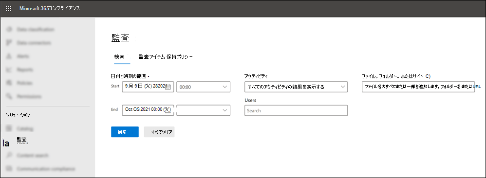
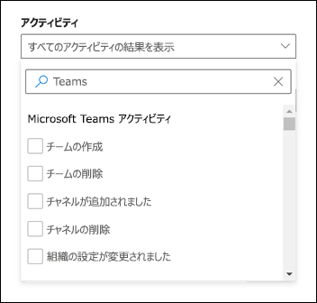
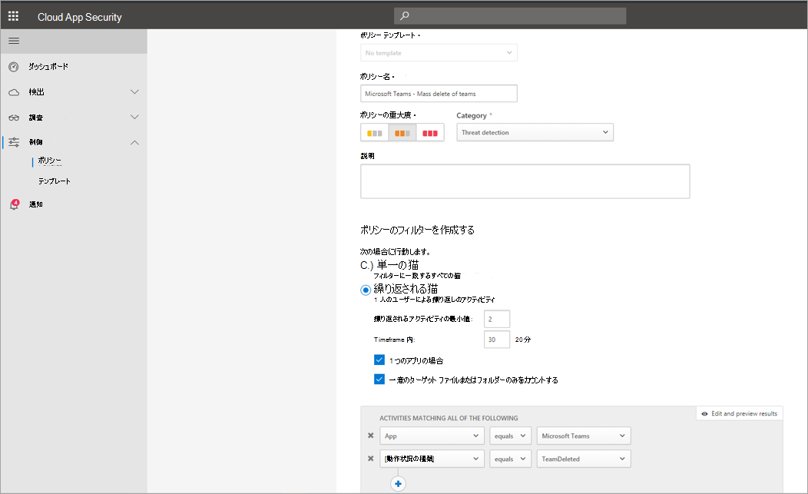
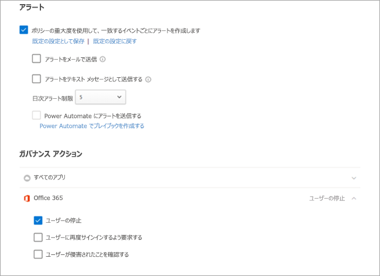

# Microsoft Teams でイベントの監査ログを検索する

> [!IMPORTANT]
> [!INCLUDE [new-teams-sfb-admin-center-notice](includes/new-teams-sfb-admin-center-notice.md)]

監査ログは、Microsoft 365 サービス全体での特定のアクティビティを調査するのに役立ちます。 Microsoft Teams の場合、監査されるアクティビティの一部を次に示します。

- チームの作成
- チームの削除
- 追加されたチャネル
- 変更された設定

監査される Teams アクティビティの完全な一覧について[Teams activities](#teams-activities)は、「[チームアクティビティ内のチームアクティビティとシフト (プレビュー)](#shifts-in-teams-activities)」を参照してください。

> [!NOTE]
> プライベートチャネルからの監査イベントも、teams および標準チャネル用としてログに記録されます。

## Teams での監査をオンにする

監査データを表示するには、まず[セキュリティ & コンプライアンスセンター](https://protection.office.com)で監査を有効にする必要があります。 監査を有効にする方法については、「[監査ログの記録を有効または無効にする](https://support.office.com/article/Turn-Office-365-audit-log-search-on-or-off-e893b19a-660c-41f2-9074-d3631c95a014)」を参照してください。

> [!IMPORTANT]
> 監査データは、監査を有効にした時点でのみ利用可能です。

## 監査ログから Teams データを取得する

1. 監査ログを取得するには、[セキュリティ/コンプライアンス センター](https://go.microsoft.com/fwlink/?linkid=855775)に移動します。 [**検索**] で、[**監査ログの検索**] を選びます。
2. [**Search (検索)**] を使用して、監査するアクティビティ、日付、ユーザーをフィルターします。
3. さらに詳しく分析するために、結果を Excel にエクスポートします。

> [!IMPORTANT]
> 監査データは、監査が有効になっている場合にのみ監査ログに表示されます。

監査レコードが保持され、監査記録で検索可能な期間は、Microsoft 365 または Office 365 のサブスクリプション、特にユーザーに割り当てられているライセンスの種類によって異なります。 詳細については、「[セキュリティ & コンプライアンスセンターサービスの説明](https://docs.microsoft.com/office365/servicedescriptions/office-365-platform-service-description/office-365-securitycompliance-center)」を参照してください。

## 監査ログを検索するためのヒント

ここでは、監査ログで Teams のアクティビティを検索するためのヒントを紹介します。

- アクティビティ名をクリックして、検索する特定のアクティビティを選ぶことができます。 または、グループ名をクリックして、グループ内のすべてのアクティビティ (**ファイルやフォルダーのアクティビティ**など) を検索することもできます。 アクティビティが選択されている場合は、それをクリックして選択を取り消すことができます。 検索ボックスを使用して、入力したキーワードを含むアクティビティを表示することもできます。 
    
- コマンドレットを使用してアクティビティを実行するイベントを表示するには、[**アクティビティ**] リストで [**すべてのアクティビティの結果を表示**] を選択します。 これらのアクティビティの操作の名前がわかっている場合は、すべてのアクティビティを検索し、[**アクティビティ**] 列のボックスに操作の名前を入力して、結果をフィルター処理します。 詳細については、「[手順 3: 検索結果をフィルター処理](https://docs.microsoft.com/microsoft-365/compliance/search-the-audit-log-in-security-and-compliance?view=o365-worldwide#step-3-filter-the-search-results)する」を参照してください。
- 現在の検索条件をクリアするには、[**クリア**] をクリックします。 日付範囲は、過去7日間の既定値に戻ります。 また、[すべてクリア] をクリックし**て、すべてのアクティビティの結果を表示**し、選択したすべてのアクティビティを取り消すこともできます。
- 5000の結果が検出された場合は、おそらく、検索条件に一致する5000イベントの数が多すぎることを前提としています。 検索条件を絞り込んで検索を再実行し、検索結果を絞り込むか、[**結果のエクスポート**] を選択してすべての検索結果をエクスポートすることができ  >  **Download all results**ます。

オーディオログ検索を使用する場合は、[このビデオ](https://www.youtube.com/embed/UBxaRySAxyE)をご覧ください。 チームの監査ログの検索を実行する方法を説明しているように、Teams のプログラムマネージャーである「a」に参加します。

## クラウドアプリのセキュリティを使用してアクティビティポリシーを設定する

[Microsoft Cloud App Security](https://docs.microsoft.com/cloud-app-security/what-is-cloud-app-security) integration を使うと、[アクティビティポリシー](https://docs.microsoft.com/cloud-app-security/user-activity-policies)を設定して、アプリプロバイダーの api を使ってさまざまな自動プロセスを適用することができます。 これらのポリシーによって、さまざまなユーザーによって実行される特定のアクティビティを監視したり、特定の種類のアクティビティを1つずつ予期しない頻度で追跡したりすることができます。

アクティビティ検出ポリシーを設定すると、通知が生成されます。 アラートは、ポリシーの作成後に発生するアクティビティでのみ生成されます。 ここでは、クラウドアプリのセキュリティでアクティビティポリシーを使用して Teams のアクティビティを監視する方法について、いくつかの例を紹介します。

### 外部ユーザーのシナリオ

ビジネスの観点から見ていく1つのシナリオは、チーム環境に外部ユーザーを追加することです。 外部ユーザーが有効になっている場合は、そのプレゼンスを監視することをお勧めします。  [クラウドアプリのセキュリティ](https://docs.microsoft.com/cloud-app-security/what-is-cloud-app-security)を使用して、潜在的な脅威を特定することができます。

外部ユーザーの追加を監視するこのポリシーのスクリーンショットでは、ポリシーに名前を付け、ビジネスニーズに応じて重要度を設定して、(この例では) 1 つのアクティビティとして設定して、このアクティビティをチームに制限することができます。

このポリシーの結果は、アクティビティログで確認できます。

ここでは、設定したポリシーとの一致を確認し、必要に応じて調整を行います。または、他の場所で使用するように結果をエクスポートすることができます。

### 一括削除のシナリオ

前に説明したように、削除シナリオを監視できます。 チームサイトの一括削除を監視するポリシーを作成することができます。 この例では、通知ベースのポリシーを設定して、チームの一括削除を30分で検出します。

スクリーンショットのように、このポリシーのさまざまなパラメーターを設定して、レベル、単一または繰り返しのアクション、[チームとサイトの削除に制限するパラメーター] などのチームの削除を監視することができます。 これは、組織のニーズに応じて、テンプレートとは別に実行することも、このポリシーを基盤とするテンプレートを作成することもできます。

ビジネスに適したポリシーを確立したら、イベントがトリガーされたときにアクティビティログで結果を確認できます。

設定したポリシーにフィルターを適用して、そのポリシーの結果を表示することができます。 アクティビティログに表示された結果が適切ではない場合 (多くの結果が表示されている場合や、何も起こらない場合) は、クエリを微調整して、必要な処理により関連性を高めることができます。

### アラートとガバナンスのシナリオ

アクティビティポリシーがトリガーされたときに、管理者や他のユーザーに通知を設定したり、メールを送信したりすることができます。 ユーザーの中断、自動的な方法でのサインインなど、自動化されたガバナンス操作を設定することができます。 次の例は、アクティビティポリシーがトリガーされ、ユーザーが2つ以上のチームを30分で削除した場合に、ユーザーアカウントを中断する方法を示しています。

## クラウドアプリのセキュリティを使用して異常検出ポリシーを設定する

クラウドアプリセキュリティの[異常検出ポリシー](https://docs.microsoft.com/cloud-app-security/anomaly-detection-policy)は、クラウド環境全体で高度な脅威検出を直ちに実行できるように、既定のユーザーと entity の動作分析 (UEBA) および machine LEARNING (ML) を提供します。 自動的に有効になるため、新しい異常検出ポリシーでは、ユーザーとネットワークに接続されているコンピューターとデバイスの間で発生した多数の動作の異常をターゲットにして、即座に検出が行われるため、すぐに結果を得ることができます。 さらに、新しいポリシーは、クラウドアプリのセキュリティ検出エンジンから多くのデータを公開し、調査プロセスを高速化し、継続的な脅威を含めることができるようにします。

チームのイベントを異常検出ポリシーに統合するために取り組んでいます。 現時点では、他の Office 製品の異常検出ポリシーを設定し、それらのポリシーに一致するユーザーに対してアクションアイテムを実行することができます。

## Teams のアクティビティ

ここでは、Microsoft 365 監査ログの Teams でのユーザーと管理者のアクティビティについて記録されるすべてのイベントの一覧を示します。 このテーブルには、[**アクティビティ**] 列に表示されるフレンドリ名と、検索結果をエクスポートするときに監査レコードと CSV ファイルの詳細情報に表示される対応する操作の名前が含まれます。

|フレンドリ名  |操作|説明 |
|---------|---------|---------|
|チームにボットが追加されました   |BotAddedToTeam        |ユーザーがボットをチームに追加します。        |
|追加されたチャネル   |ChannelAdded 追加されました         |ユーザーがチャネルをチームに追加します。         |
|追加されたコネクタ  |コネクタが追加されました          |ユーザーがコネクタをチャネルに追加します。        |
|メンバーが追加されました    |メンバーが追加されました         |チーム所有者は、チーム、チャネル、またはグループチャットにメンバーを追加します。         |
|追加されたタブ    |追加されたタブ         |ユーザーがタブをチャネルに追加します。        |
|チャンネル設定の変更    |ChannelSettingChanged         |次のアクティビティがチームメンバーによって実行されると、ChannelSettingChanged 操作が記録されます。 これらの各アクティビティについては、変更された設定 (かっこで囲まれている) の説明が、監査ログの検索結果の [**アイテム**] 列に表示されます。 <ul><li>チームチャネルの名前を変更します (**チャネル名**)。</li><li>チームチャネルの説明を変更します (**チャネルの説明**)</li> </ul>      |
|組織の設定が変更されました   |TeamsTenantSettingChanged         |Microsoft 365 管理センターのグローバル管理者によって次のアクティビティが実行されると、TeamsTenantSettingChanged 操作がログに記録されます。 これらのアクティビティは、組織全体のチーム設定に影響します。 詳細については、「[組織のチーム設定を管理](enable-features-office-365.md)する」を参照してください。  これらの各アクティビティについては、変更された設定 (かっこで囲まれています) の説明が、監査ログの検索結果の [**アイテム**] 列に表示されます。<ul><li>組織のチーム (**Microsoft Teams**) を有効または無効にします。</li><li>組織での Microsoft Teams と Skype for Business の相互運用性を有効または無効にします (**skype For business の相互運用性**)。</li><li>Microsoft Teams クライアントの組織図ビューを有効または無効にします (**組織図ビュー**)。</li><li>チームメンバーによるプライベート会議のスケジュール機能を有効または無効にします (**プライベート会議のスケジュール**)。</li><li>チームメンバーによるチャネル会議のスケジュール機能を有効または無効にします (**チャネル会議のスケジュール**)。</li><li>Teams 会議でのビデオ通話を有効または無効にします (**Skype 会議のビデオ**)。</li><li>組織の Microsoft Teams 会合で画面共有を有効または無効にします (**Skype 会議の画面共有**)。</li><li>アニメーション画像 (Giphy と呼ばれる) をチームの会話に追加する機能を有効または無効にします (**アニメーション画像**)。</li><li>組織のコンテンツの規制設定を変更します (**コンテンツの規制**)。 コンテンツの規制により、会話に表示できるアニメーション画像の種類が制限されます。</li><li>インターネット上のカスタマイズ可能な画像 (カスタム memes 呼ばれる) をチームの会話に追加する機能を有効または無効にします (**インターネット上のカスタマイズ可能な画像**)。</li><li>チームメンバーが編集可能な画像 (ステッカーと呼ばれる) をチームの会話に追加する機能 (**編集可能な画像**) を有効または無効にします。</li><li>チームメンバーが Microsoft Teams のチャットおよびチャネルでボットを使用する機能を有効または無効にします (**組織全体のボット)**。</li><li>Microsoft Teams の特定のボットを有効にします。 これには、組織でボットが有効になっている場合に使用できる、Teams のヘルプボットである T ボットは含まれません (**個々のボット**)。</li><li>チームメンバーが拡張機能またはタブを追加する機能を有効または無効にします (**拡張機能またはタブ**)。</li><li>Microsoft Teams の固有のボットのサイドローディングを有効または無効にします (**ボットのサイドローディング**)。</li><li>ユーザーが Microsoft Teams チャネルに電子メールメッセージを送信する機能を有効または無効にします (**チャネルメール**)。</li></ul>|
|チームのメンバーの役割が変更されました    |MemberRoleChanged         |チームの所有者がチームのメンバーの役割を変更します。 次の値は、ユーザーに割り当てられている役割の種類を示します。   **1** -所有者の役割を示します。 **2** -メンバーの役割を示します。 **3** -ゲストの役割を示します。  メンバーのプロパティには、組織の名前と、メンバーのメールアドレスも含まれます。        |
|変更されたチームの設定    |TeamSettingChanged        |チーム所有者が次のアクティビティを実行すると、TeamSettingChanged 操作がログに記録されます。 これらの各アクティビティについては、変更された設定 (かっこで囲まれています) の説明が、監査ログの検索結果の [**アイテム**] 列に表示されます。<ul><li>チームのアクセスの種類を変更します。 チームはプライベートまたはパブリック (**チームアクセスの種類**) として設定できます。 チームが公開されている場合 (既定の設定)、ユーザーは招待によってのみチームにアクセスできます。 チームが公開されている場合は、誰でも見つけることができます。</li><li>チームの情報の分類を変更します (**チーム分類**)。 たとえば、チームデータは、業務への影響が大きい、業務への影響が大きい、または業務への影響が小さい場合に分類されます。</li><li>チームの名前を変更します (**チーム名**)。</li><li>チームの説明を変更します (**チームの説明**)。</li><li>チーム設定に対する変更。 これらの設定にアクセスするには、チーム所有者がチームを右クリックし、[**チームの管理**] を選択して、[**設定**] タブをクリックします。これらのアクティビティについては、変更された設定の名前が、監査ログの検索結果の [**アイテム**] 列に表示されます。</li></ul>         |
|作成されたチーム    |作成されたチーム         |ユーザーがチームを作成します。         |
|すべての組織のアプリが削除されました|DeletedAllOrganizationApps           |すべての組織アプリがカタログから削除されました。     |
|削除されたアプリ |AppDeletedFromCatalog           |アプリがカタログから削除されました。     |
|削除されたチャンネル     |ChannelDeleted         |ユーザーがチームからチャネルを削除しました。         |
|削除されたチーム  |TeamDeleted            |チーム所有者がチームを削除します。      |
|インストール済みのアプリ |AppInstalled         |アプリがインストールされました。   |
|カードの操作を実行しました|実行アクション|ユーザーがチャット内のアダプティブカードで操作を実行しました。 アダプティブカードは、ほとんどの場合、お使いのチャットでの情報や操作の充実した表示を可能にするボットによって使用されます。   **注:** 監査ログでは、チャット内のアダプティブカードのインライン入力アクションのみを使用できます。 たとえば、ユーザーが、投票ボットによって生成されたアダプティブカードのチャネル会話で投票の応答を送信するとします。 ダイアログを開くための "結果の表示" などのユーザー操作、またはダイアログ内のユーザー操作は監査ログでは使用できません。|
|公開されたアプリ |AppPublishedToCatalog           |アプリがカタログに追加されました。     |
|チームからボットが削除されました   |BotRemovedFromTeam         |ユーザーがチームからボットを削除した場合。       |
|コネクタの削除     |コネクタを削除しました         |ユーザーがチャネルからコネクタを削除します。         |
|メンバーを削除しました    |メンバーの削除        |チーム所有者は、チーム、チャネル、またはグループチャットからメンバーを削除します。         |
|タブを削除しました    |削除されたタブ         |ユーザーがチャネルからタブを削除します。         |
|アンインストールされたアプリ |AppUninstalled           |アプリがアンインストールされました。     |
|更新されたアプリ |AppUpdatedInCatalog           |カタログ内のアプリが更新されました。     |
|更新されたコネクタ    |コネクタの更新         |ユーザーがチャネルのコネクタを変更しました。         |
|更新されたタブ   |TabUpdated         |ユーザーがチャネルのタブを変更しました。         |
|アップグレードされたアプリ |AppUpgraded           |アプリがカタログの最新バージョンにアップグレードされました。     |
|ユーザーがチームにサインインしました     |TeamsSessionStarted 開始         |ユーザーが Microsoft Teams クライアントにサインインします。 このイベントでは、トークンの更新アクティビティはキャプチャされません。         |

## チームアクティビティ内のシフト

**(プレビュー段階)**

組織で Teams のシフトアプリを使用している場合、[監査ログ] で、[シフト] アプリに関連するアクティビティを検索できます。 ここでは、Microsoft 365 監査ログの Teams でのシフトアクティビティ用にログに記録されるすべてのイベントの一覧を示します。

|フレンドリ名  |操作  |説明  |
|---------|---------|---------|
|スケジュールグループが追加されました      |SchedulingGroupAdded          |ユーザーが正常に新しいスケジュールグループをスケジュールに追加しました。          |
|編集済みのスケジュールグループ     |SchedulingGroupEdited         |ユーザーがスケジュールグループを正常に編集しました。          |
|削除されたスケジュールグループ         |SchedulingGroupDeleted              |ユーザーがスケジュールからスケジュールグループを正常に削除しました。|
|シフトの追加      |ShiftAdded          |ユーザーがシフトを正常に追加しました。           |
|編集したシフト       |ShiftEdited       |ユーザーがシフトを正常に編集しました。        |
|削除されたシフト          |ShiftDeleted          | ユーザーがシフトを正常に削除しました。               |
|休暇を追加しました      |TimeOffAdded 追加されました          |ユーザーがスケジュールに対して休暇を正常に追加しました。          |
|編集した休暇         |休暇編集           |ユーザーが正常に休暇を編集しました。          |
|削除された休暇     |TimeOffDeleted              |ユーザーが休暇を正常に削除しました。           |
|開いているシフトを追加しました     |OpenShiftAdded          |ユーザーが、開いているシフトをスケジュールグループに正常に追加しました。          |
|編集した開いたシフト    |OpenShiftEdited          |ユーザーが、スケジュールグループで開いているシフトを正常に編集しました。          |
|開いているシフトを削除しました      |OpenShiftDeleted          |ユーザーが、開いているシフトをスケジュールグループから正常に削除しました。         |
|共有スケジュール     |ScheduleShared                  |ユーザーが、日付範囲のチームスケジュールを正常に共有しました。          |
|時間クロックを使ったクロック         |ClockedIn          |ユーザーがタイムレコーダーを使用して正常に出勤しました。          |
|時刻の時計を使った退勤の記録      |ClockedOut          |ユーザーが時刻の時計を使って正常に復帰しました。          |
|時刻の時計を使用した休憩の開始      |BreakStarted          |ユーザーがアクティブなタイムクロックセッション中に中断を正常に開始しました。          |
|時間クロックを使用した中断の終了    |BreakEnded          |ユーザーが、アクティブなタイムクロックセッション中に中断を正常に終了しました。          |
|時間クロックの入力を追加しました     |TimeClockEntryAdded          |ユーザーが、タイムシートに新しい手動の時刻クロックエントリを追加しました。          |
|編集される時間クロックのエントリ     | TimeClockEntryEdited             |ユーザーがタイムシートの時間クロックエントリを正常に編集しました。          |
|時刻のエントリを削除しました    |TimeClockEntryDeleted              |ユーザーがタイムシートのタイムレコーダーエントリを正常に削除しました。          |
|シフト要求が追加されました         |RequestAdded              |ユーザーがシフト要求を追加しました。          |
|シフト要求に応答しました     |RequestRespondedTo                  |ユーザーがシフト要求に応答しました。          |
|キャンセルされたシフト要求         |RequestCanceled               |ユーザーがシフト要求をキャンセルしました。          |
|スケジュール設定が変更されました      |スケジュールの設定が変更されました          |ユーザーが [シフトの設定] の設定を変更した場合。         |
|追加された労働力の統合      |ワークの強制統合が追加されました                  | シフトアプリはサードパーティシステムと統合されています。         |
|シフトメッセージの無効化         |OffShiftDialogAccepted          |シフト時間後にチームにアクセスするために、ユーザーはオフシフトメッセージを確認します。           |

## Office 365 管理アクティビティ API

Office 365 Management Activity API を使用して、Teams のイベントに関する情報を取得することができます。 Teams の管理アクティビティ API スキーマの詳細については、「 [teams スキーマ](https://docs.microsoft.com/office/office-365-management-api/office-365-management-activity-api-schema#microsoft-teams-schema)」を参照してください。

## 関連トピック

- [Microsoft 365 コンプライアンスセンターで監査ログを検索する](https://docs.microsoft.com/microsoft-365/compliance/search-the-audit-log-in-security-and-compliance) 
