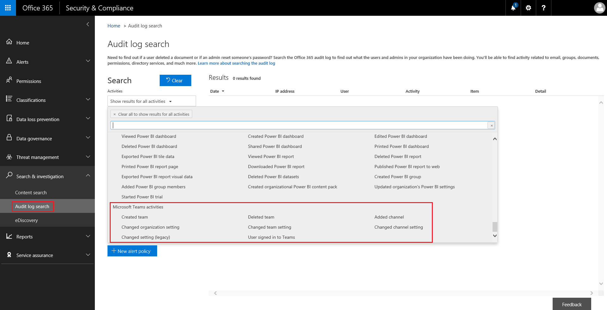

Microsoft チームのイベントの監査ログを検索します。Search the audit log for events in Microsoft Teams
==================================================

監査ログは、Office 365 サービスで特定の活動を調査するのに役立ちます。チームが、監査するアクティビティの一部は次のとおりです。The audit log can help you investigate specific activities across Office 365 services. For Teams, here are some of the activities that are audited:

-   チームの作成Team creation

-   チームの削除Team deletion

-   チャンネルの追加Added channel

-   設定を変更します。Changed setting

Office 365 で監査する活動の一覧を表示するには、 [[Office 365 のセキュリティとコンプライアンス センターの監査ログの検索](https://support.office.com/article/0d4d0f35-390b-4518-800e-0c7ec95e946c?=&PickTab=Activities&ad=US#PickTab=Activities)をお読みください。To see the complete list of activities that are audited in Office 365, read [Search the audit log in the Office 365 Security & Compliance Center](https://support.office.com/article/0d4d0f35-390b-4518-800e-0c7ec95e946c?=&PickTab=Activities&ad=US#PickTab=Activities).

## チームで監査を有効にします。Turn on auditing in Teams

監査データを表示、前に、最初に、[**セキュリティとコンプライアンス センター**(https://protection.office.com) で監査があります。監査の有効化については、[有効にする Office 365 のオンとオフを切り替える監査ログの検索](https://support.office.com/article/Turn-Office-365-audit-log-search-on-or-off-e893b19a-660c-41f2-9074-d3631c95a014)を参照してください。Before you can look at audit data, you have to first turn on auditing in the **Security & Compliance Center**(https://protection.office.com). For help turning on auditing, read [Turn Office 365 audit log search on or off](https://support.office.com/article/Turn-Office-365-audit-log-search-on-or-off-e893b19a-660c-41f2-9074-d3631c95a014).

> [!IMPORTANT]
> 監査データには、に対して監査を有効にするポイントからできるだけです。Audit data is only available from the point at which you turned on Auditing.

## 監査ログからチームのデータを取得します。Retrieve Teams data from the audit log

1.  監査ログを取得するには、[[セキュリティとコンプライアンス センター](https://go.microsoft.com/fwlink/?linkid=855775)に移動します。**検索と調査**、**監査ログの検索対象**を選択します。To retrieve audit logs, go to the [Security & Compliance Center](https://go.microsoft.com/fwlink/?linkid=855775). Under **Search & Investigation**, select **Audit log search**.

2.  **検索**を使用して、アクティビティ、日付、またはユーザーを監査するフィルター処理します。Use **Search** to filter by the activities, dates, and users you want to audit.

3.  詳細分析用の結果を Excel にエクスポートします。Export your results to Excel for further analysis.

> [!IMPORTANT]
> 監査データを監査ログに表示されるは、監査がオンの場合だけです。Audit data is only visible in the Audit Log if auditing is turned on.

## ビデオ: TechTip: チームで監査ログの検索を使用します。Video: TechTip: Using Audit Log Search in Teams

Ansuman Acharya、チームのプログラム マネージャーは、[Office 365 のセキュリティとコンプライアンス センター チームの監査ログ レポートを検索を行う彼に示すように参加します。Join Ansuman Acharya, a program manager for Teams, as he demonstrates conducting an Audit Log search for Teams in the Office 365 Security & Compliance Center. 

> [!VIDEO https://www.youtube.com/embed/UBxaRySAxyE]

