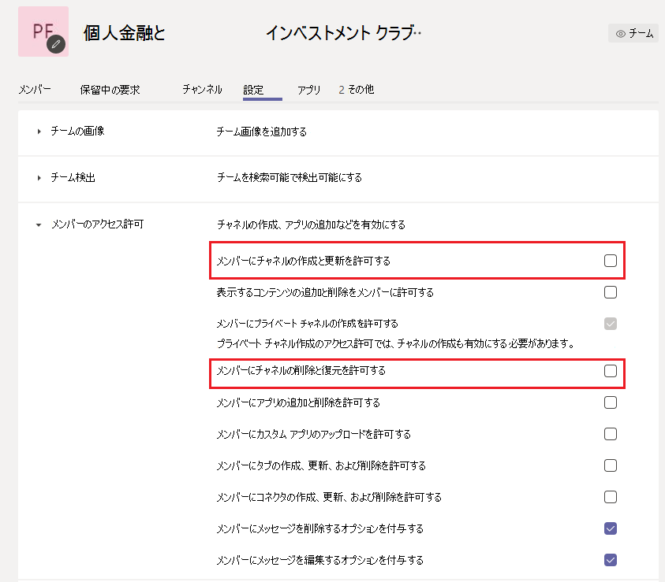
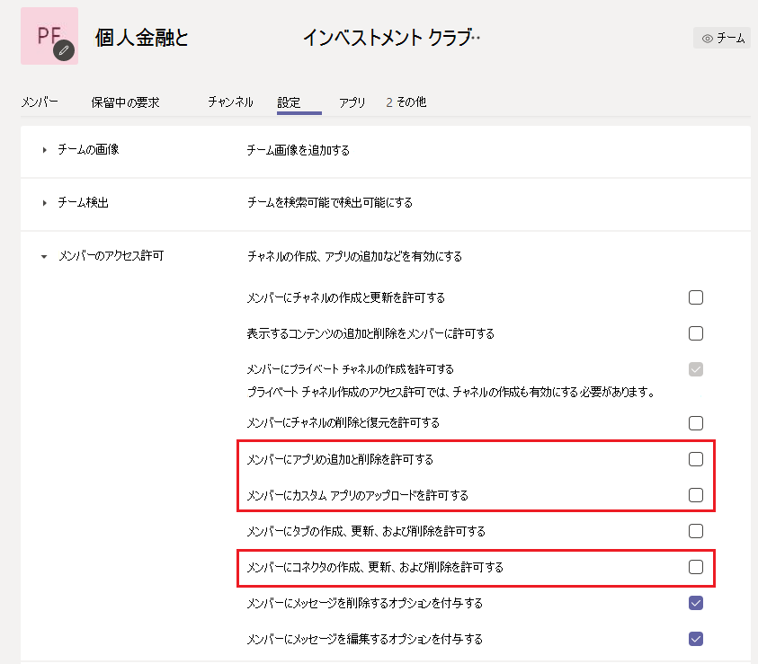
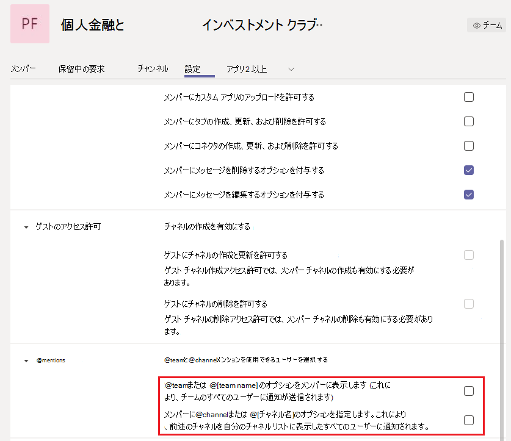

Microsoft Teams で大規模なチームを管理する - ベスト プラクティスManage large teams in Microsoft Teams - Best practices
======================================================

Microsoft Teams は、多数のメンバーを持つ小規模なグループと、数千人のメンバーを持つ大規模なグループとの間のコミュニケーションを促進する上でも同様に効果的です。Microsoft Teams is equally effective at facilitating communications between small groups with dozens of members and large groups with thousands of members. チーム [サイズの更新については、Teams](limits-specifications-teams.md) の制限と仕様を確認してください。Review [Limits and specifications for Teams](limits-specifications-teams.md) for updates on team sizes. チームの規模を増やして、独自の管理と運用上の課題を引き出します。Increase in team size leads to unique management and operational challenges. この記事では、数千人のメンバーで構成される大規模なチームを作成および管理するためのベスト プラクティスについて説明します。This article describes best practices for creating and managing large teams comprised of thousands of members.

## 大規模なチームの価値Value of large teams

大規模なチームは、次のコラボレーション シナリオを有効にする場合に非常に便利です。Large teams are very useful in enabling the following collaboration scenarios:

- **部門全体の** 共同作業: 組織に財務、オペレーション、R&D などの複数の部署がある場合、特定の部門のすべてのメンバーを含む 1 つのチームを作成できます。**Department-wide collaboration**: If your organization has multiple departments such as Finance, Operations, R&D etc., then you can create a single team that includes all members in a specific department. 部門に関連するすべてのコミュニケーションをこのチームで共有し、メンバーからすぐに連絡を取り合い、関与することができます。Now all communications relevant to a department can be shared in this team, which facilitates instant reach and engagement from members.

- **従業員リソース グループでの共同作業**: 多くの場合、組織には、異なる部門または作業グループに属する相互の関心を持つ大規模なユーザー グループが含されます。**Collaboration in employee resource groups**: Organizations often have large groups of people with mutual interests who belong to a different department or work group. たとえば、個人の資金と投資に対する熱意を共有する人々のグループがいます。As an example, there can be a group of people who share a passion for personal finance and investing. 多くの場合、大規模な組織でつながりにくい場合があります。It's often hard to connect in a large organization. このようなグループのコミュニティを作成するために、テナント管理者は大規模なチームを作成し、誰でも参加して利用できる、一般向け会社全体のリソース グループとして機能します。To develop communities for such groups, tenant admins can create a large team that serves as a public company-wide resource group that anyone can join and take advantage of. 最終的には、これらのコミュニティは、新規および既存のメンバーの両方が利用できる情報を収集します。Eventually, these communities collect information that both new and existing members can enjoy.

- **内部メンバーと外部メンバー** の共同作業: 人気のある製品は、新製品のリリースを試してフィードバックを提供することを熱望している早期導入者のコミュニティを多く開発します。**Collaboration between internal and external members**: Popular products often develop a community of early adopters who are eager to try new product releases and provide feedback. 早期導入者は、製品の形成に役立つ製品グループとの関係を構築します。Early adopters develop a relationship with product groups to help shape the product. このようなシナリオでは、テナント管理者は、豊富な製品開発プロセスを容易にするために、内部製品グループと外部製品評価者の両方を含む大規模なチームを設定できます。In such scenarios, tenant admins can set up a large team which includes both internal product groups and external product evaluators to facilitate a rich product development process. これらのチームは、一部の顧客にカスタマー サポートを提供できます。These teams can also provide customer support to a select set of customers.

## 既存のグループからチームを作成するCreate teams from existing groups

連絡先グループ、セキュリティ グループ、またはグループOfficeを使用して、チームを開始します。Use contact groups, security groups, or Office groups to jump start your team. グループをインポートしてチームを作成したり、グループからチームをOfficeできます。You can import a group to make a team or create a team from an Office group.

**グループをインポートして** チームを作成する: 最大 3,500 人のメンバーを含むグループを Teams にインポートすると、Teams はグループ内のメンバーの総数を自動的に計算します。**Import a group to make a team**: When you import a group with up to 3,500 members into Teams, Teams automatically calculates the total number of members in the group. これは 1 回のみインポートされ、グループ内の今後の変更は Teams で自動的に更新されません。This is a one-time import only and future changes in the group will not automatically be updated in Teams.

**大規模な Microsoft 365** グループからチームを作成する: 大規模な Microsoft 365 グループからチームを作成すると、メンバーは自動的にMicrosoft 365 グループとチームの一部になります。**Create a team from a large Microsoft 365 group**: When you create a team from a large Microsoft 365 group, members are automatically part of the Microsoft 365 group **and** the team. 今後、チーム メンバーは Microsoft 365 グループに参加または退出すると、自動的にチームに追加または削除されます。In the future, as team members join or leave the Microsoft 365 group, they're automatically added or removed from the team.

## チームのメンバーを一括インポート/エクスポート/削除するBulk import/export/remove members in a team

Azure Portal を使用すると、ユーザーは Microsoft 365 グループのメンバーを一括でインポート/エクスポート/削除できます。The Azure portal allows users to bulk import/export/remove members in a Microsoft 365 Group. 詳細については、「グループ メンバーを一 [括インポートするには」を参照してください](https://docs.microsoft.com/azure/active-directory/enterprise-users/groups-bulk-import-members#to-bulk-import-group-members)。For more information, see [To bulk import group members](https://docs.microsoft.com/azure/active-directory/enterprise-users/groups-bulk-import-members#to-bulk-import-group-members).

すべてのチームが Microsoft 365 グループの支援を受けたので、Azure Portal を使用して、チームに対応するグループでこれらの操作を実行できます。Since every team is backed by a Microsoft 365 Group, you can use the Azure portal to perform these operations in the group corresponding to the team. メンバーの操作は、24 時間以内にチームに反映されます。The member operations will be reflected in the team within 24 hours.

## ディスカッションのためのチャネルを作成するCreate channels to focus discussions

グループ ディスカッションを絞り込むには、注目チャネルを作成します。You can narrow the group discussions by creating focused channels. チーム [を編成するためのベスト プラクティスを参照してください](best-practices-organizing.md)。See [Best practices for organizing teams](best-practices-organizing.md).

## チャネルの作成を制限するRestrict channel creation

チーム メンバーがチャネルの作成を許可されている場合、そのチームはチャネルの広がりを持つ可能性があります。If any team member is allowed to create channels, that team can have channel sprawl. チーム所有者は、メンバーのアクセス許可の設定で、チャネルの作成、更新、削除 **、復元>する必要があります**。Team owners should turn off channel create, update, delete, and restore for members in **Settings > Member permissions**. チーム [とチャネルの概要を参照してください](teams-channels-overview.md)。See [Overview of teams and channels](teams-channels-overview.md).

![管理コンソールの [設定] タブのメンバーのアクセス許可セクションを示す画面イメージ。](media/no-channel-creation.png "管理コンソールの [設定] タブのメンバーのアクセス許可セクションの画面イメージ。チャネルの作成または削除をメンバーに許可するオプションはオフです。")

## お気に入りのチャネルを追加するAdd favorite channels

新しいユーザーエンゲージメントとコンテンツ検出を速くするために、既定でユーザーが利用できるお気に入りのチャネルを選択できます。In order to speed up new user engagement and content discovery, you can select favorite channels that are available to the user by default. 管理センター **の [** チャネル] ウィンドウで、[メンバーの表示] 列の **下にあるチャネルを確認** します。In the **Channels** pane of the admin center, check the channels under the **Show for members** column.

![管理コンソールの [チャネル] ウィンドウを示す画面イメージ。](media/favorite-channels.png "管理コンソールの [チャネル] ウィンドウを示す画面イメージ。一部のチャネルでは、メンバーに対して [表示] がオンになっています。")

 詳細 [については、「最初のチームとチャネルを作成する」](get-started-with-teams-create-your-first-teams-and-channels.md) を参照してください。See [Create your first teams and channels](get-started-with-teams-create-your-first-teams-and-channels.md) for details.

## 大規模なチームのアプリケーションとボットを規制するRegulate applications and bots in large teams

気が散るアプリケーションやボットが追加されるのを防ぐために、チーム所有者は、チーム メンバーのアプリとコネクタを無効、追加、削除、アップロードできます。To prevent addition of distracting applications or bots, team owners can disable, add, remove, and upload apps and connectors for team members. 管理センターの [メンバーのアクセス **許可>** 設定] で、メンバーがアプリまたはコネクタを追加できる 3 つのオプションをオフにします。In the admin center under **Settings > Member permissions**, uncheck the three options that allow members to add apps or connectors.

![[設定] ウィンドウの [メンバーのアクセス許可] セクションを示す画面画像。](media/disable-bots-connectors.png "[設定] ウィンドウの [メンバーのアクセス許可] セクションを示す画面画像。メンバーにアプリまたはコネクタの追加を許可するオプションはオフです。")

アプリ [、ボット、&をご覧ください](deploy-apps-microsoft-teams-landing-page.md)。See [Apps, bots, & connectors](deploy-apps-microsoft-teams-landing-page.md).

## チームとチャネルのメンションを規制するRegulate team and channel mentions

チームとチャネルのメンションを使用して、特定のチャネル投稿にチーム全体の注意を引き付けできます。Team and channel mentions can be used to draw the attention of the whole team to certain channel posts. 投稿でメンションを使用すると、何千人ものチーム メンバーに通知が送信されます。Once a mention is used in a post, a notification is sent to thousands of team members. 通知が頻繁すぎる場合は、チーム メンバーが過負荷になり、チーム所有者に苦情を申し立てる可能性があります。If the notifications are too frequent, then team members can become overloaded and might complain to team owners. チームまたはチャネルのメンションを防ぐには、[チームの設定] ウィンドウのボックスをオフにして、メンバーのチームと **チャネルのメンション> @mentions** します。To prevent team or channel mentions, turn off team and channel mentions for members by unchecking the boxes in the teams **Settings > @mentions** pane.

![[設定] ウィンドウの [メンション] セクションを示す画面画像。](media/no-at-mentions.png "[設定] ウィンドウの [メンション] セクションを示す画面画像。メンションを表示およびメンバーにアクセス権を与えるオプションはオフです。")

## チャネル内のモデレーション設定を検討するConsider setting up moderation in your channels

チーム所有者はチャネルのモデレーションを有効にして、対象チャネルで新しい投稿を開始できるユーザーと、投稿に返信できるユーザーを制御できます。Team owners can turn on moderation for a channel to control who can start new posts and reply to posts in that channel. モデレーションを設定する場合、1 人以上のチーム メンバーをモデレーターにすることができます。When you set up moderation, you can choose one or more team members to be moderators. チーム所有者は既定でモデレーターです。Team owners are moderators by default. 詳細については、「チャネル モデレート [を設定して管理する」を参照してください](manage-channel-moderation-in-teams.md)。For more information, see [Set up and manage channel moderation](manage-channel-moderation-in-teams.md).

## 関連トピックRelated topics

- [Teams を整理するためのベスト プラクティスBest practices for organizing Teams](best-practices-organizing.md)
- [組織全体のチームを作成するCreate an org-wide team](create-an-org-wide-team.md)
