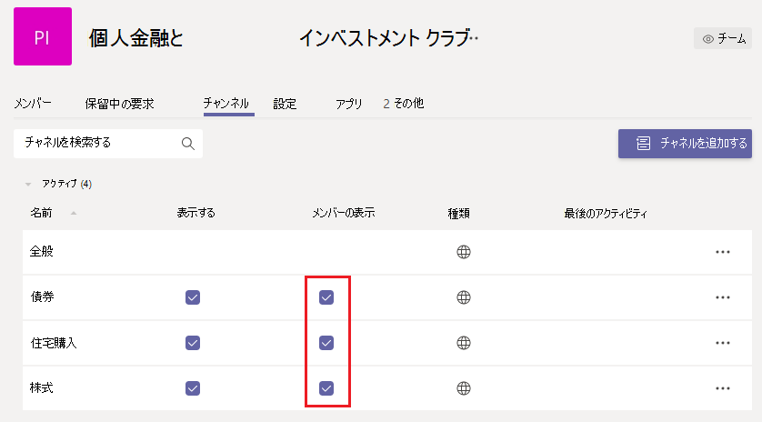

# 大規模なチームを管理する Microsoft Teams - ベスト プラクティス

Microsoft Teams数十人のメンバーを含む小さなグループと、何千人ものメンバーを持つ大規模なグループとの間の通信を促進する場合にも同様に効果的です。 チーム[サイズの更新プログラムについては、「Teams](limits-specifications-teams.md)の制限と仕様」を参照してください。 チーム サイズを増やすと、独自の管理と運用上の課題が生じします。 この記事では、数千人のメンバーで構成される大規模なチームを作成および管理するためのベスト プラクティスについて説明します。

## 大規模なチームの価値

大規模なチームは、次のコラボレーション シナリオを有効にする場合に非常に便利です。

- **部門全体の共同作業**: 組織に財務、運用、R&D などの複数の部署がある場合は、特定の部門のすべてのメンバーを含む 1 つのチームを作成できます。 このチームでは、部門に関連するすべてのコミュニケーションを共有し、メンバーからの即時の連絡と関与を容易にできます。

- **従業員リソース グループでの共同作業**: 組織には、多くの場合、異なる部署または作業グループに属する相互の関心を持つ大規模なユーザー グループがあります。 たとえば、個人の財務と投資に対する情熱を共有する人のグループがいます。 多くの場合、大規模な組織で接続するのは難しい場合があります。 このようなグループのコミュニティを開発するために、テナント管理者は、誰でも参加して利用できるパブリックな会社全体のリソース グループとして機能する大規模なチームを作成できます。 最終的に、これらのコミュニティは、新規と既存の両方のメンバーが利用できる情報を収集します。

- **内部メンバーと外部メンバー** の共同作業: 人気のある製品は、多くの場合、新製品のリリースを試してフィードバックを提供することを熱望する早期採用者のコミュニティを開発します。 早期導入者は、製品の形成に役立つ製品グループとの関係を開発します。 このようなシナリオでは、テナント管理者は、豊富な製品開発プロセスを容易にするために、内部製品グループと外部製品評価者の両方を含む大規模なチームを設定できます。 これらのチームは、一部の顧客にカスタマー サポートを提供できます。

## 既存のグループからチームを作成する

連絡先グループ、セキュリティ グループ、またはグループOfficeを使用して、チームを開始します。 グループをインポートして、チームを作成したり、グループからチームをOfficeできます。

グループをインポートしてチームを作成 **する:** 最大 3,500 人のメンバーを含むグループを Teams にインポートすると、Teams はグループ内のメンバーの総数を自動的に計算します。 これは 1 回だけのインポートであり、グループ内の今後の変更は、グループ内で自動的に更新Teams。

**大規模な Microsoft 365** グループからチームを作成する: 大規模な Microsoft 365 グループからチームを作成すると、メンバーは自動的に Microsoft 365 グループとチームの一部になります。 今後、チーム メンバーがグループに参加Microsoft 365、チームに自動的に追加または削除されます。

## チームのメンバーを一括インポート/エクスポート/削除する

Azure Portal を使用すると、ユーザーはグループ内のメンバーを一括Microsoft 365できます。 詳細については、「グループ メンバーを一括 [インポートするには」を参照してください](/azure/active-directory/enterprise-users/groups-bulk-import-members#to-bulk-import-group-members)。

すべてのチームは Microsoft 365 グループによってサポートされています。Azure portal を使用して、チームに対応するグループでこれらの操作を実行できます。 メンバーの操作は、24 時間以内にチームに反映されます。

## ディスカッションのためのチャネルを作成する

グループディスカッションを絞り込むには、焦点を絞ったチャネルを作成します。 「 [チームを編成するためのベスト プラクティス」を参照してください](best-practices-organizing.md)。

## チャネルの作成を制限する

チーム メンバーがチャネルの作成を許可されている場合、そのチームはチャネルの広がりを持つ可能性があります。 チームの所有者は、チャネルの作成、更新、削除、および復元を、メンバーのアクセス許可 設定 >**オフにする必要があります**。 「チーム [とチャネルの概要」を参照してください](teams-channels-overview.md)。

![[管理コンソール] タブの [メンバーのアクセス許可] セクションを設定画像。](media/no-channel-creation.png "管理コンソールの [メンバーのアクセス許可] セクションの [画面] 設定します。[チャネルの作成または削除をメンバーに許可する] オプションはオフです。")

## お気に入りのチャネルを追加する

新しいユーザー エンゲージメントとコンテンツ検出を高速化するために、既定でユーザーが利用できるお気に入りのチャネルを選択できます。 管理センター **の [** チャネル] ウィンドウで、[メンバーに表示] 列 **のチャネルを確認** します。

 詳細については [、「初めてのチームとチャネルを作成する](get-started-with-teams-create-your-first-teams-and-channels.md) 」を参照してください。

## 大規模なチームのアプリケーションとボットを規制する

気が散るアプリケーションやボットが追加されるのを防ぐために、チーム所有者は、チーム メンバーのアプリとコネクタを無効、追加、削除、アップロードできます。 管理センターの [メンバーのアクセス **許可設定 >]** で、メンバーがアプリまたはコネクタを追加できる 3 つのオプションをオフにします。

![[アクセス許可] ウィンドウの [メンバーのアクセス許可] セクションを設定画像。](media/disable-bots-connectors.png "[メンバー] ウィンドウの [メンバーアクセス許可] セクションを設定画像。メンバーにアプリまたはコネクタの追加を許可するオプションはオフです。")

「 [アプリ、ボット、&」を参照してください](deploy-apps-microsoft-teams-landing-page.md)。

## チームとチャネルのメンションを調整する

チームとチャネルのメンションを使用して、チーム全体の注意を特定のチャネル投稿に引き付けできます。 投稿でメンションを使用すると、何千人ものチーム メンバーに通知が送信されます。 通知が頻繁すぎる場合、チーム メンバーが過負荷になり、チーム所有者に不満を示す可能性があります。 チームまたはチャネルのメンションを防ぐには、チームウィンドウのボックスをオフにして、メンバーのチームとチャネルのメンション **設定 > @mentions** します。

![[コメント] ウィンドウの [メンション] セクションを設定画像。](media/no-at-mentions.png "[コメント] ウィンドウの [メンション] セクションを設定画像。[メンションでメンバーにアクセス権を与える] と [メンション] のオプションはオフです。")

## チャネル内のモデレーション設定を検討する

チーム所有者はチャネルのモデレーションを有効にして、対象チャネルで新しい投稿を開始できるユーザーと、投稿に返信できるユーザーを制御できます。 モデレーションを設定する場合、1 人以上のチーム メンバーをモデレーターにすることができます。 チーム所有者は、既定でモデレーターです。 詳細については、チャネル モデレーションの [設定と管理に関するページを参照してください](manage-channel-moderation-in-teams.md)。

## 関連項目

- [データを整理するためのベスト プラクティスTeams](best-practices-organizing.md)
- [組織全体のチームを作成する](create-an-org-wide-team.md)