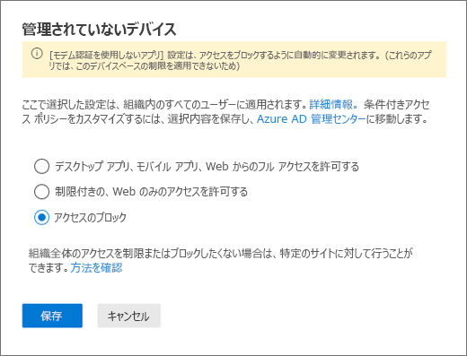
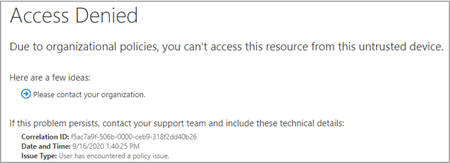

# 特定のユーザーの SharePoint へのアクセスをブロックするBlock access to SharePoint for specific users

Microsoft 365 の SharePoint の条件付きアクセス （CA） ポリシーを Teams に適用することもできます。Applying any Conditional Access (CA) policy on SharePoint in Microsoft 365 is also applied to Teams. ただし、組織によっては、SharePoint ファイルへのアクセス （アップロード、ダウンロード、表示、編集、作成） をブロックし、従業員が非管理対象デバイスで Teams デスクトップ、モバイル、Web クライアントを使用できるようにしたいと考えています。However, some organizations want to block access to SharePoint files (upload, download, view, edit, create) yet allow their employees to use Teams desktop, mobile, and web clients on unmanaged devices. CA ポリシー ルールでは、SharePoint をブロックすると、Teams もブロックされます。Under the CA policy rules, blocking SharePoint would lead to blocking Teams as well. この記事では、この制限を回避し、SharePoint に保存されているファイルへのアクセスを完全にブロックしながら、従業員が Teams を引き続き使用できるようにする方法について説明します。This article explains how you can work around this limitation and allow your employees to continue using Teams while completely blocking access to files stored in SharePoint.

> [!Note]
> 非管理対象デバイスでのアクセスのブロックまたは制限は、Azure AD 条件付きアクセス ポリシーに依存します。Blocking or limiting access on unmanaged devices relies on Azure AD conditional access policies. [Azure AD ライセンス](https://azure.microsoft.com/pricing/details/active-directory/) について説明します。Learn about [Azure AD licensing](https://azure.microsoft.com/pricing/details/active-directory/). Azure AD 条件付きアクセスの概要については、「[Azure Active Directory の条件付きアクセス](/azure/active-directory/conditional-access/overview)」をご覧ください。For an overview of conditional access in Azure AD, see [Conditional access in Azure Active Directory](/azure/active-directory/conditional-access/overview). 推奨される SharePoint Online アクセス ポリシーの詳細については、「[SharePoint サイトとファイルをセキュリティで保護するためのポリシーの推奨事項](/microsoft-365/enterprise/sharepoint-file-access-policies)」を参照してください。For info about recommended SharePoint Online access policies, see [Policy recommendations for securing SharePoint sites and files](/microsoft-365/enterprise/sharepoint-file-access-policies). 非管理対象デバイスでアクセスを制限すると、管理対象デバイス上のユーザーは [サポートされている OS とブラウザーの組み合わせ](/azure/active-directory/conditional-access/technical-reference#client-apps-condition) のいずれかを使用しなければならず、アクセスも制限されます。If you limit access on unmanaged devices, users on managed devices must use one of the [supported OS and browser combinations](/azure/active-directory/conditional-access/technical-reference#client-apps-condition), or they will also have limited access.

次のアクセスをブロックまたは制限することができます:You can block or limit access for:

- 組織内のユーザー、または一部のユーザーまたはセキュリティ グループのみ。Users in the organization or only some users or security groups.

- 組織内のすべてのサイト、または一部のサイト。All sites in the organization or only some sites.

アクセスがブロックされると、ユーザーにエラー メッセージが表示されます。When access is blocked, users will see an error message. アクセスをブロックすると、セキュリティが強化され、データを保護できます。Blocking access helps provide security and protects secure data. アクセスがブロックされると、ユーザーにエラー メッセージが表示されます。When access is blocked, users will see an error message.

1. SharePoint 管理センターを開きます。Open the SharePoint Admin Center.

2. **[ポリシー]** > **[アクセス ポリシー]** を展開します。Expand **Policies** > **Access Policies**.

3. **[非管理対象デバイス]** セクションで、**[アクセスのブロック]** を選択し、**[保存]** を選択します。In the **Unmanaged Devices** section,  select **Block Access** and select **Save**.

   

4. [Azure Active Directory](https://portal.azure.com/#blade/Microsoft_AAD_IAM/ConditionalAccessBlade/Policies) ポータルを開き、**条件付きアクセス ポリシー** に移動します。Open the [Azure Active Directory](https://portal.azure.com/#blade/Microsoft_AAD_IAM/ConditionalAccessBlade/Policies) portal and navigate to **Conditional Access Policies**.

    次の例のような新しいポリシーが SharePoint によって作成されていることがわかります:You'll see a new policy has been created by SharePoint that's similar to this example:

    

5. 特定のユーザーまたはグループのみを対象とするようにポリシーを更新します。Update the policy to target only specific users or a group.

    ![[ユーザーの選択] セクションが強調表示された SharePoint 管理センター。](media/no-sharepoint-access2b.png)

  > [!Note]
> このポリシーを設定すると、SharePoint 管理ポータルへのアクセスが制限されます。Setting this policy will cut your access to the SharePoint admin portal. 除外ポリシーを構成し、グローバル管理者と SharePoint 管理者を選択することをお勧めします。We recommended that you configure the exclusion policy and select the Global and SharePoint admins.

6. ターゲット クラウド アプリとして SharePoint のみが選択されていることを確認するVerify that only SharePoint is selected as targeted Cloud App

    

7. デスクトップ クライアントも含めるように **条件** を更新します。Update **Conditions** to include desktop clients, as well.

    

8. **アクセス権の付与** が有効になっていることを確認するMake sure that **Grant access** is enabled

    

9. **[アプリによって適用される制限を使用する]** が有効になっていることを確認します。Make sure **Use app enforced restrictions** is enabled.

10. ポリシーを有効にして、**[保存]** を選択します。Enable your policy and select **Save**.

    

ポリシーをテストするには、Teams デスクトップ アプリや OneDrive for Business 同期クライアントなどのクライアントからサインアウトし、再度サインインしてポリシーの動作を確認する必要があります。To test your policy, you need to sign out from any client such as the Teams desktop app or the OneDrive for Business sync client and sign in again to see the policy working. アクセスがブロックされている場合は、アイテムが存在しない可能性があることを示すメッセージが Teams に表示されます。If your access has been blocked, you'll see a message in Teams that states the item might not exist.

 

SharePoint では、アクセスが拒否されたというメッセージが表示されます。In SharePoint, you'll receive an access denied message.

## 関連項目Related topics

[SharePoint で非管理対象デバイスのアクセスを制御するControl access for unmanaged devices in SharePoint](/sharepoint/control-access-from-unmanaged-devices)