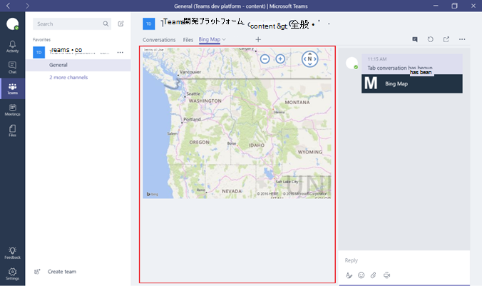

Microsoft チームで組み込みおよびユーザー設定のタブを使用します。Use built-in and custom tabs in Microsoft Teams
==================================================

タブには、チャンネル内の専用キャンバス上のサービスにアクセスするチーム メンバーができるようにします。これにより、チームの直接ツールと入力すると、データとは、チャンネルのコンテキストでの会話を作業できます。新しいチャネルごとに、2 つのタブを既定では、準備一覧されているの下にある、イメージに表示されます。Tabs allow team members to access services on a dedicated canvas within a channel. This lets the team work directly with the tools and data you provide, and to have conversations about them, in the channel’s context. With every new channel, two tabs are provisioned by default, as listed and shown in the image, below:

-   スレッドConversations

-   ファイルFiles

![マーケティング チームの [会話] セクションのスクリーン ショット。](media/Use_built-in_and_custom_tabs_in_Microsoft_Teams_image1.png)

1.  チーム メンバーと所有者の場合は、そのクラウド サービスの統合のために、各チャンネルにその他のタブを追加できます。Owners and team members can add additional tabs, to each channel, to help integrate their cloud services.

2.  Excel、PowerPoint、Word および PDF ファイルは前のタブに変換されることに、、[**ファイル] タブの [**にアップロードする必要があります。または、いずれかの既存のアップロード、ファイルに変換できる 1 回のクリック] タブ次のようにします。Excel, PowerPoint, Word and PDF files must be uploaded to the **Files tab** before they can be converted to tabs. Alternatively, any existing uploaded, files can be converted into tabs with a single click, as shown below.

    ![選択されている PowerPoint ファイルを使用して、[ファイル] タブのスクリーン ショット。](media/Use_built-in_and_custom_tabs_in_Microsoft_Teams_image2.png)

3.  Web サイトを追加するには、URL は必要があります交換情報がセキュリティで保護されたが保持されるよう**https プレフィックス**を起動します。To add a website, the URL must start with an **https prefix,** so that any information exchanged remains secure.

4.  チーム メンバーが、そのチャンネルにユーザー設定] タブを追加しようとすると、詳細な指示が提供されます。Detailed instructions are provided when a team member attempts to add a custom tab into their channel.

5.  チャンネルに、ユーザー設定] タブが追加されると、チーム メンバーが、コンテンツについてのディスカッションに重点を置いたができるようにする**] タブの [会話**が作成されます。When a Custom tab is added into a channel, a **Tab conversation** is created that allows team members to have focused discussions about the content.

    ![ウィンドウの右上にある] タブの [会話のカスタム タブのスクリーン ショット。](media/Use_built-in_and_custom_tabs_in_Microsoft_Teams_image3.png)

6.  ユーザーが簡単にアクセスし、必要がありますが、または最もよくやり取りするデータを管理するためにチャンネルにその他のタブを追加できます。Power BI レポート、ダッシュ ボード、またはも[Microsoft ストリーム](https://go.microsoft.com/fwlink/?linkid=855785)ビデオ チャンネルのトレーニング ビデオを発行することができます。Additional tabs can be added to channels to help users easily access and manage the data they need or interact with the most. This can be a Power BI report, a dashboard, or even a [Microsoft Stream](https://go.microsoft.com/fwlink/?linkid=855785) video channel where you publish training videos.

    

カスタム タブを作成します。Develop custom tabs
-------------------

に加えて、組み込みのタブ、組織が簡単に設計および Microsoft チームに統合されており、コミュニティの残りの部分と共有できる、それぞれのタブを開発することができます。In addition to the built-in tabs, organizations can easily design and develop their own tabs, that can be integrated into Microsoft Teams, or shared with the rest of the community.

Microsoft 開発ネットワーク設計し、独自のタブを作成する[詳細な手順](https://go.microsoft.com/fwlink/?linkid=855786)を提供します。ダウンロードし、Microsoft が開発した[サンプルのタブ](https://go.microsoft.com/fwlink/?linkid=855787)を配置します。The Microsoft Developer Network provides [detailed instructions](https://go.microsoft.com/fwlink/?linkid=855786) to design and build your own tabs; and download and deploy [sample tabs](https://go.microsoft.com/fwlink/?linkid=855787) developed by Microsoft.

