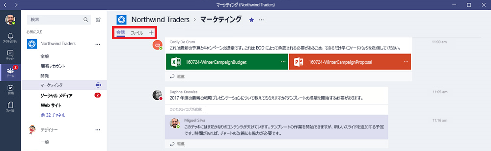
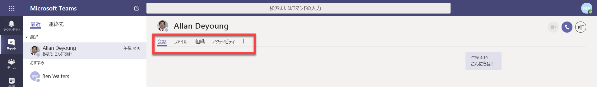
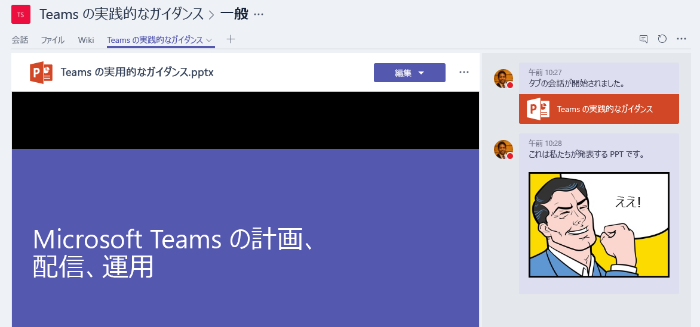

Microsoft Teams で組み込みタブとカスタム タブを使用するUse built-in and custom tabs in Microsoft Teams
==================================================

タブを使用すると、チームのメンバーはチャネル内の専用スペースまたはチャットでサービスとコンテンツにアクセスできます。Tabs allow team members to access services and content in a dedicated space within a channel or in a chat. これにより、チームはチャネルやチャットのコンテキストのみでツールやデータを直接操作することや、ツールやデータについて会話することができるようになります。This lets the team work directly with tools and data, and have conversations about the tools and data, all within the context of the channel or chat.

所有者とチーム メンバーは、チャネル、プライベート チャット、およびグループ チャットにタブを追加して、クラウド サービスの統合に役立てることができます。Owners and team members can add tabs to a channel, private chat, and group chat to help integrate their cloud services. タブは、ユーザーにとって必要なデータや頻繁に操作するデータへのアクセスと管理を簡単にするために追加できます。Tabs can be added to help users easily access and manage the data they need or interact with the most. これは、Power BI レポート、ダッシュボード、またはトレーニング ビデオを公開する [Microsoft Stream](https://go.microsoft.com/fwlink/?linkid=855785) ビデオ チャネルです。This can be a Power BI report, a dashboard, or even a [Microsoft Stream](https://go.microsoft.com/fwlink/?linkid=855785) video channel where you publish training videos.

## タブを操作するWork with tabs

- 新しいチャネルでは、[会話] と [ファイル] という 2 つのタブが既定で用意されています。With every new channel, two tabs are provisioned by default: Conversations and Files.

    
- すべてのプライベート チャットには、[会話]、[ファイル]、[組織]、および [アクティビティ] のタブが既定で用意されています。With every private chat, four tabs are provisioned by default: Conversations, Files, Organization, and Activity.

    

- 所有者とチーム メンバーは、チャネルまたはチャットの上部にある [**タブの追加**] (![[タブの追加] ボタンのスクリーンショット、+ 記号を表示](media/Use_built-in_and_custom_tabs_add_a_tab_button.png)) をクリックしてOwners and team members can add more tabs to a channel or chat by clicking **Add a tab**  チャネルまたはチャットにより多くのタブを追加できます。at the top of the channel or chat.

- Excel、PowerPoint、Word、および PDF ファイルは、タブに変換する前に [**ファイル**] タブにアップロードする必要があります。Excel, PowerPoint, Word, and PDF files must be uploaded to the **Files** tab before they can be converted to tabs. 以下に示すように、既存のアップロードされたファイルは、一度のクリック操作でタブに変換できます。Any existing uploaded file can be converted to a tab with a single click, as shown below.

    ![PowerPoint ファイルが選択された [ファイル] タブのスクリーンショット。](media/Use_built-in_and_custom_tabs_in_Microsoft_Teams_image2.png)

- Web サイトを追加するには、URLの先頭に **https** 接頭辞を付けて、交換される情報のセキュリティを確保する必要があります。To add a website, the URL must start with an **https** prefix so information that's exchanged remains secure.

- チーム メンバーがチャネルまたはチャットにカスタム タブを追加しようとすると、詳細な手順が提供されます。Detailed instructions are provided when a team member tries to add a custom tab to their channel or chat. チャネルにカスタム タブを追加すると、**タブの会話**が作成され、チーム メンバーはそこでコンテンツに関する集中的なディスカッションを行うことができます。When a custom tab is added to a channel, a **Tab conversation** is created that allows team members to have focused discussions about the content.

    

## ユーザー設定のタブを開発するDevelop custom tabs

組み込みのタブに加えて、独自のタブを設計して開発することもできます。このタブは、Teams に統合することも、別のコミュニティと共有することもできます。In addition to the built-in tabs, you can design and develop your own tabs to integrate to Teams or share with the rest of the community. 詳細については、「[開発者向けドキュメント](/microsoftteams/platform/tabs/what-are-tabs)」を参照してください:See our [developer documentation](/microsoftteams/platform/tabs/what-are-tabs) for more information.

---
