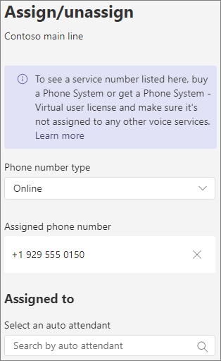

# 自動応答を設定する - 小規模ビジネス向けチュートリアル

自動応答を使用すると、ユーザーは組織に電話をかけ、メニュー システムを操作して、適切な部門、通話キュー、ユーザー、またはオペレーターに話しかけたりすることができます。 Microsoft Teams 管理センターを使用して、組織の自動応答を作成できます。

#### はじめに

組織外から直接ダイヤルすることで、アクセス可能な自動応答に必要なサービス番号を取得します。 これには、別の [プロバイダーからの番号の移行や](../phone-number-calling-plans/transfer-phone-numbers-to-teams.md) 、新しい [サービス番号の要求が含まれる場合があります](../getting-service-phone-numbers.md)。

電話システム [の取得 - 作成する](../teams-add-on-licensing/virtual-user.md) 各自動応答の仮想ユーザー ライセンス。 これらのライセンスは無料なので、後でセットアップを変更する場合に備え、追加のライセンスを取得する方法をお勧めしています。

休日に自動応答のルート通話を別の方法で呼び出す場合は、自動応答を作成する前に使用する祝日を作成します。

#### 自動応答を設定するには、次の手順に従います。

# [手順 1   電話番号](#tab/phone-number)

作成する各自動応答には、リソース アカウントが必要です。 これはユーザー アカウントに似ていますが、アカウントがユーザーではなく自動応答または通話キューに関連付けられている場合を除きます。 この手順では、アカウントを作成し *、Microsoft 365* 電話システム - 仮想ユーザー ライセンスを割り当て、サービス番号を割り当てします。

### リソース アカウントを作成する

Teams 管理センターでリソース アカウントを作成できます。

1. Teams 管理センターで、組織全体の設定 **を** 展開し、[リソース アカウント] **をクリックします**。

2. **[追加]** をクリックします。

3. [リソース アカウント **の追加]** ウィンドウで、[表示名]、[**ユーザー** 名]、および [リソース アカウントの種類の自動応答] の入力を **行います。**

    

4. **[保存]** をクリックします。

新しいアカウントがアカウントの一覧に表示されます。

### ライセンスを割り当てる

Microsoft *365* 電話システム - 仮想ユーザー ライセンスをリソース アカウントに割り当てる必要があります。

1. Microsoft 365 管理センターで、ライセンスを割り当てるリソース アカウントをクリックします。

2. [ライセンスと **アプリ] タブの** [ **ライセンス]** で **、[Microsoft 365 電話システム - 仮想ユーザー] を選択します**。

3. [変更を **保存] をクリックします**。

    

### サービス番号を割り当てる

この自動応答に電話番号でアクセスする必要がある場合は、その番号をリソース アカウントに割り当てる必要があります。

1. Teams 管理センターの [リソースアカウント] ページで、サービス番号を割り当てるリソース アカウントを選び、[割り当て/割り当て解除] を **クリックします**。

2. [電話番号 **の種類] ドロップダウン** で、使用する番号の種類を選びます。

3. [割 **り当てられた電話番号]** ボックスで、使用する番号を検索し、[追加] を **クリックします**。

    

4. **[保存]** をクリックします。

> [!div class="nextstepaction"]
> [手順 2 - 自動応答の一般的な>](https://review.docs.microsoft.com/microsoftteams/business-voice/create-a-phone-system-auto-attendant-smb?branch=mikeplum-smb-voice&tabs=general-info#steps)

# [手順 2   Attendant の一般的な情報](#tab/general-info)

自動応答を設定するには

1. Teams 管理センターで、[音声] を **展開** し、[ **自動** 応答] をクリックして、[追加] をクリック **します**。

2. 上部のボックスに自動応答の名前を入力します。

3. 演算子を指定する場合は、演算子の呼び出し先を指定します。 これは省略可能です (ただし、推奨)。 発信者 **がメニューから** 抜け出し、指定されたユーザーと話し合う場合にオペレーター オプションを設定できます。

4. この自動応答のタイム ゾーンを指定します。 タイム ゾーンは、営業時間外の別のコール フローを作成する場合に、営業時間の計算に使用されます。

5. この自動応答の言語を指定します。 システム生成の音声プロンプトに使用される言語です。

6. 音声入力を有効にする場合に選択します。 有効にすると、すべてのメニュー オプションの名前が音声認識キーワードになります。 たとえば、発信者は"1" と言ってキー 1 にマップされたメニュー オプションを選択したり、"営業" と言って "営業" という名前のメニュー オプションを選択したりします。

    

7. **[次へ]** をクリックします。

> [!div class="nextstepaction"]
> [手順 3 - コール フロー >](https://review.docs.microsoft.com/microsoftteams/business-voice/create-a-phone-system-auto-attendant-smb?branch=mikeplum-smb-voice&tabs=call-flow#steps)

# [手順 3   コール フロー](#tab/call-flow)

コール フロー オプションを選択する

1. 自動応答が通話に応答するときに応答メッセージを再生する場合に選択します。

    [オーディオ ファイルの **再生] を選** ぶと、[ファイルのアップロード] ボタンを使用して、音声として保存された録音されたあいさつメッセージをアップロードできます。WAV、.MP3、または .WMA 形式。 記録できるサイズは 5 MB 以下です。

    [あいさつ文を入力する] を選択した場合、自動応答が通話に応答すると、入力したテキスト (最大 1000 文字) が読み上げされます。

    

2. 通話のルーティング方法を選択します。

    [切断] を **選ぶ** と、自動応答によって通話が切断されます。

    [通話の **リダイレクト] を選択** した場合は、通話ルーティング先のいずれかを選択できます。

    [再生] メニュー **オプションを** 選択した場合は、[オーディオ ファイルの再生] または [あいさつメッセージを入力] を選び、メニュー オプションとディレクトリ検索から選びます。

    

3. 発信者がダイヤル キーを使用して移動する場合は、[メニューオプションの設定] で、発信者がダイヤル キーを押した場合に行う操作を選びます。 (この自動応答を会社のディレクトリとして作成する場合は、ダイヤル キー オプションを空白のままにします)。

    ダイヤル キーは、次の宛先に設定できます。

    - **組織内のユーザー** - 音声通話を受信できる組織内のユーザー。
    - **音声アプリ** - 別の自動応答または通話キュー。
    - **外部電話番号** - 任意の電話番号。 次の形式を使用します: +[国コード][郵便番号][電話番号]
    - **ボイス** メール - 指定した Microsoft 365 グループに関連付けられているボイス メールボックス。
    - **オペレーター** - 自動応答に定義された演算子。 演算子の定義は省略可能です。 演算子は、このリストの他の宛先として定義できます。

    演算子には 0 キーを設定することをお勧めします。

    メニュー オプションごとに、次を指定します。

    - **ダイヤル キー** - このオプションにアクセスするには、電話機のキーパッドのキー。

    - **音声コマンド** - 音声入力が有効になっている場合に、発信者がこのオプションにアクセスするために与える音声コマンドを定義します。 "カスタマー サービス" や "Operations and Grounds" のような複数の単語を含めることができます。 

    - **[リダイレクト先** ] - 発信者がこのオプションを選択するときに通話を発信する場所。 自動応答または通話キューにリダイレクトする場合は、関連付けられているリソース アカウントを選択します。

    

4. この自動応答を会社のディレクトリとして使用する場合は、[ディレクトリ検索] で [名前でダイヤル]**を選択します**。 このオプションを有効にすると、発信者はユーザーの名前を音声で入力したり、電話機のキーパッドに入力できます。 電話システム ライセンスを持つオンライン ユーザーは、対象ユーザーであり、名前でダイヤルで検索できます。 

    ([内線番号 **でダイヤル]** を選択することもできますが、Azure Active Directory で拡張機能を構成する必要があります)。

5. ディレクトリ検索オプションを選択したら、[ **次へ** ] をクリック **します**。

> [!div class="nextstepaction"]
> [手順 4 - 営業時間外のコール フロー>](https://review.docs.microsoft.com/microsoftteams/business-voice/create-a-phone-system-auto-attendant-smb?branch=mikeplum-smb-voice&tabs=after-hours#steps)

# [手順 4 営業時間   外](#tab/after-hours)

各自動応答に営業時間を設定できます。 営業時間が設定されていない場合、既定では 24 時間 7 日のスケジュールが設定されている場合、その日のすべての日とすべての時間が営業時間と見なされます。 営業時間は、日中の時間内の休憩を使用して設定できます。営業時間として設定されていないすべての時間は、営業時間外と見なされます。 さまざまな着信通話処理オプションと応答メッセージを営業時間外に設定できます。

自動応答と通話キューの構成によっては、直接の電話番号を含む自動応答の営業時間外の通話ルーティングのみを指定する必要がある場合があります。

営業時間外の発信者に対して個別の通話ルーティングが必要な場合は、各日の営業時間を指定します。 [ **新しい時間の追加** ] をクリックして、昼休みなど、指定した日に複数の時間セットを指定します。

営業時間を指定したら、営業時間外の通話ルーティング オプションを選択します。 手順 3 - コール フローで指定した営業時間内の通話ルーティングと同じ **オプションを使用できます**。

完了 **したら、[** 次へ] をクリックします。

> [!div class="nextstepaction"]
> [手順 5 - 休日のコール フロー >](https://review.docs.microsoft.com/microsoftteams/business-voice/create-a-phone-system-auto-attendant-smb?branch=mikeplum-smb-voice&tabs=holidays#steps)

# [手順 5   祝日](#tab/holidays)

自動応答への通話は、他の日とは異なる方法で休日にルーティングできます。 (休日の別のコール フローを使用したくない場合は、この手順をスキップできます)。

自動応答には、設定した休日ごとにコール フローを設定できます。 各自動応答には、最大 20 個の決められた休業日を追加できます。

1. [休日の通話の設定] ページで、[追加] を **クリックします**。

2. この休日設定の名前を入力します。

3. [休日 **] ドロップダウン** から、使用する休日を選択します。

4. 使用する応答メッセージの種類を選択します。

    

5. 通話を切断 **またはリダイレクト****する場合に** 選択します。

6. リダイレクトを選択した場合は、通話の通話ルーティング先を選択します。

    

7. **[保存]** をクリックします。

追加の祝日ごとに、必要に応じて手順を繰り返します。

すべての休日を追加した後、[次へ] をクリック **します**。

> [!div class="nextstepaction"]
> [手順 6 - ディレクトリ 内のユーザーを選択>](https://review.docs.microsoft.com/microsoftteams/business-voice/create-a-phone-system-auto-attendant-smb?branch=mikeplum-smb-voice&tabs=dial-scope#steps)

# [手順 6   ディレクトリ メンバー](#tab/dial-scope)

ダイヤル *スコープは、* 発信者が名前でダイヤルバイネームまたはダイヤルバイ拡張機能を使用する場合にディレクトリ内で使用できるユーザーを定義します。 [すべてのオンライン ユーザー **] の既定値には** 、電話システム ライセンスを持つオンライン ユーザーである組織内のすべてのユーザーが含まれます。

[含める] または [除外] で [カスタムユーザー グループ] を選択し、1 つ以上の Microsoft 365 グループ、配布リスト、またはセキュリティ グループを選択して、特定のユーザーを含めるか除外することができます。  たとえば、組織内のエグゼクティブをダイヤル ディレクトリから除外することができます。 (ユーザーが両方のリストにある場合は、ディレクトリから除外されます)。

> [!NOTE]
> 新しいユーザーの名前がディレクトリに一覧表示されるには、最大 36 時間かかる場合があります。

ダイヤルスコープの設定が完了したら、[次へ] を **クリックします**。

> [!div class="nextstepaction"]
> [手順 7 - リソース アカウントを割り当>](https://review.docs.microsoft.com/microsoftteams/business-voice/create-a-phone-system-auto-attendant-smb?branch=mikeplum-smb-voice&tabs=resource-accounts#steps)

# [手順 7   リソース アカウント](#tab/resource-accounts)

すべての自動応答には、リソース アカウントが関連付けられている必要があります。  第 1 レベルの自動応答には、サービス番号が関連付けられているリソース アカウントが少なくとも 1 つ必要です。 必要な場合は、複数のリソース アカウントを自動応答に割り当て、それぞれに個別のサービス番号を割り当てできます。

リソース アカウントを追加するには

1. [ **アカウントの追加]** をクリックし、追加するアカウントを検索します。 [追加 **] をクリック** し、[追加] を **クリックします**。

    ![リソース アカウントの [アカウントの追加] パネルのスクリーンショット](../media/auto-attendant-add-resource-account.png)

2. サービス アカウントの追加が完了したら、[送信] を **クリックします**。

    

これで自動応答の構成が完了します。

---

