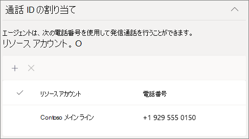

# 通話キューを作成する - 小規模ビジネス向けチュートリアル

通話キューは、特定の問題や質問に役立つ組織内のユーザーに発信者をルーティングする方法を提供します。 呼び出しは、キュー内のユーザー (エージェントと呼ばれる) に一度に 1 回 *配布されます*。 

呼び出しキューには、次の機能があります。

- あいさつメッセージ。

- ユーザーがキューで保留を待機している間の音楽。

- コール ルーティング - *First In,First Out* (FIFO) order - to agents.

- キューのオーバーフローとタイムアウトの処理オプション。

#### ビデオデモ

このビデオでは、仮想ネットワークで通話キューを作成する方法Teams。

> [!VIDEO https://www.microsoft.com/videoplayer/embed/RWCF23?autoplay=false]

#### はじめに

一部電話システム[取得 - 仮想ユーザー](../teams-add-on-licensing/virtual-user.md)ライセンスをまだ持ってない場合は、そのライセンスを取得します。 設定する予定の通話キューと自動応答ごとに 1 つを取得します。 これらのライセンスは無料なので、後でセットアップを変更する場合に備え、追加のライセンスを取得できます。

通話キュー内のエージェントはダイヤルアウトして顧客の通話を返す可能性があります。通話エージェントの発信者番号をメインの電話番号または適切な自動応答の番号に設定します。 詳細[については、「Microsoft Teams で](../caller-id-policies.md)発信者番号ポリシーを管理する」を参照してください。

#### 次の手順に従って通話キューを設定します。

# [手順   1: チームを作成する](#tab/create-team)

通話キューを作成するときに、個々のユーザーをキューに追加したり、既存のセキュリティ グループ、Microsoft 365 グループ、または他のチームMicrosoft Teamsできます。 チーム チャネル [を使用することをお勧めします](https://support.microsoft.com/office/9f07dabe-91c6-4a9b-a545-8ffdddd2504e)。 これにより、キューのメンバーは互いにチャットしたり、アイデアを共有したり、顧客を支援するドキュメントや他のリソースを作成することができます。 また、チームは、発信者が数時間後にメッセージを残したり、キューが最大容量に達したりするためにボイス メールボックスを提供します。

チームを作成するには

1. 最初に **、Teams** の左側にある [チーム] をクリックし、チーム リストの下部にある [参加] または [チームの作成] をクリックします。

2. 次に、[ **チームの作成]** (最初のカード、左上隅) をクリックします。

3. [ **チームをゼロから作成する] を選択します**。

4. 次に、パブリック チームとプライベート チームの 2 つのチームを選択します。 チームに **参加** することで、ユーザーが意図せずにキューに参加しないように、通話キューに Private を使用することをお勧めします。

5. チームに名前を付け、オプションの説明を追加します。

6. 完了したら、[作成] を **クリックします**。

8. 通話キューに追加するユーザーの名前を入力し、[追加] を **クリックします**。

9. [**閉じる**] をクリックします。 チームに追加したユーザーは、チームのメンバーになれたと知らせるメールを受け取り、チームの一覧にチームが表示されます。

次に、通話キューで使用するチャネルを追加します。

チャネルを追加するには

1. このTeams作成したチームを見つけ、[その他のオプション (...)] をクリックし、[チャネルの追加]**をクリックします**。

2. チャネルの名前と説明を入力し、[追加] を **クリックします**。

> [!div class="nextstepaction"]
> [手順 2 - リソース アカウントの>](/microsoftteams/business-voice/create-a-phone-system-call-queue-smb?tabs=resource-account#steps)

# [手順 2   リソース アカウント](#tab/resource-account)

作成する各呼び出しキューには、リソース アカウントが必要です。 これはユーザー アカウントに似ていますが、アカウントがユーザーではなく自動応答または通話キューに関連付けられている点が除きます。 この手順では、アカウントを作成し、Microsoft 365 電話システム *- Virtual User* ライセンスを割り当て、それを使用して通話キューの作成を開始します。

### リソース アカウントを作成する

リソース アカウントは、管理センター Teams作成できます。

1. 管理センター Teams、[組織全体の設定]**を展開し**、[リソース アカウント]**をクリックします**。

2. **[追加]** をクリックします。

3. [リソース **アカウントの追加]** ウィンドウで、[表示名] 、[**ユーザー** 名] に入力し、[リソース アカウントの種類] で [キューの呼び **出し] を選択します**。  エージェントは、キューから着信呼び出しを受信すると、表示名を表示します。

    

4. **[保存]** をクリックします。

   新しいアカウントがアカウントの一覧に表示されます。

   

### ライセンスを割り当てる

リソース アカウントに Microsoft 365 電話システム *- 仮想ユーザー ライセンスを* 割り当てる必要があります。

1. [アクティブMicrosoft 365 管理センターの一覧で、ライセンスを割り当てるリソース アカウントをクリックします。

2. [ライセンスと **アプリ] タブの**[ライセンス]**で**、[仮想Microsoft 365 電話システム **- 仮想ユーザー] を選択します**。

3. [変更の **保存] をクリックします**。

    ![[ライセンスの割り当て] ユーザー インターフェイスのスクリーンショットMicrosoft 365 管理センター](../media/resource-account-assign-virtual-user-license.png)

### 呼び出しキューを作成する

次に、新しい呼び出しキューの作成を開始し、リソース アカウントを割り当てします。

1. 管理センター Teams、[音声] を **展開** し **、[キューの** 呼び出し] をクリックし、[追加] を **クリックします**。

1. 通話キューの名前を入力します。

2. [**アカウントの追加]** をクリックし、この呼び出しキューで使用するリソースアカウントを検索し、[追加] をクリックして、[追加] を **クリックします**。

3. (省略可能)[**通話 ID の割** り当て] で、[追加] をクリックし、自動応答用に作成したリソース アカウントを検索し、[追加] をクリックし、[追加] を **クリックします**。 これにより、通話エージェントがコールアウトするときに、メイン ラインの発信者番号が提供されます。

    

3. 言語を選択します。 この言語は、システムで生成された音声プロンプトとボイスメールのトランスクリプション (有効にした場合) に使用されます。

    

4. 発信者がキューに到着するときに、発信者にあいさつメッセージを再生する場合に指定します。 再生するあいさつメッセージを含む MP3、WAV、または WMA ファイルをアップロードする必要があります。

5. Teamsキュー内で保留されている間、呼び出し元に既定の音楽を提供します。 特定のオーディオ ファイルを再生する場合は、[オーディオ ファイルの再生] を選択し、MP3、WAV、または WMA ファイルをアップロードします。

   > [!NOTE]
   > アップロードされた記録は 5 MB 以下にできます。
   > 通話キューで提供される既定Teamsは、組織が支払う使用料金は無料です。 

> [!div class="nextstepaction"]
> [手順 3 - エージェントを呼び出>](/microsoftteams/business-voice/create-a-phone-system-call-queue-smb?tabs=call-agents#steps)

# [手順 3 エージェント   を呼び出す](#tab/call-agents)

エージェントを呼び出しキューに追加するには、前に作成したチームとチャネルにエージェントを追加します。 これを行うには、チームのメンバーである必要があります。

1. [チームの **選択] オプションを選択し** 、[チャネルの **追加] をクリックします**。
2. 作成したチームの名前を入力して選択し、[追加] を **クリックします**。
3. キュー用に作成したチャネルを選択します。
3. [**適用**] をクリックします。

    

> [!NOTE]
> 新しいユーザーがチームに追加された場合、最初の呼び出しが到着するには最大 8 時間かかる場合があります。

> [!div class="nextstepaction"]
> [手順 4 - リソース アカウントの>](/microsoftteams/business-voice/create-a-phone-system-call-queue-smb?tabs=call-routing#steps)

# [手順 4 通話   ルーティング](#tab/call-routing)

使用する呼び出しルーティング方法を選択します。

1. [会議 **モード] を [** 自動] に **設定します**。

2. 使用する **ルーティング方法** を選択します。 これにより、エージェントがキューから呼び出しを受信する順序が決定されます。 シリアル ルーティングまたは **ラウンド ロビン をお****勧めします**。 次のオプションから選択します。

    - **アテンダント** ルーティングでは、キュー内のすべてのエージェントが同時に呼び出されます。 呼び出しを受け取る最初の呼び出しエージェントが呼び出しを取得します。

    - **シリアル ルーティングでは、** すべての呼び出しエージェントが 1 つ 1 つリングされます。 エージェントが通話を閉じ、または呼び出しを受け取らない場合、呼び出しは次のエージェントを呼び出し、エージェントが取り出されるか、または時間が切れるまですべてのエージェントを試します。

    - **ラウンド ロビンは** 、着信呼び出しのルーティングのバランスを取り、各呼び出しエージェントがキューから同じ数の呼び出しを取得します。 これは、すべての通話エージェント間で均等な機会を確保するために、受信販売環境で望ましい場合があります。

    - **アイドル時間が** 最も長いエージェントに各呼び出しをルーティングします。 (プレゼンス状態が 10 分以上離れたエージェントは含まれません)。

    

3. プレゼンス **ベースのルーティングを有効** にする。 これにより、プレゼンス状態が [使用可能] のエージェントに呼び出しが **ルーティングされます**。

4. エージェントが呼び出しからオプトアウトすることを許可する場合に選択します。

5. エージェントの **アラート時間を設定** して、キューが呼び出しを次のエージェントにリダイレクトする前にエージェントの電話が鳴る時間を指定します。

    

> [!div class="nextstepaction"]
> [手順 5 - 呼び出しオーバーフロー>](/microsoftteams/business-voice/create-a-phone-system-call-queue-smb?tabs=call-overflow#steps)

# [手順 5.   呼び出しオーバーフロー](#tab/call-overflow)

キューの最大数を超える呼び出しを処理する方法を選択します。

1. キュー内 **の最大呼び出し数を設定します**。

2. 呼び出しの最大数に達した場合に実行する操作を選択します。 通話を切断するか、リダイレクトできます。 次のいずれかの宛先に呼び出しをリダイレクトすることをお勧めします。
    - **組織内のユーザー** - 音声通話を受信できる組織内のユーザー
    - **音声アプリ** - 自動応答または別の通話キュー。 (この宛先を選択するときに、自動応答または通話キューに関連付けられているリソース アカウントを選択します)。
    - **外部電話番号** - 任意の電話番号。 +[国コード][地域コード][電話番号] の形式を使用します。
    - **ボイス** メール - 作成したチームのボイス メールボックスを使用できます。

    

> [!div class="nextstepaction"]
> [手順 6 - 呼び出しタイムアウト>](/microsoftteams/business-voice/create-a-phone-system-call-queue-smb?tabs=call-timeout#steps)

# [手順 6 通話   タイムアウト](#tab/call-timeout)

呼び出しがキュー内で待ち時間が長すぎるときに実行する処理を選択します。

1. [最大 **待機時間] を設定します**。

2. 通話がアウトした場合に実行する操作を選択します。通話を切断するか、リダイレクトできます。 次のいずれかの宛先に呼び出しをリダイレクトすることをお勧めします。
    - **組織内のユーザー** - 音声通話を受信できる組織内のユーザー
    - **音声アプリ** - 自動応答または別の通話キュー。 (この宛先を選択するときに、自動応答または通話キューに関連付けられているリソース アカウントを選択します)。
    - **外部電話番号** - 任意の電話番号。 +[国コード][地域コード][電話番号] の形式を使用します。
    - **ボイス** メール - 作成したチームのボイス メールボックスを使用できます。

    

3. **[保存]** をクリックします。

これで、通話キューのセットアップが完了します。 次に、自動応答 [を設定できます](create-a-phone-system-auto-attendant-smb.md)。

---

