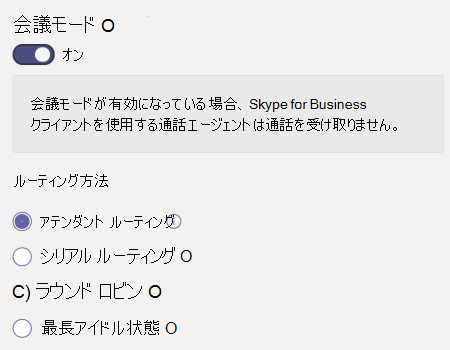

# 通話キューを作成する - 小規模ビジネス向けチュートリアルCreate a call queue - small business tutorial

通話キューは、組織内の特定の問題や質問に役立つユーザーに発信者をルーティングする方法を提供します。Call queues provide a method of routing callers to people in your organization who can help with with a particular issue or question. 通話はキュー内のユーザー (エージェントと呼ばれる) に一度に 1 つ配布 *されます*。Calls are distributed one at a time to the people in the queue (who are known as *agents*). 

通話キューには次の機能があります。Call queues provide:

- あいさつメッセージ。A greeting message.

- ユーザーがキューで保留を待っている間の音楽。Music while people are waiting on hold in a queue.

- コール ルーティング - *First In、First Out* (FIRST Out )順序で- エージェントに。Call routing - in *First In, First Out* (FIFO) order - to agents.

- キュー オーバーフローとタイムアウトの処理オプション。Handling options for queue overflow and timeout.

#### はじめにBefore you begin

電話システム [を取得する - 仮想ユーザー ライセンス](../teams-add-on-licensing/virtual-user.md) をまだ持ってない場合は、仮想ユーザー ライセンスを取得します。Get some [Phone System - Virtual User licenses](../teams-add-on-licensing/virtual-user.md) if you don't already have them. セットアップする通話キューと自動応答ごとに 1 つ取得します。Get one for each call queue and auto attendant that you plan to set up. これらのライセンスは無料なので、後でセットアップを変更する場合に備え、追加のライセンスを取得する方法をお勧めしています。These licenses are free, so we suggest getting a few extra in case you decide to make changes to your setup in the future.

通話キュー内のエージェントがダイヤルアウトして顧客の通話を返す可能性がある場合は、通話エージェントの発信者番号をメインの電話番号または適切な自動応答の番号に設定します。Since agents in a call queue may dial out to return a customer call, consider setting the caller ID for your call agents to your main phone number or the number of an appropriate auto attendant. 詳細 [については、「Microsoft Teams で発信者番号ポリシーを](../caller-id-policies.md) 管理する」を参照してください。See [Manage caller ID policies in Microsoft Teams](../caller-id-policies.md) for more information.

#### 通話キューをセットアップするには、次の手順に従います。Follow these steps to set up your call queue

# [手順 1   チームを作成するStep 1 Create a team](#tab/create-team)

通話キューを作成するときに、個々のユーザーをキューに追加するか、既存のセキュリティ グループ、Microsoft 365 グループ、または Microsoft Teams チームを使用できます。When creating a call queue, you can add individual users to the queue, or you can use an existing security group, Microsoft 365 group, or Microsoft Teams team. チーム チャネル [を使用することをお勧めします](https://support.microsoft.com/office/9f07dabe-91c6-4a9b-a545-8ffdddd2504e)。We recommend [using a team channel](https://support.microsoft.com/office/9f07dabe-91c6-4a9b-a545-8ffdddd2504e). これにより、キューのメンバーは互いにチャットしたり、アイデアを共有したり、顧客を支援するドキュメントや他のリソースを作成することができます。This allows members of the queue to chat with each other, share ideas, and create documents or other resources to help them help your customers. また、チームは、発信者が数時間後にメッセージを残したり、キューが最大容量に達したりするためにボイス メールボックスを提供します。A team also provides a voice mailbox for callers to leave a message after hours or if the queue reaches its maximum capacity.

チームを作成するにはTo create a team

1. まず、アプリ **の左側にある [Teams]** をクリックし、[参加] をクリックするか、チーム リストの下部にあるチームを作成します。First, click **Teams** on the left side of the app, then click **Join or create a team** at the bottom of your teams list.

2. 次に、[ **チームの作成]** (最初のカード、左上隅) をクリックします。Then click **Create team** (first card, top left corner).

3. [チーム **を一から作成] を選択します**。Choose **Build a team from scratch**.

4. 次に、パブリック チームとプライベート チームの選択を行います。Next, choose whether you want a public or private team. チームに **参加** することで、ユーザーが意図せずにキューに参加することを避けるために、通話キューにプライベートを使用することをお勧めします。We recommend **Private** for your call queue to avoid people unintentionally becoming part of the queue by joining the team.

5. チームに名前を付け、オプションの説明を追加します。Name your team and add an optional description.

6. 完了したら、[作成] をクリック **します**。When you're done, click **Create**.

8. 通話キューに追加するユーザーの名前を入力し、[追加] をクリック **します**。Type the names of the people that you want to have in your call queue, and then click **Add**.

9. [**閉じる**] をクリックします。Click **Close**. チームに追加したユーザーには、チームのメンバーになれたというメールが送信され、チームがチーム リストに表示されます。People you add to a team will receive an email letting them know they are now a member of your team and the team will show up in their teams list.

次に、通話キューで使用するチャネルを追加します。Next, we'll add a channel to use with the call queue.

チャネルを追加するにはTo add a channel

1. Teams で、作成したチームを見つけ、[その他のオプション **]** (...) をクリックし、[チャネルの追加] **をクリックします**。In Teams, find the team you just created, click **More options** (...), and then click **Add channel**.

2. チャネルの名前と説明を入力し、[追加] をクリック **します**。Type a name and description for the channel, and then click **Add**.

> [!div class="nextstepaction"]
> [手順 2 - リソース アカウントの>Step 2 - Resource accounts >](/microsoftteams/business-voice/create-a-phone-system-call-queue-smb?tabs=resource-account#steps)

# [手順 2   リソース アカウントStep 2 Resource accounts](#tab/resource-account)

作成する各通話キューには、リソース アカウントが必要です。Each call queue that you create requires a resource account. これはユーザー アカウントに似ていますが、アカウントがユーザーではなく自動応答または通話キューに関連付けられている場合を除きます。This is similar to a user account, except the account is associated with an auto attendant or call queue instead of a person. この手順では、アカウントを作成し *、Microsoft 365* 電話システム - 仮想ユーザー ライセンスを割り当て、それを使用して通話キューの作成を開始します。In this step, we'll create the account, assign it a *Microsoft 365 Phone System - Virtual User* license, and then use it to start creating the call queue.

### リソース アカウントを作成するCreate a resource account

Teams 管理センターでリソース アカウントを作成できます。You can create a resource account in the Teams admin center.

1. Teams 管理センターで、組織全体の設定 **を** 展開し、[リソース アカウント] **をクリックします**。In the Teams admin center, expand **Org-wide settings**, and then click **Resource accounts**.

2. **[追加]** をクリックします。Click **Add**.

3. [リソース アカウント **の追加]** ウィンドウで、[表示名] に[**ユーザー** 名] を入力し、[リソース アカウントの種類] の [通話キュー **] を選択します**。In the **Add resource account** pane, fill out **Display name**, **Username**, and choose **Call queue** for the **Resource account type**. エージェントは、キューからの着信通話を受信すると、表示名を表示します。Agents will see the display name when they receive an incoming call from the queue.

    

4. **[保存]** をクリックします。Click **Save**.

新しいアカウントがアカウントの一覧に表示されます。The new account will appear in the list of accounts.

### ライセンスを割り当てるAssign a license

Microsoft *365* 電話システム - 仮想ユーザー ライセンスをリソース アカウントに割り当てる必要があります。You must assign a *Microsoft 365 Phone System - Virtual User* license to the resource account.

1. Microsoft 365 管理センターの [アクティブなユーザー] リストで、ライセンスを割り当てるリソース アカウントをクリックします。In the Microsoft 365 admin center, in the **Active users** list, click the resource account to which you want to assign a license.

2. [ライセンスと **アプリ] タブの** [ **ライセンス]** で **、[Microsoft 365 電話システム - 仮想ユーザー] を選択します**。On the **Licenses and Apps** tab, under **Licenses**, select **Microsoft 365 Phone System - Virtual User**.

3. [変更を **保存] をクリックします**。Click **Save changes**.

    

### 呼び出しキューを作成するCreate a call queue

次に、新しい通話キューの作成を開始し、リソース アカウントを割り当てします。Next, we'll start creating a new call queue and assign the resource account.

1. Teams 管理センターで、[音声] を **展開** し、[ **通話キュー**] をクリックして、[追加] をクリック **します**。In the Teams admin center, expand **Voice**, click **Call queues**, and then click **Add**.

1. 通話キューの名前を入力します。Type a name for the call queue.

2. [**アカウントの追加]** をクリックし、この通話キューで使用するリソース アカウントを検索し、[追加] をクリックして、[追加] をクリック **します**。Click **Add accounts**, search for the resource account that you want to use with this call queue, click **Add**, and then click **Add**.

3. 言語を選択します。Choose a language. この言語は、システム生成の音声プロンプトとボイスメール トランスクリプション (有効にした場合) に使用されます。This language will be used for system-generated voice prompts and voicemail transcription (if you enable them).

    

4. 発信者がキューに入った場合に発信者に応答メッセージを再生する場合に指定します。Specify if you want to play a greeting to callers when they arrive in the queue. 再生する応答メッセージを含む MP3、WAV、または WMA ファイルをアップロードする必要があります。You must upload an MP3, WAV, or WMA file containing the greeting that you want to play.

5. Teams は、キューで保留にしている間、発信者に既定の音楽を提供します。Teams provides default music to callers while they are on hold in a queue. 特定のオーディオ ファイルを再生する場合は、[オーディオ ファイルの再生] を選択し、MP3、WAV、または WMA ファイルをアップロードします。If you want to play a specific audio file, choose **Play an audio file** and upload an MP3, WAV, or WMA file.

> [!NOTE]
> アップロードされた記録は 5 MB 以下にできます。The uploaded recording can be no larger than 5 MB.
> Teams の通話キューで提供される既定の音楽には、組織が支払う料金は無料です。The default music supplied in Teams call queues is free of any royalties payable by your organization. 

> [!div class="nextstepaction"]
> [手順 3 - コール エージェントが>Step 3 - Call agents >](/microsoftteams/business-voice/create-a-phone-system-call-queue-smb?tabs=call-agents#steps)

# [手順 3 コール   エージェントStep 3 Call agents](#tab/call-agents)

エージェントを通話キューに追加するには、先に作成したチームとチャネルにエージェントを追加します。To add agents to the call queue, we'll add them to the team and channel that we created earlier.

1. [チームの **選択] オプションを選択し** 、[チャネルの追加 **] をクリックします**。Select the **Choose a team** option and click **Add a channel**.
2. 作成したチームの名前を入力して選択し、[追加] をクリック **します**。Type the name of the team that you created, select it, and click **Add**.
3. キュー用に作成したチャネルを選択します。Select the channel that you created for the queue.
3. [**適用**] をクリックします。Click **Apply**.

    

> [!NOTE]
> 新しいユーザーがチームに追加された場合、最初の通話が到着するには最大 8 時間かかる場合があります。When new users are added to the team, it can take up to eight hours for their first call to arrive.

> [!div class="nextstepaction"]
> [手順 4 - リソース アカウントの>Step 4 - Resource accounts >](/microsoftteams/business-voice/create-a-phone-system-call-queue-smb?tabs=call-routing#steps)

# [手順 4 通話   ルーティングStep 4 Call routing](#tab/call-routing)

使用する通話ルーティング方法を選択します。Choose the call routing method that you want to use.

1. 会議モード **を自動に\*\*\*\*設定します**。Set **Conference mode** to **Auto**.

2. 使用する **ルーティング方法** を選択します。Choose the **Routing method** you want to use. これにより、エージェントがキューから通話を受信する順序が決定されます。This determines the order in which agents receive calls from the queue. シリアル ルーティング **またはラウンド ロビン\*\*\*\*をお勧めします**。We recommend **Serial routing** or  **Round robin**. 次のオプションから選択します。Choose from these options:

    - **アテンダント** ルーティングでは、キュー内のすべてのエージェントが同時に呼び出されます。**Attendant routing** rings all agents in the queue at the same time. 通話を受け取る最初の通話エージェントが通話を受け取る。The first call agent to pick up the call gets the call.

    - **シリアル ルーティングは** 、すべてのコール エージェントを 1 つ 1 つリングします。**Serial routing** rings all call agents one by one. エージェントが通話を却下するか、通話を受け取らない場合、通話は次のエージェントを呼び出し、エージェントが受け取されるか、または時間が切れるまですべてのエージェントを試します。If an agent dismisses or does not pick up a call, the call will ring the next agent and will try all agents until it is picked up or times out.

    - **ラウンド ロビンは** 、着信通話のルーティングのバランスを取り、各通話エージェントがキューから同じ数の通話を受け取ります。**Round robin** balances the routing of incoming calls so that each call agent gets the same number of calls from the queue. 受信販売環境では、すべてのコール エージェント間で機会が均等に確保されるのが望ましい場合があります。This may be desirable in an inbound sales environment to assure equal opportunity among all the call agents.

    - **アイドル時間が** 最も長いエージェントに各呼び出しがルーティングされます。**Longest idle** routes each call to the agent who has been idle the longest time. (プレゼンス状態が 10 分以上離れたエージェントは含まれません)。(Agents whose presence state has been Away for more than 10 minutes are not included.)

    

3. プレゼンス **ベースのルーティングを有効** にする。Turn **Presence-based routing** on. これにより、プレゼンス状態が [使用可能] のエージェントに通話がルーティング **されます**。This routes calls to agents whose presence status is **Available**.

4. エージェントが通話をオプトアウトすることを許可する場合に選択します。Choose if you want to allow agents to opt out of calls.

5. エージェントの **通知時間を設定** して、キューが呼び出しを次のエージェントにリダイレクトする前にエージェントの電話が鳴る時間を指定します。Set an **Agent alert time** to specify how long an agent's phone will ring before the queue redirects the call to the next agent.

    

> [!div class="nextstepaction"]
> [手順 5 - 呼び出しオーバーフロー >Step 5 - Call overflow >](/microsoftteams/business-voice/create-a-phone-system-call-queue-smb?tabs=call-overflow#steps)

# [手順 5 通話   オーバーフローStep 5 Call overflow](#tab/call-overflow)

キューの最大数を超える呼び出しを処理する方法を選択します。Choose how you want to handle calls that exceed the maximum in the queue.

1. キュー内 **の最大呼び出しを設定します**。Set the **Maximum calls in the queue**.

2. 通話の最大数に達した場合に実行する操作を選択します。Choose what you want to do when the maximum number of calls is reached. 通話を切断するか、リダイレクトできます。You can disconnect the call or redirect it. 次のいずれかの接続先に通話をリダイレクトすることをお勧めします。We recommend that you redirect the call to one of the following destinations:
    - **組織内のユーザー** - 音声通話を受信できる組織内のユーザー**Person in the organization** - a person in your organization who is able to receive voice calls
    - **音声アプリ** - 自動応答または別の通話キュー。**Voice app** - an auto attendant or another call queue. (この宛先を選ぶときに、自動応答または通話キューに関連付けられているリソース アカウントを選ぶ。(Choose the resource account associated with the auto attendant or call queue when choosing this destination.)
    - **外部電話番号** - 任意の電話番号。**External phone number** - any phone number. 次の形式を使用します: +[国コード][郵便番号][電話番号]Use this format: +[country code][area code][phone number]
    - **ボイス** メール - 作成したチームのボイス メールボックスを使用できます。**Voicemail** - you can use the voice mailbox of the team that you created.

    

> [!div class="nextstepaction"]
> [手順 6 - 通話のタイムアウト>Step 6 - Call timeout >](/microsoftteams/business-voice/create-a-phone-system-call-queue-smb?tabs=call-timeout#steps)

# [手順 6 通話   タイムアウトStep 6 Call timeout](#tab/call-timeout)

通話がキュー内で長い間待機している場合に実行する処理を選択します。Choose what you want to happen when calls have been waiting in the queue for too long.

1. [最大 **待ち時間] を設定します**。Set the **Maximum wait time**.

2. 通話がタイムアウトした場合に実行する操作を選択します。通話を切断するか、リダイレクトできます。Choose what you want to do when a call times out. You can disconnect the call or redirect it. 次のいずれかの接続先に通話をリダイレクトすることをお勧めします。We recommend that you redirect the call to one of the following destinations:
    - **組織内のユーザー** - 音声通話を受信できる組織内のユーザー**Person in the organization** - a person in your organization who is able to receive voice calls
    - **音声アプリ** - 自動応答または別の通話キュー。**Voice app** - an auto attendant or another call queue. (この宛先を選ぶときに、自動応答または通話キューに関連付けられているリソース アカウントを選ぶ。(Choose the resource account associated with the auto attendant or call queue when choosing this destination.)
    - **外部電話番号** - 任意の電話番号。**External phone number** - any phone number. 次の形式を使用します: +[国コード][郵便番号][電話番号]Use this format: +[country code][area code][phone number]
    - **ボイス** メール - 作成したチームのボイス メールボックスを使用できます。**Voicemail** - you can use the voice mailbox of the team that you created.

    

3. **[保存]** をクリックします。Click **Save**.

これで通話キューのセットアップが完了します。This completes the setup of your call queue. 次に、自動応答 [を設定できます](create-a-phone-system-auto-attendant-smb.md)。Next, you may want to [set up an auto attendant](create-a-phone-system-auto-attendant-smb.md).

---

