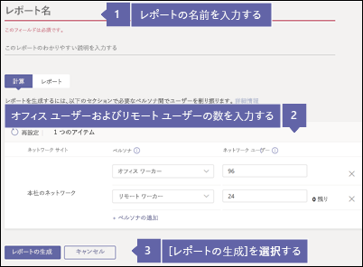
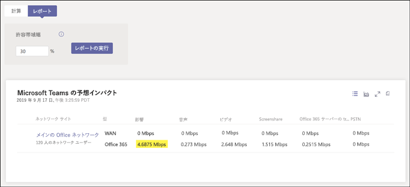

# インターネット接続を確認するCheck your Internet connection

Business Voice は、Microsoft 365 のクラウドにあります。Business Voice is located in the cloud with Microsoft 365. Microsoft Teams および Business Voice を使用するすべてのコンピューターとデバイスで、インターネット接続が必要になります。Every computer and device that uses Microsoft Teams and Business Voice needs a connection to the Internet. Business Voice を最大限に活用するには、予想される電話の数を一度にサポートできるブロードバンド インターネット接続が必要です。To get the best experience with Business Voice, you need a broadband Internet connection that can support the expected number of phone calls that will be made at any one time. また、ネットワーク上のコンピューターが Microsoft 365 サーバーに到達できることを確認する必要もあります。You also need to make sure that computers on your network can reach Microsoft 365 servers.

これらの手順を実行するには、次のいずれかのサブスクリプションを持つテナントが必要です。To follow these steps, you need to have a tenant with one of the following subscriptions:

* Office 365 Business EssentialsOffice 365 Business Essentials
* Office 365 Business PremiumOffice 365 Business Premium
* Office 365 E1Office 365 E1
* Office 365 E3Office 365 E3
* Office 365 F1Office 365 F1
* Microsoft 365 A1Microsoft 365 A1
* Microsoft 365 A3Microsoft 365 A3
* Microsoft 365 E3Microsoft 365 E3
* Microsoft 365 BusinessMicrosoft 365 Business

これらの手順を実行するのに Business Voice ライセンスは必要ありません。You don't need a Business Voice license to follow these steps.

## インターネット接続の速度を確認するCheck your Internet connection speed

この記事は、電話をかける必要のある人数、ビデオ会議のホストなどに対応するのにインターネット接続が十分な速度であるかどうかを判断するのに役立ちます。This article helps you determine whether your Internet connection is fast enough for the number of people who need to make phone calls, host video conferences, and so on. 組織に関する情報を入力すると、Teams や Business Voice で使用されるインターネット接続の量が記載されたレポートが返されます。You'll enter some information about your organization and get back a report with how much of your Internet connection will be used by Teams and Business Voice.

### インターネット接続とユーザーに関する情報を入手するGet information about your Internet connection and users

始める前に、次の情報を知っておく必要があります。Before you start, you need to know the following information:

* インターネット接続の速度。The speed of your Internet connection.
* 主にオフィス内で Business Voice を使用する人数。How many people will use Business Voice mainly from your office.
* ホーム オフィスなど、主にリモートの場所で Business Voice を使用する人数。How many people will use Business Voice mainly from a remote location, such as a home office.

### ネットワーク プランナーに情報を入力するEnter your information into the network planner

必要な操作は次のとおりです。Here's what you need to do:

1. ブラウザーを開き、https://admin.teams.microsoft.com に移動して、グローバル管理者のアクセス許可を持つアカウントでサインインします。Open a browser and go to https://admin.teams.microsoft.com and sign in with an account that has Global Administrator permissions. Office 365 へのサインアップに使用したアカウントには、これらのアクセス許可があります。The account you used to sign up for Office 365 has these permissions.
1. **[計画]** を開いて **[ネットワーク プランナー]** を選択します。Open **Org-wide settings** and then select **Network planner**.
1. **[ネットワーク プラン]** で、**[追加]** を選択します。Under **Network plans**, select **Add**. プランの名前を指定して、**[適用]** を選択します。Give your plan a name, and then select **Apply**. ネットワーク プランは次のようになります。Your network plan should look like this:

    
1. ネットワーク プランの名前をクリックします (上の図の**本社**)。Click on your network plan's name (**Main office** in the picture above).
1. 次のページで、**[ネットワーク サイト]** タブの **[ネットワーク サイトを追加]** を選択します。On the next page, select **Add a network site** under the **Network sites** tab.
1. 以下のスクリーンショットに示されているフィールドにのみ入力し、**[保存]** を選択します。Fill in only the fields indicated in the screenshot below and then select **Save**. この画面上の他のフィールドを空白のままにしておき、**[ExpressRoute]** も **[WAN に接続済み]** のオプションも選択しないでください。Leave the other fields on this screen blank, and don't select either the **ExpressRoute** or **Connected to WAN** options.

    
1. **[レポート]** タブで、**[レポートの開始]** を選択します。Under the **Report** tab, select **Start a report**.
1. 次の情報を入力してから **[レポートの生成]** を選択し、Teams の帯域幅要件を示すレポートを作成します。Fill out the following information and then select **Generate report** to create a report showing the bandwidth requirements for Teams. 次のセクションでは、レポートを読み込む方法について説明します。We'll show you how to read the report in the next section.

    

### インターネット接続の最低速度を確認するFind your minimum Internet connection speed

**[レポートの生成]** を選択すると、Office 365 で次のようなレポートが作成されます。When you select **Generate report**, Office 365 creates a report that looks like this:

強調表示された数値は、Teams と Business Voice で使用するインターネット接続の量を示しています。The highlighted number shows how much of your Internet connection Teams and Business Voice will use. この数値が、インターネット接続の合計速度の 30% を超えないようにすることをお勧めします。We recommend that this number be no more than 30% of your total Internet connection speed. たとえば、インターネット接続が 60 Mbps の場合、Teams や Business Voice は 18 Mbps を超えないようにする必要があります。For example, if your Internet connection is 60Mbps, Teams and Business Voice should take up no more than 18Mbps.

インターネット接続の最低速度を確認するには、次の計算を行います。`<highlighted number> / .3`。You can find your minimum Internet connection speed by doing this calculation: `<highlighted number> / .3`. 上の図で強調表示された数値を使用すると、`4.6875 / .3 = 15.6` になります。Using the highlighted number in the picture above, the calculation would be `4.6875 / .3 = 15.6`. つまり、インターネット接続の最低速度は、少なくとも 15.6 Mbps である必要があります。This means your minimum Internet connection speed needs to be at least 15.6Mbps.

Teams と Business Voice での使用量がインターネット接続の合計速度の 30% を超える場合、強調表示された数値が赤色で表示されます。If Teams and Business Voice will use more than 30% of your total Internet connection speed, the highlighted number will show up as red. この場合、インターネット接続をアップグレードする必要がある場合があります。If this happens, you might need to upgrade your Internet connection.

## ネットワーク上のコンピューターとデバイスが Microsoft 365 に到達できることを確認するMake sure computers and devices on your network can reach Microsoft 365

正常に動作させるには、Business Voice で使用するコンピューターとデバイスが特定のネットワーク ポートを使用して Microsoft 365 サーバーと通信する必要があります。To work correctly, computers and devices you want to use with Business Voice need to communicate with Microsoft 365 servers using specific network ports. ネットワーク ポートは実質的に、ネットワークやインターネット経由でコンピューターとデバイスが相互に通信するための出入口です。Network ports are essentially doors through which computers and devices can talk to each other over a network or the Internet. ファイアウォールでは、次の送信ネットワーク ポートを使用して、ネットワーク上のコンピューターとデバイスが Microsoft 365 に到達できるようにする必要があります。Your firewall needs to allow computers and devices on your network to reach Microsoft 365 using the following outbound network ports:

* **TCP ポート** 80 と 443**TCP ports** 80 and 443
* **UDP ポート** 3478、3479、3480、3481**UDP ports** 3478, 3479, 3480, and 3481

お使いのファイアウォールでこれらのネットワーク ポート上の通信が許可されているかどうかを確認する一番簡単な方法は、Teams を使用してテスト通話を行うことです。The easiest way to check whether your firewall allows communication on these network ports is to make a test call using Teams. テスト通話を行うには、次の操作を行います。To make a test call, do the following:

1. ネットワーク上のコンピューターで https://aka.ms/getteams に移動して、Teams をインストールします。Go to https://aka.ms/getteams on a computer on your network to install Teams. スピーカーとマイクがこのコンピューターに接続されていることを確認します。Make sure speakers and a microphone are connected to this computer.
2. Teams を開いて、Microsoft 365 アカウントを使用してサインインしますOpen Teams and sign in using a Microsoft 365 account
3. Teams で、プロファイルの画像を選択してから、**[設定]**  >  **[デバイス]** の順に選択しますIn Teams, select your profile picture, then **Settings** > **Devices**
4. **[オーディオ デバイス]** の **[テスト通話]** を選択しますChoose **Make a test call** under **Audio devices**
5. プロンプトに従ってメッセージを残し、メッセージを再生しますFollow the prompts to leave a message and have it played back to you

* 電話が繋がり、メッセージを再生できたら、ファイアウォールは正しく設定されています。If the call connects and you can hear your message played back to you, your firewall is set up correctly.
* 電話は繋がるものの、プロンプトが聞こえない場合またはメッセージが再生されない場合は、コンピューターによってスピーカーとマイクが正しく設定され、検出されていることを確認します。If the call connects but you can't hear the prompts or your message played back to you, make sure your speakers and microphone are set up correctly and detected by the computer. もう一度お試しください。Try again.
* 電話が繋がらない場合、または繋がるもののメッセージが聞こえない場合は、ファイアウォールを更新して、上のリストに表示されているネットワーク ポートを許可する必要がある場合があります。If the call doesn't connect or if it does but you can't hear your message played back to you, you might need to update your firewall to allow the network ports listed above. ネットワーク ポートがインターネットに到達できるようにする方法については、ファイアウォールのドキュメントを確認するか、IT スペシャリストにお問い合わせください。Check your firewall's documentation on how to allow network ports to reach the Internet, or contact an IT specialist to help you.

IT プロフェッショナルで、Business Voice をサポートするためにより大きくて複雑なネットワークを準備する方法の詳細が必要な場合は、「[環境を評価する](../3-envision-evaluate-my-environment.md)」をご覧ください。If you're an IT professional and want more information about how to prepare larger or more complex networks to support Business Voice, take a look at [Evaluate my environment](../3-envision-evaluate-my-environment.md). 記事「[環境を評価する](../3-envision-evaluate-my-environment.md)」では、帯域幅、プロキシ、ファイアウォールの要件に関する詳細と、[Network Assessment Tool](../3-envision-evaluate-my-environment.md#test-the-network) を使用してネットワークをテストする方法について説明します。The [Evaluate my environment](../3-envision-evaluate-my-environment.md) article gives additional information about bandwidth, proxy, and firewall requirements and also how to test your network using the [Network Assessment Tool](../3-envision-evaluate-my-environment.md#test-the-network).
