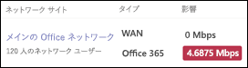

# Business Voice のインターネット接続を確認するCheck your Internet connection for Business Voice

Business Voice は、Microsoft 365 のクラウドにあります。Business Voice is located in the cloud with Microsoft 365. Microsoft Teams および Business Voice を使用するすべてのデバイスで、インターネット接続が必要になります。Every device that uses Microsoft Teams and Business Voice needs a connection to the Internet.

最高の Business Voice エクスペリエンスを達成するには、組織が一度に行う最大通話数をサポートできるブロードバンド インターネット接続が必要です。To get the best Business Voice experience, you need a broadband Internet connection that can support the maximum number of phone calls that your organization might make at any one time. また、ネットワーク上のコンピューターが Microsoft 365 サーバーに到達できることを確認する必要もあります。You also need to make sure that the computers on your network can reach Microsoft 365 servers.

これらの手順を実行するには、次のいずれかのサブスクリプションを持つテナントが必要です。To follow these steps, you need to have a tenant with one of the following subscriptions:

* Office 365 Business EssentialsOffice 365 Business Essentials
* Office 365 Business PremiumOffice 365 Business Premium
* Office 365 E1Office 365 E1
* Office 365 E3Office 365 E3
* Office 365 F1Office 365 F1
* Microsoft 365 A1Microsoft 365 A1
* Microsoft 365 A3Microsoft 365 A3
* Microsoft 365 E3Microsoft 365 E3
* Microsoft 365 BusinessMicrosoft 365 Business

これらの手順を実行するのに Business Voice ライセンスは必要ありません。You don't need a Business Voice license to follow these steps.

## インターネット接続の速度を確認するCheck your Internet connection speed

この記事は、電話をかける必要のある人数、ビデオ会議のホストに対応するのにインターネット接続が十分な速度であるかどうかを判断するのに役立ちます。This article helps determine whether your Internet connection is fast enough for the number of people who need to make phone calls and host video conferences. 組織に関する情報を入力すると、Teams や Business Voice で使用されるインターネット接続の量が記載されたレポートが返されます。You'll provide information about your organization and get back a report that shows how much of your Internet connection will be used by Teams and Business Voice.

### インターネット接続とユーザーに関する情報を収集するGather information about your Internet connection and users

始める前に、次の情報が必要です。Before you start, you need the following information:

* インターネット接続の速度The speed of your Internet connection
* 主にオフィス内で Business Voice を使用する人数How many people will use Business Voice mainly from your office
* ホーム オフィスなど、主にリモートの場所で Business Voice を使用する人数How many people will use Business Voice mainly from a remote location, such as a home office

### ネットワーク プランナーに情報を入力するEnter your information into the network planner

次の手順を実行します。Follow these steps:

1. ブラウザーで、https://admin.teams.microsoft.com に移動します。In a browser, go to https://admin.teams.microsoft.com. グローバル管理者権限を持つアカウントを使用してサインインします。Sign in by using an account that has Global Administrator permissions. Office 365 へのサインアップに使用したアカウントには、これらのアクセス許可があります。The account that you used to sign up for Office 365 has these permissions.
2. **[計画]** を開いて **[ネットワーク プランナー]** を選択します。Open **Planning** and select **Network planner**.
3. **[ネットワーク プラン]** で、**[追加]** を選択します。Under **Network plans**, select **Add**. プランの名前を入力して、**[適用]** を選択します。Enter a name for your plan, and then select **Apply**. ネットワーク プランは次のようになります。Your network plan should look like this:

    
1. ネットワーク プランの名前を選択します。Select the name of your network plan. (これは、前の図では **[メイン オフィス]** です。)(It's **Main office** in the preceding picture.)
2. 次のページで、**[ネットワーク サイト]** タブで **[ネットワーク サイトを追加]** を選択します。On the next page, select **Add a network site** on the **Network sites** tab.
3. 次のスクリーンショットに示されているフィールドにのみ入力し、**[保存]** を選択します。Fill in only the fields that are indicated in the following screenshot, and then select **Save**. この画面上の他のフィールドを空白のままにしておき、**[ExpressRoute]** も **[WAN に接続済み]** のオプションも選択しないでください。Leave the other fields on this screen blank, and don't select the **ExpressRoute** or **Connected to WAN** options.

    
1. **[レポート]** タブで、**[レポートの開始]** を選択します。On the **Report** tab, select **Start a report**.
1. 次の情報を入力してから **[レポートの生成]** を選択し、Teams の帯域幅要件を示すレポートを作成します。Enter the following information, and then select **Generate report** to create a report that shows the bandwidth requirements for Teams. 次のセクションでは、レポートを読み込む方法について説明します。We show you how to read the report in the next section.

    

### インターネット接続の最低速度を確認するFind your minimum Internet connection speed

**[レポートの生成]** を選択すると、Office 365 で次のようなレポートが作成されます。When you select **Generate report**, Office 365 creates a report that looks like this:

強調表示された数値は、Teams と Business Voice で使用するインターネット接続の量を示しています。The highlighted number shows how much of your Internet connection Teams and Business Voice will use. この数値が、インターネット接続の合計速度の 30% を超えないようにすることをお勧めします。We recommend that this number is no more than 30 percent of your total Internet connection speed. たとえば、インターネット接続が 60 Mbps の場合、Teams や Business Voice は 18 Mbps 未満を使用する必要があります。For example, if your Internet connection is 60 Mbps, Teams and Business Voice should use no more than 18 Mbps.

この式を使用して、インターネット接続の最小速度を決定します: *\< 強調表示された数字 > / 0.3*。Use this equation to determine your minimum Internet connection speed: *\<highlighted number> / 0.3*. 前の図で強調表示されている数値を使用すると計算は、*4.6875 / 0.3 = 15.6* になります。With the number that's highlighted in the preceding image, the calculation is *4.6875 / 0.3 = 15.6*. この場合、インターネット接続速度は、15.6 Mbps 以上にする必要があります。In this case, the Internet connection speed should be at least 15.6 Mbps.

Teams と Business Voice での使用量がインターネット接続の合計速度の 30% を超える場合、強調表示された数値が赤色で表示されます。If Teams and Business Voice will use more than 30 percent of your total Internet connection speed, the highlighted number will appear red. この場合、インターネット接続をアップグレードする必要がある場合があります。In that case, you may need to upgrade your Internet connection.

## ネットワーク上のコンピューターとデバイスが Microsoft 365 に到達できることを確認するMake sure the computers and devices on your network can reach Microsoft 365

Business Voice を使用するコンピューターやデバイスは、特定のネットワーク ポートを使用して Microsoft 365 サーバーと通信する必要があります。Computers and devices that use Business Voice must use specific network ports to communicate with Microsoft 365 servers. これらのポートは実質的に、ネットワークやインターネット経由でデバイスが相互に通信するための出入口です。These ports are essentially doors through which devices talk to each other over a network or the Internet. ファイアウォールでは、次の*送信*ネットワーク ポートを使用して、ネットワーク上のデバイスが Microsoft 365 に到達できるようにする必要があります。Your firewall needs to allow devices on your network to reach Microsoft 365 through the following *outbound* network ports:

* **TCP ポート** 80 と 443**TCP ports** 80 and 443
* **UDP ポート** 3478、3479、3480、3481**UDP ports** 3478, 3479, 3480, and 3481

お使いのファイアウォールでこれらのネットワーク ポート上の通信が許可されているかどうかを確認する一番簡単な方法は、Teams でテスト通話を行うことです。The easiest way to check whether your firewall allows communication on these network ports is to make a test call in Teams:

1. ネットワーク上のコンピューターで https://aka.ms/getteams に移動して、Teams をインストールします。Go to https://aka.ms/getteams on a computer on your network and install Teams. コンピューターにスピーカーとマイクがあることを確認します。Make sure that the computer has speakers and a microphone.
2. Teams を開いて、Microsoft 365 アカウントを使用してサインインします。Open Teams and sign in by using a Microsoft 365 account.
3. Teams で、プロファイルの画像を選択してから、**[設定]**  >  **[デバイス]** の順に移動します。In Teams, select your profile picture, and then go to **Settings** > **Devices**.
4. **[オーディオ デバイス]** で、**[テスト通話]** を選択します。Under **Audio devices**, select **Make a test call**.
5. 手順に従ってメッセージを残し、メッセージを再生します。Follow the steps to leave a message and have it played back to you.

   * 電話が繋がり、メッセージが聞こえたら、ファイアウォールは正しく設定されています。If the call connects and you hear your message, your firewall is set up correctly.
   * 電話は繋がるものの、指示が聞こえない場合またはメッセージが再生されない場合は、コンピューターによってスピーカーとマイクが正しく設定されていることを確認し、もう一度お試しください。If the call connects, but you can't hear the instructions or your message, make sure that your speakers and microphone are set up correctly, and then try again.
   * 電話が繋がらない場合、または繋がるもののメッセージが聞こえない場合は、ファイアウォールを更新して、必要なネットワーク ポートへのアクセスを許可する必要がある場合があります。If the call doesn't connect or it connects but you can't hear your message, you might need to update your firewall to allow access to the required network ports. ファイアウォールのドキュメントを確認するか、IT 専門家にお問い合わせください。Check your firewall's documentation, or contact an IT specialist for help.

 IT プロフェッショナルで、Business Voice をサポートするためにより大きくて複雑なネットワークを準備する方法の詳細が必要な場合は、「[環境を評価する](../3-envision-evaluate-my-environment.md)」をご参照ください。If you're an IT professional and want more information about how to prepare larger or more complex networks to support Business Voice, see [Evaluate my environment](../3-envision-evaluate-my-environment.md). この記事では、帯域幅、プロキシ、ファイアウォールの要件に関する詳細と、[Network Assessment Tool](../3-envision-evaluate-my-environment.md#test-the-network) を使用してネットワークをテストする方法について説明します。This article provides information about bandwidth, proxy and firewall requirements, and how to use the [Network Assessment Tool](../3-envision-evaluate-my-environment.md#test-the-network) to test your network.

