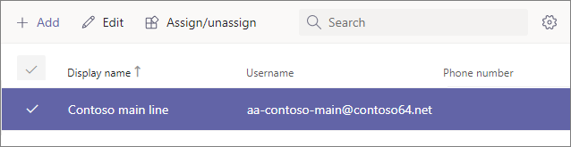

# 手順 4: Business Voice リソース アカウントを設定する

リソース アカウントは、特定のユーザーには割り当てられていない。 代わりに、無料の仮想ユーザー ライセンスを使用するリソース アカウントは、仮想マシンのデバイスとサービスMicrosoft 365。 このMicrosoft Teams、リソース アカウントには電話番号が割り当てられた後、自動応答と通話キューに関連付けられます。

リソース アカウントを自動応答と通話キューに関連付け、1 つ以上の有料電話番号または無料電話番号を追加できます。 たとえば、あるリソース アカウントを有料電話番号に関連付け、ローカル発信者の自動応答に関連付けできます。 遠距離通話の場合は、別のリソース アカウントを無料電話番号と同じ自動応答に関連付けます。

この記事のセクションでは、リソース アカウントを設定し、そのアカウントに電話番号を割り当てる方法について説明します。 後で、リソース アカウントを自動応答に関連付ける予定です。

## 仮想ユーザー ライセンスの取得

自動応答と通話キューを操作するには、リソース アカウントにライセンスが必要です。 無料の仮想マシン Microsoft 365 電話システム *ライセンスを使用* できます。

> [!NOTE]
> Business Voice の試用期間にサインアップした場合にのみ、次の手順を実行する必要があります。 Business Voice ライセンスを購入した場合は、仮想ライセンスが既にアカウントに適用されている必要があります。 
>
> 仮想ライセンスが既にある場合は、グローバル管理者アクセス許可Microsoft 365アカウントを使用してログインします。 次に、[製品の課金> [に移動します](https://admin.microsoft.com/Adminportal/Home#/subscriptions)。 仮想ライセンスがある場合は、[仮想ユーザー] **Microsoft 365 電話システム として表示されます**。

1. Microsoft 365 管理センターを開き、グローバル管理者のユーザー (通常は、このアカウントを使用してアカウントにサインアップしたアカウント) でログインMicrosoft 365。
2. 左側のナビゲーション ウィンドウで、[課金 <a href="https://admin.microsoft.com/Adminportal/Home#/catalog" target="_blank">  >  購入サービス</a>アドオン] に移動します。すべてのアドオン  >    >  **製品を表示します**。
3. 最後までスクロールして、仮想ユーザー ライセンス **Microsoft 365 電話システムを見** つける。 [詳細 **] を選択** し、[購入] **を選択します**。
4. ライセンス購入ページで、必要な仮想ユーザー ライセンスの数を選択します。 設定する予定の自動応答と通話キューごとに 1 つの仮想ライセンスが必要です。 少なくとも 5 つのライセンスを選択することをお勧めします。今後、より多くの自動応答と通話キューを簡単にセットアップできます。ライセンスを今すぐ追加購入する必要はありません。
5. [ライセンス **がないすべてのユーザーに自動的に割り当てる] をオフにします**。
6. [今 **すぐチェックアウト] を選択します**。
7. ご注文を確認し、[次へ] **を選択** し、[注文] **を選択します**。

> [!NOTE]
> コストが 0 の  **場合でも、** ライセンスを購入する必要があります。

## リソース アカウントを作成する

仮想ユーザー - 仮想Microsoft 365 電話システムライセンスを受 *け* 取った後、リソース アカウントを作成できます。

1. Microsoft Teams 管理センターを開き、グローバル管理者であるユーザー (通常は、管理者のサインアップに使用したアカウント) でログインMicrosoft 365。
2. 左側のナビゲーション ウィンドウで、[組織全体の設定] <a href="https://admin.teams.microsoft.com/company-wide-settings/resource-accounts" target="_blank"> **[リソース アカウント]**  >  **に移動します**</a>。
3. **[追加]** を選択します。
4. [リソース **アカウントの追加] ウィンドウ** で、[表示名] **に入力** し、[ユーザー名] を **入力します**。 リソース アカウントの目的を説明するわかりやすい表示名 ("メイン ライン自動応答" など) を選択します。
5. [ **リソース アカウントの種類] で、[** 自動応答] **を選択します**。
6. **[保存]** を選択します。

## ライセンスを割り当てる

リソース アカウントを作成したら、仮想ユーザー ライセンスまたは仮想ユーザー ライセンスMicrosoft 365 電話システム *割* り当てる *電話システム* があります。

1. Microsoft 365 管理センターを開き、グローバル管理者のユーザー (通常は、このアカウントを使用してアカウントにサインアップしたアカウント) でログインMicrosoft 365。
1. 左側のナビゲーション ウィンドウで、[ユーザーアクティブ ユーザー]<a href="https://admin.microsoft.com/Adminportal/Home#/users" target="_blank">  >  **に移動します**</a>。
1. リソース アカウントを選択します。
1. [ライセンスと **アプリ] タブの**[ライセンス]**で**、[仮想Microsoft 365 電話システム **- 仮想ユーザー] を選択します**。
1. [変更の **保存] を選択し** 、[閉じる] **を選択します**。

## サービス番号を割り当てる

1. Microsoft Teams 管理センターを開き、グローバル管理者であるユーザー (通常は、管理者のサインアップに使用したアカウント) でログインMicrosoft 365。
1. 左側のナビゲーション ウィンドウで、[組織全体の設定] <a href="https://admin.teams.microsoft.com/company-wide-settings/resource-accounts" target="_blank"> **[リソース アカウント]**  >  **に移動します**</a>。
1. 作成したリソース アカウントを選択し、[割り当て/割り当て解除] **をクリックします**。
1. [電話番号の **電話ボックスで、[オンライン**] を **選択します**。
1. [割 **り当てられた電話番号]** ボックスで、使用する番号を検索し、[追加] を **クリックします**。 国コードを必ず含める (例: **+1** 250 555 0012)
1. **[保存]** をクリックします。

> [!div class="nextstepaction"]
> [次の手順: ユーザーに電話番号を割り当てる](set-up-assign-numbers.md)
