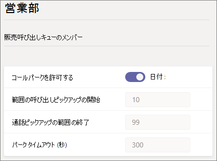
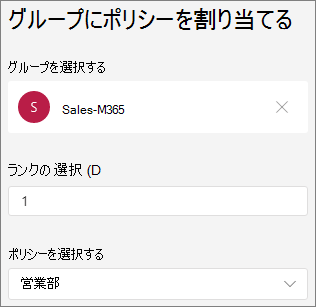

# Microsoft Teams でのコール パークおよび保留解除

コール パークと取得は、ユーザーが通話を保留にできる機能です。 通話の保留を実行すると、Teams サービスにより通話解除のための固有のコードが生成されます。 通話を登録したユーザーまたは他のユーザーは、サポートされているアプリまたはデバイスでそのコードを使用して、呼び出しを取得できます。 (詳細については、「通話[を他のユーザーにTeams」](https://support.office.com/article/park-a-call-in-teams-8538c063-d676-4e9a-8045-fc3b7299bb2f)を参照してください)。

コール パークを使用する一般的なシナリオには、次のようなものがあります。

- 受付が、工場で働く人宛にかかってきた通話を保留にします。 次に、受付は場内アナウンス設備で着信とコード番号をアナウンスします。 通話を受けたユーザーは、工場のフロアで Teams 電話を取り、コードを入力して通話を保留解除できます。
- バッテリーの充電が切れかけているため、ユーザーが携帯電話で通話を保留にします。 その後、そのユーザーは Teams の卓上電話でコードを入力して通話を保留解除できます。
- サポート担当者が顧客からの電話を保留して、顧客への通話サポートを行うエキスパートへ Teams チャネルでアナウンスを送信します。 エキスパートが Teams クライアントにコードを入力し、通話を保留解除します。

呼び出しをパークして取得するには、ユーザーはユーザーエンタープライズ VoIP、コール パーク ポリシーに含める必要があります。

> [!NOTE]
> コール パークと取得は、Teams[展開](teams-and-skypeforbusiness-coexistence-and-interoperability.md)モードでのみ使用できます。また、IP 電話Skype for Businessサポートされていません。

## コール パークの構成と取得

コール パークを構成して取得Teams管理者である必要があります。 既定では無効になっています。 コール パーク ポリシーを使用して、ユーザーに対して有効にしたり、ユーザー グループを作成したりできます。 一連のユーザーに同じポリシーを適用すると、そのユーザーの間で通話を保留したり、保留を解除したりできます。

呼び出しの集荷番号の範囲は、10 ~ 99 の範囲に事前に定義され、変更することはできません。 最初にパークされた呼び出しは 10 の集荷コードをレンダリングし、次にパークされた呼び出しは 11 などの集荷コードをレンダリングします。 99 までが集荷コードとしてレンダリングされます。 その後、レンダリングされた集荷コードは 10 から再度開始されます。  89 を超えるアクティブなパークされた呼び出しがある場合、レンダリングされた集荷コードは 99 を超えて増加し続け、90 番目のアクティブなパークされた呼び出しは集荷コードに対して 100 回レンダリングされ、91 番目のアクティブなパークされた呼び出しは 101 の集荷コードをレンダリングします。

コール パーク ポリシーを有効にするには

1. 管理センターの左側のナビゲーションMicrosoft Teams、音声 **通話パークポリシー**  >  **に移動します**。
2. [ポリシーの **管理] タブで、[** 追加] を **クリックします**。
3. ポリシーに名前を付け、[呼び出しパークを **許可する] を [オン** ] に **切り替えます**。

    

4. **[保存]** を選択します。

ポリシーを編集するには、一覧でポリシーを選択し、[編集] をクリック **します**。

ポリシーを機能するには、ポリシーをユーザーに割り当てる必要があります。 ポリシーを [ユーザーに個別に割り当てるか](assign-policies.md) 、グループに割り当てできます。

グループにコール パーク ポリシーを割り当てるには

1. [コール **パーク ポリシー] ページの** [グループ ポリシーの割り当て] タブ **で** 、[グループの追加] **をクリックします**。
2. 使用するグループを検索し、[追加] を **クリックします**。
3. 他のグループ割り当てと比較してランクを選択します。
4. [ **ポリシーの選択] で**、このグループを割り当てるポリシーを選択します。

    

5. **[適用]** を選択します。

## 関連トピック

[通話を一時Teams](https://support.office.com/article/park-a-call-in-teams-8538c063-d676-4e9a-8045-fc3b7299bb2f)

[ Teams でユーザーにポリシーを割り当てる](assign-policies.md)

[New-CsTeamsCallParkPolicy](/powershell/module/skype/new-csteamscallparkpolicy?view=skype-ps)

[Set-CsTeamsCallParkPolicy](/powershell/module/skype/set-csteamscallparkpolicy?view=skype-ps)

[Grant-CsTeamsCallParkPolicy](/powershell/module/skype/grant-csteamscallparkpolicy?view=skype-ps)
