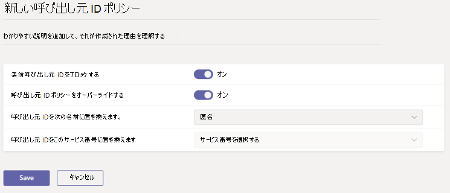

# <a name="manage-caller-id-policies-in-microsoft-teams"></a>Microsoft Teams で発信者番号通知ポリシーを管理する

>[!INCLUDE [new-feature-teams-admin-center](includes/new-feature-teams-admin-center.md)]

管理者として、Microsoft Teams の発信者番号ポリシーを使用して、発信者番号を変更またはブロックすることができます (通話回線 ID とも呼ばれます)。 既定では、ユーザーが PSTN 携帯電話に通話を発信し、PSTN の発信者の電話番号が Teams ユーザーに発信されたときに、その電話番号が表示されるようにすることができます。 発信者番号通知ポリシーを使って、組織内の Teams ユーザーに対して別の電話番号を表示したり、着信番号が表示されないようにブロックしたりすることができます。

たとえば、ユーザーが電話をかけるときに、発信者番号認識を変更して、ユーザーの電話番号ではなく、組織の主要な電話番号を表示することができます。

発信者番号通知ポリシーを管理するには、Microsoft Teams 管理センターの**音声** > **発信者番号ポリシー**にアクセスします。 グローバル (組織全体の既定) ポリシーを使用するか、カスタムポリシーを作成してユーザーに割り当てることができます。 組織内のユーザーは、カスタムポリシーを作成して割り当てる場合を除き、自動的にグローバルポリシーを取得します。

グローバルポリシーを編集するか、カスタムポリシーを作成して割り当てることができます。 ユーザーにカスタムポリシーが割り当てられている場合は、そのポリシーがユーザーに適用されます。 ユーザーにカスタムポリシーが割り当てられていない場合は、グローバルポリシーがユーザーに適用されます。

## <a name="create-a-custom-caller-id-policy"></a>カスタム発信者番号ポリシーを作成する

1. Microsoft Teams 管理センターの左のナビゲーションで、[**ボイス** > **発信者番号ポリシー**] に移動します。
2. [**追加**] をクリックします。

3. ポリシーの名前と説明を入力します。
4. ここで、目的の設定を選びます。

    - [着信した発信者番号を**ブロック**]: この設定をオンにすると、着信が表示されないように発信者 id がブロックされます。
    - **ユーザーは発信者番号ポリシーを上書きでき**ます。この設定を有効にして、ユーザーがポリシーの設定を上書きできるようにします。 これは、ユーザーが発信者 ID を表示するか、着信呼び出しの発信者番号をブロックするかを選択できることを意味します。
    - [発信者番号の**交換**]: 次のいずれかを選択して、ユーザーに表示される発信者番号を設定します。

        - [**ユーザーの電話番号**: ユーザーの電話番号を表示します。 
        - [**サービス番号**: 発信者 ID として表示するサービスの電話番号を設定することができます。
        - **匿名**: 発信者番号を匿名で表示します。

    - **発信者番号認識の代わりに使用するサービス番号**: ユーザーの発信者番号を置き換えるサービス番号を選択します。 このオプションは、[発信者番号の**置換**] で [**サービス番号**] を選択した場合に使用できます。

5. [**保存**] をクリックします。

## <a name="edit-a-caller-id-policy"></a>発信者番号ポリシーを編集する

グローバルポリシーまたは作成したカスタムポリシーを編集できます。 

1. Microsoft Teams 管理センターの左のナビゲーションで、[**ボイス** > **発信者番号ポリシー**] に移動します。
2. ポリシー名の左側をクリックしてポリシーを選択し、[**編集**] をクリックします。
3. 必要に応じて設定を変更し、[**保存**] をクリックします。

## <a name="assign-a-custom-caller-id-policy-to-users"></a>ユーザーにカスタム発信者番号ポリシーを割り当てる

Microsoft Teams 管理センターを使用して、ユーザー設定のポリシーを1人以上のユーザーまたは Skype for Business PowerShell モジュールに割り当てて、セキュリティグループや配布グループなどのユーザーグループにカスタムポリシーを割り当てることができます。

### <a name="assign-a-custom-caller-line-id-policy-to-a-user"></a>カスタム発信者番号通知ポリシーをユーザーに割り当てる

1. Microsoft Teams 管理センターの左側のナビゲーションで、**[ユーザー]** に移動してユーザーをクリックします。
2. [**ポリシー**] をクリックし、[**割り当てられたポリシー**] の横にある [**編集**] をクリックします。
3. [**発信者番号ポリシー**] で、割り当てるポリシーを選び、[**保存**] を選びます。

### <a name="assign-a-custom-calling-line-id-policy-to-multiple-users-at-a-time"></a>ユーザー設定の発信行 ID ポリシーを一度に複数のユーザーに割り当てる

ユーザー設定の発信行 Id ポリシーを一度に複数のユーザーに割り当てるには、「 [Teams のユーザー設定を一括](edit-user-settings-in-bulk.md)して編集する」を参照してください。

または、次の操作も行うことができます。

1. **Microsoft Teams 管理センター** > の**ボイス** > **発信者番号のポリシー**に移動します。
2. ポリシー名の左側をクリックして、ポリシーを選択します。
3. [**ユーザーの管理**] を選びます。
4. [**ユーザーの管理**] ウィンドウで、[表示名] または [ユーザー名] でユーザーを検索し、名前を選択して [**追加**] を選択します。 追加するユーザーごとに、この手順を繰り返します。
5. ユーザーの追加が完了したら、[**保存**] を選択します。

### <a name="assign-a-custom-caller-id-policy-to-users-in-a-group"></a>ユーザー設定の発信者番号ポリシーをグループ内のユーザーに割り当てる

既に識別した複数のユーザーにカスタムポリシーを割り当てることができます。 たとえば、セキュリティグループ内のすべてのユーザーにポリシーを割り当てることができます。 これを行うには、Azure Active Directory PowerShell for Graph モジュールと Skype for Business PowerShell モジュールに接続します。 PowerShell を使用して Teams を管理する方法の詳細については、「[Teams での PowerShell の概要](teams-powershell-overview.md)」を参照してください。

この例では、Contoso サポートグループ内のすべてのユーザーに発信者番号通知をサポートするカスタムの発信者番号ポリシーを割り当てます。  

> [!NOTE]
> 「[単一の Windows PowerShell ウィンドウですべての Office 365 サービスに接続する](https://docs.microsoft.com/office365/enterprise/powershell/connect-to-all-office-365-services-in-a-single-windows-powershell-window)」の手順に従って、必ず最初に Azure Active Directory PowerShell for Graph モジュールと Skype for Business PowerShell モジュールに接続してください。

特定のグループの GroupObjectId を取得します。
```
$group = Get-AzureADGroup -SearchString "Contoso Support"
```
指定したグループのメンバーを取得します。
```
$members = Get-AzureADGroupMember -ObjectId $group.ObjectId -All $true | Where-Object {$_.ObjectType -eq "User"}
```
グループ内のすべてのユーザーを特定の発信者番号ポリシーに割り当てます。 この例では、発信者番号ポリシーがサポートされています。
```
$members | ForEach-Object { Grant-CsCallingLineIdentity -PolicyName "Support Caller ID Policy" -Identity $_.EmailAddress}
``` 
グループ内のメンバー数によっては、このコマンドの実行に数分かかる場合があります。

 ## <a name="related-topics"></a>関連項目

- [新規-CsCallingLineIdentity](https://docs.microsoft.com/powershell/module/skype/new-cscallinglineidentity?view=skype-ps)

