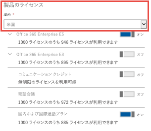
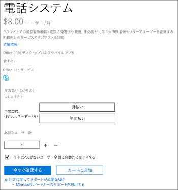
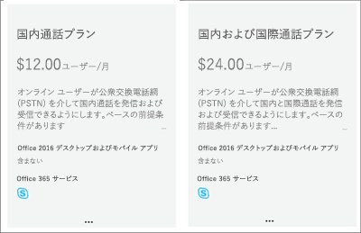

# 通話プランのMicrosoft 365Calling Plans for Microsoft 365

その他の Skype for Business ユーザーと Microsoft Teams ユーザーへの通話は無料ですが、ユーザーが通常の通話をできるようにする必要があり、音声通話を行うためのサービス プロバイダーがまだ設定されていない場合は、通話プランを購入する必要があります。Calls to other Skype for Business and Microsoft Teams users are free, but if you want your users to be able to call regular phones, and you don't already have a service provider to make voice calls, you need to buy a Calling Plan. 詳細については、[電話システムと通話プラン](calling-plan-landing-page.md)に関する記事をご覧ください。For more information, see [Phone System and Calling Plans](calling-plan-landing-page.md).
  
通話プランのオプションを紹介します。Here are the Calling Plans options:
  
- **国内通話プラン**: ライセンスを取得したユーザーは、国または地域に割り当てられている国/地域にある番号をMicrosoft 365呼び出Office 365。**Domestic Calling Plan**: Licensed users can call out to numbers located in the country/region where they are assigned in Microsoft 365 or Office 365.
    
- **国内** 通話プランと国際通話プラン: ライセンスを取得したユーザーは、Microsoft 365 または Office 365 ライセンスがユーザーの場所に基づいてユーザーに割り当てられている国/地域にある番号と [、196](country-and-region-availability-for-audio-conferencing-and-calling-plans/users-can-make-outbound-calls-to-these-countries-and-regions.md)か国/地域の国際番号にコールアウトできます。**Domestic and International Calling Plan**: Licensed users can call out to numbers located in the country/region where their Microsoft 365 or Office 365 license is assigned to the user based on the user's location, and to international numbers in [196 countries/regions](country-and-region-availability-for-audio-conferencing-and-calling-plans/users-can-make-outbound-calls-to-these-countries-and-regions.md).

同じ通話プランで同じ国/地域のすべてのユーザー (Microsoft 365 管理センターのライセンス領域で定義されているユーザーの国の場所) は、分のプールを共有します。All users in the same country/region (this is the user country location defined in the licensing area of the Microsoft 365 admin center) with the same Calling Plan share a pool of minutes. たとえば、同じ国/地域に 100 人のユーザーがいて、国内通話プランが 120 分割り当てられている場合、そのユーザーは 12,000 分のプールを共有します。For example, if you have 100 users located in the same country/region with a 120 minutes Domestic Calling Plan assigned, they share a pool of 12,000 minutes. この分を超えるすべての呼び出しは、1 分ごとに請求されます。All calls exceeding these minutes are billed per minute.
    
国 [と地域の空き時間](country-and-region-availability-for-audio-conferencing-and-calling-plans/country-and-region-availability-for-audio-conferencing-and-calling-plans.md) 情報にアクセスして、各国/地域の各組織で利用できる月次分を確認します。Visit [Country and region availability](country-and-region-availability-for-audio-conferencing-and-calling-plans/country-and-region-availability-for-audio-conferencing-and-calling-plans.md) to find out about monthly minutes available for each organization in each country/region.
  
> [!IMPORTANT]
> 国/地域は、**[Microsoft 365 管理センター]** の **[組織プロファイル]** にある請求先住所 **ではなく**、**[Microsoft 365 管理センター]** > **[アクティブなユーザー]** にあるユーザーのライセンスの場所に基づいています。The country/region is based on the location of the user's license in the **Microsoft 365 admin center** > **Active users** and **NOT** the billing address listed under the **Organization Profile** in the **Microsoft 365 admin center**.   

  
使用量の制限と利用規約の詳細については、「[電話会議の無料のダイヤルアウト期間](complimentary-dial-out-period.md)」を参照してください。For detailed information about usage limits and terms of use, see [Audio Conferencing complimentary dial-out period](complimentary-dial-out-period.md).
  
## 通話プランを購入する方法How to buy a Calling Plan

1. <strong>最初に\*\*電話システム</strong>ライセンスを購入する必要があります <strong>。これを行うには、Microsoft 365 [管理](https://portal.office.com/adminportal/home?add=sub&amp;adminportal=1#/catalog)</strong>センターにサインインし、[課金購入サービス] アドオン サブスクリプション [今すぐ購入]  >    >    >  **を選択します**。<strong>You must first purchase a \*\*Phone System</strong> add-on license <strong>. To do that, [sign in to the Microsoft 365 admin center](https://portal.office.com/adminportal/home?add=sub&amp;adminportal=1#/catalog) and choose \*\*Billing</strong> > **Purchase services** > **Add-on subscriptions** > **Buy now**.
    
    
  
    > [!NOTE]
    > お使いのプランによっては、通話システムのライセンスを購入するために、さらにアドオンを購入する必要がある場合があります。Depending on your plan, you may need to buy more add-ons before you can buy Phone System licenses. 詳細は、[Microsoft Teamsアドオンライセンス](./teams-add-on-licensing/microsoft-teams-add-on-licensing.md)をご覧ください。To learn more, see [Microsoft Teams add-on licensing](./teams-add-on-licensing/microsoft-teams-add-on-licensing.md).
  
2. 電話システムのライセンスを購入したら、通話プランを購入することができます。そのためには、**Microsoft 365 管理センター** にサインインし、**[請求]** > **[サービスの購入]** > **[アドオン サブスクリプション]** の順に選択して、**[今すぐ購入]** をクリックします。After you buy Phone System licenses, you can buy the Calling Plan by signing in to the **Microsoft 365 admin center**, choose **Billing** > **Purchase services** > **Add-on subscriptions**, and then clicking **Buy now**. そこに通話プランが表示されます。You'll see the Calling Plans there.
    
    
  
組織のニーズに応じて、ユーザーごとに異なる通話プランを購入し、割り当てることができます。You can buy and assign different Calling Plans to different users, depending on the needs of your organization. 必要な通話プランを選択したら、チェックアウトに進みます。After you select the Calling Plan you need, proceed to checkout. Microsoft 365 管理センターの各ユーザーにプランを割り当てます。You assign a plan to each user in the Microsoft 365 admin center. 方法については、「アドオン ライセンスを割[り当Microsoft Teams」を参照してください](./teams-add-on-licensing/microsoft-teams-add-on-licensing.md)。To learn how, see [Assign Microsoft Teams add-on licenses](./teams-add-on-licensing/microsoft-teams-add-on-licensing.md).
  
## ハイブリッド ユーザーに対してオンプレミスの PSTN 接続を提供するサービス プロバイダーをお持ちですか?Do you have a service provider that provides on-premises PSTN connectivity for hybrid users?

その場合、通話プランを購入する必要はありません。If so, you don't need to buy a Calling Plan. Office 365 Enterprise E5 には **通話システム** のアドオンが含まれているため、チェックアウトに進んでください。Office 365 Enterprise E5 includes the **Phone System** add-on, so you can proceed to checkout.
  
次に、Microsoft 365 管理センターのユーザーに Enterprise E5 または **電話システム** のアドオン ライセンスを割り当てます。Then, assign the Enterprise E5 or **Phone System** add-on licenses to users in the Microsoft 365 admin center. 方法については、「アドオン ライセンスを割[り当Microsoft Teams」を参照してください](./teams-add-on-licensing/microsoft-teams-add-on-licensing.md)。To learn how, see [Assign Microsoft Teams add-on licenses](./teams-add-on-licensing/microsoft-teams-add-on-licensing.md).
  
## 価格情報Pricing information

- [通話プランと通話プランの電話システムPricing for Calling Plans and Phone System](https://www.microsoft.com/microsoft-365/microsoft-teams/voice-calling)
    
- [電話会議の価格Pricing for Audio Conferencing](https://www.microsoft.com/microsoft-365/microsoft-teams/online-meetings)
    
## 関連情報For more information

通話プランを設定する方法に関するその他の記事については、以下をご覧ください。Here are more articles that explain how to set up your Calling Plans:
  
- [通話プランの設定Set up Calling Plans](set-up-calling-plans.md)
    
- [Microsoft Teams アドオン ライセンスMicrosoft Teams add-on licensing](./teams-add-on-licensing/microsoft-teams-add-on-licensing.md)
    
- [次に示すのは、電話システム または Microsoft 365 のOffice 365Here's what you get with Phone System in Microsoft 365 or Office 365](./here-s-what-you-get-with-phone-system.md)
    
   
## 関連トピックRelated topics

- [Skype for Business Online をセットアップするSet up Skype for Business Online](/SkypeForBusiness/set-up-skype-for-business-online/set-up-skype-for-business-online)
    
- [クラウド ボイスメールの設定 - Admin ヘルプSet up Cloud Voicemail - Admin help](set-up-phone-system-voicemail.md)
    
- [通話プランの設定Set up Calling Plans](set-up-calling-plans.md)
    
- [資金を追加してコミュニケーション クレジットを管理するAdd funds and manage Communications Credits](add-funds-and-manage-communications-credits.md)
