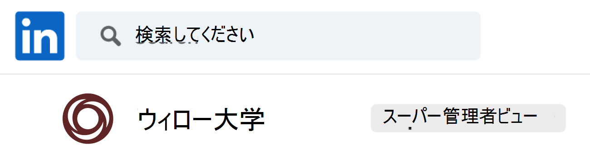
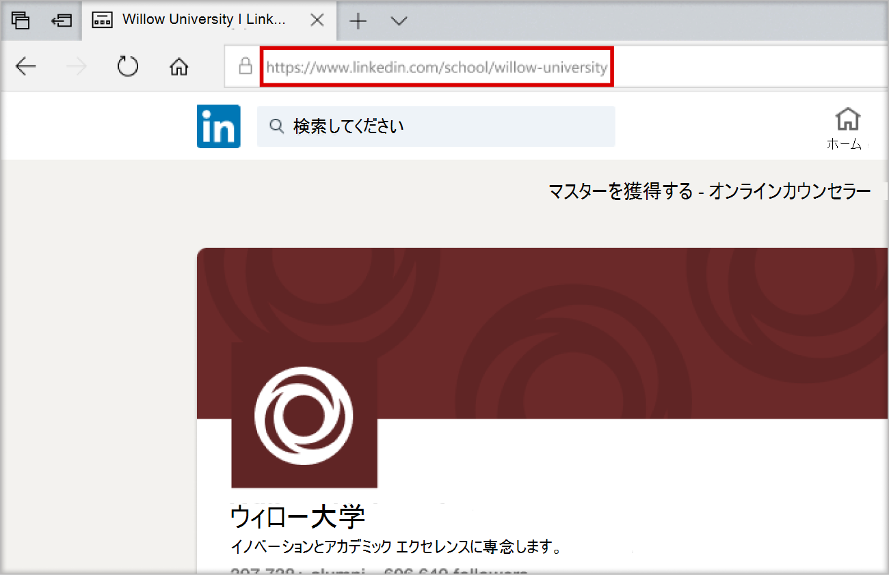

# Microsoft Teams のキャリア コーチを設定して構成する

この記事は、it 管理者がMicrosoft Teams のキャリア コーチを設定する方法を学習するための記事です。

キャリア コーチを設定、構成、リリースするための主な手順は次のとおりです。

1. [手順 1: キャリア コーチ用にテナントを準備する](#step-1-prepare-your-microsoft-365-tenant-for-career-coach)。
1. [手順 2: キャリア コーチ ライセンスを購入する](#step-2-purchase-career-coach-licenses)。
1. [手順 3: キャリア コーチの設定にアクセスする](#step-3-access-the-career-coach-app-settings)。
1. [手順 4: キャリア コーチの設定を構成する](#step-4-configure-career-coach-settings)。
1. [手順 5: キャリア コーチを教育機関で利用できるようにします](#step-5-make-career-coach-available-to-your-institution)。

## ロールとアクセス許可を特定する

キャリア コーチを設定するには、いくつかの種類の管理者ロールが必要です。 これらのロールとアクセス許可は、1 人の個人に割り当てられる場合や、教育機関の IT プロフェッショナルとのコラボレーションが必要な場合があります。 参照されるタスクを完了するために必要な個人を特定するには、以下のチェックリストを使用します。

アカウントの割り当てられたロールを確認するには、[[ユーザー] Microsoft 365 管理センター > > [アクティブ なユーザー] >](https://go.microsoft.com/fwlink/p/?linkid=834822) [ユーザー名の選択] にアクセスして、ロールを確認します。

[Microsoft 365 管理センターの管理者ロールの](/microsoft-365/admin/add-users/about-admin-roles)詳細については、こちらをご覧ください。

### [タスクのMicrosoft 365 管理センター](https://go.microsoft.com/fwlink/p/?linkid=2024339)

ロール: [グローバル管理者](/azure/active-directory/roles/permissions-reference#global-administrator)

キャリア コーチのタスク:

- [ライセンスを購入します](#step-2-purchase-career-coach-licenses)。
- [ライセンスを割り当てます](#assign-career-coach-licenses-to-users)。

### [Azure Active Directory 管理センターのタスク](https://go.microsoft.com/fwlink/p/?linkid=2067268)

ロール: [グローバル管理者](/azure/active-directory/roles/permissions-reference#global-administrator)

キャリア コーチ タスク:

- [LinkedIn アカウント接続を有効にします](#turn-on-linkedin-account-connections)。

### [Teams 管理センターのタスク](https://admin.teams.microsoft.com/dashboard)

ロール: [Teams 管理者](/azure/active-directory/roles/permissions-reference#teams-administrator)

キャリア コーチのタスク:

- [インストールされているアプリとしてキャリア コーチを追加します](#add-career-coach-as-an-installed-app)。
- [キャリア コーチ アプリの設定を構成します](#step-4-configure-career-coach-settings)。
- [ポリシーを設定します](#identify-roles-and-permissions)。
- [アプリをピン留めします](#identify-roles-and-permissions)。

### LinkedIn 開発者ポータル のタスク

ロール: [LinkedIn School Page Super 管理](https://www.linkedin.com/help/linkedin/answer/a541981)

キャリア コーチ タスク:

- [LinkedIn School ページを確認します](#verify-the-linkedin-school-page)。

## キャリアコーチの準備

キャリア コーチを設定して構成する前に、次の準備手順に従ってください。

1. [手順 1: キャリア コーチ用にテナントを準備する](#step-1-prepare-your-microsoft-365-tenant-for-career-coach)。
1. [手順 2: キャリア コーチ ライセンスを購入する](#step-2-purchase-career-coach-licenses)。

### 手順 1: キャリア コーチのMicrosoft 365 テナントを準備する

#### LinkedIn アカウント接続を有効にする

キャリア コーチでは、LinkedIn アカウント接続を使用する方法は 2 つあります。

- 学生、教職員が自分の Microsoft 365 アカウントを LinkedIn アカウントに接続し、[キャリア コーチから LinkedIn 招待を送信](https://support.microsoft.com/topic/career-coach-quick-start-guide-for-students-c419db47-9290-4961-9684-c3f86a9b3708#bkmk_connect_your_linkedin_account)できるようにします。
- LinkedIn のパブリック卒業生データを使用して [、ネットワークを構築](https://support.microsoft.com/topic/career-coach-quick-start-guide-for-students-c419db47-9290-4961-9684-c3f86a9b3708#bkmk_build_your_network) し [、キャリアを探索](https://support.microsoft.com/topic/career-coach-quick-start-guide-for-students-c419db47-9290-4961-9684-c3f86a9b3708#bkmk_discover_your_career_path) する機能を有効にするには。

LinkedIn アカウント接続を有効にするには:

1. [Azure AD](https://go.microsoft.com/fwlink/p/?linkid=2067268) 組織の[グローバル管理者アカウント](#identify-roles-and-permissions)で Azure AD 管理センターにサインインします。

2. [ **ユーザー] を選択します**。

3. [ **ユーザー** ] ページで、[ **ユーザー設定**] を選択します。

4. キャリア コーチを適切に構成するには、**LinkedIn アカウント接続** を **[はい****] または [選択したグループ]** に設定する必要があります。

   - 教育機関のすべてのユーザーに対してサービスを有効にするには、[ **はい** ] を選択します。
   - 教育機関で **選択した** ユーザーのグループに対してのみサービスを有効にするには、[選択したグループ] を選択します。

詳細については、「 [Azure Active Directory での LinkedIn アカウント接続](/azure/active-directory/enterprise-users/linkedin-integration)」を参照してください。

> [!NOTE]
> ユーザーの同意なしにデータは共有されません。

#### Teams でMicrosoftアプリを許可する

キャリア コーチはMicrosoftアプリケーションであるため、Teams アプリのアクセス許可ポリシー内で許可する必要があります。

1. **[Teams 管理センター](https://go.microsoft.com/fwlink/p/?linkid=2066851)** にサインインします。

2. 左側のナビゲーションで、[ **Teams アプリ** > **[のアクセス許可ポリシー](https://admin.teams.microsoft.com/policies/manage-apps)**] を選択します。

3. お好みのポリシーを選択します。
    1. 使用するポリシーがわからない場合は、 [Teams ポリシー管理ドキュメント](policy-packages-edu.md) Microsoft参照するか、 [教育ポリシー ウィザード](easy-policy-setup-edu.md) を使用して、Microsoft Teams のポリシーを構成します。

[アクセス許可ポリシーの構成](teams-app-permission-policies.md)の詳細については、こちらをご覧ください。

#### インストールされているアプリとしてキャリア コーチを追加する

この手順により、キャリア コーチが教育機関用に適切に構成され、学生はキャリア コーチを見つけることができます。

1.  [Teams 管理センター](https://go.microsoft.com/fwlink/p/?linkid=2066851)にサインインします。

2.  **[Teams アプリ** > **] [セットアップ ポリシー] の順に** 選択し、目的のポリシーを選択します。
    1. 使用するポリシーがわからない場合は、 [Teams ポリシー管理ドキュメント](policy-packages-edu.md) Microsoft参照するか、 [教育ポリシー ウィザード](easy-policy-setup-edu.md) を使用して、Microsoft Teams のポリシーを構成します。

3. [ **インストールされているアプリ] で**、[ **+ アプリの追加]** を選択します。

4. [ **インストール済みアプリの追加]** ウィンドウで、ユーザーが Teams を起動するときに自動的にインストールするアプリを検索します。 アプリのアクセス許可ポリシーでアプリをフィルター処理することもできます。

5. アプリの一覧を選択したら、[ **追加**] を選択します。

6. [ **確認の保存] を****選択します** > 。

ポリシーの編集または割り当てには、変更が有効になるまで数時間かかることがあります。 変更が完了するまで、Microsoft Teams ではキャリア コーチを使用できません。

### 手順 2: キャリア コーチ ライセンスを購入する

#### ライセンスの種類

キャリア コーチには、アプリケーションにアクセスするためのライセンスが必要です。

使用可能なライセンスの種類は 2 つあります。

- **学生ライセンス** は学生向けに設計されています。
- **教職員ライセンス** は、キャリアコーチによる学生支援に関わる教職員、ITプロフェッショナル向けに設計されています。
  - キャリア コーチ **の教職員ライセンス** は、構成を完了する IT 管理者に割り当てる必要があります。

#### ライセンスの購入

キャリア コーチは、教育機関向けのアドオン ライセンスとして認定教育機関 (EES)、クラウド サービス プロバイダー (CSP)、Microsoft 365 管理センター (Web ダイレクト) を通じて、認定教育機関向けに世界中 (中国とロシアを除く) で利用できます。

Microsoft Teams アプリとして、アドオン キャリア コーチ ライセンスを購入するには、テナントに Microsoft 365 A3/A5 または Office 365 A1/A3/A5 が必要です。 学生と教職員のユーザーには、個別のライセンスが提供されます。

#### 無料試用版にサインアップする

標準の 90 日間の無料試用版は、25 人の学生と 25 の教員ライセンスで利用できます。 対象テナントごとに 1 つの試用版を利用できます。 試用版ライセンスは、キャリア コーチ ライセンスを購入する資格があるテナントによってMicrosoft 365 管理センターからアクティブ化できます。

試用版のアクティブ化については、[Microsoft 365 管理センター >課金>購入サービスにサインイン>キャリア コーチを検索](https://go.microsoft.com/fwlink/p/?linkid=868433)して[、学生ライセンス試用版](https://signup.microsoft.com/signup?OfferId=b3a40ff2-3d0d-481e-a0ed-f4de1069f201)と[教職員ライセンス試用版](https://signup.microsoft.com/signup?OfferId=6f6e7db5-b9ab-4baa-86be-f13d0ae6a2c8)を見つけます。

## キャリア コーチの設定を設定して構成する

教育機関のキャリア コーチ設定を設定して構成するには、次の手順に従います。

1. [手順 3: キャリア コーチ アプリの設定にアクセスします](#step-3-access-the-career-coach-app-settings)。
1. [手順 4: キャリア コーチの設定を構成する](#step-4-configure-career-coach-settings)。

### 手順 3: キャリア コーチ アプリの設定にアクセスする

キャリア コーチの設定を構成し、ユーザーに許可するには、ページにアクセスするには、グローバル管理者または Teams サービス管理者である必要があります。

1.  [Teams 管理センター](https://go.microsoft.com/fwlink/p/?linkid=2066851)にサインインします。
2. 左側のナビゲーションで、[ **Teams アプリ] [アプリ** >の管理] の **順に選択します**。
3.  **キャリア コーチ** を検索または参照します。
4. [ **キャリア コーチ**] を選択し、[ **設定] を選択します**。

![[設定] タブが選択された [キャリア コーチ] アプリを示すスクリーンショット。](media/career-coach-app-updated.png)

### 手順 4: キャリア コーチの設定を構成する

次のキャリア コーチ設定は、学生、教職員向けに構成できます。

- [LinkedIn 接続](#linkedin-connection-required) (必須)
- [ブランドと好み](#brand-and-preferences-optional) (省略可能)
- [コース カタログ](#course-catalog-optional) (省略可能)
- [研究分野](#fields-of-study-optional) (省略可能)
- [カスタマイズ オプション](#customization-options-optional) (省略可能)

#### LinkedIn 接続 (必須)

LinkedIn 接続設定は、キャリア コーチと教育機関の LinkedIn School Page のパブリック卒業生データを接続します。

この手順は、 [Azure Active Directory で LinkedIn アカウント接続が有効になっている](#turn-on-linkedin-account-connections)場合にのみ完了できます。 LinkedIn 接続設定は、[ネットワークの [構築](https://support.microsoft.com/topic/career-coach-quick-start-guide-for-students-c419db47-9290-4961-9684-c3f86a9b3708#bkmk_build_your_network) ] 機能と [ [キャリアの探索](https://support.microsoft.com/topic/career-coach-quick-start-guide-for-students-c419db47-9290-4961-9684-c3f86a9b3708#bkmk_discover_your_career_path) ] 機能をオンにします。

> [!IMPORTANT]
> これは必須のセクションです。 LinkedIn School Page の接続が確認されていないと、キャリア コーチをオンにすることはできません。
>
> LinkedIn 接続では、複数のテナントがサポートされています。

##### LinkedIn School ページ URL を追加する

LinkedIn School ページ URL を追加するプロセスは、Teams 管理者によって処理されます。 URL を確認する後続の手順は、教育機関の LinkedIn School Page Super 管理者によって完了します。

1. **[Teams 管理センター](https://go.microsoft.com/fwlink/p/?linkid=2066851)** にサインインします。

2. [ **Teams アプリ** > **] [アプリの管理]** > **[キャリア コーチ** > **の設定]** > **LinkedIn 接続を選択します**。

3. [ **LinkedIn に接続] を選択します**。

4. LinkedIn で検索し、[学校] フィルターを選択して、教育機関の LinkedIn **学校** ページを見つけます。 または、教育機関のマーケティング スタッフ メンバーと接続して、使用する正しい LinkedIn School Page を決定します。 詳細については、「 [LinkedIn ページを識別する方法](https://www.linkedin.com/help/linkedin/answer/40133/differences-between-a-linkedin-page-for-a-school-and-company?lang=en)」を参照してください。

    

5. **LinkedIn School ページ URL を追加します**。 URL は *、会社**のページではなく学校ページ* である必要があり、通常は として`https://www.linkedin.com/school/willow-university/`書式設定されます。

   

6. **[送信]** を選択します。

7. **LinkedIn School Page URL** が正常に送信されると、設定ページが更新され、[ **確認] リンクと [確認] リンク** の  **有効期限** が表示されます。 検証リンクの有効期限は 30 日後です。

8. **[確認] リンク** をコピーし、教育機関の LinkedIn School Page Super 管理者と共有します。

9. LinkedIn School Page Super 管理者は、一意の検証リンクを使用して [LinkedIn School Page を確認](#verify-the-linkedin-school-page) し、キャリア コーチに関連付けます。

10. 検証と設定が正常に送信されたことを確認するには、 [キャリア コーチの構成状態](#configuration-status) が **[完了**] とマークされていることを確認します。

##### LinkedIn School ページを確認する

LinkedIn School Page の検証は、教育機関の [LinkedIn School Page Super 管理者](https://www.linkedin.com/help/linkedin/answer/a541981)が完了する必要があります。

LinkedIn アカウントの管理者ロールを確認するには、LinkedIn にサインインし、教育機関の LinkedIn School Page にアクセスします。 アカウントにスーパー管理者ロールが割り当てられている場合は、LinkedIn ページの教育機関の名前の横に **スーパー管理者ビュー** が表示されます。 **[スーパー管理者ビュー**] タグが表示されない場合は、学校のページのスーパー管理者ではありません。

1. Teams 管理者が **LinkedIn School Page URL を** 送信すると、ページに **[確認] リンクと [確認] リンク** の **有効期限** が表示されます。 検証リンクの有効期限は 30 日後です。

     

2. 確認リンクをコピーし、LinkedIn School Page Super 管理者と共有します。

3. LinkedIn ページのスーパー管理者が確認リンクを開き、キャリア コーチを学校のページに関連付けます。 詳細については、「 [LinkedIn ページの検証に関するその他のドキュメント](https://www.linkedin.com/help/linkedin/answer/102672)」を参照してください。

4. 検証が完了すると、Teams 管理者は、 [キャリア コーチの構成状態](#configuration-status) が **[完了**] とマークされているかどうかを確認することで、設定が正常に送信されたかどうかを確認できます。

   

#### ブランドと好み (省略可能)

教育機関のブランドに合わせてキャリア コーチをカスタマイズします。 お客様は、著作権や商標権を含む他者の権利を尊重する責任を負います。

1. **[Teams 管理センター](https://go.microsoft.com/fwlink/p/?linkid=2066851)** にサインインします。

2. **[Teams アプリ** > **] [アプリの管理]** > **[キャリア コーチ** > **の設定]****[ブランドと設定の編集]** >  の順に選択します。

3. [ **ブランド化] で**、[ **組織名] を追加します**。

4. **[組織] アイコン** をアップロードします。 このアイコンは、キャリア コーチ全体で、教育機関固有のコンテンツ、アプリ全体のコース カタログ リソース、ダッシュボードの実際のエクスペリエンス セクションで識別するために使用されます。

    アイコンの形式は次のとおりです。

    - 透過 PNG
    - 縦横比 1:1
    - 最大サイズは 64 px x 64 px

5. **Learning コンテンツサムネイル画像** をアップロードします。 サムネイルは、教育機関が提供するコースに特定の画像が指定されていない場合、アプリ全体のコース カタログ学習リソースに使用されます。

    サムネイルは、次のように書式設定するのが最適です。

    - A PNG
    - 縦横比 16:9
    - 最大サイズは 360 px x 200 px

6. この手順は省略可能です。 組織の **プライバシー ポリシー URL を追加します**。 追加された場合、学生はキャリアコーチでレビューするために機関のプライバシーポリシーを利用できます。

7. **[送信]** を選択します。

8. 設定が正常に送信されたことを確認するには、[完了] の [[キャリア コーチの構成状態](#configuration-status) ] を確認 **します**。

![管理センターの [キャリア コーチのブランド化] セクションを示すスクリーンショット。](media/career-coach-brand-updated.png)

#### コース カタログ (省略可能)

コース カタログには、教育機関が提供するコースとクラスが記録されます。

キャリア コーチは、コース カタログ データを使用して、成績証明書から学生のスキルを特定し、受講するコースを提案します。

これらのコースは、次の 2 つの分野でキャリア コーチ内で使用されます。

- コースは [学習リソース](https://support.microsoft.com/topic/career-coach-quick-start-guide-for-students-c419db47-9290-4961-9684-c3f86a9b3708#bkmk_grow_real_world_skills)の一部として返されます。  

- コースタイトルや説明などのコースとコースメタデータは、 [生徒がトランスクリプトをアップロード](https://support.microsoft.com/topic/career-coach-quick-start-guide-for-students-c419db47-9290-4961-9684-c3f86a9b3708#bkmk_Set_up_your_profile)するときにスキルを識別するのに役立ちます。

コース カタログを作成するには、教育機関で教えられているすべてのコースの一覧をまとめ、 [コース カタログのドキュメント形式とスキーマ](#course-catalog-document-format-and-schema)を使用して CSV ファイルとしてアップロードします。

適切な書式を確保するために、 [サンプル コース カタログ](https://aka.ms/career-coach/docs/it-admins/sample-catalog) ドキュメントから開始します。また、必須フィールドと推奨フィールドの詳細については、 [コース カタログのドキュメント形式とスキーマ](#course-catalog-document-format-and-schema) セクションを参照することもできます。

##### コース カタログを追加する

1. **[Teams 管理センター](https://go.microsoft.com/fwlink/p/?linkid=2066851)** にサインインします。

2. [**Teams アプリ** > **] [アプリの管理**] > [**Search Career Coach** > **の設定]****コース カタログ** を選択 > します。

3. [ **コース カタログのアップロード]** >必要な列 (courseId、title、sourceLink) を使用して、CSV 形式でコースをアップロードするを選択します。
    1. 各行には、必要な列ごとにデータを含める必要があります。
    1. *推奨フィールドを含めると、検索結果とスキルの識別が向上し、学生のエクスペリエンスが向上します。*

4. アップロードしたコース カタログのセクションのプレビューが参照用に表示されます。

5. 準備ができたら **[送信] を選択します** 。

6. [アップロードされたドキュメントの状態](#course-catalog-status)が設定ページに表示されます。

7. 設定が正常に送信されたことを確認するには、 [キャリア コーチの構成状態](#configuration-status) が **[完了**] とマークされていることを確認します。

新しいファイルをアップロードするには、[(**X**)] を選択してドキュメント プレビューを閉じて、最後のファイルがクリアされていることを確認します。 このアクションにより、[ **アップロード** ] ボタンが再び表示されます。

##### コース カタログドキュメントの形式とスキーマ

ドキュメントは、最大サイズが 18 MB の CSV 形式である必要があります。 処理を成功させるには、最大 15,000 行を含む複数の小さなファイルに大きなファイルを分割する必要があります。

ドキュメントには、必要なコース メタデータ ( **コース タイトル**、 **コース ID**、 **コース URL**) が含まれている必要があります。

適切な書式を確保するために、 [サンプル コース カタログ]( https://aka.ms/career-coach/docs/it-admins/sample-catalog) ドキュメントから開始します。 *推奨フィールドを含めると、検索結果とスキルの識別が向上し、学生のエクスペリエンスが向上します。*

次の表は、コース カタログに含める項目を示しています。

| 名前             | ステータス      | 種類   | 説明                                                                    |
|------------------|-------------|--------|--------------------------------------------------------------------------------|
| courseId         | 必須    | 文字列 | courseId は、学生のトランスクリプトで生成されたものにマップされます。             |
| タイトル            | 必須    | 文字列 | コースタイトル。                                                              |
| sourceLink       | 必須    | Url    | コースとシラバスの詳細については、コース ページへの Web サイトリンクを参照してください。   |
| 説明      | 推奨 | 文字列 | 学習目標を説明するコースの概要テキスト。       |
| 言語         | 推奨 | 文字列 | コースの言語。 標準言語コードを使用します。                           |
| 形式           | 推奨 | 文字列 | 教育のモード (オンライン、ビデオ、個人)。                                   |
| thumbnailLink    | 推奨 | Url    | コース画像へのサムネイル リンク。                                            |
| thumbnailAltText | 推奨 | 文字列 | 画像のアクセシビリティ代替テキスト                                           |
| educationLevel   | 推奨 | 文字列 | 学習レベル、例: 学部・卒業。                                       |
| トピック           | 推奨 | 文字列 | コースが教えるスキルに関連付けられているトピックまたはタグ。          |

##### コース カタログの状態

ドキュメントがアップロードされると、コース カタログの状態が [コース カタログの設定] ページに表示され、ドキュメントのアップロードと処理の状態の詳細が表示されます。

処理中、キャリア コーチはドキュメントの重複を分析し、タイトルや説明からスキルを抽出してカタログを正規化および強化し、それを Learn ページで使用するために保存し、スキル識別のための学生のトランスクリプトのアップロード中に保存します。

| 列           | 値     | 説明                                                                                        |
| ---------------- | --------- | -------------------------------------------------------------------------------------------------- |
| アップロードされた時間    | タイムスタンプ | IT 管理者がドキュメントをアップロードした日時。                                                     |
| 完了した時間   | タイムスタンプ | ドキュメントが完全に処理された日付と時刻。                                               |
| アップロードされたコース | 整数型   | ドキュメントで見つかったコースの数。                                                           |
| インジェストの状態 | Pending   | 処理中のキュー内のドキュメント。                                                                  |
| インジェストの状態 | 実行   | ドキュメントは現在処理されています。 このプロセスは、ドキュメントのサイズに応じて最大 6 時間かかることがあります。 |
| インジェストの状態 | 成功   | インジェスト プロセスが完了し、必要なすべての設定が構成されると、キャリア コーチでコースを利用できるようになります。 |
| インジェストの状態 | 失敗 しました    | ドキュメントの形式を確認し、再アップロードします。                                                           |
| 重複       | 整数型   | ドキュメント内で見つかった重複するコースの数。                                                 |

コース カタログの状態の列が空白の場合、ドキュメントは現在処理中であり、これらの値は使用できません。 このプロセスは、カタログのサイズに応じて最大 6 時間かかることがあります。 ドキュメントが処理されると、値が設定されます。 ページを更新して、更新プログラムを確認できます。

#### 研究分野 (省略可能)

研究分野は、主要な関心領域、学術専攻、学位プログラムと同義です。 これらの研究分野は、キャリアコーチの使用を開始し、パーソナライズされたプロファイルの設定を開始するときに学生によって参照されます。

フィールドのリストを使用すると、学生は興味を持つ可能性のある研究分野を発見し、キャリアコーチのプロフィールに計画的な学術的焦点を追加することができます。

> [!IMPORTANT]
> キャリア コーチの研究分野を構成する場合は、エンジニアリング、英語、ビジネスなど、学生が利用できるすべての研究分野を追加します。

##### 学習フィールドを追加する

1. **[Teams 管理センター](https://go.microsoft.com/fwlink/p/?linkid=2066851)** にサインインします。

2. [**Teams アプリ** > **] [アプリの管理**] > [Search Career Coach **Settings]\(****キャリア コーチ** > の設定 >  **\) [フィールドの調査] を選択します**。

3. [ **アップロード]** を選択して、学習ファイルのフィールドを CSV 形式でアップロードします。 スタディ ドキュメントのフィールドのプレビューが表示されます。

4. **[送信]** を選択します。

5. 設定が正常に送信されたことを確認するには、 [キャリア コーチの構成状態](#configuration-status) が **[完了**] とマークされていることを確認します。

##### 学習文書の形式とスキーマのフィールド

ドキュメントは、最大サイズが 18 MB の CSV 形式である必要があります。 ドキュメントには必要なメタデータが含まれている必要があります。 **フィールドオブスタディ名**。

次の表は、研究分野に含める項目を示しています。

| 名前          | ステータス   | 種類   | 説明                    |
|---------------|----------|--------|--------------------------------|
| fieldsOfStudy | 必須 | 文字列 | 研究分野の名前 |

#### カスタマイズ オプション (省略可能)

カスタマイズ設定では、教育機関が学生に提供するダッシュボードに実際のエクスペリエンスを得る機会を追加できます。

含めるための推奨リンクは、学生が就職委員会、イベント、キャリアサービスオフィス、キャリア関連のイベント、学生クラブなどの実際の経験を得るのに役立つはずです。

1. **[Teams 管理センター](https://go.microsoft.com/fwlink/p/?linkid=2066851)** にサインインします。

2. [**Teams アプリ** > ] [アプリ **の管理**] > [**Search Career Coach** > **の設定] を選択します**。

3. [**エクスペリエンス** > のカスタマイズ **+ 追加] を選択** します

4. [**適用**] を選択>、各 **タイトル**、**URL**、**およびヒントの説明** を追加します。

5. 追加された情報のプレビューが表示されます。

6. **[送信]** を選択します。

### キャリア コーチの設定の状態

Teams 管理センターの [キャリア コーチの設定] ページには、キャリア コーチを構成するための不完全、保留中、完了、失敗した手順の状態の概要が表示されます。

ステータス メッセージは、キャリア コーチが適切に構成され、テナントにリリースする準備ができているかどうかを判断するのに役立ちます。

#### 構成の状態

アプリ設定ページの [構成状態] セクションには、次の凡例を使用してリアルタイムの状態が表示されます。

| [カテゴリ]                    | ステータス                                        | 説明                                                 |
| --------------------------- | --------------------------------------------- | ----------------------------------------------------------- |
| サービス プロビジョニングの状態 | キャリア コーチがテナントを初期化しています。     | サービス プロビジョニングは、キャリア コーチの設定ページにアクセスすると自動的に行われます。 構成の変更は、初期設定が完了するまで受け入れられません。 サービス プロビジョニングの推定時間は最大 15 分です。 |
| サービス プロビジョニングの状態 | キャリア コーチを構成する準備ができました。       | キャリア コーチの設定ページでは、IT 管理者が設定を送信する準備が整いました。 |
| ブランドと好み       | [未開始]                                   | 送信されていない設定。 これは省略可能な手順であり、構成の完了を妨げません。 |
| ブランドと好み       | 見つからない: 学習アイコン                        | 学習コンテンツのサムネイル画像をアップロードします。 |
| ブランドと好み       | 見つからない: ロゴ                                 | 教育機関アイコンをアップロードします。 |
| ブランドと好み       | 見つからない: 機関名                     | 教育機関名をアップロードします。 |
| ブランドと好み       | 完了                                      | 設定が完了しました。 |
| コース カタログのアップロード       | [未開始]                                   | コース カタログは送信されません。 これは省略可能な手順であり、構成の完了を妨げません。 |
| コース カタログのアップロード       | 見つからない: コース カタログのアップロードに成功しました   | コース カタログの処理の詳細については、コース カタログの状態を確認してください。 |
| コース カタログのアップロード       | 完了                                      | 設定が完了しました。 |
| LinkedIn school connection  | [未開始]                                   | LinkedIn School Page URL が送信されていません。 |
| LinkedIn school connection  | 見つからない: 承認済みの LinkedIn School ページ URL | LinkedIn School Page Super 管理者検証の承認を待機しています。 |
| LinkedIn school connection  | 完了                                      | それ以上のアクションは必要ありません。 設定が完了しました。 |
| 研究分野のアップロード      | [未開始]                                   | 研究フィールド CSV は送信されません。 これは省略可能な手順であり、構成の完了を妨げません。 |
| 研究分野のアップロード      | 見つからない: 関心のある領域                    | 研究分野のアップロードが成功したかどうかを確認します。 |
| 研究分野のアップロード      | 完了                                      | 設定が完了しました。 |

必要なすべての手順が完了としてマークされると、キャリア コーチをテナントに正常にリリースできます。

## 手順 5: キャリア コーチを教育機関で利用できるようにする

この時点で、キャリア コーチは教育機関用に構成されています。

次に、次の手順に従って、キャリア コーチが Microsoft Teams の教育機関で使用できることを確認します。

### ユーザーにキャリア コーチ ライセンスを割り当てる

詳細な手順については、「 [ユーザーにライセンスを割り当てる](/microsoft-365/admin/manage/assign-licenses-to-users)」を参照してください。

### ポリシーを設定し、アプリをピン留めする

キャリア コーチをピン留めすると、Microsoft Teams ウィンドウの左側のレールに追加され、学生がよりアクセシビリティが高く表示されるようになります。 ユーザーのサブセットにキャリア コーチをピン留めする場合は、そのグループを含めて [セットアップ ポリシー](teams-app-setup-policies.md) を実装する必要があります。

1. **[Teams 管理センター](https://go.microsoft.com/fwlink/p/?linkid=2066851)** にサインインします。

2. **[Teams アプリ** > **] [セットアップ ポリシー] の順に** 選択し、目的のポリシーを選択します。

    使用するポリシーがわからない場合は、[Microsoft Teams ポリシー管理ドキュメント](policy-packages-edu.md)を参照するか、[教育ポリシー ウィザード](easy-policy-setup-edu.md)を使用して、Microsoft Teams のポリシーを構成します。

3. [ **ピン留めされたアプリ**] で、[ **アプリの追加]** を選択します。

4. [ **このアプリのアクセス許可ポリシーに基づいて検索**] で、お好みのポリシーを選択します。

5. [**名前で検索**] で **キャリア コーチ** を検索し、[ **追加** > ] を選択してウィンドウを閉じます。

6. アプリの表示順序を選択し、[確認] を選択 **します**。

学生は、Microsoft Teams でキャリア コーチがピン留めされたことが通知されます。
