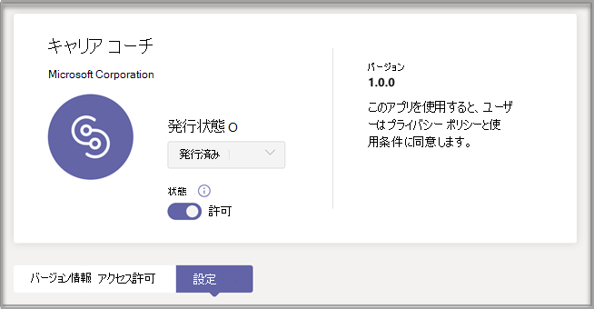
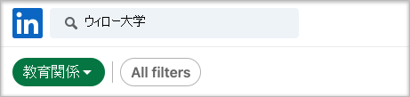
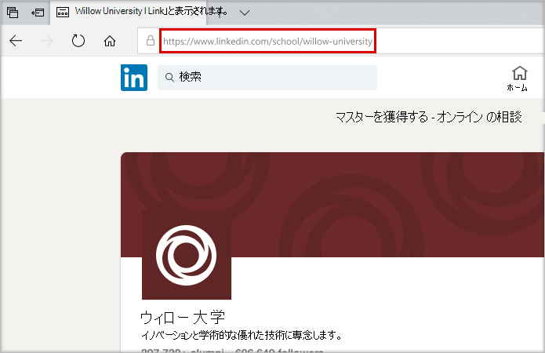

# アプリの購入、構成、キャリア コーチ有効Microsoft Teams

キャリア コーチは、Microsoft Teams for Educationの学生がキャリア体験をナビゲートするパーソナライズされたガイダンスを提供する LinkedIn を搭載したアプリです。 キャリア コーチは、学生がキャリア パスを発見し、現実世界のスキルを高め、ネットワークを 1 か所で構築するための統一されたキャリア ソリューションを教育機関に提供します。

## サポートされている言語

キャリア コーチは、次の言語でローカライズされます。

- 中国語 (簡体字、中国大陸)
- 中国語 (繁体字、台湾)
- 英語 (米国)
- 英語 (U.K.)
- フランス語 (カナダ)
- フランス語 (フランス)
- ドイツ語 (ドイツ)
- 日本語 (日本)
- ポルトガル語 (ブラジル)
- スペイン語 (スペイン)
- スペイン語 (メキシコ)

詳細[については、キャリア コーチ。](https://aka.ms/career-coach)

> [!NOTE]
> このガイドのベスト プラクティスと役立つヒントを使用して、学生、教職員キャリア コーチの機能を有効にしてください。 クイック プランニング [ガイドに関する記事を参照](https://support.microsoft.com/office/c5d0b934-bfcf-4fe7-8a85-ba7bbb1b6ad4) してください。

## 要件を確認する

教育機関のキャリア コーチを有効にするには、アプリを起動して実行するために必要な情報を確認します。

**技術要件**

- Office 365を持つテナントAzure Active Directory

- Microsoft Teams

- Azure Active Directory の LinkedIn アカウント接続

**ライセンス**

- Faculty

- 学生

> [!NOTE]
> 構成キャリア コーチ IT 管理者に、教職員のライセンスを割り当てる必要があります。

**教育機関からのデータとファイル**

- コース カタログ データ

- 提供される研究分野

- 教育機関の LinkedIn ページ

- LinkedIn ラーニング のサブスクリプション (推奨)

## ライセンスをキャリア コーチする

キャリア コーチは、教育機関向け登録ソリューション (EES)、クラウド サービス プロバイダー (CSP)、および Microsoft 365 管理センター (Web Direct) を通じてアドオン ライセンスとして、資格のある教育機関 (中国とロシアを除く) で世界中で利用できます。 追加Microsoft Teamsライセンスを購入するには、Microsoft 365 A3/A5 または Office 365 A1/A3/A キャリア コーチ5 が必要です。

### ユーザーにアプリ ライセンスを割り当てる

詳細な手順については、「ユーザーにライセンスを割り当 [てる」を参照してください](/microsoft-365/admin/manage/assign-licenses-to-users)。

### LinkedIn アカウント接続を有効にする

キャリア コーチ、教育機関のユーザーが自分の Microsoft 365 アカウントを、そのアカウント内で容易に使用できる LinkedIn アカウントに接続できる必要キャリア コーチ

1. Azure AD [組織](https://aad.portal.azure.com/) のグローバル管理者であるアカウントを使用して、Azure ADします。

2. [ユーザー] **を選択します**。

3. [ユーザー] **ページで** 、[ユーザー設定] **を選択します**。

4. **[LinkedIn アカウント接続] で**、ユーザーが自分のアカウントを接続して、一部の Microsoft アプリ内の LinkedIn 接続にアクセスできます。 ユーザーが自分のアカウントへの接続に同意するまで、データは共有しません。

   - [ **はい]** を選択して、教育機関のすべてのユーザーに対してサービスを有効にする

   - [ **選択したグループ]** を選択して、教育機関で選択したユーザーのグループに対してのみサービスを有効にする

   - 教育機関 **のすべてのユーザー** からの同意を取り消す場合は、[いいえ] を選択します。

LinkedIn アカウント接続[を統合する方法について説明Azure Active Directory](/azure/active-directory/enterprise-users/linkedin-integration)

## 管理キャリア コーチでTeamsを構成する

管理センターの管理者設定Microsoft Teams、教育機関向キャリア コーチを構成し、ユーザーに対して有効にできます。

**考慮すべき点**

- 以下のセクションは、使用する前に完了する必要キャリア コーチブランドと環境設定、LinkedIn
- コース カタログと研究分野の CSV には、必要な形式と最大サイズが 18 MB です。

- キャリア コーチ アプリで "キャリア コーチ がすぐに使用するために設定されています" と表示されている場合、必要なセクションは完了していありません。

- 必須フィールドを含む設定ページで、フィールドが完了していない場合、ページは送信されません
  - ユーザーに警告メッセージが表示されません。ページは単に送信されません

## アプリの設定キャリア コーチアクセスする

[アプリ[の管理] ページを](/microsoftteams/manage-apps)使用してTeamsのアプリ カタログ内のアプリを表示します。

1. 管理センター **にTeamsします**。

2. 左側のナビゲーションで、[アプリの管理] **Teams を**  >  **選択します**。  

    > [!NOTE]
    > ページにアクセスするには、グローバル管理者Teamsサービス管理者である必要があります。

3. を検索 **または参照** キャリア コーチ。  

4. **[キャリア コーチ]** を選択し、[次へ]**設定。**  

    

### アプリの設定キャリア コーチ構成する

キャリア コーチには、次の 5 つの構成カテゴリがあります。

- [ブランドと基本設定](#brand-and-preferences)

- [LinkedIn 接続](#linkedin-connection)

- [コース カタログ](#course-catalog)

- [研究分野](#fields-of-study)

- [カスタマイズ](#customization)

> [!NOTE]
> 学生、教職員向けアプリを効果的に有効にするには、ブランドと基本設定、LinkedIn 構成、コース カタログ、および研究分野が必要です。 

#### ブランドと基本設定

ブランドと環境設定の設定ページで、教育機関の名前、ロゴ、既定の言語を設定します。

> [!NOTE]
> これは必須のセクションです。キャリア コーチ設定を送信せずに有効にすることはできません。

![管理キャリア コーチの [ブランド] セクション](media/career-coach-brand.png)

##### 教育機関のアイコン

教育機関アイコンは、キャリア コーチ 全体で使用され、教育機関に固有のコンテンツ、アプリ全体のコース カタログ リソース、ダッシュボードの実際のエクスペリエンス セクションを識別します。 アイコンの形式は次の形式が最適です。

- 透過的な PNG
- 縦横比 1:1
- 最大サイズは 64 ピクセル x 64 ピクセルです。

##### 教育機関のサムネイル

教育機関アイコンは、特定の画像がコースで利用できない場合に、アプリ全体のコース カタログ リソースに使用されます。 アイコンの形式は次の形式が最適です。

- A PNG
- 縦横比 16:9
- 最大サイズは 360 ピクセル x 200 ピクセルです。

#### LinkedIn 接続

LinkedIn 構成は、LinkedIn キャリア コーチの一般の同窓生データと接続します。

> [!NOTE]
> これは必須のセクションです。LinkedIn キャリア コーチ接続を確認しない場合、このセクションを有効にすることはできません。

##### LinkedIn ページを追加して確認する

教育機関の LinkedIn ページを決定します。 LinkedIn で検索するか、キャリア サービスのスタッフ メンバーと接続して、使用する正しいページを決定することで、LinkedIn ページを探します。  
  
1. 管理センター **にTeamsします**。

1. [アプリ **Teams LinkedIn 接続**  >  **でアプリ**  >  **キャリア コーチ**  >  **を管理する] を選択します**。

2. LinkedIn で検索し、[学校フィルター] を選択して、[LinkedIn] ページを探します。 または、キャリア サービスのスタッフ メンバーと接続して、使用する適切な LinkedIn 学校ページを決定します。 [LinkedIn ページを識別する方法](https://www.linkedin.com/help/linkedin/answer/40133/differences-between-a-linkedin-page-for-a-school-and-company?lang=en)

    

3. LinkedIn 学校ページの URL を追加します。 URL は、会社のページではなく学校のページである必要があります。通常は として書式設定されます `https://www.linkedin.com/school/willow-university/` 。

   

4. [送信] **を選択します**。

5. 正常に送信されると、ページが更新され、[確認] リンクと [確認]**リンク****の有効期限が表示されます**。 確認リンクは 30 日後に期限切れになります。

     

6. 確認リンクをコピーし、教育機関の LinkedIn ページのスーパー管理者と共有します。LinkedIn ページのスーパー管理者ロールの詳細については [、LinkedIn ページ管理者のドキュメントを参照してください](https://www.linkedin.com/help/linkedin/answer/102672)。

7. LinkedIn ページのスーパー管理者は、一意の確認リンクを使用してキャリア コーチのページに関連付けることができます。 [LinkedIn ページ検証に関する追加のドキュメント](https://www.linkedin.com/help/linkedin/answer/102672)。

> [!NOTE]
> LinkedIn ページのスーパー管理者による確認は、LinkedIn 接続を完了するために必要キャリア コーチ。

   

#### コース カタログ

コース カタログは、教育機関が学生に提供するコースとクラスを表します。

> [!NOTE]
> これは必須のセクションです。キャリア コーチカタログなしでは有効にできません。

これらのコースは、アプリ内で次の 2 つの領域で使用されます。

- コースは学習リソースの一部として返されます。  

- コースとコースのメタデータ (説明など) は、学生がトランスクリプトをアップロードするときにスキルを識別するのに役立ちます。  

コース カタログを作成するには、教育機関で教えられたすべてのコースの一覧をまとめ、CSV ファイルとしてアップロードします。 アプリは、トランスクリプトから学生のスキルを識別し、受講するコースを提案するために、コース カタログから描画します。

##### コース カタログ ドキュメントの書式設定とスキーマ

ドキュメントは、最大サイズが 18 MB の CSV 形式である必要があります。 ドキュメントには、必須フィールドのコース **タイトル**、 **コース ID、** およびコース URL が **含まれている必要があります**。 推奨されるフィールドを含め、より良い検索結果とスキルの識別を返して、学生のエクスペリエンスを向上します。

> [!NOTE]
> 開始するには、 [サンプル コース カタログ]( https://aka.ms/career-coach/docs/it-admins/sample-catalog) ドキュメントから開始します。

次の表は、コース カタログに含める項目を示しています。

| 名前             | 状態      | 型   | 説明                                                                    |
|------------------|-------------|--------|--------------------------------------------------------------------------------|
| courseId         | 必須    | string | 通常、コース ID (通常はトランスクリプトで生成された値にマップされます)。 |
| title            | 必須    | string | 通常、コースのタイトル。                                                      |
| sourceLink       | 必須    | URL    | コース ページへの Web サイト のリンク。                                               |
| description      | 推奨 | string | コースの概要テキスト。                                              |
| 言語         | 推奨 | string | コースの言語。 標準言語コードを使用します。                           |
| format           | 推奨 | string | 学習モード (オンライン、ビデオ、対人)。                              |
| thumbnailLink    | 推奨 | URL    | コースの画像へのサムネイル リンク。                                            |
| thumbnailAltText | 推奨 | string | 画像のアクセシビリティ代替テキスト                                           |
| educationLevel   | 推奨 | string | 研究レベル (例: ) 学士/卒業者。                                       |
| topics           | 推奨 | string | コースが教えるスキルに関連付けられているトピックまたはタグ。          |

##### コース カタログを追加する

1. 管理センター **にTeamsします**。

1. [アプリ **Teams** &gt; **アプリの管理]** &gt;  &gt; **キャリア コーチ設定** &gt; **カタログ] を選択します**。  

2. アップロード、タイトル、sourceLink という必須の列を含む CSV 形式のコースを作成します。 各行には、必要な各列のデータを含める必要があります。

推奨されるフィールドを含め、より良い検索結果とスキルの識別を返して、学生のエクスペリエンスを向上します。

4. [送信] **を選択します**。

   

#### 研究分野

研究分野は、関心のある主な分野、学歴、および程度と同義です。 これらのタイトルは、学生がアプリの使用を開始し、パーソナライズされたプロファイルの設定を開始するときに参照されます。

> [!NOTE]
> これは必須のセクションです。キャリア コーチフィールドの一覧がない場合は有効にできません。

エンジニアリング、英語、ビジネスなど、学生が利用できるすべての研究分野を追加します。 フィールドの一覧を使用すると、学生は興味のある研究分野を発見し、自分のプロファイルにフォーカス領域を追加できます。

> [!NOTE]
> 最初に、 [サンプルの研究分野のドキュメントを参照](https://aka.ms/career-coach/docs/it-admins/sample-fieldsofstudy) してください。

次の表は、研究分野に含める項目を示しています。

| 名前          | 状態   | 型   | 説明                    |
|---------------|----------|--------|--------------------------------|
| fieldsOfStudy | 必須 | string | 研究分野の名前 |

##### 研究分野を追加する

1. 管理センター **にTeamsします**。
1. [Teams **アプリの** &gt; **管理] キャリア コーチ設定** &gt;  &gt;  &gt; **フィールド] を選択します**。  

2. アップロード CSV 形式の研究分野を作成します。

3. [送信] **を選択します**。

#### カスタマイズ

キャリア コーチは、教育機関に固有のカスタマイズが可能です。 カスタマイズでは、ダッシュボードへのエクスペリエンスの追加がサポートされます。 ジョブ ボード、イベント、キャリア サービス オフィス、キャリア関連イベント、学生クラブ、学生が実際のエクスペリエンスを得るために役立つその他のリソースへのリンクを追加する方法をお勧めします。

##### カスタマイズされたエクスペリエンスを追加する

1. 管理センター **にTeamsします**。

1. [アプリ **Teams** &gt; **アプリの管理]** &gt;   >  **キャリア コーチ設定** &gt; **を選択します**。

2. 各 URL、タイトル、および簡単な説明を追加します。  
  
3. [送信] **を選択します**。

## 組織キャリア コーチ使用できる環境を作成する

これで、キャリア コーチ構成が行いました。 次の手順に従って、キャリア コーチ組織が使用Microsoft Teams。

### アプリを有効にする

構成が完了したら、学生とライセンスを取得したユーザーがアプリにアクセスキャリア コーチ。  
  
> [!NOTE]
> グローバルロールまたは管理者ロールTeams必要があります。

1. 管理センター **にTeamsします**。

1. [アプリ **Teamsアプリ** &gt; **の管理] を** &gt; **選択キャリア コーチ。**

2. [状態] トグルを [許可] **に移動します**。  

  > [!NOTE]
  > 許可とは、教育機関のユーザーがアプリを利用できるという意味です。 ブロックとは、アプリを学生が利用できないという意味です。

### インストールキャリア コーチとしてアプリを追加する

> [!NOTE]
> この手順により、1) 学生がキャリア コーチを見つける組織 2) に対して適切に構成キャリア コーチ。

1. 管理センター **にTeamsします**。

2. [アプリ **Teams** &gt; **ポリシーの設定]** &gt; *を選択します*。

3. [インストール済みアプリ] で、[アプリの追加] を選択します。

4. [インストール済みアプリの追加] ウィンドウで、ユーザーがアプリを起動するときに自動的にインストールするアプリTeams。 アプリのアクセス許可ポリシーでアプリをフィルター処理することもできます。 アプリの一覧を選択したら、[追加] を選択します。

### アプリをピン留めする

アプリをキャリア コーチすると、アプリのアクセスがしやすく、学生に表示されます。

1. 管理センター **にTeamsします**。

2. [アプリ **Teams** &gt; **ポリシーの設定]** &gt; *を選択します*。

3. [ピン **留めされたアプリ] で**、[アプリの **追加] を選択します**。

4. を検索 **キャリア コーチ** し、[追加] を **選択します**。

5. アプリを表示する順序を選択し、[保存] を **選択します**。

> [!NOTE]
> 学生には、ピン留めされたMicrosoft Teamsがキャリア コーチ通知されます。

詳細 [については、「Microsoft でアプリセットアップ ポリシーを管理](/microsoftteams/teams-app-setup-policies) する」を参照してください。

## リソース

次のリソースは、アプリの計画キャリア コーチします。

- [Microsoft Teams にようこそ](Teams-overview.md)

- [Teams の展開方法](get-started-with-teams-resources-for-org-wide-rollout.md?tabs=SmallBusiness)

- [Microsoft Teams でのチームとチャネルの概要](teams-channels-overview.md)

- [管理センターでのMicrosoft Teamsの管理](manage-apps.md)

- [オンライン仮想向きキット](https://www.microsoft.com/education/remote-learning/virtual-orientation)

- [チャネルの制限Teams仕様](limits-specifications-teams.md)

- [管理者向けトレーニングのMicrosoft Teams](ITAdmin-readiness.md)

- [Teams のトラブルシューティング](/microsoftteams/troubleshoot/teams-welcome)

- [Microsoft Teams のアプリのアクセス許可ポリシーを管理する](teams-app-permission-policies.md)
