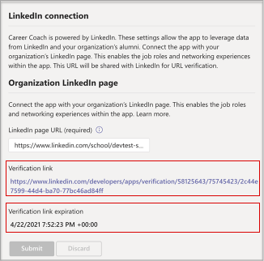

# キャリア コーチを購入、構成、有効化Microsoft Teams

キャリア コーチは、Microsoft Teamsをナビゲートするパーソナライズされたガイダンスを提供する LinkedIn を搭載した教育アプリの一部です。 キャリア コーチは、学生がキャリア パスを発見し、現実世界のスキルを高め、ネットワークを 1 か所で構築するための統一されたキャリア ソリューションを教育機関に提供します。

キャリア コーチの [詳細については、 を参照してください](https://aka.ms/career-coach)。

> [!NOTE]
> このガイドのベスト プラクティスと役立つヒントを使用して、学生、教職員向けキャリア コーチの機能を有効にしてください。 クイック プランニング [ガイドに関する記事を参照](https://support.microsoft.com/office/c5d0b934-bfcf-4fe7-8a85-ba7bbb1b6ad4) してください。

## 要件を確認する

教育機関でキャリア コーチを有効にするには、アプリを起動して実行するために必要なことを確認します。

**技術要件**

  - Office 365を持つテナントAzure Active Directory

  - Microsoft Teams

  - Azure Active Directory の LinkedIn アカウント接続

**ライセンス**

  - Faculty 

  - 学生

> [!NOTE]
> 構成を完了するには、IT 管理者にキャリア コーチ教員ライセンスを割り当てる必要があります。

**教育機関からのデータとファイル**

  - コース カタログ データ

  - 提供される研究分野

  - 教育機関の LinkedIn ページ

  - LinkedIn Learning Campus サブスクリプション (推奨)

## キャリア コーチ のライセンスを購入する

キャリア コーチは、教育機関向けソリューション (EES)、クラウド サービス プロバイダー (CSP)、および Microsoft 365 管理センター (Web ダイレクト) を通じて、資格のある教育機関向け (中国とロシアを除く) で世界中で利用できます。 アプリのMicrosoft Teams、顧客は A3/A5 または Microsoft 365/A3/A5 をOffice 365 A1必要があります。

### ユーザーにアプリ ライセンスを割り当てる

詳細な手順については、「ユーザーにライセンスを割り当 [てる」を参照してください](/microsoft-365/admin/manage/assign-licenses-to-users)。

### LinkedIn アカウント接続を有効にする

キャリア コーチ **は**、教育機関のユーザーが、キャリア コーチ内で容易に使用できる LinkedIn アカウントに Microsoft 365 アカウントを接続する機能を持っている必要があります。

1. Azure AD [組織](https://aad.portal.azure.com/) のグローバル管理者であるアカウントを使用して、Azure ADします。

2. [ユーザー] **を選択します**。

3. [ユーザー] **ページで** 、[ユーザー設定] **を選択します**。

4. **[LinkedIn アカウント接続] で**、ユーザーが自分のアカウントを接続して、一部の Microsoft アプリ内の LinkedIn 接続にアクセスできます。 ユーザーが自分のアカウントへの接続に同意するまで、データは共有しません。

   - [ **はい]** を選択して、教育機関のすべてのユーザーに対してサービスを有効にする

   - [ **選択したグループ]** を選択して、教育機関で選択したユーザーのグループに対してのみサービスを有効にする

   - 教育機関 **のすべてのユーザー** からの同意を取り消す場合は、[いいえ] を選択します。

LinkedIn アカウント接続[を統合する方法について説明Azure Active Directory](/azure/active-directory/enterprise-users/linkedin-integration)

## 管理センターでキャリア コーチTeams構成する

Microsoft Teams 管理センターの管理者設定を使用して、教育機関用に Career Coach を構成し、ユーザーに対して有効にできます。

## キャリア コーチ アプリの設定にアクセスする

[アプリ[の管理] ページを](/microsoftteams/manage-apps)使用してTeamsのアプリ カタログ内のアプリを表示します。

1. 管理センター **にTeamsします**。

2. 左側のナビゲーションで、[アプリの管理] **Teams を**  >  **選択します**。  

    > [!NOTE]
    > ページにアクセスするには、グローバル管理者Teamsサービス管理者である必要があります。

3. キャリア コーチ を検索 **または参照します**。  

4. [**キャリア コーチ] を** 選択し、[キャリア コーチ]**設定。**  

    ![は、[キャリア コーチ] アプリが選択され、設定表示されます。](media/career-coach-app.png)

### キャリア コーチ アプリの設定を構成する

キャリア コーチには、次の 5 つの構成カテゴリがあります。

- [ブランドと基本設定](#brand-and-preferences)

- [LinkedIn の構成](#linkedin-configuration)

- [コース カタログ](#course-catalog)

- [研究分野](#fields-of-study)

- [カスタマイズ](#customization)

> [!NOTE]
> 学生、教職員向けアプリを効果的に有効にするには、ブランドと基本設定、LinkedIn 構成、コース カタログ、および研究分野が必要です。 

#### ブランドと基本設定

ブランドと環境設定の設定ページで、教育機関の名前、ロゴ、既定の言語を設定します。

![管理センターの [キャリア コーチ] ブランドセクション](media/career-coach-brand.png)

##### 教育機関のアイコン

教育機関アイコンは、教育機関に固有のコンテンツ、アプリ全体のコース カタログ リソース、ダッシュボードの実際のエクスペリエンス セクションを識別するために、キャリア コーチ全体で使用されます。 アイコンの形式は次の形式が最適です。

 - 透過的な PNG
 - 縦横比 1:1
 - 最大サイズは 64 ピクセル x 64 ピクセルです。

##### 教育機関のサムネイル

教育機関アイコンは、特定の画像がコースで利用できない場合に、アプリ全体のコース カタログ リソースに使用されます。 アイコンの形式は次の形式が最適です。

- A PNG
- 縦横比 16:9
- 最大サイズは 360 ピクセル x 200 ピクセルです。

#### LinkedIn の構成

LinkedIn 構成は、キャリア コーチと LinkedIn の一般の同窓生データを接続します。

> [!NOTE]
> LinkedIn ページ接続が確認されていないと、キャリア コーチを有効にすることはできません。

##### LinkedIn ページを追加して確認する

教育機関の LinkedIn ページを決定します。 LinkedIn で検索するか、キャリア サービスのスタッフ メンバーと接続して、使用する正しいページを決定することで、LinkedIn ページを探します。  
  
1. 管理センター **にTeamsします**。

1. [アプリ **Teamsアプリの**  >  **管理**  >  **][キャリア コーチ**  >  **LinkedIn 接続] を選択します**。

2. 教育機関の LinkedIn ページ URL を入力します。  

3. **[適用]** を選択します。

4. 確認 URL をコピーし、教育機関の LinkedIn ページ管理者 [LinkedIn ページ管理者ドキュメント と共有します](https://www.linkedin.com/help/linkedin/answer/4783/linkedin-page-admins-overview?lang=en)。 確認リンクは 30 日後に期限切れになります。  

     

#### コース カタログ

コース カタログは、教育機関が学生に提供するコースとクラスを表します。 これらのコースは、アプリ内で次の 2 つの領域で使用されます。

- コースは学習リソースの一部として返されます。  

- コースとコースのメタデータ (説明など) は、学生がトランスクリプトをアップロードするときにスキルを識別するのに役立ちます。  

コース カタログを作成するには、教育機関で教えられたすべてのコースの一覧をまとめ、CSV ファイルとしてアップロードします。 アプリは、トランスクリプトから学生のスキルを識別し、受講するコースを提案するために、コース カタログから描画します。 

##### コース カタログ ドキュメントの書式設定とスキーマ

ドキュメントは、最大サイズが 18 MB の CSV 形式である必要があります。 ドキュメントには、必須フィールドのコース **タイトル**、 **コース ID、** およびコース URL が **含まれている必要があります**。 推奨されるフィールドを含め、より良い検索結果とスキルの識別を返して、学生のエクスペリエンスを向上します。

> [!NOTE]
> 開始するには、 [サンプル コース カタログ]( https://aka.ms/career-coach/docs/it-admins/sample-catalog) ドキュメントから開始します。

次の表は、コース カタログに含める項目を示しています。

| 名前             | 状態      | 型   | 説明                                                                    |
|------------------|-------------|--------|--------------------------------------------------------------------------------|
| courseId         | 必須    | string | 通常、コース ID (通常はトランスクリプトで生成された値にマップされます)。 |
| title            | 必須    | string | 通常、コースのタイトル。                                                      |
| sourceLink       | 必須    | URL    | コース ページへの Web サイト のリンク。                                               |
| description      | 推奨 | string | コースの概要テキスト。                                              |
| language         | 推奨 | string | コースの言語。 標準言語コードを使用します。                           |
| format           | 推奨 | string | 学習モード (オンライン、ビデオ、対人など)。                              |
| thumbnailLink    | 推奨 | URL    | コースの画像へのサムネイル リンク。                                            |
| thumbnailAltText | 推奨 | string | 画像のアクセシビリティ代替テキスト                                           |
| educationLevel   | 推奨 | string | 研究レベル (例: ) 学士/卒業者。                                       |
| topics           | 推奨 | string | コースが教えるスキルに関連付けられているトピックまたはタグ。          |

##### コース カタログを追加する

1. 管理センター **にTeamsします**。

1. [アプリ **Teamsアプリ** &gt; **の管理] を選択し** &gt; **、Career Coach** &gt; **設定** カタログ &gt; **を選択します**。  

2. アップロード CSV 形式のコースを作成します。

4. **[適用]** を選択します。

   

#### 研究分野

研究分野は、関心のある主な分野、学歴、および程度と同義です。 これらのタイトルは、学生がアプリの使用を開始し、パーソナライズされたプロファイルの設定を開始するときに参照されます。

エンジニアリング、英語、ビジネスなど、学生が利用できるすべての研究分野を追加します。 フィールドの一覧を使用すると、学生は興味のある研究分野を発見し、自分のプロファイルにフォーカス領域を追加できます。

> [!NOTE]
> 最初に、 [サンプルの研究分野のドキュメントを参照](https://aka.ms/career-coach/docs/it-admins/sample-fieldsofstudy) してください。
##### 研究分野を追加する

1. 管理センター **にTeamsします**。
1. [アプリ **Teamsアプリ** &gt; **の管理** &gt; **] [キャリア コーチ] 設定** &gt;  &gt; **フィールド] を選択します**。  

2. アップロード CSV 形式の研究分野を作成します。

3. **[適用]** を選択します。

#### カスタマイズ

キャリア コーチは、教育機関に固有のカスタマイズが可能です。 カスタマイズでは、ダッシュボードへのエクスペリエンスの追加がサポートされます。 ジョブ ボード、イベント、キャリア サービス オフィス、キャリア関連イベント、学生クラブ、学生が実際のエクスペリエンスを得るために役立つその他のリソースへのリンクを追加する方法をお勧めします。

##### カスタマイズされたエクスペリエンスを追加する

1. 管理センター **にTeamsします**。

1. [アプリ **Teamsアプリ** &gt; **の管理]を選択し**、[ &gt; **キャリア**  >  **コーチ] 設定** &gt; **カスタマイズします**。

2. 各 URL、タイトル、および簡単な説明を追加します。  
  
3. **[適用]** を選択します。

## 組織でキャリア コーチを利用できる

これで、組織に対してキャリア コーチが構成されます。 次の手順に従って、キャリア コーチが組織内の組織で使用Microsoft Teams。

### アプリを有効にする

構成が完了したら、学生とライセンスを取得したユーザーがキャリア コーチにアクセスできるアプリを有効にしてください。  
  
> [!NOTE]
> グローバルロールまたは管理者ロールTeams必要があります。

1. 管理センター **にTeamsします**。

1. [アプリ **Teamsアプリ** &gt; **の管理]** &gt; **を選択します。**

2. [状態] トグルを [許可] **に移動します**。  

  > [!NOTE]
  > 許可とは、教育機関のユーザーがアプリを利用できるという意味です。 ブロックとは、アプリを学生が利用できないという意味です。

### インストールされているアプリとしてキャリア コーチを追加する

> [!NOTE]
> この手順により、1) 学生がキャリア コーチを見つける 1) 自分の組織に対してキャリア コーチが適切に構成されていることを確認します。

1. 管理センター **にTeamsします**。

2. [アプリ **Teams** &gt; **ポリシーの設定]** &gt; *を選択します*。 

3. [インストール済みアプリ] で、[アプリの追加] を選択します。

4. [インストール済みアプリの追加] ウィンドウで、ユーザーがアプリを起動するときに自動的にインストールするアプリTeams。 アプリのアクセス許可ポリシーでアプリをフィルター処理することもできます。 アプリの一覧を選択したら、[追加] を選択します。

### アプリをピン留めする

キャリア コーチをピン留めすると、アプリのアクセスがしやすく、学生に表示されます。

1. 管理センター **にTeamsします**。

2. [アプリ **Teams** &gt; **ポリシーの設定]** &gt; *を選択します*。 

3. [ピン **留めされたアプリ] で**、[アプリの **追加] を選択します**。

4. [キャリア コーチ **] を検索** し、[追加] を **選択します**。

5. アプリを表示する順序を選択し、[保存] を **選択します**。

> [!NOTE]
> キャリア コーチがピン留めMicrosoft Teams学生に通知されます。

詳細については [、「Microsoft でアプリセットアップ ポリシーを管理](/microsoftteams/teams-app-setup-policies) する」を参照してください。

## リソース

次のリソースは、キャリア コーチ アプリの計画に役立ちます。

- [Microsoft Teams にようこそ](Teams-overview.md)

- [Teams の展開方法](get-started-with-teams-resources-for-org-wide-rollout.md?tabs=SmallBusiness)

- [Microsoft Teams でのチームとチャネルの概要](teams-channels-overview.md)

- [管理センターでのMicrosoft Teamsの管理](manage-apps.md)

- [オンライン仮想向きキット](https://www.microsoft.com/education/remote-learning/virtual-orientation) 

- [チャネルの制限Teams仕様](limits-specifications-teams.md)

- [管理者向けトレーニングのMicrosoft Teams](ITAdmin-readiness.md)

- [Teams のトラブルシューティング](/microsoftteams/troubleshoot/teams-welcome)

- [Microsoft Teams のアプリのアクセス許可ポリシーを管理する](teams-app-permission-policies.md)
