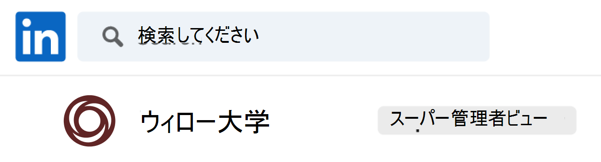

# Microsoft Teams の Career Coach を購入、構成、および有効にする

キャリア コーチは、LinkedIn を搭載したMicrosoft Teams for Education アプリであり、高等教育を受ける学生が自分のキャリアをナビゲートするためのパーソナライズされたガイダンスを提供します。 キャリア コーチは、教育機関に、学生が自分のキャリア パスを発見し、現実世界のスキルを高め、ネットワークをすべて 1 か所で構築するための統合されたキャリア ソリューションを提供します。

## サポートされている言語

Career Coach は、次の言語でローカライズされています。

- 中国語 (簡体字、中国大陸)
- 中国語 (繁体字、台湾)
- 英語 (米国)
- 英語 (U.K.)
- フランス語 (カナダ)
- フランス語 (フランス)
- ドイツ語 (ドイツ語)
- 日本語 (日本)
- ポルトガル語 (ブラジル)
- スペイン語 (スペイン)
- スペイン語 (メキシコ)

[キャリア コーチ](https://aka.ms/career-coach)の詳細については、こちらを参照してください。

> [!TIP]
> このガイドのベスト プラクティスと役に立つヒントを使用して、学生、教職員、スタッフに対して Career Coach の機能を有効にします。 [クイック 計画ガイド](https://support.microsoft.com/office/c5d0b934-bfcf-4fe7-8a85-ba7bbb1b6ad4)の記事を参照してください。

## 要件を確認する

教育機関で Career Coach を有効にするには、Career Coach を起動して実行するために必要なものを確認します。

### 技術的要件

- LinkedIn アカウント接続が有効になっている Azure Active Directory を使用してテナントをOffice 365します。
- Microsoft Teams。
- LinkedIn School ページ。

### 教育機関のデータとファイル

- 教育機関のロゴとグラフィックアセット [を必要な形式で指定します](#brand-and-preferences)。

- コース カタログ データ。 [サンプル ファイル](https://aka.ms/career-coach/docs/it-admins/sample-catalog) と [ドキュメント形式](#course-catalog-document-format-and-schema)を表示します。

- 提供されている研究分野の一覧。 [サンプル ファイルを表示します](https://aka.ms/career-coach/docs/it-admins/sample-fieldsofstudy)。

- 教育機関の [LinkedIn School ページ URL](https://www.linkedin.com/help/linkedin/answer/40133/differences-between-a-linkedin-page-for-a-school-and-company?lang=en)。

- 教育機関のプライバシー ポリシー URL。

- 教育機関は、キャリア サービス Web サイトや学生の求人情報 (省略可能) などのキャリア関連のリソースにリンクしています。

## セットアップ チェックリスト

テナントの Career Coach をリリースする準備として、いくつかの管理者ロールが必要になります。 これらのロールとアクセス許可は、1 人の個人に割り当てられる場合や、組織内の IT プロフェッショナルとのコラボレーションが必要な場合があります。 このガイドを使用すると、必要なタスクを完了するために必要な個人を特定できます。

アカウントの割り当てられたロールを確認するには、[Microsoft 365 管理センター > ユーザー>アクティブユーザーにアクセス>](https://go.microsoft.com/fwlink/p/?linkid=834822)ユーザー名を選択してロールを確認します。

[Microsoft 365 管理センターの管理者ロール](/microsoft-365/admin/add-users/about-admin-roles)の詳細については、こちらを参照してください。

### [Microsoft 365 管理センター](https://go.microsoft.com/fwlink/p/?linkid=2024339)

ロール: [グローバル管理者](/azure/active-directory/roles/permissions-reference#global-administrator) のキャリア コーチ タスク:

- [ライセンスを購入する](#purchase-career-coach-licenses)
- [ライセンスを割り当てる](#assign-career-coach-licenses-to-users)

### [Azure Active Directory 管理センター](https://go.microsoft.com/fwlink/p/?linkid=2067268)

ロール: [グローバル管理者](/azure/active-directory/roles/permissions-reference#global-administrator) のキャリア コーチ タスク:

- [LinkedIn アカウント接続を有効にする](#turn-on-linkedin-account-connections)

### [Teams 管理センター](https://admin.teams.microsoft.com/dashboard)

ロール: [Teams 管理者](/azure/active-directory/roles/permissions-reference#teams-administrator) のキャリア コーチ タスク:

- [インストール済みアプリとして Career Coach を追加する](#add-career-coach-as-an-installed-app)
- [Career Coach アプリの設定を構成する](#configure-career-coach-settings)
  - [ブランドと設定](#brand-and-preferences) - 必須
  - [LinkedIn 接続](#linkedin-connection) - 必須
  - [コース カタログ](#course-catalog) - 必須
  - [研究分野](#fields-of-study) - 必須
  - [カスタマイズ](#customization) - 省略可能
- [セットアップ ポリシー](#setup-policies-and-pin-the-app)
- [アプリをピン留めする](#setup-policies-and-pin-the-app)

### LinkedIn 開発者ポータル

ロール: [LinkedIn School Page Super 管理](https://www.linkedin.com/help/linkedin/answer/a541981) Career Coach タスク:

- [LinkedIn School ページを確認する](#verify-the-linkedin-school-page)

## Career Coach ライセンスを購入する

### ライセンスの種類

Career Coach には、アプリケーションにアクセスするためのライセンスが必要です。

使用できるライセンスの種類は 2 つあります。

- **学生ライセンス** は学生向けに設計されています。
- **教職員ライセンス** は、キャリア コーチを使用して学生をサポートすることに関与する教職員、IT プロフェッショナル向けに設計されています。

> [!IMPORTANT]
> 構成を完了する IT 管理者には、Career Coach **の教職員ライセンス** を割り当てる必要があります。

### ライセンスを購入する

キャリア コーチは、教育機関向け登録 (EES)、クラウド サービス プロバイダー (CSP)、Microsoft 365 管理センター (Web ダイレクト) を通じてアドオン ライセンスとして認定された教育機関向けに、世界中 (中国とロシアを除く) で利用できます。

Microsoft Teams アプリとして、テナントは、アドオンの Career Coach ライセンスを購入するために、Microsoft 365 A3/A5 またはOffice 365 A1/A3/A5 を持っている必要があります。 学生と教職員のユーザーには、個別のライセンスが提供されます。

### 無料試用版にサインアップする

標準の 90 日間無料試用版は、25 人の学生と 25 の教職員ライセンスで利用できます。 対象テナントごとに 1 つの試用版を利用できます。 試用版ライセンスは、キャリア コーチを購入する資格を持つテナントがMicrosoft 365 管理センターからアクティブ化できます。

試用版のライセンス認証については、[課金>購入サービスMicrosoft 365 管理センター >サインイン>、学生](https://go.microsoft.com/fwlink/p/?linkid=868433)[ライセンス試用版](https://signup.microsoft.com/signup?OfferId=b3a40ff2-3d0d-481e-a0ed-f4de1069f201)と[教職員ライセンス試用版](https://signup.microsoft.com/signup?OfferId=6f6e7db5-b9ab-4baa-86be-f13d0ae6a2c8)を見つけるために Career Coach を検索します。

## キャリア コーチの準備

### LinkedIn アカウント接続を有効にする

キャリア コーチでは、LinkedIn アカウント接続を使用する方法は 2 つあります。

- 学生、教職員が自分の Microsoft 365 アカウントを自分の LinkedIn アカウントに接続し、 [キャリア コーチから LinkedIn 招待を送信](https://support.microsoft.com/topic/career-coach-quick-start-guide-for-students-c419db47-9290-4961-9684-c3f86a9b3708#bkmk_connect_your_linkedin_account)できるようにします。
- LinkedIn の一般の同窓生データを使用して [、ネットワークの構築](https://support.microsoft.com/topic/career-coach-quick-start-guide-for-students-c419db47-9290-4961-9684-c3f86a9b3708#bkmk_build_your_network) と [キャリアの探索](https://support.microsoft.com/topic/career-coach-quick-start-guide-for-students-c419db47-9290-4961-9684-c3f86a9b3708#bkmk_discover_your_career_path) 機能を有効にするには。

1. [Azure AD](https://go.microsoft.com/fwlink/p/?linkid=2067268) 組織の[グローバル管理者アカウント](#setup-checklist)を使用して Azure AD 管理センターにサインインします。

2. [ **ユーザー] を選択します**。

3. [ **ユーザー** ] ページで、[ **ユーザー設定**] を選択します。

4. **LinkedIn アカウント接続** を正しく構成するには、キャリア Coach の **[はい****] または [選択済み] グループ** に設定する必要があります。

   - 教育機関内のすべてのユーザーに対してサービスを有効にするには、[ **はい** ] を選択します。
   - 選択 **したグループ** を選択して、教育機関で選択したユーザーのグループに対してのみサービスを有効にします。

詳細については、 [Azure Active Directory の LinkedIn アカウント接続に関する](/azure/active-directory/enterprise-users/linkedin-integration)ページを参照してください。

> [!NOTE]
> ユーザーの同意なしにデータが共有されることはありません。

### Teams で Microsoft アプリを許可する

Career Coach は Microsoft アプリケーションであるため、Teams アプリのアクセス許可ポリシー内で許可する必要があります。

1. **[Teams 管理センター](https://admin.teams.microsoft.com)** にサインインします。

2. 左側のナビゲーションで、[ **Teams アプリ** > **[のアクセス許可ポリシー](https://admin.teams.microsoft.com/policies/manage-apps)**] を選択します。

3. 優先するポリシーを選択します。
    1. 使用するポリシーがわからない場合は、 [Microsoft Teams ポリシー管理のドキュメント](policy-packages-edu.md) を参照するか、 [教育機関向けポリシー ウィザード](easy-policy-setup-edu.md) を使用して Microsoft Teams のポリシーを構成します。

[アクセス許可ポリシーの構成](teams-app-permission-policies.md)の詳細について説明します。

### インストール済みアプリとして Career Coach を追加する

この手順により、キャリア コーチが組織に合わせて適切に構成され、学生がキャリア コーチを見つけられるようになります。

1.  [Teams 管理センター](https://go.microsoft.com/fwlink/p/?linkid=2066851)にサインインします。

2.  **Teams アプリ** > **のセットアップ ポリシー** を選択し、優先するポリシーを選択します。
    1. 使用するポリシーがわからない場合は、 [Microsoft Teams ポリシー管理のドキュメント](policy-packages-edu.md) を参照するか、 [教育機関向けポリシー ウィザード](easy-policy-setup-edu.md) を使用して Microsoft Teams のポリシーを構成します。

3. [ **インストール済みアプリ**] で、[ **+ アプリの追加**] を選択します。

4. [ **インストール済みのアプリの追加]** ウィンドウで、Teams の起動時にユーザーを自動的にインストールするアプリを検索します。 アプリのアクセス許可ポリシーでアプリをフィルター処理することもできます。

5. アプリの一覧を選択したら、[ **追加**] を選択します。

6. [ **確認の保存] を選択します** > 。

> [!NOTE]
> ポリシーの編集または割り当てには、変更が有効になるまでに数時間かかる場合があります。 変更が完了するまで、キャリア コーチは Microsoft Teams では利用できません。

## キャリア コーチの設定を構成する

### Career Coach アプリの設定にアクセスする

Career Coach の設定を構成し、ユーザーに対して有効にするには、ページにアクセスするには、グローバル管理者または Teams サービス管理者である必要があります。

1.  [Teams 管理センター](https://go.microsoft.com/fwlink/p/?linkid=2066851)にサインインします。
2. 左側のナビゲーションで、[ **Teams アプリの管理] を** >選択 **します**。
3.  **キャリア コーチ** を検索または参照します。
4.  **[キャリア コーチ**]、[設定] の順に **選択します**。

![は、[設定] タブが選択された状態で選択された Career Coach アプリを示します。](media/career-coach-app-updated.png)

### Career Coach 構成カテゴリ

学生、教職員のキャリア コーチを効果的に有効にするには、次の設定が必要です。

- [ブランドと設定](#brand-and-preferences)
- [LinkedIn 接続](#linkedin-connection)
- [コース カタログ](#course-catalog)
- [研究分野](#fields-of-study)

オプションの [カスタマイズ](#customization) 設定を設定することもできます。

> [!TIP]
> ページの上部にある **キャリア コーチ** パスを形式 `Manage apps\Career Coach\Setting label`で選択して、あるカテゴリから別のカテゴリにすばやく移動します。

### ブランドと設定

教育機関のブランドに合わせてキャリア コーチをカスタマイズします。 お客様は、著作権や商標の権利を含む他のユーザーの権利を尊重する責任があります。

> [!IMPORTANT]
> これは必須のセクションです。 キャリア コーチは、 **ブランドとユーザー設定** が送信されていないと有効にできません。

1. **[Teams 管理センター](https://go.microsoft.com/fwlink/p/?linkid=2066851)** にサインインします。

2. **Teams アプリ** > **[アプリの管理** > ]**を選択します。[キャリア コーチ** > **設定]** > **ブランドと基本設定を編集します**。

3. [ **ブランド]** で、[ **組織名] を追加します**。

4. **[組織] アイコン** をアップロードします。 このアイコンは、教育機関に固有のコンテンツ、アプリ全体のコース カタログ リソース、ダッシュボードの実際のエクスペリエンス セクションで識別するために、Career Coach 全体で使用されます。

    アイコンの形式は次のとおりです。

    - 透明な PNG
    - 縦横比 1:1
    - 最大サイズは 64 ピクセル x 64 ピクセル

5. **ラーニング コンテンツのサムネイル 画像** をアップロードします。 サムネイルは、教育機関が提供するコースに特定の画像が指定されていない場合に、アプリ全体でコース カタログ学習リソースに使用されます。

    サムネイルの形式は次のとおりです。

    - A PNG
    - 縦横比 16:9
    - 最大サイズは 360 ピクセル x 200 ピクセル

6. 組織の **プライバシー ポリシー URL を追加します**。 追加すると、教育機関のプライバシー ポリシーを学生がキャリア コーチで確認できるようになります。

7. **[送信]** を選択します。

8. 設定が正常に送信されたことを確認するには、[ [完了] の [Career Coach の構成状態]](#configuration-status) を確認 **します**。

![管理センターの [Career Coach のブランド化] セクション。](media/career-coach-brand-updated.png)

### LinkedIn 接続

LinkedIn 接続設定は、教育機関の LinkedIn School ページから、キャリア コーチと一般の同窓生データを接続します。

この手順は、 [Azure Active Directory で LinkedIn アカウント接続が有効になっている](#turn-on-linkedin-account-connections)場合にのみ実行できます。 LinkedIn 接続設定では、[ [ネットワークの構築](https://support.microsoft.com/topic/career-coach-quick-start-guide-for-students-c419db47-9290-4961-9684-c3f86a9b3708#bkmk_build_your_network) ] 機能と [[キャリアの探索] 機能が](https://support.microsoft.com/topic/career-coach-quick-start-guide-for-students-c419db47-9290-4961-9684-c3f86a9b3708#bkmk_discover_your_career_path) 有効になります。

> [!IMPORTANT]
> これは必須のセクションです。 LinkedIn School ページの接続が検証されていないと、Career Coach を有効にできません。

#### LinkedIn School ページ URL を追加する

LinkedIn School ページ URL を追加するプロセスは、Teams 管理者によって処理されます。 URL を確認する後続の手順は、教育機関の LinkedIn School Page Super 管理者によって完了します。

1. **[Teams 管理センター](https://go.microsoft.com/fwlink/p/?linkid=2066851)** にサインインします。

2. **Teams アプリ** > **の [アプリ** > の管理]**を選択します。[キャリア コーチ** > **設定** > **] LinkedIn 接続**。

3. [ **LinkedIn への接続] を選択します**。

4. LinkedIn で検索し、学校フィルターを選択して、教育機関の LinkedIn **学校** ページを見つけます。 または、教育機関のマーケティング スタッフに接続して、使用する正しい LinkedIn School ページを決定します。 詳細については、「 [LinkedIn ページを識別する方法」を参照してください](https://www.linkedin.com/help/linkedin/answer/40133/differences-between-a-linkedin-page-for-a-school-and-company?lang=en)。

    

5. **LinkedIn 学校ページの URL を追加します**。 URL は *、会社* の *ページではなく学校* ページである必要があり、通常`https://www.linkedin.com/school/willow-university/`は .

   

6. **[送信]** を選択します。

7. **LinkedIn School ページの URL** が正常に送信されると、設定ページが更新され、[ **確認] リンクと [検証] リンク** の  **有効期限** が表示されます。 確認リンクの有効期限は 30 日後です。

8. **[検証] リンク** をコピーし、教育機関の LinkedIn School ページ スーパー管理者と共有します。

9. LinkedIn School Page Super 管理者は、一意の確認リンクを使用して [LinkedIn School ページを確認](#verify-the-linkedin-school-page) し、それをキャリア コーチに関連付けます。

10. 確認と設定が正常に送信されたことを確認するには、 [Career Coach の構成状態](#configuration-status) が **[完了**] とマークされていることを確認します。

#### LinkedIn School ページを確認する

LinkedIn 学校ページの確認は、教育機関の [LinkedIn School Page Super 管理者](https://www.linkedin.com/help/linkedin/answer/a541981)が行う必要があります。

LinkedIn にサインインし、教育機関の LinkedIn 学校ページにアクセスすると、LinkedIn アカウントの管理者ロールを確認できます。 アカウントにスーパー管理者ロールが割り当てられている場合、LinkedIn ページに教育機関の名前の横に **スーパー管理者ビュー** が表示されます。 **スーパー管理者ビュー** のタグが表示されない場合は、学校のページのスーパー管理者ではありません。

1. Teams 管理者によって **LinkedIn School ページ URL が** 送信されると、ページに **[確認] リンクと [検証] リンク** の **有効期限** が表示されます。 確認リンクの有効期限は 30 日後です。

     

2. 確認リンクをコピーし、LinkedIn School Page Super 管理者と共有します。

3. LinkedIn ページスーパー管理者が確認リンクを開き、キャリア コーチを学校のページに関連付けます。 詳細については、 [LinkedIn ページの検証に関するその他のドキュメント](https://www.linkedin.com/help/linkedin/answer/102672)を参照してください。

4. 確認が完了すると、Teams 管理者は [、Career Coach の構成状態](#configuration-status) が **完了** とマークされているかどうかを確認することで、設定が正常に送信されたかどうかを確認できます。

   

### コース カタログ

コース カタログには、教育機関が提供するコースとクラスが記録されます。

Career Coach では、コース カタログ データを使用して、学生のトランスクリプトから学生のスキルを識別し、受講するコースを提案します。

> [!IMPORTANT]
> これは必須のセクションです。 コース カタログなしでは、Career Coach を有効にすることはできません。

これらのコースは、次の 2 つの分野で Career Coach 内で使用されます。

- コースは [学習リソース](https://support.microsoft.com/topic/career-coach-quick-start-guide-for-students-c419db47-9290-4961-9684-c3f86a9b3708#bkmk_grow_real_world_skills)の一部として返されます。  

- コースタイトルや説明などのコースとコースのメタデータは、 [学生がトランスクリプトをアップロード](https://support.microsoft.com/topic/career-coach-quick-start-guide-for-students-c419db47-9290-4961-9684-c3f86a9b3708#bkmk_Set_up_your_profile)するときに自分のスキルを識別するのに役立ちます。

コース カタログを作成するには、教育機関で教えられているすべてのコースの一覧をまとめ、 [コース カタログドキュメントの形式とスキーマ](#course-catalog-document-format-and-schema)を使用して CSV ファイルとしてアップロードします。

> [!TIP]
>  [最初にサンプル コース カタログ](https://aka.ms/career-coach/docs/it-admins/sample-catalog) ドキュメントを使用して、適切な書式設定を行います。また、必須フィールドと推奨フィールドの詳細については、 [コース カタログドキュメントの形式とスキーマ](#course-catalog-document-format-and-schema) セクションを参照することもできます。

#### コース カタログを追加する

1. **[Teams 管理センター](https://go.microsoft.com/fwlink/p/?linkid=2066851)** にサインインします。

2. **[Teams アプリ** > **の管理]** > [**Search Career Coach** > **設定** > **コース] カタログ** を選択します。

3. **[コース カタログのアップロード**] >必要な列 (courseId、タイトル、sourceLink) を含む CSV 形式でコースをアップロードするを選択します。
    1. 各行には、必要な各列のデータを含める必要があります。
    1. *推奨フィールドを含めると、より良い検索結果とスキル識別が返され、学生のエクスペリエンスが向上します。*

4. アップロードされたコース カタログのセクションのプレビューが参照用に表示されます。

5. 準備ができたら **、[送信] を選択します** 。

6. [アップロードされたドキュメントの状態](#course-catalog-status)が設定ページに表示されます。

7. 設定が正常に送信されたことを確認するには、 [Career Coach の構成状態](#configuration-status) が **[完了**] とマークされていることを確認します。

> [!TIP]
> 新しいファイルをアップロードするには、(X) を選択してドキュメント プレビューを閉じて、最後のファイルがクリアされていることを確認します。 この操作により、[ **アップロード** ] ボタンを再度表示できます。

#### コース カタログドキュメントの形式とスキーマ

ドキュメントは、最大サイズが 18 MB の CSV 形式である必要があります。 大きなファイルは、処理を成功させるために最大 15,000 行を含む複数の小さいファイルに分割する必要があります。

ドキュメントには、コース **のタイトル**、コース  **ID**、コース URL という必須  **のコース** メタデータが含まれている必要があります。

> [!TIP]
> [最初にサンプル コース カタログ]( https://aka.ms/career-coach/docs/it-admins/sample-catalog) ドキュメントを使用して、適切な書式設定を行います。 *推奨フィールドを含めると、より良い検索結果とスキル識別が返され、学生のエクスペリエンスが向上します。*

次の表は、コース カタログに含める項目を示しています。

| 名前             | ステータス      | 種類   | 説明                                                                    |
|------------------|-------------|--------|--------------------------------------------------------------------------------|
| courseId         | 必須    | 文字列 | courseId は、学生トランスクリプトで生成されたものにマップされます。             |
| タイトル            | 必須    | 文字列 | コースタイトル。                                                              |
| sourceLink       | 必須    | URL    | コースとシラバスの詳細については、コース ページへの Web サイトのリンクを参照してください。   |
| 説明      | 推奨 | 文字列 | 学習目標を説明するコースの概要テキスト。       |
| 言語         | 推奨 | 文字列 | コースの言語。 標準言語コードを使用します。                           |
| 形式           | 推奨 | 文字列 | 教えるモード (オンライン、ビデオ、対人)。                                   |
| thumbnailLink    | 推奨 | URL    | コースイメージへのサムネイル リンク。                                            |
| thumbnailAltText | 推奨 | 文字列 | 画像のアクセシビリティ代替テキスト                                           |
| educationLevel   | 推奨 | 文字列 | スタディ レベル (例: 学部/卒業。                                       |
| トピック           | 推奨 | 文字列 | コースが教えるスキルに関連付けられているトピックまたはタグ。          |

### コース カタログの状態

ドキュメントがアップロードされると、コース カタログの状態が [コース カタログの設定] ページに表示され、ドキュメントのアップロードと処理の状態の詳細が表示されます。

処理中に、Career Coach はドキュメントの重複を分析し、タイトルと説明からスキルを抽出してカタログを正規化および強化し、学習ページやスキル識別用の学生トランスクリプトアップロード時に使用するために保存します。

| 列           | 値     | 説明                                                                                        |
| ---------------- | --------- | -------------------------------------------------------------------------------------------------- |
| アップロードされた時間    | タイムスタンプ | IT 管理者がドキュメントをアップロードした日時。                                                     |
| 完了時間   | タイムスタンプ | ドキュメントが完全に処理された日時。                                               |
| アップロードされたコース | 整数型   | ドキュメント内で見つかったコースの数。                                                           |
| インジェストの状態 | Pending   | 処理用のキュー内のドキュメント。                                                                  |
| インジェストの状態 | 実行   | ドキュメントは現在処理されています。 このプロセスは、ドキュメントのサイズに応じて最大 6 時間かかる場合があります。 |
| インジェストの状態 | 成功   | インジェスト プロセスが完了し、必要なすべての設定が構成されると、コースは Career Coach で利用できるようになります。 |
| インジェストの状態 | 失敗 しました    | ドキュメントの形式を確認し、再アップロードします。                                                           |
| 重複       | 整数型   | ドキュメント内で見つかった重複するコースの数。                                                 |

> [!NOTE]
> コース カタログの状態の列が空白の場合、ドキュメントは現在処理されており、それらの値は使用できません。 このプロセスは、カタログのサイズに応じて最大 6 時間かかる場合があります。 ドキュメントが処理されると、値が設定されます。 ページを更新して更新プログラムを確認できます。

### 研究分野

専門分野は、主要な関心領域、学術専攻、および学位プログラムと同義です。 これらの学習分野は、学生がキャリア コーチの使用を開始し、パーソナライズされたプロファイルの設定を開始するときに参照されます。

フィールドの一覧を使用すると、学生は興味を持つ可能性のある学習分野を見つけ、キャリア コーチのプロファイルに計画的な学術的焦点を追加できます。

> [!IMPORTANT]
> これは必須のセクションです。 キャリア コーチは、学習分野の一覧がないと有効にできません。
>
> エンジニアリング、英語、ビジネスなどの学生が利用できるすべての学習フィールドを追加する

#### 学習フィールドを追加する

1. **[Teams 管理センター](https://go.microsoft.com/fwlink/p/?linkid=2066851)** にサインインします。

2. **Teams アプリ** > **の [アプリの管理**] >検索 **キャリア コーチ** > **設定** >  **フィールドの学習を** 選択します。

3. [ **アップロード]** を選択して、スタディ ファイルのフィールドを CSV 形式でアップロードします。 スタディ ドキュメントのフィールドのプレビューが表示されます。

4. **[送信]** を選択します。

5. 設定が正常に送信されたことを確認するには、 [Career Coach の構成状態](#configuration-status) が **[完了**] とマークされていることを確認します。

#### スタディ ドキュメントの形式とスキーマのフィールド

ドキュメントは、最大サイズが 18 MB の CSV 形式である必要があります。 ドキュメントには、必要なメタデータである **フィールド オブ スタディ名が** 含まれている必要があります。

次の表は、研究分野に含める項目を示しています。

| 名前          | ステータス   | 種類   | 説明                    |
|---------------|----------|--------|--------------------------------|
| fieldsOfStudy | 必須 | 文字列 | 研究分野の名前 |

### カスタマイズ

カスタマイズ設定では、教育機関が学生に提供するダッシュボードに実際のエクスペリエンスを得る機会を追加できます。

推奨されるリンクは、学生がジョブ ボード、イベント、キャリア サービス オフィス、キャリア関連のイベント、学生クラブなどの現実世界の経験を得るのに役立つリンクです。

1. **[Teams 管理センター](https://go.microsoft.com/fwlink/p/?linkid=2066851)** にサインインします。

2. **[Teams アプリ** > **の管理]** > [**Search Career Coach** > **の設定] を選択します**。

3. [**エクスペリエンス** > のカスタマイズ **+ 追加] を選択します。**

4. [**適用**] を選択>、各 **タイトル**、**URL**、**ヒントの説明** を追加します。

5. 追加された情報のプレビューが表示されます。

6. **[送信]** を選択します。

## キャリア コーチの設定の状態

Teams 管理センターの [Career Coach の設定] ページには、キャリア コーチを構成するための不完全、保留中、完了、失敗した手順の状態の概要が表示されます。

状態メッセージは、Career Coach が適切に構成され、テナントにリリースする準備ができているかどうかを判断するのに役立ちます。

### 構成の状態

アプリ設定ページの [構成状態] セクションには、次の凡例を使用してリアルタイムの状態が表示されます。

| [カテゴリ]                    | ステータス                                        | 説明                                                 |
| --------------------------- | --------------------------------------------- | ----------------------------------------------------------- |
| サービス プロビジョニングの状態 | キャリア コーチがテナントを初期化しています。     | サービス のプロビジョニングは、[Career Coach の設定] ページにアクセスすると自動的に行われます。 初期セットアップが完了するまで、構成の変更は受け入れられません。 サービス プロビジョニングの推定時間は最大 15 分です。 |
| サービス プロビジョニングの状態 | キャリア コーチを構成する準備ができました。       | [キャリア コーチの設定] ページでは、IT 管理者が設定を送信する準備が整いました。 |
| ブランドと設定       | 未開始                                   | 設定を送信する必要があります。 |
| ブランドと設定       | 見つからない: ラーニング アイコン                        | 不足しているラーニング コンテンツのサムネイル 画像をアップロードします。 |
| ブランドと設定       | 見つかりません: ロゴ                                 | 見つからない組織アイコンをアップロードします。 |
| ブランドと設定       | 存在しない: 教育機関名                     | 不足している組織名をアップロードします。 |
| ブランドと設定       | 完了                                      | それ以上のアクションは必要ありません。 設定が完了しました。 |
| コース カタログのアップロード       | 未開始                                   | コース カタログ CSV を送信する必要があります。 |
| コース カタログのアップロード       | 見つからない: コース カタログのアップロードが成功しました   | コース カタログの処理の詳細については、コース カタログの状態を確認してください。 |
| コース カタログのアップロード       | 完了                                      | それ以上のアクションは必要ありません。 設定が完了しました。 |
| LinkedIn 学校の接続  | 未開始                                   | LinkedIn School ページの URL を送信する必要があります。 |
| LinkedIn 学校の接続  | 見つかりません: 承認済みの LinkedIn School ページ URL | LinkedIn School Page スーパー管理者の確認承認を待っています。 |
| LinkedIn 学校の接続  | 完了                                      | それ以上のアクションは必要ありません。 設定が完了しました。 |
| スタディ アップロードのフィールド      | 未開始                                   | フィールドオブ スタディ CSV を送信する必要があります。 |
| スタディ アップロードのフィールド      | 見つからない: 関心のある領域                    | フィールドのアップロードが成功したかどうかを確認します。 |
| スタディ アップロードのフィールド      | 完了                                      | それ以上のアクションは必要ありません。 設定が完了しました。 |

> [!NOTE]
> 必要なすべての手順が完了としてマークされたら、キャリア コーチをテナントに正常にリリースできます。

## キャリア コーチを組織で利用できるようにする

この時点で、キャリア コーチは組織用に構成されています。

次に、次の手順に従って、Microsoft Teams の組織でキャリア コーチを利用できるようにします。

### ユーザーに Career Coach ライセンスを割り当てる

詳細な手順については、「 [ユーザーにライセンスを割り当てる」を](/microsoft-365/admin/manage/assign-licenses-to-users)参照してください。

### ポリシーを設定し、アプリをピン留めする

ピン留めキャリア コーチは、Microsoft Teams ウィンドウの左側のレールに追加して、学生にとってよりアクセスしやすく、見えるようにします。 ユーザーのサブセットに対して Career Coach をピン留めする場合は、そのグループを含む [セットアップ ポリシー](teams-app-setup-policies.md) を実装する必要があります。

1. **[Teams 管理センター](https://go.microsoft.com/fwlink/p/?linkid=2066851)** にサインインします。

2. **Teams アプリ** > **のセットアップ ポリシーを** 選択し、優先するポリシーを選択します。

    使用するポリシーがわからない場合は、 [Microsoft Teams ポリシー管理のドキュメント](policy-packages-edu.md) を参照するか、 [教育機関向けポリシー ウィザード](easy-policy-setup-edu.md) を使用して Microsoft Teams のポリシーを構成します。

3. **[ピン留めされたアプリ**] で、[**アプリの追加]** を選択します。

4. **このアプリのアクセス許可ポリシーに基づいて、[検索**] で優先ポリシーを選択します。

5. **[名前で検索**] で **[キャリア コーチ**] を検索し、[ **追加** > ] を選択してウィンドウを閉じます。

6. アプリの表示順序を選択し、[ **確認**] を選択します。

> [!NOTE]
> 学生には、キャリア コーチがピン留めされたことを Microsoft Teams で通知されます。

## Career Coach のアクセシビリティ

Career Coach には、すべてのユーザーがアクセスできるエクスペリエンスを作成する責任があります。 キャリア コーチは WCAG 2.1 A、AA、AAA に準拠し、すべてのグローバル アクセシビリティ標準を採用しています。

Career Coach のアクセシビリティ機能には、次のものが含まれます。

- マウス、キーボード、または音声によるナビゲーションをサポートする論理的な見出し構造と明確なフォーカス インジケーター。
- リンクをスキップして、ユーザーが重要な機能にすばやくアクセスできるようにします。
- 明確で簡潔なテキストを使用して、すべてのユーザーに対して Career Coach の読み取りと理解を簡単にします。
- さまざまなニーズと好みに合わせて、濃色およびハイ コントラスト モードのカラー コントラスト。
- [セクション 508 信頼できるテスター](https://www.dhs.gov/trusted-tester)を使用して、すべての形式 (PC、Mac、Android、iPhone) で検証される適切なサイズのユーザー エクスペリエンス。

## トラブルシューティング

### 必要な構成データがありません

Career Coach エクスペリエンスで "Career Coach は現在すぐに使用できるようにセットアップされています" と表示 **される場合、必要なすべての構成データは追加されていません**。

Career Coach **を使用するには、次のセクションを完了する必要があります** 。

- [ブランドと設定](#brand-and-preferences)
- [LinkedIn 接続](#linkedin-connection)
- [コース カタログ](#course-catalog)
- [研究分野](#fields-of-study)

[キャリア コーチの構成状態](#configuration-status)を参照して、完了する必要がある設定を確認します。

### コース カタログまたは調査データのフィールドの書式設定が正しくありません

コース カタログと専門分野の CV には、必要な形式と最大サイズが 18 MB です。

適切な構成を確保するために、[学習ドキュメント スキーマの](#fields-of-study-document-format-and-schema) Career Coach [コース カタログ ドキュメント スキーマ](#course-catalog-document-format-and-schema)と Career Coach フィールドを参照してください。

さらに、コース カタログ ファイルの処理を成功させるには、15,000 行以下にする必要があります。

### キャリア コーチ設定ページのフィールドが見つからない

[キャリア コーチの設定] ページには必須フィールドがあります。 必要なフィールドが入力されていない場合、ページは送信されません。

警告メッセージが表示されない場合があります。ページは送信されません。

ページの上部に緑色のバナーが表示されると、送信は成功します。

### セットアップ ポリシーの変更が完了していない

ユーザー向けの Microsoft Teams に Career Coach が表示されていない場合は、セットアップ ポリシーの変更がまだ有効になっていない可能性があります。 セットアップ ポリシーの変更が有効になるまで、Career Coach は Microsoft Teams のユーザーに対してインストールおよびピン留めされません。 ポリシーの変更が有効になるには数時間かかる場合があります。

ただし、Career Coach は、Microsoft Teams アプリ ストアから直接インストールできます。

- ユーザーが Microsoft Teams アプリ ストアで Career Coach を見つけることができない場合は、アプリのアクセス許可ポリシーを確認し、Career Coach がブロックされたアプリではないことを確認します。
- Career Coach は Microsoft アプリであり、アクセス許可ポリシーによって Microsoft アプリを許可することをお勧めします。 [アクセス許可ポリシーの構成](teams-app-permission-policies.md)の詳細について説明します。

### キャリア コーチの初期化が完了していない

次のエラーが発生する可能性があります。"アプリの設定を取得できません。 もう一度お試しください。 引き続き問題が発生する場合は、Microsoft カスタマー サポートにお問い合わせください。

[キャリア コーチの設定] ページで **サービス プロビジョニングの状態** を確認します。

テナントがまだ初期化されている場合は、15 分待ってからもう一度試してください。 それでもエラーが発生した場合は、サポート チケットを開きます。

## リソース

次のリソースは、Microsoft Teams を使用して Career Coach の実装を計画するのに役立ちます。

- [キャリア コーチのクイック プランニング ガイド](https://support.microsoft.com/topic/career-coach-quick-planning-guide-c5d0b934-bfcf-4fe7-8a85-ba7bbb1b6ad4)
- [学生向けのキャリア コーチクイック スタート ガイド](https://support.microsoft.com/topic/career-coach-quick-start-guide-for-students-c419db47-9290-4961-9684-c3f86a9b3708)
- [キャリア コーチのレッスンプランで学生を引き付ける](https://support.microsoft.com/topic/get-started-with-career-coach-goals-and-activities-086ce412-05de-4259-a9fd-c96471cef1b0?preview=true)
- [Microsoft Teams にようこそ](Teams-overview.md)
- [Teams の展開方法](get-started-with-teams-resources-for-org-wide-rollout.md?tabs=SmallBusiness)
- [Microsoft Teams でのチームとチャネルの概要](teams-channels-overview.md)
- [Microsoft Teams 管理センターでのアプリの管理](manage-apps.md)
- [Microsoft Teams の管理者トレーニングの概要](ITAdmin-readiness.md)
- [Teams のトラブルシューティング](/microsoftteams/troubleshoot/teams-welcome)
- [Microsoft Teams のアプリのアクセス許可ポリシーを管理する](teams-app-permission-policies.md)
