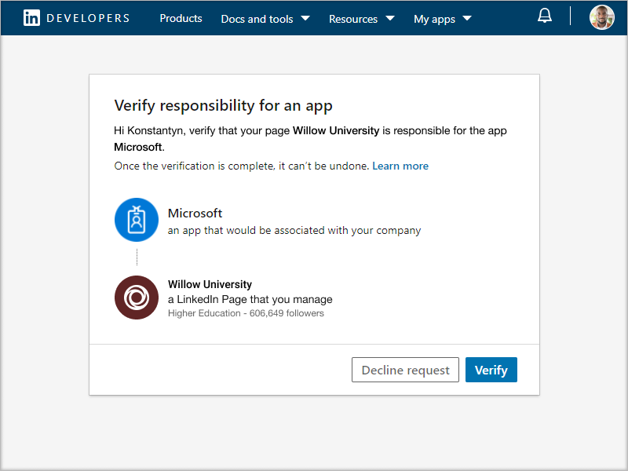

# Microsoft Teamsのキャリア コーチを購入、構成、および有効にする

キャリア コーチは、LinkedIn を搭載したMicrosoft Teams for Education アプリであり、教育機関の学生が自分のキャリアをナビゲートするためのパーソナライズされたガイダンスを提供します。 キャリア コーチでは、学生が自分のキャリア パスを発見し、現実世界のスキルを高め、ネットワークをすべて 1 か所で構築するための統合されたキャリア ソリューションを教育機関に提供します。

## サポートされている言語

キャリア コーチは、次の言語でローカライズされます。

- 中国語 (簡体字、中国大陸)
- 中国語 (繁体字、台湾)
- 英語 (米国)
- 英語 (U.K.)
- フランス語 (カナダ)
- フランス語 (フランス)
- ドイツ語 (ドイツ語)
- 日本語 (日本)
- ポルトガル語 (ブラジル)
- スペイン語 (スペイン)
- スペイン語 (メキシコ)

[キャリア コーチ](https://aka.ms/career-coach)の詳細については、こちらを参照してください。

> [!TIP]
> このガイドのベスト プラクティスと役に立つヒントを使用して、学生、教職員、スタッフのキャリア コーチの機能を有効にします。 [クイック 計画ガイド](https://support.microsoft.com/office/c5d0b934-bfcf-4fe7-8a85-ba7bbb1b6ad4)の記事を参照してください。

## 要件を確認する

教育機関のキャリア コーチを有効にするには、アプリを起動して実行するために必要なものを確認します。

**技術要件**

- Azure Active Directoryを使用してテナントをOffice 365します。

- Microsoft Teams。

- Azure Active Directoryの LinkedIn アカウント接続。

**ライセンス**

- 教職員

- 学生

> [!IMPORTANT]
> 構成を完了する IT 管理者には、キャリア コーチ教職員ライセンスを割り当てる必要があります。

**教育機関のデータとファイル**

- 教育機関のロゴとグラフィックアセットを必要な形式で指定します。

- コース カタログ データ。

- 提供されている研究分野の一覧。

- 教育機関の [LinkedIn ページ](https://www.linkedin.com/help/linkedin/answer/40133/differences-between-a-linkedin-page-for-a-school-and-company?lang=en)。

- 教育機関のプライバシー ポリシー URL。

- 教育機関は、キャリア サービスや学生の求人情報 (省略可能) などのキャリア関連のリソースにリンクしています。

- LinkedIn ラーニングキャンパス サブスクリプション (優先)。

## キャリア コーチ ライセンスを購入する

キャリア コーチは、教育機関向け登録 (EES)、クラウド サービス プロバイダー (CSP)、およびMicrosoft 365 管理センター (Web ダイレクト) を通じてアドオン ライセンスとして認定された教育機関向けに世界中 (中国とロシアを除く) で利用できます。 Microsoft Teams アプリとして、アドオン キャリア コーチ ライセンスを購入するには、テナントに Microsoft 365 A3/A5 または Office 365 A1/A3/A5 が必要です。 学生と教職員のユーザーには個別のライセンスが提供されます。

標準の 90 日間無料試用版は、25 の学生ライセンスと 25 の教職員ライセンスで利用できます。 試用版ライセンスは、キャリア コーチを購入する資格を持つテナントがMicrosoft 365 管理センターからアクティブ化できます。

### ユーザーにアプリ ライセンスを割り当てる

詳細な手順については、「 [ユーザーにライセンスを割り当てる」を](/microsoft-365/admin/manage/assign-licenses-to-users)参照してください。

### LinkedIn アカウント接続を有効にする

キャリア コーチでは、教育機関のユーザーは、キャリア コーチ内で促進される LinkedIn アカウントに自分のMicrosoft 365 アカウントを接続する機能を持っている **必要** があります。

1. Azure AD組織のグローバル[管理者](https://aad.portal.azure.com/)であるアカウントを使用して、Azure AD管理センターにサインインします。

2. [ **ユーザー] を選択します**。

3. [ **ユーザー** ] ページで、[ **ユーザー設定**] を選択します。

4. **LinkedIn アカウント接続** を適切に構成するには、キャリア コーチを [**はい****] または [選択済み] グループ** に設定する必要があります。

   

   > [!NOTE]
   > ユーザーが自分のアカウントの接続に同意するまで、データは共有されません。

   - 教育機関内のすべてのユーザーに対してサービスを有効にするには、[ **はい** ] を選択します。

   - 選択 **したグループ** を選択して、教育機関で選択したユーザーのグループに対してのみサービスを有効にします。

詳細については、「[Azure Active Directoryの LinkedIn アカウント接続](/azure/active-directory/enterprise-users/linkedin-integration)」を参照してください。

## キャリア コーチ アプリの設定にアクセスする

Microsoft Teams管理センターを使用して教育機関のキャリア コーチを構成し、ユーザーに対して有効にします。

> [!IMPORTANT]
> これらのポリシーを管理するには、グローバル管理者または Teams サービス管理者である必要があります。

1. **[Teams管理センター](https://admin.teams.microsoft.com)** にサインインします。

2. 左側のナビゲーションで、**Teams** **[appsManage アプリ](https://admin.teams.microsoft.com/policies/manage-apps)** > を選択します。  

3. **キャリア コーチ** を検索または参照します。  

4. **キャリア コーチ** を選択し、**設定** を選択します。  

    

## キャリア コーチ アプリの設定を構成する

キャリア コーチには、次の 5 つの構成カテゴリがあります。

- [ブランドと設定](#brand-and-preferences) - 必須

- [LinkedIn 接続](#linkedin-connection) - 必須

- [コース カタログ](#course-catalog) - 必須

- [研究分野](#fields-of-study) - 必須

- [カスタマイズ](#customization)

> [!IMPORTANT]
> 学生、教職員、スタッフ向けにアプリを効果的に有効にするには、ブランドと基本設定、LinkedIn 構成、コース カタログ、および学習フィールドが __必要__ です。

### ブランドと設定

教育機関のブランドに合わせてキャリア コーチをカスタマイズします。 お客様は、著作権や商標の権利を含む他のユーザーの権利を尊重する責任があります。

> [!IMPORTANT]
> これは必須のセクションです。キャリア コーチブランドと基本設定を送信しないと有効にできません。

1. **[Teams管理センター](https://admin.teams.microsoft.com)** にサインインします。

2. **Teams appsManage** >  **[アプリ](https://admin.teams.microsoft.com/policies/manage-apps)** > **キャリア コーチ** > **Brand と基本設定を選択します**。

3. **教育機関アイコン** をアップロードします。 このアイコンは、教育機関に固有のコンテンツ、アプリ全体のコース カタログ リソース、ダッシュボードの実際のエクスペリエンス セクションで、キャリア コーチ全体で使用されます。 アイコンの形式は次のとおりです。

    - 透明な PNG
    - 縦横比 1:1
    - 最大サイズは 64 ピクセル x 64 ピクセル

4. **教育機関のサムネイル** をアップロードします。 サムネイルは、特定の画像がコースで使用できない場合に、アプリ全体のコース カタログ リソースに使用されます。 サムネイルの形式は次のとおりです。

    - A PNG
    - 縦横比 16:9
    - 最大サイズは 360 ピクセル x 200 ピクセル

5. 教育機関の **プライバシー ポリシー URL を追加します**。 追加すると、教育機関のプライバシー ポリシーを学生がキャリア コーチ アプリで確認できるようになります。

6. **[送信]** を選択します。

### LinkedIn 接続

LinkedIn 構成は、キャリア コーチを LinkedIn の一般の同窓生データと接続します。

> [!IMPORTANT]
> これは必須のセクションです。LinkedIn ページ接続を確認しないと有効にキャリア コーチできません。

#### LinkedIn ページを追加する
  
1. **[Teams管理センター](https://admin.teams.microsoft.com)** にサインインします。

2. **Teams appsManage** >  **[アプリ](https://admin.teams.microsoft.com/policies/manage-apps)** > **キャリア コーチ** > **LinkedIn 接続** を選択します。

3. LinkedIn で検索し、 **学校** フィルターを選択して、LinkedIn ページを見つけます。 または、キャリア サービスのスタッフ メンバーと接続して、使用する正しい LinkedIn 学校ページを決定します。 詳細については、「 [LinkedIn ページを識別する方法」を参照してください](https://www.linkedin.com/help/linkedin/answer/40133/differences-between-a-linkedin-page-for-a-school-and-company?lang=en)。

    

4. LinkedIn 学校ページの URL を追加します。 URL は学校ページでなければならず、会社のページではなく、通常 `https://www.linkedin.com/school/willow-university/`は .

   

5. **[送信]** を選択します。
#### LinkedIn ページを確認する 

> [!IMPORTANT]
> 教育機関の LinkedIn ページ スーパー管理者が確認を完了する必要があります。

1. 正常に送信されると、確認 **リンクと検証リンク** の **有効期限** が表示されるようにページが更新されます。 確認リンクの有効期限は 30 日後です。

     

2. 確認リンクをコピーし、教育機関の LinkedIn ページスーパー管理者と共有します。LinkedIn ページのスーパー管理者ロールの詳細については、 [LinkedIn ページ管理ドキュメントを参照してください](https://www.linkedin.com/help/linkedin/answer/102672)。

3. LinkedIn ページスーパー管理者は、一意の確認リンクを使用して、キャリア コーチを学校のページに関連付けます。 詳細については、 [LinkedIn ページの検証に関するその他のドキュメント](https://www.linkedin.com/help/linkedin/answer/102672) を参照してください。

   

### コース カタログ

コース カタログは、教育機関が学生に提供するコースとクラスを表します。

> [!IMPORTANT]
> これは必須のセクションです。キャリア コーチコース カタログがないと有効にできません。

これらのコースは、アプリ内で 2 つの領域で使用されます。

- コースは学習リソースの一部として返されます。  

- コースとコースのメタデータ (説明など) は、学生がトランスクリプトをアップロードするときにスキルを特定するのに役立ちます。  

コース カタログを作成するには、教育機関で教えられているすべてのコースの一覧をまとめ、CSV ファイルとしてアップロードします。 アプリはコース カタログから描画され、トランスクリプトから学生のスキルを識別し、受講するコースを提案します。

#### コース カタログを追加する

1. **[Teams管理センター](https://admin.teams.microsoft.com)** にサインインします。

1. **[アプリ**&gt;の **[管理](https://admin.teams.microsoft.com/policies/manage-apps)**&gt;] Teamsコース カタログ **キャリア コーチ** &gt; **設定**&gt;**選択します**。  

2. 必要な列 (courseId、タイトル、sourceLink) を使用して、CSV 形式でコースをアップロードします。 各行には、必要な各列のデータを含める必要があります。 _推奨フィールドを含めると、より良い検索結果とスキル識別が返され、学生のエクスペリエンスが向上します。_

4. **[送信]** を選択します。

   

#### コース カタログドキュメントの形式とスキーマ

ドキュメントは、最大サイズが 18 MB の CSV 形式である必要があります。 ドキュメントには、必須フィールドの **コースタイトル**、 **コース ID**、および **コース URL が** 含まれている必要があります。 

> [!TIP]
> [最初にサンプル コース カタログ]( https://aka.ms/career-coach/docs/it-admins/sample-catalog) ドキュメントを使用して、適切な書式設定を行います。 _推奨フィールドを含めると、より良い検索結果とスキル識別が返され、学生のエクスペリエンスが向上します。_

次の表は、コース カタログに含める項目を示しています。

| 名前             | ステータス      | 種類   | 説明                                                                    |
|------------------|-------------|--------|--------------------------------------------------------------------------------|
| courseId         | 必須    | 文字列 | 通常、コース ID (通常はトランスクリプトで生成されたものにマップされます)。 |
| タイトル            | 必須    | 文字列 | 通常はコースタイトルです。                                                      |
| sourceLink       | 必須    | URL    | コース ページへの Web サイトリンク。                                               |
| 説明      | 推奨 | 文字列 | コースの概要テキスト。                                              |
| 言語         | 推奨 | 文字列 | コースの言語。 標準言語コードを使用します。                           |
| 形式           | 推奨 | 文字列 | 教えるモード (オンライン、ビデオ、対人)。                                   |
| thumbnailLink    | 推奨 | URL    | コースイメージへのサムネイル リンク。                                            |
| thumbnailAltText | 推奨 | 文字列 | 画像のアクセシビリティ代替テキスト                                           |
| educationLevel   | 推奨 | 文字列 | スタディ レベル (例: 学部/卒業。                                       |
| トピック           | 推奨 | 文字列 | コースが教えるスキルに関連付けられているトピックまたはタグ。          |

### 研究分野

専門分野は、関心のある主要な分野、学術的な専攻、および学位と同義です。 これらのタイトルは、学生がアプリの使用を開始し、パーソナライズされたプロファイルの設定を開始するときに参照されます。

> [!IMPORTANT]
> これは必須のセクションです。キャリア コーチは、調査フィールドの一覧がないと有効にできません。

#### 学習フィールドを追加する

1. **[Teams管理センター](https://admin.teams.microsoft.com)** にサインインします。
1. **[Teams アプリ** &gt; **[の管理](https://admin.teams.microsoft.com/policies/manage-apps)**&gt;] **キャリア コーチ [** &gt; **設定**&gt;**分野] を** 選択します。  

2. アップロード分野を CSV 形式で指定します。

3. **[送信]** を選択します。

#### スタディ ドキュメントの形式とスキーマのフィールド

エンジニアリング、英語、ビジネスなどの学生が利用できるすべての学習フィールドを追加します。 フィールドの一覧を使用すると、学生が興味を持つ可能性のある学習分野を見つけて、自分のプロファイルにフォーカス領域を追加できます。

> [!TIP]
> 適切な書式設定を確保するには、 [まず学習ドキュメントのサンプル フィールド](https://aka.ms/career-coach/docs/it-admins/sample-fieldsofstudy) から始めます。

次の表は、研究分野に含める項目を示しています。

| 名前          | ステータス   | 種類   | 説明                    |
|---------------|----------|--------|--------------------------------|
| fieldsOfStudy | 必須 | 文字列 | 研究分野の名前 |

### カスタマイズ

教育機関に固有のキャリア コーチをカスタマイズできます。 カスタマイズでは、ダッシュボードへのエクスペリエンスの追加がサポートされています。 ジョブ ボード、イベント、キャリア サービス オフィス、キャリア関連のイベント、学生クラブ、学生が実際の経験を得るのに役立つその他のリソースへのリンクを追加することをお勧めします。

#### カスタマイズされたエクスペリエンスを追加する

1. **[Teams管理センター](https://admin.teams.microsoft.com)** にサインインします。

1. **[アプリ** &gt; Teams **[アプリの管理](https://admin.teams.microsoft.com/policies/manage-apps)** &gt; **キャリア コーチ** > **設定**&gt;カスタマイズ] を選択 **します**。

2. 各タイトル、URL、簡単な説明を追加します。  
  
3. **[送信]** を選択します。

## 組織でキャリア コーチを利用できるようにする

これで、組織用にキャリア コーチが構成されました。 次の手順に従って、キャリア コーチをMicrosoft Teamsの組織で使用できるようにします。

### アプリを有効にする

構成が完了したら、学生とライセンスを持つユーザーがキャリア コーチにアクセスできるようにアプリを有効にします。  
  
> [!IMPORTANT]
> グローバルまたはTeams管理者ロールのアクセス許可が必要です。

1. **[Teams管理センター](https://admin.teams.microsoft.com)** にサインインします。

1. **[アプリ** &gt; Teams **[アプリの管理](https://admin.teams.microsoft.com/policies/manage-apps)** &gt; **] キャリア コーチ** を選択します。

2. [状態] トグルを **[許可]** に移動します。  

   > [!NOTE]
   > **[許可]** は、教育機関のユーザーがアプリを使用できることを意味します。 [ブロック] は、アプリを学生が使用できないことを意味します。

### キャリア コーチをインストール済みアプリとして追加する

> [!IMPORTANT]
> この手順により、組織に対してキャリア コーチが適切に構成され、学生がキャリア コーチを見つけられるようになります。

1. **[Teams管理センター](https://admin.teams.microsoft.com)** にサインインします。

2. **Teamsアプリ** &gt; **のセットアップ ポリシー** を選択し、優先するポリシーを選択します。
使用するポリシーがわからない場合は、[Microsoft Teams ポリシー管理のドキュメント](/microsoftteams/policy-packages-edu)を参照するか、[教育機関向けポリシー ウィザード](/microsoftteams/easy-policy-setup-edu?tabs=students%2Cstudent-settings)を使用してMicrosoft Teamsのポリシーを構成できます。

3. [インストール済みアプリ] で、[ **アプリの追加**] を選択します。

4. [インストール済みのアプリの追加] ウィンドウで、ユーザーがTeamsを開始したときに自動的にインストールするアプリを検索します。 アプリのアクセス許可ポリシーでアプリをフィルター処理することもできます。 アプリの一覧を選択したら、[ **追加**] を選択します。

5. **[保存]** を選択します。

> [!NOTE]
> ポリシーの編集または割り当てには、変更が有効になるまでに数時間かかる場合があります。 キャリア コーチ アプリは、変更が完了するまでMicrosoft Teamsでは使用できません。

### アプリをピン留めする

キャリア コーチピン留めすると、学生にとってアプリのアクセシビリティが高く、見やすくなります。

1. **[Teams管理センター](https://admin.teams.microsoft.com)** にサインインします。

2. **Teamsアプリ** &gt; **のセットアップ ポリシー** を選択し、優先するポリシーを選択します。
使用するポリシーがわからない場合は、[Microsoft Teams ポリシー管理のドキュメント](/microsoftteams/policy-packages-edu)を参照するか、[教育機関向けポリシー ウィザード](/microsoftteams/easy-policy-setup-edu?tabs=students%2Cstudent-settings)を使用してMicrosoft Teamsのポリシーを構成できます。

3. **[ピン留めされたアプリ**] で、[**アプリの追加]** を選択します。

4. **キャリア コーチ** を検索し、[**追加**] を選択します。

5. アプリを表示する順序を選択し、[保存] を選択 **します**。

> [!NOTE]
> 学生には、キャリア コーチがピン留めされたことをMicrosoft Teamsに通知されます。

詳細については、 [Microsoft のアプリセットアップ ポリシーの管理](/microsoftteams/teams-app-setup-policies) に関するページを参照してください。

## キャリア コーチ設定の状態

Teams管理センターの [キャリア コーチ設定] ページには、アプリを構成するための不完全、保留中、完了、失敗した手順の状態レポートが表示されます。 これらの状態は、キャリア コーチが適切に構成され、テナントにリリースする準備ができているかどうかを判断するのに役立ちます。

### 構成の状態

アプリ設定ページの [構成状態] セクションに、現在の状態が表示されます。

| [カテゴリ]              | ステータス                    | 説明                                                 |
| --------------------- | ------------------------- | ----------------------------------------------------------- |
| サービス プロビジョニング  | Pending                   | アプリがテナントに追加されています。 それ以上のアクションは必要ありません。 |
| サービス プロビジョニング  | 完了                  | IT 管理者が設定を送信する準備ができました。                      |
| ブランドと設定 | 未開始               | 設定送信する必要があります。                              |
| ブランドと設定 | _必須フィールド_ がありません | IT 管理者は、不足しているフィールドを追加またはアップロードする必要があります。         |
| ブランドと設定 | 完了                  | それ以上のアクションは必要ありません。                                   |
| コース カタログ        | 未開始               | カタログを送信する必要があります。                              |
| コース カタログ        | 不完全                | 解決方法の詳細については、インジェストの状態を確認してください。   |
| コース カタログ        | 完了                  | それ以上のアクションは必要ありません。                                   |
| LinkedIn 接続   | 未開始               | LinkedIn 学校ページの URL を送信する必要があります。             |
| LinkedIn 接続   | Pending                   | LinkedIn 学校ページ管理者の承認を待っています。               |
| LinkedIn 接続   | 完了                  | それ以上のアクションは必要ありません。                                   |
| 研究分野       | 未開始               | ドキュメントを送信する必要があります。                             |
| 研究分野       | 完了                  | それ以上のアクションは必要ありません。                                   |

> [!NOTE]
> すべての手順が完了としてマークされたら、アプリをテナントに正常にリリースし、キャリア コーチライセンスを割り当てることができます。 詳細な手順については、「 [ユーザーにライセンスを割り当てる」を](/microsoft-365/admin/manage/assign-licenses-to-users?view=o365-worldwide)参照してください。

### コース カタログの状態

ドキュメントがアップロードされると、コース カタログの状態が [コース カタログの設定] ページに表示され、ドキュメントのアップロードと処理の詳細が提供されます。

| 列           | 値     | 説明                                                                                        |
| ---------------- | --------- | -------------------------------------------------------------------------------------------------- |
| アップロードされた時間    | タイムスタンプ | IT 管理者がドキュメントをアップロードした日時。                                                     |
| 完了時間   | タイムスタンプ | ドキュメントが完全に処理された日時。                                               |
| アップロードされたコース | 整数型   | ドキュメント内で見つかったコースの数。                                                           |
| インジェストの状態 | Pending   | 処理用のキュー内のドキュメント。                                                                  |
| インジェストの状態 | 実行   | ドキュメントは現在処理されています。 このプロセスには最大で 60 分かかる場合があります。                        |
| インジェストの状態 | 成功   | インジェスト プロセスが完了し、コースが完了し、完全に構成されるとアプリで利用できるようになります。 |
| インジェストの状態 | 失敗 しました    | ドキュメントの形式を確認し、再アップロードします。                                                            |
| 重複       | 整数型   | ドキュメント内で見つかった重複するコースの数。                                                 |

> [!NOTE]
> 列が空白の場合、ドキュメントは現在処理中であり、これらの値は使用できません。 ドキュメントが処理されると、値が設定されます。 ページを更新して更新プログラムを確認できます。

## トラブルシューティング

- キャリア コーチ アプリで "キャリア コーチがすぐに使用できるように設定されています" と表示される場合は、__必要なセクションは完了していません__。 [ブランドと環境設定](#brand-and-preferences)、[LinkedIn 接続](#linkedin-connection)、[コース カタログ](#course-catalog)、[および調査フィールド](#fields-of-study)を使用するには、キャリア コーチを使用する前に、次のセクションを完了する __必要__ があります。

- コース カタログと専門分野の CV には、必要な形式と最大サイズが 18 MB です。 適切な構成を確保するには、キャリア コーチ [コース カタログ ドキュメント スキーマ](#course-catalog-document-format-and-schema)と[スタディ ドキュメント スキーマのキャリア コーチ フィールド](#fields-of-study-document-format-and-schema)を参照します。

- 必須フィールドを含む設定ページでは、フィールドが入力されていない場合、ページは送信されません。 警告メッセージは表示されません。ページは送信されません。

- キャリア コーチを最初に構成すると、"アプリの設定を更新できません。 もう一度やり直してください。 これは、テナントがキャリア コーチ アプリをプロビジョニングしているため、最大で 15 分かかる可能性があるためです。 このような場合は、もう一度送信するまで 15 分待ちます。

- キャリア コーチ アプリがMicrosoft Teamsに表示されない場合、ポリシーの変更が有効になっていない可能性があります。 ポリシーの変更は、更新に数時間かかる場合があります。 キャリア コーチ アプリは、変更が完了するまでMicrosoft Teamsでは使用できません。

## テナント データの削除

テナント データには、アプリケーション構成の一部としてアップロードまたは生成される情報が含まれます。 キャリア コーチ テナント内のすべてのデータを削除するには、テナントのグローバル管理者に[サポート チケットを開](https://edusupport.microsoft.com/support?product_id=career_coach)いて、テナントのデータを完全に削除するように要求します。 このプロセスは元に戻せません。 データの削除が完了すると、キャリア コーチ アプリケーションはすべてのユーザーに対して事前構成された非パーソナライズ状態に戻り、Teams管理者はアプリケーションを再度設定して使用を続行する必要があります。

削除のプロセスを次に示します。

- サポート チケットは、テナントのデータを完全に削除する要求を明確に示すテナント グローバル管理者によって提出する必要があります。 **削除のデータ セットまたは時間枠を制限する機能はありません**。

- 提出されると、コンプライアンスの最小限のアイテム保持ポリシーを満たすために、サポート チケットは 1 週間後に対処されます。 この間に操作を取り消すことができます。

- 1 週間後、キャリア コーチ チームは、テナントに関連するすべてのデータが削除されるようにします。 Microsoft サポートはチケットを監視し、削除プロセスが完了すると **30 日以内に** 通知します。

## リソース

次のリソースは、キャリア コーチ アプリの計画に役立ちます。

- [Microsoft Teams にようこそ](Teams-overview.md)

- [Teams の展開方法](get-started-with-teams-resources-for-org-wide-rollout.md?tabs=SmallBusiness)

- [Microsoft Teams でのチームとチャネルの概要](teams-channels-overview.md)

- [Microsoft Teams管理センターでのアプリの管理](manage-apps.md)

- [オンライン仮想オリエンテーション キット](https://www.microsoft.com/education/remote-learning/virtual-orientation)

- [Teams チャネルの制限と仕様](limits-specifications-teams.md)

- [Microsoft Teamsの管理者トレーニングの概要](ITAdmin-readiness.md)

- [Teams のトラブルシューティング](/microsoftteams/troubleshoot/teams-welcome)

- [Microsoft Teams のアプリのアクセス許可ポリシーを管理する](teams-app-permission-policies.md)
