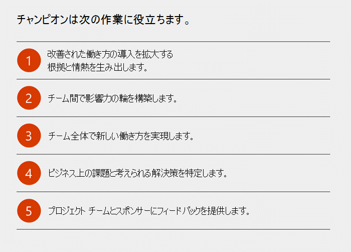

Microsoft Teams の変更管理戦略を作成する
=======================================================

新しいテクノロジーに対するエンドユーザーの啓発とその導入に関する変更管理戦略は、組織で新しいテクノロジーのロールアウトを成功させる上で非常に重要な意味を持ちます。展開におけるこの段階を正しく遂行することによって、新しいエクスペリエンスへのユーザーの適応と満足を獲得できます。

この領域の重要なベスト プラクティスを特定しています。

1.  主要なステークホルダーとユーザー オーディエンスを特定する

2.  ビジネスの成果を特定、選択する

3.  導入キャンペーンの設計、開始、管理には次の項目が含まれます。

    a.  ポスター、電子看板、イベントなどの内部の啓発資料

    b.  自助に役立つ情報やトレーニングの情報を 1 つの場所に統合する

    c.  成功の測定方法を選択する

4.  チャンピオン プログラムを構築する

5.  標準のフィードバック方法を提供する

6.  成功を測定、共有する

7.  フィードバックに基づきメッセージングや方法を調整し、それを繰り返します。

主要なステークホルダー、ユーザー、チャンピオンを特定する
-----------------------------------------------

導入を成功させるための最初のルールは、変更を促進し、効果的にその影響を浸透させることのできる主要なステークホルダーと適切なメンバーで構成される動的なチームを編成することです。導入戦略の成功の第一歩は組織横断的に選ばれた献身的な個人で構成されるチームによって踏み出されます。主要なステークホルダーの役割には、エグゼキュティブ スポンサー、サービス所有者、IT 専門家、チャンピオンが含まれます。

|  |  |
|---------|---------|
|     |**エグゼキュティブ スポンサー**とは、組織内の主要なリーダーであり、彼らの参加は従業員の適応を促進する上で欠かすことができません。企業文化に対して最も大きな影響力を持つ彼らは新しいテクノロジーや手法の価値や恩恵を積極的に伝えることができます。         |
|     |**サービス所有者**は、人々がサービスを使用し、そこから価値を引き出せるようにする責任があります。組織内でサービス所有者を設定することは、Office 365 に対して設定したビジネス目標を実現させる上で重要です。         |
|     |組織全体ですべてのユーザーから賛同を得ることは困難です。**チャンピオン**は、この困難を軽減し、Office 365 の導入に欠かせない重要な役割を果たします。チャンピオンは、専門性を深めるための取り組み、同僚の指導や支援を惜しまない知識豊富な存在です。彼らのサポートにより、部門やチームで Office 365  の導入を実現することができます。         |

定期的にステークホルダー会議を行い、プログラムの進捗状況について最新情報を保つようにします。企業文化によっては、フィードバックやディスカッションを行う「コラボレーション審議会」を設立すると有益な場合があります。

|  |  |
|---------|---------|
|  ヒント    |この種類の展開では、変更に対する最大の障害となりえる人たちは同時に最良の協力者となり得ます。早い段階からこうした組織メンバーと関わりを持ち、彼らの懸念や問題に頻繁に耳を傾けることをお勧めします。彼らはキャンペーンの成功率を高める貴重なフィードバックを提供してくれます。         |

ユーザー プロファイル
-------------

環境におけるユーザーの種類を理解することも重要です。主にモバイルを使用しているユーザー、常に会議に出席したりプレゼンテーションを行っているユーザー、既存のコラボレーション ソリューションで最も困難な問題を抱えているユーザーなどが存在します。ユーザー コミュニティを区分することで、変更に対して最もオープンな姿勢のグループを特定できます。こうしたグループは、初期のビジネス パイロットにとっての最良のターゲットであり、メンバーは極めて価値のあるフィードバックを提供してくれます。

ユーザーの 1 日の日程を理解することは、ビジネス成果の優先順位設定、展開に適した導入目標の設定、長期的な使用の持続に役立てることができます。

チャンピオン
---------

コラボレーション チャンピオンとなり得る個人を特定することで、実装のサポート チームを拡張できます。計画に対する洞察やフィードバックを初期の段階から提供して、コミュニティを形成します。このコミュニティに対して時間、注目、報酬といった何らかの投資を行うと、その見返りとして実装に対するサポートや熱心な活動を得ることができます。

チャンピオン プログラムの構築について詳しく知るには、[チャンピオン プログラムを構築する](https://go.microsoft.com/fwlink/?linkid=854665)を行います。

ビジネス成果と成功の測定方法を特定し選択する
---------------------------------------------------------------

主要なステークホルダーとユーザー区分を特定すれば、ビジネス成果の特定は簡単に行うことができます。ビジネス成果のいつかの例を次に示します。

-   従業員の強化

-   製品の改良

-   顧客の関与性の向上

-   運営の最適化

調整がうまくいかず優れたエクスペリエンスを提供できない営業担当者、製品やサービスを提供するために調整を向上させる必要がある場合、従業員の人事に関連する経験など、各組織には独自の優先順位があります。初期のパイロットで対応する優先度は最大で 3 つ選択することをお勧めします。

変更にオープンな姿勢のユーザー、モバイル ユーザーまたは施設内で作業するユーザーなど、ユーザーのシナリオも考慮することをお勧めします。サポートしてくれるエグゼキュティブ スポンサーやチャンピオンのグループに対するユーザーの親密度、変更を浸透させるために使用できる既存のコミュニティや伝達方法なども考慮する必要があります。

テクノロジー プロジェクトでは、人的な変更管理の要件に対する注目を怠ると困難に直面します。次に示す推奨事項を参考にすることで、成功率を高めることができます。

導入キャンペーンを設計、開始、管理する
-------------------------------------------------

初期パイロットおよびその後の会社全体でのロールアウトの両方にとって、内部伝達は優先事項です。内部伝達には次の項目が含まれます。

-   ポスター、電子看板、イベントなどの内部の啓発資料。

-   自助に役立つ情報やトレーニングの情報を 1 つの場所に統合する。

パイロット段階では、成功するために次の必要最低限の手順があります。

-   プロジェクト ステークホルダーとの情報更新を目的とした定期的な会議を開きます。

-   パイロットに参加している人たちから情報を収集するフィードバック方法を活用します。キャンペーンでは、ユーザーが参加してフィードバックを提供できる Microsoft Teams の公開チャネルを使用することができます。

-   製品ビデオなど、セルフヘルプの資料を利用可能にします。

-   パイロット ユーザーとキックオフ ミーティングを開いて、彼らの参加を歓迎します。熱意のあるコミュニティの雰囲気を作り出すことを過小評価してはいけません。

初期のパイロット段階が完了したら、上記の手順を組織全体に広げることができます。組織の規模によっては、時間がかかる場合があるため、地域、ユーザー プロファイル、組織別に対応することもできます。大規模なロールアウトでは、組織にいるコミュニケーターの専門的知識が非常に役に立ちます。初期の段階でこうした専門家を取り入れ、[利用可能な導入資料](https://go.microsoft.com/fwlink/?linkid=854598)または独自の資料を作成して活用することをお勧めします。

ニュース、情報、サポートなどを提供する中央イントラネット ポータルを備えている場合は、このロールアウトの情報ハブとして利用できます。セルフヘルプの情報、トレーニング、文書化されたガイダンスを幅広く利用可能にすることで、製品に対するすばやいユーザー関与を促進できます。多くのユーザーはこうした資料が利用可能になると同時に利用を開始するため、資料を提供することでこの傾向を促進することができます。学習方法は個人によって異なるため、中央情報ポータルを準備することで、組織内の多種多様な学習スタイルをサポートできます。

伝達や導入キャンペーンと同様に、最初から成功の測定方法を特定します。たとえば、次のような測定方法があります。

-   製品を積極的に利用するユーザー

-   情報 Web ページの表示回数

-   ユーザー コミュニティでの質問

-   トレーニング ビデオの再生回数

-   学習イベントの参加者
