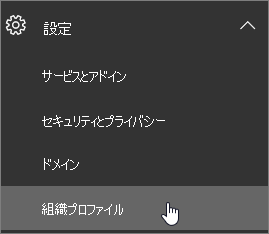
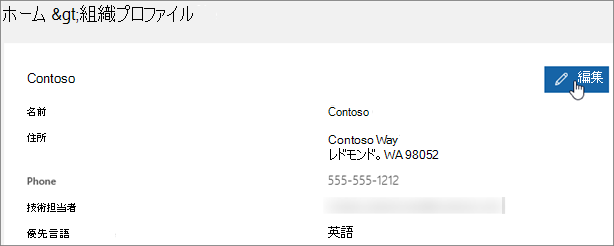

# 応答メッセージとメールに使用する既定の言語を変更する

[[Office 365 のグローバル管理者](https://support.office.com/article/da585eea-f576-4f55-a1e0-87090b6aaa9d)] の場合は、Skype for Business を設定して、別の言語で再生される既定のボイスメール応答メッセージを入れることができます。 既定のシステム応答メッセージは、たとえば「内田です。ただいま、席を外しております。 発信音の後に、メッセージを録音してください。 終わりましたら、電話を切るか、シャープを押して別のオプションを選択してください。」のようになっています。 
  
 **最初に、次の重要な情報をお読みください。**
  
- **利用できる言語は組織の場所によって決まります** 。 たとえば、組織が米国内にある場合は、既定の言語を英語またはスペイン語に設定できます。 組織がカナダにある場合は、英語とフランス語から選べます。 サポートされる言語のリストについては、「[Skype for Business からのボイスメールの応答メッセージに使用する言語](languages-for-voicemail-greetings-and-messages.md)」をご覧ください。
    
- **組織内の 1 人のユーザーのみに対してシステムの言語を変更する方法はありません。** 組織のユーザー全員に対してあいさつ文の言語を変更することのみが可能です。
    
    > [!NOTE]
    > ユーザーはサイン インした後に設定を操作して自身のあいさつ文の言語を変更できます。 
  
- **発信ボイス メール メッセージを録音する場合は、** 「[Skype for Business ボイス メールの確認とオプション](https://support.office.com/article/2deea7f8-831f-4e85-a0d4-b34da55945a8)」をご覧ください。

- **ボイスメール メッセージの言語を変更しますか。** [https://mysettings.lync.com/voicemail](https://mysettings.lync.com/voicemail) 、**プロンプトの言語**] の下の新しい言語を選択します。
    
## 組織のユーザー全員に対してシステムの言語を変更する

1. [Office 365 のグローバル管理者](https://support.office.com/article/da585eea-f576-4f55-a1e0-87090b6aaa9d)アカウントを使用してサインイン[https://portal.office.com/adminportal/home](https://portal.office.com/adminportal/home)。 
    
2. In the admin center, choose **Settings** > **Organization profile**. 
    
     
  
3. [ **編集**] を選びます。
    
    
  
4. [ **優先言語**] リストから、組織内のすべてのユーザーのための言語を選択します。
    
5. [ **保存**] を選びます。
    
## 管理者向けの関連記事

- [Office 365 の通話プランについて](what-are-calling-plans-in-office-365.md)
    
- [通話プランのセットアップ](set-up-calling-plans.md)
    
- [Skype for Business Server 2015 または Lync Server 2013 でオンプレミスの PSTN 接続を備えた Office 365 の電話システムを計画する](https://go.microsoft.com/fwlink/?LinkId=717947)
    
## 関連トピック

- [一般法人向け Office 365 で表示言語とタイム ゾーンを変更する](https://support.office.com/article/Change-your-display-language-and-time-zone-in-Office-365-for-Business-6f238bff-5252-441e-b32b-655d5d85d15b)
    
- [Office 2010 以降で別の言語を使用できるようにする](https://support.office.com/article/Add-a-language-or-set-language-preferences-in-Office-663d9d94-ca99-4a0d-973e-7c4a6b8a827d)
    
- [キーボード レイアウトの言語を有効化または変更する](https://support.office.com/article/Enable-or-change-a-keyboard-layout-language-1c2242c0-fe15-4bc3-99bc-535de6f4f258)
    
  
 
