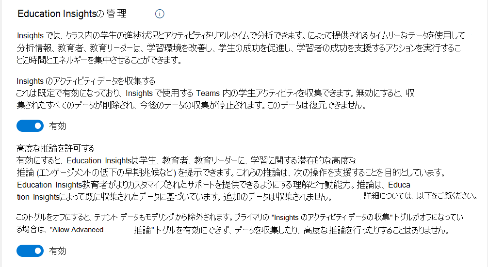

# Microsoft Teams の Education Insights への IT 管理者ガイド

このドキュメントでは、Microsoft Teams の Education Insights を稼働させ、教職員と教育リーダーがプラットフォームを採用してアプリを正常に使用できるようにするために必要な手順を説明します。

## 概要

**それぞれの生徒は独自の経験、スキル、声を持っています。** 
**Insights は、生徒を理解し、生徒のニーズに対応するのに役立ちます。**

Insights は、クラス内の生徒の進捗状況とアクティビティのリアルタイム分析を提供します。 簡単に理解できる視覚化がされているので、学校のコミュニティは生徒のエクスペリエンスを積極的かつ簡単に追跡できます。 教職員とリーダーには、クラス チームに関して十分な情報に基づいた決定をするための、意味があり信頼できるデータが提示されます。 このデータに基づいて、教職員は、生徒の感情的、社会的、および学術的なニーズが満たされていることを確認するために必要な情報を入手できます。

学校のコミュニティは、教職員がどの戦略が生徒に役立つかを知っている場合、努力を振り向け、より大きな影響を与えることができます。 Insights が提供するタイムリーなデータにより、教職員と教育リーダーは、学習環境を改善し、生徒の成功を促進し、学習者の成長を支援する行動を取ることに時間とエネルギーを集中させます。

## Insights の使用対象者

### 教職員

教職員とは、クラス チームを所有しているすべてのユーザーのことです。 教職員には、教師、講師、教授が含まれる場合があります。

教職員はクラスレベルで Insights にアクセスします。 クラスに割り当てられた生徒のアクティビティは表示されますが、他のクラスのデータにはアクセスできません。 Insights は、教職員が生徒を理解してサポートするのに役立ちます。

Insightsを使用するための前提条件はありません。教職員は、Insights を左側のアプリバーに追加するか、Teams の各クラスのタブとして追加するだけです。

教職者は教職員用ライセンスで識別されます。Insights でデータを表示するには、教職員は教職員ライセンスを持っており、クラス チームの所有者である必要があります。

### 教育リーダー

教育リーダーとは、学生の関与、進歩、幸福度などを理解するために組織的な見解を必要とする教育機関のすべての役割のことをいいます。教職員は、クラスチームを所有していて、クラス ビュー以上のもの (たとえば、対象部門の責任者) が必要な場合、教育リーダーになることもできます。 

教育リーダーには、最高学術責任者、学部長、地区リーダー、学校長、校長、カウンセラー、教科長、プログラム ディレクター、ソーシャル ワーカー、心理学者が含まれる場合があります。

教育リーダーは、IT 管理者によって割り当てられた権限に応じた組織ビューを取得します。 たとえば、学区の管理者は、アクセスするすべての学校を表示できます。 対照的に、学校の校長または学校の監督者は、その学校の学年とクラスのみを確認します。

スーパーバイザーも教えていると仮定すると、スーパーバイザーは教職員と教育リーダーの両方と見なされ、Insights の (教職員と教育リーダー向けの) 両方のビューにアクセスできます。 ここで、Insights は、教育リーダーが教職員と学生をサポートするのに役立ちます。
組織レベルでは、IT 管理者は学生情報システムに接続し、各役割に関連する学校または部門にアクセスするためのアクセス許可を割り当てる必要があります。

教育リーダーは教職員ライセンスによって識別されます。また、組織の Insights レポートを表示するには、ITグローバル管理者からの *明示的なアクセス許可* が必要です。

> [!NOTE]
> **学生について:**
>
> Insights は、Teams での学生の活動に関するデータを収集します。
>
> 学生は、Teams 内のクラス チームのメンバーです。 学生たちはライセンスによって識別され、たとえチームの所有者であっても Insights アプリまたはタブに **アクセスできません**。
>
> ゲストを学生と見なすことは *できません*。

## ユーザーはどこで Insights を見つけますか?

教職員と教育リーダーとでは、Insights にアクセスする方法が異なります。

### 教職員

教職員 は、次の 2 つの方法を使用できます。

- [パーソナル アプリ](https://support.microsoft.com/office/747fd8d9-00b0-43e6-bacc-a1bf030b1867) - すべてのアクティブなクラスの概要は、チームの左側のアプリ バーから入手でき、クラス データにドリルダウンすることができます。
- [タブ](https://support.microsoft.com/office/1386d1b4-3641-4a23-9b9c-0c6c774c2b6c) - 教職員が所有する各クラスの Insights は、上部のナビゲーション メニューから追加されたタブで使用できます。 このタブを使用すると、教職員は Teams のそのクラスにいるときに関連データに直接アクセスして、クラスのコンテキストでデータを確認できます。

Insights では、クラスチーム内のすべてのチャネルのアクティビティ データが表示されますが、パブリック チャネルにはタブとしてのみ追加できます。 このタブには、所有者以外のクラス チーム内の (クラス チームの所有者ではない教職員を含む) すべてのユーザーのアクティビティが反映されます。

どちらのビューでも、教職員はクラス データにアクセスできます。パーソナル アプリを使用すると、教職員はクラス レベルにドリルダウンする必要がありますが、タブではクラス データに直接アクセスできます。

クラス レベルでは、教職員がクラス チームを所有している場合、IT管理者が他のアクションを実行しなくてもInsightsを利用できます。

### 教育リーダー

教育リーダーは、Teams の左側のアプリ バーから利用できる[個人用アプリ](https://support.microsoft.com/office/8738d1b1-4e1c-49bd-9e8d-b5292474c347)として Insights を使用できます。

組織レベルでは、IT 管理者は学生情報システムに接続し、各役割に関連する学校または部門にアクセスするためのアクセス許可を割り当てる必要があります。

たとえば、校長は学校のクラスのみを表示したり、学部長は学部のクラスのみを表示したりします。
学生のデータはクラス、学部、学校、地区のレベルで集計され、(各ユーザーの許可に基づいて) 各レベルで洞察を提供します。教職員と教育リーダーの両方がズーム インして、個々の生徒のデータを表示できます。

**Teams に Insights アプリを追加するには:**

- アプリ バーの **[...]** を選択します。
- **Insights** を検索して選択します。
- 説明画面が開きます。 **[追加]** を選択します。

  :::image type="content" source="media/insights-add-personal-app.png" alt-text="Teams に Insights を追加します。":::

- Insights アイコンを右クリックし、**[固定]** を選択します。

  :::image type="content" source="media/insights-pin-app.png" alt-text="Insights アプリを固定します。":::

> [!TIP]
> 次のリンクから Insights アプリを見つけることもできます。[https://aka.ms/addInsights](https://aka.ms/addInsights)

## インサイトはいつ使用されますか?

Insights は、**学習サイクル** 全体で学習コミュニティをサポートしています。Insights は、複数のディメンションにわたるリアルタイムメトリックを使用して、学校コミュニティのメンバー間で識別、リフレクション、ディスカッション、アクションの継続的なサイクルをサポートします。

- 学生が教職員、コース資料、および学友といつどのように関わるか、そして彼らが課題をどのように実行するかを **特定** します。
- 入力が学生が成功するようにサポートする方法、成長する領域を決定する方法、および支援が必要な場所を **検討** します。
- 調査結果について生徒や学校のコミュニティと **話し合い**、関係を強化し、目標を設定し、自己レビューし、コラボレーションを促進し、成果を向上させます。
- 介入を開発し、成長分野に関するフィードバックを提供し、教育戦略を修正し、必要な追加のサポートを特定するために **行動を起こします**。

:::image type="content" source="media/insights-learning-cycle.png" alt-text="Insights は、学習サイクル全体を通じて学習コミュニティをサポートします。":::

## Insights はどのように機能しますか?

Insights は、教職員がより良い学習成果を提供するのに役立つ強力な分析を生成します。 これは、Teams 内の学生の活動を分析し、オプションで、提供する学生情報システム (SIS) データを使用して、その活動のコンテキスト化とグループ化を支援することによって行われます。

教育機関に Insights の導入を開始する前に、Insights の仕組み、データ倫理への取り組み、および必要なライセンスの概要について確認します。

### データ収集

Teams での学生と教職員の活動から Insights のデータが収集されます。 ゲスト データは収集されません。

Insights は、教職員に関するデータを表示 *しません*。 データの分析は、教育と学習に役立つ実用的な情報を提供します。

現在、データはクラス チームの次の領域から収集されています。

|Teams コンポーネント|収集データ|
|---|---|
|**割り当て**|課題の開始、提出、採点。|
|**チャネル エンゲージメント**|チャネルに移動して投稿を作成したり、(チャット コンテンツを含まない) 投稿に返信したり、高く評価したりできます。|
|**ファイル**|ファイル (ファイル コンテンツを含まない) のアップロード、ダウンロード、アクセス、変更、コメント添付、共有。|
|**OneNote Class Notebook**|ノートブックのページまたはセクションの編集 (ページ コンテンツは含まれません)。|
|**会議**|出席 (会議コンテンツを含まない)。|
|**[音読みの進行状況](https://support.microsoft.com/topic/e71705a2-a79a-4d7e-bcef-a1e0aa336017)**|精度率、最も困難な単語、および 1 分あたりの単語数。|
|**[Reflect](reflect.md)**|チェックイン (値を含む)。|
|**キャリア コーチ**|学生が提供する専攻 (研究分野) と学年、キャリア コーチ アプリでの学生のアクティビティ (スキル、スキルの関心、キャリアの関心、学習の関心、キャリア関連のアクティビティなど)。|

> [!NOTE]
> 収集されたデータのほとんどは、数分以内に Insights に表示されます。クラス ミーティング (クラス チャネルの 1 つに関連するミーティング) への出席は、ミーティングの終了後数時間で、通常は最大 24 時間後に表示されます。

> [!NOTE]
> Education Insights で収集されたデータは、IT 管理者が [Education Analytics トグル](#turn-sds-for-insights-on-or-off) をオフにするか、テナントの Office サブスクリプションが終了するまで保持されます。Teams で特定の機能をオフにしても、履歴データは削除されません。

### プライバシーとセキュリティ

Microsoft 365 の一部として、Reflect は、[GDPR](/compliance/regulatory/gdpr) や学生の教育記録のプライバシーを保護する [学生と子供のセキュリティに関する家族教育権およびプライバシー法 (FERPA)](/compliance/regulatory/offering-ferpa) など、データの収集と使用に関する国、地域、業界固有の規制を満たしています。

データは教育機関に属し、Microsoft はデータを収集して保存するだけです。 Microsoft の担当者は、データ リカバリなど、サービスを維持するための監査された方法でコンプライアンスによって許可されている場合を除き、データにアクセスしたり、データを表示したりすることはできません。

> [!TIP]
>
> - [Microsoft トラストセンターの](https://www.microsoft.com/trust-center) にアクセスして、Microsoft でデータを保護している方法をご確認ください。
> - [Microsoft コンプライアンス オファリング](/compliance/regulatory/offering-home) にアクセスして、Microsoft 365 がお客様の機関で規制コンプライアンス基準を満たすためにどのような役割を果たすかご確認ください。

### パフォーマンスと信頼性

Insights は、最適なパフォーマンスと信頼性を実現して Teams のアクティビティから収集される大量のデータを処理するように設計されています。 100％ の可用性を保証することはできませんが、可能な限りその目標に近い状態で利用できるように努めています。

[Insights] タブが Teams にインストールされているかどうかに関係なく、データ収集のプロセスは別のサーバーで実行されます。 Teams の機能の残りを使用しているので、[Insights] タブや個人用アプリは、教職員と学生用のアプリケーションのパフォーマンスやネットワーク帯域幅には影響しません。

> [!TIP]
> 詳細については、「[EDU 向けの Teams の低帯域幅状況を解決するためのヘルプ](edu-remote-low-bandwidth.md)」をご確認ください。

### データ記憶域

Insights は現在、ヨーロッパと米国で展開されています。 欧州のテナントのInsights データは、欧州にあるサーバーに格納されています。 オーストラリア ベースおよび米国 ベースのユーザーのデータは、米国のサーバーに保存されます。 ヨーロッパ、オーストラリア、または米国以外のユーザーのデータは、当社の地理的地域の 1 つに保存されます。

### データを倫理的に使用する

私たちは、責任を持って倫理的にデータを使用することをお約束します。 Insights は、責任を負うデータと AI に関する Microsoft の原則に従います。 これは、データがどのように使用されるかについて透明性を持ち、教育者と学生の利益を最優先することを意味します。  私たちは最高のセキュリティとプライバシーの基準を使用し、継続的な信頼性と正確性を監視し、教育機関の継続的なコンプライアンスを保証します。

Microsoft は、データ保護を確実にするために Insights をゼロから構築しました。 私たちは、このデータがどのように使用されるかについての潜在的な機密性を認識しており、あなたのデータと個人のプライバシーを大切にしています。

#### 学習をサポートするデータ

Insights は、学生の学習とデジタル エンゲージメントにスポットライトを当てています。 データは学習をサポートし、デジタル学習プラットフォームでの学生の関与のレベルを示しています。 クラス アクティビティの個々のレベルにドリル ダウンすることはできますが、Microsoft はこれらのアクションに割り当てられた **正または負の値を割り当てません**。 データを収集する目的は、学生と教職員が最善を尽くすのをサポートすることです。

教職員は学生について最もよく知っており、理解しています。 Insights で提示される情報は、デジタル学習シナリオで **学生にサポートを提供する** 手助けをするためにあります。 この情報は、対面での環境で利用できる分析情報を再現します。 たとえば、学生が特定の期間活動していないか、先週は時間どおりにすべての課題を完了しなかったとします。 データは教職員に表示され、適切なナッジを提供したり、生徒にチェックインしたりします。 学生、学生の家族、または保護者と連絡を取り合って、検知されたアクティビティの原因を特定したり、アクティビティがなかったことへの原因を特定するのは、教職員の責任の範ちゅうです。

Insights は、デジタル学習環境フレームワークで学生と教職員の両方をサポートするように設計されています。 Insights は、**教職員に関するデータを直接キャプチャしません**。 個々の学生データに加えて、特定の教職員との学生の活動と結果の集計を提供し、教育リーダーが学生と教職員をサポートできるようにします。

### ライセンス

Insights にアクセスするには、ユーザーは Microsoft 365 の A1、A3、またはA5 教員ライセンスを持っている必要があります。

*Education Insights Premium* は、教育機関のリーダーに Education Insights データの組織レベルのビューを提供し、教師の履歴データ ビューへのアクセスを拡張する有料アップグレードです。 対象となる教育機関は、教育ソリューション加入契約 (EES)、クラウド サービス プロバイダー (CSP)、そして Microsoft 365 管理センター (Web ダイレクト) を通じて *Education Insights Premium* アドオン ライセンスを購入できます。

Education Insights Premium アドオンは、テナント内のすべてのデジタル アクティブな学生のライセンスの購入に基づいて組織で利用できるようになります。

## 学生情報システム (SIS) への統合

より多くのデータが Insights に提供されるほど、教師はより適切に学生をサポートでき、教育リーダーはより適切に教師をサポートできます。

組織レベルの Insights を提供するには、[学校データ同期 (SDS)](/SchoolDataSync) を使用して学生情報システム (SIS) に接続する必要があります。これは、Insights が教育システムの階層構造を正しくマッピングできるようにするためです。

クラスの教師としてクラス レベルの Insights を表示する場合は、その必要は *ありません*。これは、Teams のクラス構造とアクセス許可が使用されるためです。

詳細については、「[**学生情報システム (SIS) データを Education Insights と同期する**](education-insights-sis-data-sync.md)」をご確認ください。

## 権限の管理

IT管理者として、教育指導者、地区指導者、校長、教頭、カウンセラー、学習分野の責任者、プログラムディレクター、ソーシャルワーカー、心理学者に権限を与えることができます。教育関係者は、クラスチームを所有している場合、*自動的* に権限が与えられます。

詳細については、「[**Education Insights へのユーザー アクセスを管理する**](education-insights-manage-access.md)」を参照してください。

## 設定ポリシーの管理

IT 管理者として、教職員やリーダーが Teams の使用を開始する場合にアプリ設定ポリシーを使用して既定で Insights をインストールすることができます。 このポリシーを使用すると、Teams をカスタマイズして、Insights を強調表示したり、アプリ バーにInsightsをピン留めしたりすることができます。

教育者が各クラスに直接アクセスしたい場合は、上部のナビゲーション メニューの [Insights] タブを手動でインストールできます。 このタブを使用すると、教職員は Teams のそのクラスにいるときに関連データに直接アクセスして、クラスのコンテキストでデータを確認できます。

どちらのビューでも、教職員はクラス データにアクセスできます。パーソナル アプリを使用すると、教職員はクラス レベルにドリルダウンする必要がありますが、タブではクラス データに直接アクセスできます。

> [!TIP]
> 詳細については、「[教育機関向け Teams ポリシーおよびポリシー パッケージ](./policy-packages-edu.md)」をご確認ください。

## Insights の導入をすすめる

所属する教育機関に Insights の使用をおすすめしてください。

次の資料は **教職員** のみなさんにご自由に配布できます。

- 詳細については、[Insights サポート ページ](https://support.microsoft.com/office/27b56255-90c0-47aa-bac3-1c9f50157181)を確認してください。
- すぐに起動して実行 – [Insights についての 1 ページの PDF を入手してください](https://aka.ms/insights/start)。
- [完全ガイド PDF](https://aka.ms/insights/guide) をお読みください。
- Insights の使用方法に関する[手順ごとのチュートリアル](https://aka.ms/insights/resources)をご覧ください。
- Microsoft 教師センターの[無料の Insights コース](https://aka.ms/insights/course) を使って、ご自身でトレーニングできます。
- そして最後に、Insights 専用の[このブログ](https://techcommunity.microsoft.com/t5/education-blog/6-ways-to-be-insight-ful-and-support-student-engagement/ba-p/1903091)をチェックしてください。

**教育リーダー** 向けの資料:

- [教育機関向けの分析情報サポート ページ](https://support.microsoft.com/office/8738d1b1-4e1c-49bd-9e8d-b5292474c347)。

### Insights のオンとオフを切り替える

既定では、Insights が有効になっています。これにより、Microsoft は Teams 内の学生のアクティビティの分析情報を Insights で使用できます。 Insights からオプトアウトした場合、Insights に *収集されたすべてのデータを削除* し、今後のデータの収集を停止します。 Insights を再びオンにすると、再度有効になった時点からデータの収集が開始されます。

*Education Insights* を制御できる場所は 2 つあります。 どちらのオプションで作成しても、同じ結果になります。 *SDS (クラシック)* から *プロビジョニング用 SDS* に移行したお客様は、Teams クライアント オプションのみを使用できます。

#### SDS 管理センターで Insights のオンとオフを切り替える

1. [SDS 管理センター](https://sds.microsoft.com/)を開きます。
1. **[設定]** > **[Education Insights の管理]** の順に移動します。
1. **[Insights のアクティビティ データを収集する]** トグルを調整します。

#### Teams クライアントで Insights のオンとオフを切り替える

1. *Education Insights* の個人用アプリがピン留めされていない場合は、[次の手順](class-insights.md#education-leaders)に従って追加します。
1. Microsoft 365 管理者アカウントを使用して、*Education Insights* の右上隅にある省略記号アイコンを使用して、**[管理者設定]** ページを開きます。
1. **[Insights のアクティビティ データを収集する]** トグルを調整します。

> [!NOTE]
> Insights をオフにした場合、収集されたデータは削除されます。 オプトアウトによって削除されたデータは、Insights が再び有効になった場合でも、後から復元することはできません。

### Insights で高度な推論のオンとオフを切り替える

Education Insights の **[高度な推論を許可する]** トグルがオンになっている場合、Education Insights は、学生、教師、および教育リーダーに、学習に関する高度な推論 (エンゲージメント警告など) を提示する場合があります。 これらの推論により、教師は学生により合わせたサポートを提供できます。 トグルは、モデリングのためのテナント データの使用も制御します。

このトグルをオンにしても、Education Insights によって既に収集されているデータ以外に追加のデータは収集されません。

*高度な推論* を制御できる場所は 2 つあります。 どちらのオプションで作成しても、同じ結果になります。 *SDS (クラシック)* から *プロビジョニング用 SDS* に移行したお客様は、Teams クライアント オプションのみを使用できます。  

#### SDS 管理センターで高度な推論のオンとオフを切り替える

1. [SDS 管理センター](https://sds.microsoft.com/)を開きます。
1. **[設定]** > **[Education Insights の管理]** の順に移動します。
1. **[高度な推論を許可する]** トグルをオフまたはオンに調整します。

#### Teams クライアントで高度な推論のオンとオフを切り替える

1. *Education Insights* の個人用アプリがピン留めされていない場合は、[次の手順](class-insights.md#education-leaders)に従って追加します。
1. Microsoft 365 管理者アカウントを使用して、*Education Insights* の右上隅にある省略記号アイコンを使用して、**[管理者設定]** ページを開きます。
1. **[高度な推論を許可する]** トグルをオフまたはオンに調整します。

> [!NOTE]
> このトグルは、**[分析情報のアクティビティ データを収集する]** トグルに依存します。 **[Insights のアクティビティ データを収集する]** をオフにすると、**[高度な推論を許可する]** トグルもオフになります。

### Insights 用 SDS をオンまたはオフにする

School Data Sync (SDS) は、Student Information System (SIS) データをインポートおよび同期するプロセスを自動化するために役立ちます。

Insights を使用するときに SDS を使用する必要は *ありません*。 ただし、いつでも Insights からオプトアウトすることを選択できます。

- Insights でSchool Data Sync の使用をオフにするには、[[Insights で SDS を無効にする]](/schooldatasync/how-to-deploy-sds-for-insights#disabling-sds-for-insights) の手順に従ってください。

- これを元に戻すには、「[Insights 用 SDS の展開方法](/schooldatasync/how-to-deploy-sds-for-insights)」の手順に従ってください。

### Education Insights からユーザー データを削除する方法

Insights は、Microsoft Teams for Education で実行された学生と教育者のアクティビティを保存します。

Insights によって収集されるデータには、次の 2 つの種類があります:

- **混合データ** – クラス学習活動の一部として生成されるデータ。
- **非混合 (プライベート) データ** – クラス学習活動の一部ではない Teams for Education の学生アクティビティによって収集されたデータ。

Insights によって収集された完全なデータは、[ここに](class-insights.md#data-collection)リストされています。

過去の時間枠のデータの完全性と整合性を教育者と教育リーダーに提供するために、既定では、Insights は学生または教育者のユーザー アカウントが閉じられたときにサービスからデータを自動的に削除しません。 組織の IT 管理者は、次の手順を実行することにより、ユーザー (教育者または学生) データの手動削除を要求できます。

- [サポート チケット](https://aka.ms/edusupport)を開きます。 サポートチケットには、GDPR 削除 DSR 操作の要求を明確に記載し、削除するユーザーオブジェクト ID を入れる必要があります。
削除するデータセットまたは時間帯を制限することはできません。
- 要求では、IT 管理者は、次のオプションから、そのユーザーに対して削除する必要のあるデータの種類を明確に示す必要があります:
  - すべてのデータ (混合およびプライベート)
  - すべてのプライベート データ
  - キャリア コーチのデータのみ
- 提出されると、サポート チケットは、コンプライアンスの最小保持ポリシーを満たすために 1 週間キュー内で待機します。 この間、操作をキャンセルすることができます。
- 1 週間後、Education Insights チームは、上記の特定の種類のユーザー ID に関連するすべてのデータがサービスから削除されることを確認します。 Microsoft サポートが チケットを監視し、28 日以内に削除プロセスが完了したことを通知します

## トラブルシューティング

### 自分の教育機関が Insights でデータを表示できないのはなぜですか?

*新規* テナントで、Insights でデータを *見たことがない* 場合、テナントが Insights にアクセスするために **教育テナントとして認証されているかどうか** を確認してください。 Microsoft アカウント マネージャーに問い合せて、テナントが正しく構成されていることを確認するよう依頼します。

アカウント マネージャーがいない場合は、チケットをオープンにします。 [Microsoft 365 管理センター](https://admin.microsoft.com/AdminPortal/) > **[サポート]** > **[新しいお問い合わせ]** の順に移動します。  チケットのタイトルに「教育機関の認証に関するサポートが必要」と記載します。

また、Insights のデータ収集が有効になっていることを確認します。 既定でオンになっている間は、IT 管理者がオフにしている可能性があるため、Insights が保持しているすべてのデータが削除されます。

これを確認するには、[SDS 管理センター](https://sds.microsoft.com)を開き、**[設定]** > **[Education Insights の管理]** の順に移動します。 [Insights のアクティビティ データを収集する] の状態を確認します。

オフになっている場合は、オンに戻します。Insights はデータの収集を開始しますが、レポートでデータを確認するには最大 24 時間かかる場合があります。

### すべてではなく、一部の生徒またはクラスのデータが表示されるのはなぜですか?

*ライセンスを取得した* 生徒のデータのみを収集するため、最も可能性の高い理由は、ゲスト生徒がクラスに参加していて、そのデータが収集されていないことです。 名前は表示されるかもしれませんが、データはありません。

生徒の状態を確認して、全員がライセンスを持っていることを確認します。

### なぜ教育者は会議データを表示できないのですか?

Insights レポートで会議データを表示するには、最大 24 時間かかります。 十分な時間が経過したことを確認してください。

また、生徒が [Teams アカウントなしでクラス会議に参加](https://support.microsoft.com/office/c6efc38f-4e03-4e79-b28f-e65a4c039508)しなかったことを確認してください。 このようなシナリオでは、生徒のアクティビティは収集されません。

> [!TIP]
> 生徒の出席状況を追跡する必要がある教育者は、会議中に生徒に返信を求めるメッセージを送信することをおすすめします。これで生徒の出席状況が数分でわかるようになります。

> [!NOTE]
> 質問にまだ回答がない場合は、[サポート チケットをオープン](https://aka.ms/edusupport)してください。 問題を示すスクリーンショットと、問題が発生した日付を含めます。 問題の解決に役立つと思われるデータを追加してください。

### Education Insights Premium をアクティブにするにはどのようなライセンスが必要ですか?

組織で Education Insights Premium を有効にするには、テナントは、組織のテナント内のデジタル アクティブな学生の数に基づいてライセンスを購入する必要があります。 つまり、会議、コミュニケーション、チャット、課題、ファイルの編集、クラス ノートブック、リフレクトなどのアクティビティの学校での作業の一部として Teams クラスを使用するすべての学生向けです。
