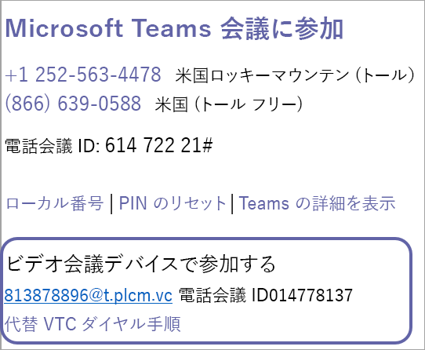

# Microsoft Teams のクラウド ビデオ相互運用機能の設定Set up Cloud Video Interop for Microsoft Teams

[クラウド ビデオ相互運用パートナーを選択](cloud-video-interop.md)した後は、展開を計画し、プロビジョニングの詳細とパートナーのテナント キーを使用して設定を行い、組織のビデオ相互運用アプリに同意する必要があります。After you have [chosen your Cloud Video Interop partner(s)](cloud-video-interop.md), you will need to plan your deployment, get set up with provisioning details and partner tenant key, and consent to the video interop app in your organization. この手順を次の図に示します。The following diagram outlines the process. 

## 計画Plan

組織で使用するパートナーを特定する方法については、「[Microsoft Teams のクラウド ビデオ相互運用](cloud-video-interop.md)」を参照してください。See [Cloud Video Interop for Microsoft Teams](cloud-video-interop.md) for information about identifying a partner or partners to use in your organization. 

ユーザー ベース、同時、サイト全体での有効化を計画するにはTo plan for user based/concurrent/site wide enablement: 

- 使用する展開モデルやホスト モデルを選ぶPick a deployment model/hosted model for your use
- 組織に最適なライセンス プランを選択するSelect the license plan ideal for your organization. 
- ビデオ インフラストラクチャをホストしている VM の容量を計画するPlan for capacity of VMs is you are hosting your video infrastructure.

## 構成Configure 

クラウド ビデオ相互運用を構成するには、次の手順を実行します。To configure Cloud Video Interop, follow these steps. 

1. 選択したパートナーから構成情報 (テナント キー、アプリ ID など) を入手します。Obtain configuration info from the partner/partners you have chosen (tenant key, appIds…). 組織では、1 つまたは複数のビデオ相互運用パートナーを使用できますYou can use one or more video interop partners in your organization 

2. ネットワークが正しく構成されていることを確認します。Ensure that your network is configured correctly. 境界ネットワーク トラバーサルをサポートするために、標準ベースのビデオ ファイアウォールを構成します。Configure your standards-based video firewall for perimeter network traversal to support. 次に例を示します。For example: 
    - Cisco VCS-eCisco VCS-e                  
    - Polycom RPADPolycom RPAD

3. 統合された会議室を Exchange と OTD を使用して構成します。Configure integrated rooms with exchange and OTD. ほとんどの場合、追加の中継は、環境でセットアップして構成する必要があります。In most cases, additional relay would need to be set up and configured in your environment.

## プロビジョニングProvision
 
テナント キーは、パートナー サービスへのダイヤル アウトになります。The tenant key will be the dial out to the partner service. 次の例では、813878896@t.plcm.vc がテナント キーです。In the following example, 813878896@t.plcm.vc is the tenant key. 

 

テナント キーをプロビジョニングするには、次のコマンドレットを実行する必要があります。また、選択したユーザーまたは組織全体がビデオ相互運用座標を使用して会議を作成できるようになります。You will need to execute the following cmdlets to provision the tenant key, and also enable select users or your whole organization to create meetings with video interop coordinates.

 
- **[Get-CsTeamsVideoInteropServicepolicy](/powershell/module/skype/get-csteamsvideointeropservicepolicy):** Microsoft では、サポート対象の各パートナーに対して、クラウド ビデオ相互運用性に使用するパートナーを指定できる事前構築ポリシーを提供しています。**[Get-CsTeamsVideoInteropServicepolicy](/powershell/module/skype/get-csteamsvideointeropservicepolicy):** Microsoft provides pre-constructed policies for each of our supported partners that allow you to designate which partner(s) to use for cloud video interop.

    このコマンドレットは、組織内で使用できる事前構築ポリシーを指定できます。This cmdlet allows you to identify the pre-constructed policies that you can use in your organization. Grant-CsTeamsVideoInteropServicePolicy コマンドレットを使用して、このポリシーを 1 人または複数のユーザーに割り当てることができます。You can assign this policy to one or more of your users leveraging the Grant-CsTeamsVideoInteropServicePolicy cmdlet.
 
- **[Grant-CsTeamsVideoInteropServicePolicy](/powershell/module/skype/grant-csteamsvideointeropservicepolicy):** Grant-CsTeamsVideoInteropServicePolicy コマンドレットを使用すると、組織で使用するために事前構築されたポリシーを割り当てたり、特定のユーザーにポリシーを割り当てたりすることができます。**[Grant-CsTeamsVideoInteropServicePolicy](/powershell/module/skype/grant-csteamsvideointeropservicepolicy):** The Grant-CsTeamsVideoInteropServicePolicy cmdlet allows you to assign a pre-constructed policy for use in your organization or assign the policy to specific users.
 
- **[New-CsVideoInteropServiceProvider](/powershell/module/skype/new-csvideointeropserviceprovider):** New-CsVideoInteropServiceProvider を使用して、組織が使用するサポート対象の CVI パートナーに関する情報を指定します。**[New-CsVideoInteropServiceProvider](/powershell/module/skype/new-csvideointeropserviceprovider):** Use the New-CsVideoInteropServiceProvider to specify information about a supported CVI partner your organization would like to use.
 
- **[Set-CsVideoInteropServiceProvider](/powershell/module/skype/set-csvideointeropserviceprovider):** Set-CsVideoInteropServiceProvider を使用して、組織が使用するサポート対象の CVI パートナーに関する情報を更新します。**[Set-CsVideoInteropServiceProvider](/powershell/module/skype/set-csvideointeropserviceprovider):** Use the Set-CsVideoInteropServiceProvider to update information about a supported CVI partner your organization uses.
 
- **[Get-CsVideoInteropServiceProvider](/powershell/module/skype/get-csvideointeropserviceprovider):** 組織内で使用するために構成されているすべてのプロバイダーを取得します。**[Get-CsVideoInteropServiceProvider](/powershell/module/skype/get-csvideointeropserviceprovider):** Get all of the providers that have been configured for use within the organization.
 
- **[Remove-CsVideoInteropServiceProvider](/powershell/module/skype/remove-csvideointeropserviceprovider):** Remove-CsVideoInteropServiceProvider を使用して、組織で使用しなくなったプロバイダーに関するすべてのプロバイダー情報を削除します。**[Remove-CsVideoInteropServiceProvider](/powershell/module/skype/remove-csvideointeropserviceprovider):** Use Remove-CsVideoInteropServiceProvider to remove all provider information about a provider that your organization no longer uses.  
 
## 同意Consent

パートナー サービスを介して組織の会議に参加するには、ビデオ会議デバイス (VTC) に対するアクセス許可の同意を付与する必要があります。You will need to provide permission consent for the video teleconferencing devices (VTCs) to join your organizations meetings via the partner service. また、この同意リンクはパートナーによって提供されます。This consent link will also be provided by your partner.  
 
これらの手順が完了すると、上記の Grant コマンドレットを使用して個別に有効にされたユーザー、またはテナントが有効な場合は組織内のすべてのユーザーが、スケジュールされているすべての Teams 会議において VTC 座標を持つようになります。When these steps are complete, the users who are individually enabled via the Grant cmdlet above, or all of the users in the organization if the tenant is enabled, will have VTC coordinates in all the Teams meetings that they schedule. すべての VTC は、これらの座標を使用してこれらの会議に参加できます。Any VTC can join these meetings via those coordinates.

|名前Name|アプリケーションのアクセス許可の簡潔な説明Application Permission Short Description| 説明Description|
|--|--|---|
|Calls.JoinGroupCall.AllCalls.JoinGroupCall.All|グループ通話と会議にアプリとして参加する (プレビュー)Join Group Calls and Meetings as an app (preview)|アプリで、サインインしているユーザーがいなくても、組織のグループ通話やスケジュールされた会議に参加することができるようにします。Allows the app to join group calls and scheduled meetings in your organization, without a signed-in user.  このアプリでは、ディレクトリ ユーザーの特権を使用してテナントの会議に参加します。The app will be joined with the privileges of a directory user to meetings in your tenant.|
|Calls.JoinGroupCallasGuest.AllCalls.JoinGroupCallasGuest.All|グループ通話と会議にゲスト ユーザーとして参加する (プレビュー)Join Group Calls and Meetings as a guest user (preview)|アプリで、サインインしているユーザーがいなくても、組織のグループ通話とスケジュールされた会議に匿名で参加することができるようにします。Allows the app to anonymously join group calls and scheduled meetings in your organization, without a signed-in user.  このアプリは、テナントの会議にゲストとして参加します。The app will be joined as a guest to meetings in your tenant.|
|Calls.AccessMedia.AllCalls.AccessMedia.All|通話内のメディア ストリームにアプリとしてアクセスする (プレビュー)Access media streams in a call as an app (preview)|アプリで、サインインしているユーザーがいなくても、通話内のメディア ストリームに直接アクセスすることができるようにします。Allows the app to get direct access to media streams in a call, without a signed-in user.|
|OnlineMeetings.Read.AllOnlineMeetings.Read.All|オンライン会議の詳細を読み取る (プレビュー)Read Online Meeting details (preview)|アプリで、サインインしているユーザーがいなくても、組織内のオンライン会議の詳細を読み取ることができるようにします。Allows the app to read Online Meeting details in your organization, without a signed-in user.|

## スケジュールSchedule

次に、ビデオ相互運用座標を使用して Teams 会議をスケジュールします。Next, schedule Teams meeting with video interop coordinates. 有効なユーザーは、次のようにして Teams 会議をスケジュールできます。The enabled user can schedule teams meetings via:
- [Outlook 用 Teams 会議アドインTeams Meeting add-in for Outlook](teams-add-in-for-outlook.md)
- チーム クライアントのデスクトップとモバイルTeams client desktop and mobile

## 参加Join

次の方法で、Teams 会議を VTC デバイスと結合できます。You can join Teams meetings with your VTC devices in the following ways:
 
- IVR (対話型音声応答)IVR (Interactive voice Response)
    - tenantkey@domain を使用して、パートナーの IVR にダイヤルインできます。You can dial in to the partner's IVR using the tenantkey@domain. 
    - パートナー IVR に入ると、VTC conferenceId を入力するように求められます。これにより、Teams 会議に接続されます。Once you are in the partner IVR, you will be prompted to enter the VTC conferenceId, which will then connect you to the Teams meeting.
- 直接ダイヤルDirect dial
    - TenantKey の全文字列を使用して、直接ダイヤル機能を使用すると、パートナーの IVR に対する操作なしに、Teams 会議に直接ダイヤルインできます。VTC ConferenceId@domain。You can directly dial into the Teams meeting without interacting with the partner’s IVR by using the direct dial feature using the full string of tenantkey.VTC ConferenceId@domain.
- ワンタッチ ダイヤルOne-touch dial
    - Teams ミーティングが統合されている場合は、パートナーが提供するワンタッチ ダイヤル機能を使用できます (ダイヤルの文字列を入力する必要はありません)。If you have an integrated Teams room, you can use the one-touch dial capabilities offered by your partner (without needing to type any dial string).

最後に、音声、ビデオ、コンテンツ共有を使用して、Teams ユーザーと打ち合わせを行います。Finally, engage with Teams users in your meetings using audio, video, and content sharing.