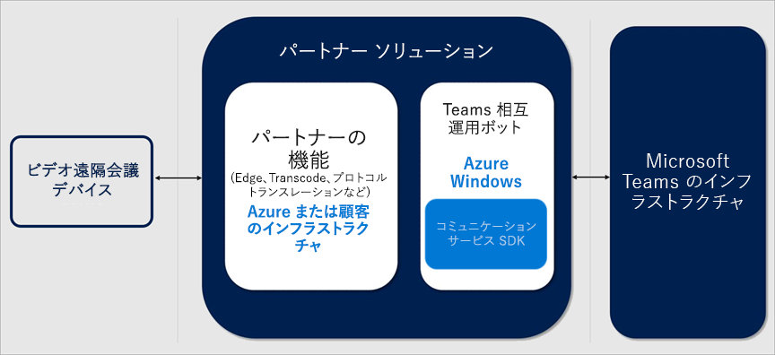
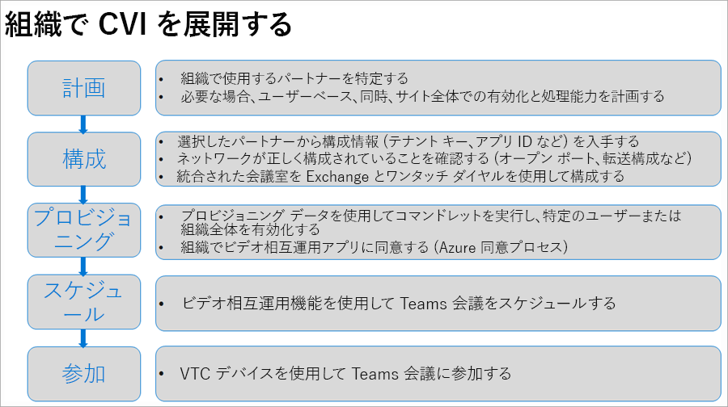

# Microsoft Teams のクラウド ビデオ相互運用性Cloud Video Interop for Microsoft Teams

クラウド ビデオ相互運用性 (CVI) は、サード パーティ製の会議室 (テレプレゼンス) と個人用ビデオ デバイス (VTC) が Microsoft Teams の会議に参加できるようにする Microsoft 認定のサード パーティ ソリューションです。Cloud Video Interop (CVI) is a Microsoft Qualified third-party solution that enables third-party meeting rooms (telepresence) and personal video devices (VTCs) to join Microsoft Teams meetings.
 
Microsoft Teams を使用すると、音声、ビデオ、およびコンテンツ共有を含む会議で、豊富なオンライン コンテンツ コラボレーションを実現できます。With Microsoft Teams, you get rich online content collaboration in meetings that include audio, video, and content sharing. これは、デスクトップと Web クライアントだけでなく、Microsoft Teams とネイティブに統合された多くのパートナー デバイスでも楽しむことができます。This can be enjoyed through the desktop and web client, as well as through many partner devices that integrate natively with Microsoft Teams. しかし、多くのお客様がアップグレードに費用がかかるかもしれないビデオ会議デバイスや個人用ビデオ通信デバイスに既に投資しています。However, many customers have already invested in video teleconferencing and personal video communication devices, which can be expensive to upgrade. クラウド ビデオ相互運用性は簡単なソリューションを提供し、アップグレードの準備が整うまで既存のソリューションを使用し続けることができます。Cloud Video Interop provides an easy solution, allowing you to keep using your existing solutions until you are ready to upgrade.

Microsoft Teams は、クラウド ビデオ相互運用性により、会議室または Teams のクライアントで、すべての参加者にネイティブな会議エクスペリエンスを提供します。Cloud video interop for Teams works with third-party systems and delivers a native meeting experience for all participants – in meeting rooms or inside Teams clients.

### クラウド ビデオ相互運用性は私に適していますか?Is Cloud Video Interop for me?

クラウド ビデオ相互運用性は、Teams エンドポイントを使用して完全なネイティブ Microsoft Teams ソリューションに移行する際に中間サービスを提供します。Cloud Video Interop provides an intermediate service while you transition to a full native Microsoft Teams Solution, using Teams endpoints. 提供されるサービスは、移行パスに含まれている必要があります。The service provided should be part of your migration path.

クラウド ビデオ相互運用性は、次の条件を満たす顧客を対象としています。Cloud Video Interop is intended for customers who meet the following criteria:

- Microsoft Teams との直接統合が認められていない会議室デバイスおよび個人用 ビデオ デバイス (50 台以上) を大規模に展開するHave a large deployment of meeting room devices and personal video devices deployment (50+ devices) that are not qualified for direct integration with Microsoft Teams
- クラウド ビデオ相互運用性パートナーのいずれかによってサポートされているAre supported by one of our Cloud Video Interop partners
- ネイティブの Microsoft Teams ソリューションへの移行時に、現在の会議室デバイスおよび個人用ビデオ デバイスへの投資価値を維持したいWant to retain the value of their investment in their current meeting room devices and personal video devices during the migration to a native Microsoft Teams solution

クラウド ビデオ相互運用性は優れた中間ソリューションを提供しますが、Teams ミーティング システムなどのネイティブの Teams Meeting ソリューションを長期的に使用するために、検討することをお勧めします。While Cloud Video Interop provides a great intermediate solution, we encourage our customers to look into our native Teams Meeting solutions, such as Teams Room Systems, for the long term. 

### Microsoft Teams 認定パートナーAnnouncing Certified for Microsoft Teams

次のパートナーには、Microsoft Teams のビデオ相互運用性ソリューションがあります。The following partners have video interop solutions for Microsoft Teams. 企業は、企業内でこれらのパートナーのいずれかと組み合わせて使用することを選択できます。Your company may choose to work with any combination of these partners within your enterprise. 

|パートナーPhone Partner|パートナー ソリューションPartner solution|
|----|---|
| | <a href="https://aka.ms/PolycomRealConnect" target="_blank">Polycom RealConnect Service</a><a href="https://aka.ms/PolycomRealConnect" target="_blank"> Polycom RealConnect Service for Office 365</a> |
|| <a href="https://aka.ms/PexipInfinity" target="_blank">Pexip Infinity for Microsoft Teams</a><a href="https://aka.ms/PexipInfinity" target="_blank">Pexip Infinity for Microsoft Teams</a> | 
|| <a href="https://aka.ms/BluejeansGateway" target="_blank">BlueJeans Gateway for Microsoft Teams</a><a href="https://aka.ms/BluejeansGateway" target="_blank">BlueJeans Gateway for Microsoft Teams</a> |

### クラウド ビデオ相互運用性の概要Cloud Video Interop

クラウド ビデオ相互運用性は、既存のオンプレミスのビデオ会議と個人用ビデオ デバイス ソリューション、および Microsoft Teams 間の相互運用性を提供するサード パーティ サービスです。Cloud Video Interop is a third-party service that is offered by our partners to provide interoperability between existing video conferencing and personal video device solutions on premises, and Microsoft Teams.

パートナーが提供するソリューションは、完全なクラウド ベースまたは部分的に/完全にオンプレミスに展開できるコンポーネントで構成されています。The solutions offered by our partners consist of components that can be deployed either fully cloud based or partially/fully on premises. 
     
次の図は、パートナー ソリューションのアーキテクチャの概要を示しています。The following diagram shows the high-level architecture of our partner solutions.

## クラウド ビデオ相互運用性を展開するCloud Video Interop

クラウド ビデオ相互運用性ソリューションを展開する際には、パートナー ソリューションを展開していることを理解することが重要です。When deploying a Cloud Video Interop solution, it’s important to understand that you are deploying a partner solution. クラウド ビデオ相互運用性を展開するために必要な一般的な手順を次の図に示します。The general steps you should take to deploy Cloud Video Interop are listed in the following diagram.

### 計画Plan

計画フェーズでは、ネイティブの Teams デバイスと交換しないデバイスを特定し、これらのデバイスをサポートできるクラウド ビデオ相互運用性パートナーを見つける必要があります。During the plan phase, you should identify the devices that you will not replace with a native Teams device, and find a Cloud Video Interop partner that can support these devices.  

また、クラウド ビデオ相互運用性対応デバイスが必要な会議をスケジュールするユーザーごとにライセンスが必要であることを理解することも重要です。It’s also important to understand that you will need a license for each user who will schedule meetings in which you want a Cloud Video Interop-enabled device to join. 正確なライセンス要件は、クラウド ビデオ相互運用性パートナーから取得できます。Note that exact licensing requirements can be obtained from the Cloud Video Interop partner. 展開を開始する前に、ライセンスに関することがクリアされていることを確認してください。Ensure that this is clear before you start your deployment.

### 構成Configure

CVI 展開用に選択したパートナーは、組織内で正常に展開するために必要なすべての手順が含まれている完全な展開ドキュメントを提供します。The partner that you have chosen for your CVI deployment will provide you with a full deployment document that consists of all the steps needed to deploy successfully within your organization. これには、ファイアウォール ポートと IP 範囲、デバイスの構成変更、およびその他の変更が必要な設定が含まれます。This will include firewall ports and IP ranges, configuration changes for your devices, and other settings that need to change.

### プロビジョニングProvision  

プロビジョニング フェーズでは、パートナーから提供された構成ガイドに従って、適切なユーザーにライセンスを割り当てます。During the provision phase, you will assign licenses to the appropriate users according to the partner configuration guide. また、パートナーが Teams 環境にアクセスできるようにするには、Azure 同意プロセスも実行する必要があります。You will also need to go through the Azure Consent process to provide the partner access to your Teams environment. Azure 同意プロセスの詳細については、こちらを参照してください。https://docs.microsoft.com/en-us/azure/active-directory/develop/v2-permissions-and-consentMore information on the Azure Consent process can be found here: https://docs.microsoft.com/en-us/azure/active-directory/develop/v2-permissions-and-consent 

### スケジュールSchedule Workflow

ユーザーがクラウド ビデオ相互運用性を有効にすると、Outlook または Teams クライアン トの Teams 会議アドインを使用してスケジュールされたすべての会議に、適切な追加情報が自動的に追加されるため、クラウド ビデオ相互運用性デバイスをこれらの会議に使用できるようになります。After a user is enabled for Cloud Video Interop, any meeting scheduled using either the Teams Meeting Add-in for Outlook or the Teams Client will have the appropriate additional information automatically added into the Teams meeting so that Cloud Video Interop-compatible devices can join these meetings.

### 参加Join

パートナー ソリューションによっては、クラウド ビデオ相互運用性対応の会議に参加する方法がいくつかあります。Depending on the partner solution, there are several ways to join a Cloud Video Interop-enabled meeting. 正確な会議参加シナリオは、クラウド ビデオ相互運用性パートナーから提供されます。Exact meeting join scenarios will be provided by your Cloud Video Interop partner. 次に例を示します。We’ve listed some examples below:

- IVR (対話型音声応答)IVR (Interactive Voice Response) 
  - tenantkey@domain を使用して、パートナーの IVR にダイヤルインできます。You can dial in to the partner's IVR using the tenantkey@domain.
  - パートナー IVR にいると、VTC conferenceId を入力するように求められます。これにより、Teams 会議に接続されます。When you are in the partner IVR, you will be prompted to enter the VTC conferenceId, which will then connect you to the Teams meeting.
- 直接ダイヤルDirect dial 
  - TenantKey の全文字列を使用して、直接ダイヤル機能を使用すると、パートナーの IVR に対する操作なしに、Teams 会議に直接ダイヤルインできます。VTC ConferenceId@domain。You can directly dial in to the Teams meeting without interacting with the partner’s IVR by using the direct dial feature, using the full string of tenantkey.VTC ConferenceId@domain.
- ワンタッチ ダイヤルOne-touch dial 
  - Teams ミーティングが統合されている場合は、パートナーが提供するワンタッチ ダイヤル機能を使用できます (ダイヤルの文字列を入力する必要はありません)。If you have an integrated Teams room, you can use the one-touch dial capabilities offered by your partner (without needing to type any dial string).

## クラウド ビデオ相互運用性の管理Cloud Video Interop

クラウド ビデオ相互運用性の展開後、パートナーが提供するソリューションを使用してデバイスを管理できます。After Cloud Video Interop is deployed, you can manage the devices using the solutions provided by our partners. 各パートナーは、ライセンスとデバイス管理の両方を含む管理インターフェイスを提供します。Each partner will provide you with an administrative interface that will include both license and device management. 

レポートは、パートナーの管理インターフェイスから直接使用することもできます。Reporting is also available directly from the partner administrative interface. レポート機能の詳細については、選択したパートナーにお問い合わせください。For more information on reporting capabilities, contact the partner of your choice. 

### クラウド ビデオ相互運用性のトラブルシューティングCloud Video Interop

クラウド ビデオ相互運用性は、パートナーが提供するサービスです。Cloud Video Interop is a partner-provided service. 問題が発生した場合は、まず Teams クライアントがインストールされているデバイスを接続し、問題の原因となっているクラウド ビデオ相互運用性デバイスと同じセグメントに接続します。If you are experiencing issues, the first step is to connect a device that has the Teams Client installed and connect it to the same segment as the Cloud Video Interop device that is causing problems. 

このセグメントで Teams が正しく機能し、パートナーが提供したすべてのネットワークおよび構成ガイドラインにも従っている場合は、トラブルシューティングについてパートナーに連絡する必要があります。If Teams functions correctly on this segment, and you have also followed all the networking and configuration guidelines the partner has provided, you will need to contact the partner for further troubleshooting. 

## クラウド ビデオ相互運用性のための PowerShellPowerShell for Cloud Video Interop

クラウド ビデオ相互運用性の展開を (部分的に) 自動化するには、次の PowerShell コマンドレットを使用します。The following PowerShell cmdlets are available for you to (partially) automate the Cloud Video Interop deployment.

- **Get-CsTeamsVideoInteropServicepolicy**: Microsoft は、サポート対象の各パートナーに対して、クラウド ビデオ相互運用性に使用するパートナーを指定できる事前構築ポリシーを提供しています。**Get-CsTeamsVideoInteropServicepolicy**: Microsoft provides pre-constructed policies for each of our supported partners that allow you to designate which partner(s) to use for Cloud Video Interop. このコマンドレットは、組織内で使用できる事前構築ポリシーを指定できます。This cmdlet allows you to identify the pre-constructed policies that you can use in your organization. Grant-CsTeamsVideoInteropServicePolicy コマンドレットを使用して、このポリシーを 1 人または複数のユーザーに割り当てることができます。You can assign this policy to one or more of your users by leveraging the Grant-CsTeamsVideoInteropServicePolicy cmdlet.
- **Grant-CsTeamsVideoInteropServicePolicy**: このコマンドレットを使用すると、組織で使用するために事前構築されたポリシーを割り当てたり、特定のユーザーにポリシーを割り当てることができます。**Grant-CsTeamsVideoInteropServicePolicy**: This cmdlet allows you to assign a pre-constructed policy for use in your organization or assign the policy to specific users.
- **New-CsVideoInteropServiceProvider**: このコマンドレットを使用して、組織が使用するサポート対象の CVI パートナーに関する情報を指定します。**New-CsVideoInteropServiceProvider**: Use this cmdlet to specify information about a supported CVI partner that your organization would like to use.
- **Set-CsVideoInteropServiceProvider**: このコマンドレットを使用して、組織が使用するサポート対象の CVI パートナーに関する情報を更新します。**Set-CsVideoInteropServiceProvider**: Use this cmdlet to update information about a supported CVI partner that your organization uses.
- **Get-CsVideoInteropServiceProvider**: このコマンドレットを使用して、組織内で使用するように構成されているすべてのプロバイダーを取得します。**Get-CsVideoInteropServiceProvider**: Use this cmdlet to get all of the providers that have been configured for use within the organization.
- **Remove-CsVideoInteropServiceProvider**: このコマンドレットを使用して、組織で使用しなくなったプロバイダーに関するすべてのプロバイダー情報を削除します。**Remove-CsVideoInteropServiceProvider**: Use this cmdlet to remove all provider information about a provider that your organization no longer uses.
