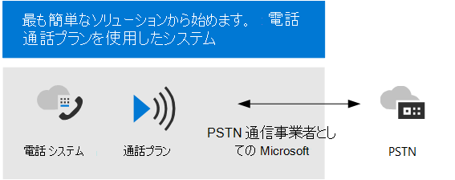
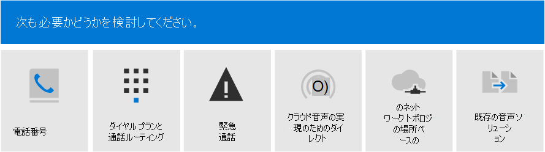
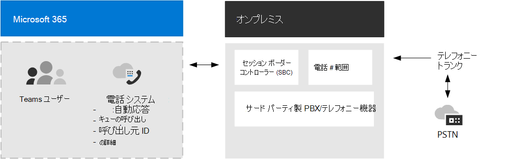

# Teams の音声ソリューションを計画する 

この記事では、組織に最適な Microsoft 音声ソリューションを決定する方法について説明します。 決定したら、この記事では、選択したソリューションを実装できるコンテンツのロードマップを提供します。

> [!NOTE]
> Skype for Business Server から Teams にアップグレードする全体的な計画の一部として Teams 音声ソリューションを計画する方法については、オンプレミスの [Skype for Business](upgrade-to-teams-on-prem-pstn-considerations.md)から Teams にアップグレードする場合の PSTN に関する考慮事項を参照してください。

最も簡単なソリューションの電話 &mdash; システムと通話プランが必要な場合があります。 これは、次の図に示すように、プライベート ブランチ交換 (PBX) 機能と公衆交換電話網 (PSTN) への通話を提供する、Microsoft のクラウド内すべてソリューションです。 このソリューションを使用すると、Microsoft が PSTN 通信事業者になります。

「はい」と答える場合は、通話プラン付き電話システムが適切なソリューションです。

- 通話プランは、お客様の地域で利用できます。
- 現在の PSTN 通信事業者を保持する必要はない。
- PSTN への Microsoft が管理するアクセスを使用する場合。

ただし、状況は複雑になる可能性があります。 たとえば、通話プランが利用できない場所にオフィスがある場合などです。 または、地理的な場所ごとに異なる要件を持つ、複雑な多国籍展開をサポートする複合ソリューションが必要な場合があります。 Microsoft では、次のソリューションの組み合わせをサポートしています。 

- 通話プラン付き電話システム
- 直接ルーティングを使用する独自の PSTN 通信事業者を使用した電話システム
- 通話プラン付き電話システムと直接ルーティング付き電話システムの両方を使用する組み合わせソリューション

## 何を読む必要がありますか?

**すべてのユーザーに必要です。** この記事の一部のセクションは、すべての組織に関係します。 たとえば、すべてのユーザーが電話システムについて理解し、公衆交換電話網 (PSTN) に接続するためのオプションについて理解する必要があります。 

| すべてのユーザーに必須 | 説明 |
| :------------|:-------|
| [**電話システム**](#phone-system) | Microsoft Teams を使用して Microsoft 365 クラウドで通話制御とプライベート ブランチ交換 (PBX) 機能を有効にする Microsoft のテクノロジ。 |
| [**公衆交換電話網 (PSTN) 接続オプション**](#public-switched-telephone-network-connectivity-options) | Microsoft をテレフォニーキャリアとして使用するか、ダイレクト ルーティングを使用して独自のテレフォニーキャリアを Microsoft Teams に接続するかの選択肢です。 電話システムと組み合わせると、PSTN 接続オプションにより、ユーザーは世界中に電話を発信できます。|

**要件に応じて異なる。** この記事の一部のセクションは、既存の展開と要件に応じて関連します。 たとえば、ルートLocation-Basedは、有料バイパスを許可していない地理的な場所にあるダイレクト ルーティングのお客様にのみ必要です。

次の追加構成が必要な場合は、次の点を考慮してください。

| 要件に応じて | 説明 |
| :------------|:-------|
| [**Microsoft からの電話番号**](#phone-numbers-from-microsoft) | Microsoft から電話番号を取得して管理する方法と、既存の番号を Microsoft に転送する方法について説明します。 Microsoft 通話プランの電話番号の取得、既存の番号の転送、サービス番号の取得が必要な場合は、この記事をお読みください。 |
| [**ダイヤル プランと通話ルーティング**](#dial-plans-and-call-routing) | ダイヤルされた電話番号を通話承認および通話ルーティング用の別の形式 (通常は E.164 形式) に変換するダイヤル プランを構成および管理する方法。 ダイヤル プランの詳細と、組織のダイヤル プランを指定する必要があるかどうかを理解する必要がある場合は、この記事を参照してください。|
| [**緊急通話**](#emergency-calling) | PSTN 接続オプションに応じて緊急 &mdash; 通話を管理および構成する方法。 Microsoft 通話プランまたは直接ルーティングを使用し、組織の緊急通話を管理する方法を理解する必要がある場合は、このセクションをお読みください。 |
| [**直接ルーティングの場所に基づくルーティング**](#location-based-routing-for-direct-routing) |LBR (Location-Basedルーティング) を使用して、地理的な場所に基づいて Microsoft Teams ユーザーの有料バイパスを制限する方法。 組織が有料バイパスを許可していない場所で直接ルーティングを使用している場合は、このセクションをお読みください。
| [**クラウド音声機能のネットワーク トポロジ**](#network-topology-for-voice-features) | 組織が直接ルーティングまたは動的緊急通話用の Location-Based ルーティング (LBR) を展開している場合は、Microsoft Teams でこれらの機能で使用するネットワーク設定を構成する必要があります。 直接ルーティング用の LBR を実装している場合、または通話プランまたはダイレクト ルーティングを使用して動的緊急通話を実装している場合は、このセクションを参照してください。 |
| [**既存の音声ソリューションを移行する**](#migrate-your-existing-voice-solution-to-teams) | 音声ソリューションを Teams に移行するときに考える必要があるもの。  既存の音声ソリューションから Teams に移行する場合は、このセクションをお読みください。 

> [!Important]
> この記事では、Microsoft Teams の音声ソリューションについて説明します。 Skype for Business Online のソリューションは引き続き利用できます [(Microsoft](https://docs.microsoft.com/SkypeForBusiness/hybrid/msft-telephony-solutions)テレフォニー ソリューションの説明に従って)、Skype for Business Online は 2021 年 7 月 31 日に廃止される予定です。  この日付を終了すると、Skype for Business Online サービスにアクセスできなくなりました。 さらに、Skype for Business Server または Cloud Connector Edition と Skype for Business Online を介したオンプレミス環境間の PSTN 接続は &mdash; &mdash; サポートされなくなりました。 この記事では、Teams 音声ソリューションと、必要に応じて直接ルーティングを使用してオンプレミスのテレフォニー ネットワークを Teams に接続する方法について説明します。

## 電話システム

電話システムは、Microsoft Teams を使用して Microsoft 365 または Office 365 クラウドで通話制御とプライベート ブランチ交換 (PBX) 機能を有効にする Microsoft のテクノロジです。

電話システムは、Teams または Skype for Business クライアントおよび認定デバイスで動作します。 電話システムを使用すると、既存の PBX システムを、Microsoft 365 または Office 365 から直接提供される一連の機能に置き換える機能を使用できます。 

組織内のユーザー間の通話は電話システムの内部で処理され、公衆交換電話網 (PSTN) に流れることは決してありません。 これは、地理的にさまざまな場所にいる組織内のユーザー間の通話にも当てはまるため、このような長距離の社内通話にかかるコストが解消されます。

この記事では、次の電話システムの主な機能と、検討する必要がある展開の決定について説明します。

- [自動応答と呼び出しキュー](#auto-attendants-and-call-queues)
- [クラウド ボイスメール](#cloud-voicemail)
- [通話 ID](#calling-identity)

電話システムのすべての機能と電話システムのセットアップ方法については、次の記事を参照してください。

- [電話システムで利用できる機能](here-s-what-you-get-with-phone-system.md)
- [組織内の電話システムの設定](setting-up-your-phone-system.md) 
  電話システム ライセンスの購入と割り当て、電話番号の管理、無料電話番号のコミュニケーション クレジットの設定方法について説明します。 

サポートされているデバイスの管理の詳細については [、「Microsoft Teams](devices/device-management.md) と Teams Marketplace でデバイスを管理する」 [を参照してください](https://www.microsoft.com/microsoft-365/microsoft-teams/across-devices?ms.url=officecomteamsdevices&rtc=1)。

### 自動応答と通話キュー

自動応答では、発信者の入力に基づいて通話をルーティングするメニュー オプションを設定できます。 通話キューは、呼び出し元の待機領域です。 自動応答と通話キューを組み合わせて使用すると、発信者を組織内の適切な人物または部門に簡単にルーティングできます。

自動応答と通話キューの詳細については、次の記事を参照してください。

- [Teams の自動応答と通話キューを計画する](plan-auto-attendant-call-queue.md)
- [自動応答を設定する](create-a-phone-system-auto-attendant.md)
- [呼び出しキューを作成する](create-a-phone-system-call-queue.md) 
- [Contoso のケース スタディ: 自動応答と通話キュー](voice-case-study-call-queues.md) 
  架空の多国籍企業 Contoso が、音声ソリューションの自動応答と通話キューを実装した方法について説明します。

### クラウド ボイスメール

Azure ボイスメール サービスを利用したクラウド ボイスメールは、Exchange メールボックスへのボイスメール の入金のみをサポートします。 サードパーティのメール システムはサポートされていません。 

クラウド ボイスメールでは、組織内のすべてのユーザーに対してボイスメールの文字起こしが既定で有効になっています。 会社のニーズに応じて、特定のユーザーまたは組織全体の全ユーザーに対してボイスメールの文字起こしを無効にすることができます。

オンラインユーザーの場合、ユーザーに電話システム ライセンスが割り当てられると、クラウド ボイスメールが自動的にセットアップされ、プロビジョニングされます。 Exchange メールボックスを持つ電話システム ユーザーの場合は、追加の構成手順を実行する必要があります。 

クラウド ボイスメールとその構成の詳細については、次の記事を参照してください。

- [クラウド ボイスメールのセットアップ](set-up-phone-system-voicemail.md)
- [組織内のボイスメール ポリシーを設定する](set-up-phone-system-voicemail.md#setting-voicemail-policies-in-your-organization)

### 通話 ID

既定で、すべての発信通話は、割り当てられた電話番号を通話 ID (発信者 ID) として使用します。 通話の受信者は、発信者をすばやく特定して、通話を承諾または拒否するかどうかを決定できます。 発信者番号の設定、または発信者番号の変更またはブロックについては、「ユーザーの発信者番号を設定する」 [を参照してください](set-the-caller-id-for-a-user.md)。 

## 公衆交換電話網接続オプション

電話システムは、組織に完全な PBX 機能を提供します。 ただし、ユーザーが組織外に通話を発信するには、電話システムを公衆交換電話網 (PSTN) に接続する必要があります。 電話システムを PSTN に接続するには、次のいずれかのオプションを選択できます。

- [**通話プランが設定された電話システム**](#phone-system-with-calling-plan)。 MICROSOFT を PSTN 通信事業者として使用するクラウド内のソリューションです。

- [**直接ルーティングを使用してオンプレミス環境**](#phone-system-with-own-pstn-carrier-with-direct-routing) を Teams に接続することで、独自の PSTN キャリアを備える電話システム。

オプションの組み合わせを選ぶと、複雑な環境のソリューションを設計したり、複数ステップの移行を管理したりすることもできます (後で移行する方法の詳細)。

### 通話プラン付き電話システム 

この記事で前述したように、通話プラン付き電話システムは、Teams ユーザー向け Microsoft のクラウド内音声ソリューションです。 これは、Microsoft 電話システムを公衆交換電話網 (PSTN) に接続して、世界中の固定電話や携帯電話への通話を有効にする最も簡単なオプションです。 このオプションを使用すると、Microsoft は組織にプライベート ブランチ交換 (PBX) 機能を提供し、次の図に示すように PSTN キャリアとして機能します。

「はい」と答える場合は、通話プラン付き電話システムが適切なソリューションです。

- 通話プランは、お客様の地域で利用できます。
- 現在の PSTN 通信事業者を保持する必要はない。
- PSTN への Microsoft が管理するアクセスを使用する場合。

このオプションを使用する場合: 

- Microsoft Phone System に国内通話プランまたは国際通話プランが追加され、世界中の電話への通話が可能になります (ライセンスされるサービスのレベルに応じて異なる)。

- 通話プランは Microsoft 365 または Office 365 から運用されます。 &mdash;

- 注: 必要に応じて、サードパーティ PBX、アナログ デバイス、SBC でサポートされているその他のサードパーティテレフォニー機器との相互運用性を確保するために、サポートされているセッション ボーダー コントローラー (SBC) をダイレクト ルーティングを通じて接続することができます。

このオプションを使用するには、Microsoft 365 または Office 365 への接続が必要です。

通話プランの詳細については、次の記事を参照してください。

- [どの通話プランが適していますか?](calling-plan-landing-page.md)
- [通話プランを購入する方法](calling-plans-for-office-365.md)
- [通話プランが利用可能な国と地域](https://docs.microsoft.com/microsoftteams/country-and-region-availability-for-audio-conferencing-and-calling-plans/country-and-region-availability-for-audio-conferencing-and-calling-plans)
- [通話プランを設定する](set-up-calling-plans.md)

### ダイレクト ルーティングを使用した独自の PSTN 通信事業者を使用した電話システム

このオプションは、次の図に示すように、直接ルーティングを使用して Microsoft Phone System をテレフォニー ネットワークに接続します。 

次の質問に「はい」と回答した場合、直接ルーティングを使用した電話システムが適切なソリューションになります。

- 電話システムで Teams を使用する場合。
- 現在の PSTN 通信事業者を保持する必要があります。
- 一部の通話は通話プランを経由し、一部は通信事業者を経由して、ルーティングを混在する必要があります。
- サードパーティの PBX や、オーバーヘッド ページ、アナログ デバイスなどの機器と相互運用する必要があります。

このオプションを使用する場合:

- サポートされる独自の SBC を Microsoft Phone System に接続し、追加のオンプレミス ソフトウェアを使用する必要がない。

- Microsoft Phone System では、事実上すべてのテレフォニー通信事業者を使用できます。

- このオプションを構成および管理するか、または通信事業者またはパートナーが構成および管理することができます (通信事業者またはパートナーにこのオプションが提供されていないか問い合わせください)。

- サードパーティ製 PBX やアナログ デバイスなどのテレフォニー機器と Microsoft Phone System 間の相互運用性 &mdash; &mdash; を構成できます。

このオプションには、次の情報が必要です。

- Microsoft 365 または Office 365 への接続。

- サポートされている SBC の展開と保守。

- サードパーティの通信事業者との契約。
  (サードパーティ製 PBX、アナログ デバイス、その他のテレフォニー機器への接続を、通話プランを使用して電話システムを使用しているユーザーに提供するオプションとして展開されていない場合)。

ダイレクト ルーティングの詳細については、次の記事を参照してください。

- [電話システムのダイレクト ルーティング](direct-routing-landing-page.md)
- [ダイレクト ルーティングを計画する](direct-routing-plan.md)
- [ダイレクト ルーティングを構成する](direct-routing-configure.md)
- [ダイレクト ルーティングで使用する音声ルーティング ポリシーを管理する](manage-voice-routing-policies.md)
- [ダイレクト ルーティングの場所に基づくルーティングを計画する](location-based-routing-plan.md)
- [ダイレクト ルーティングに対応する認定済みセッション ボーダー コントローラーのリスト](direct-routing-border-controllers.md)

## Microsoft からの電話番号

Microsoft には、組織内のユーザーに割り当て可能なサブスクライバー *(ユーザー* ) 番号と、有料および無料のサービス番号として利用可能なサービス番号という 2 種類の電話番号があります。 サービス番号は、サブスクライバー番号よりも高い同時通話容量を持ち、電話会議、自動応答、通話キューなどのサービスに割り当てることができます。

次の条件を決定する必要があります。

- Microsoft からの新しい電話番号が必要なのはどのユーザー ロケーションですか?
- どの種類の電話番号が必要ですか (サブスクライバーまたはサービス)? 
- どんな方法で既存の電話番号を Teams に移植しますか?

新しい番号の取得や退出番号の移行など、組織内の電話番号の管理の詳細については、次の記事を参照してください。

- [組織の電話番号を管理する](manage-phone-numbers-for-your-organization/manage-phone-numbers-for-your-organization.md) 
- [通話プランに使用されるさまざまな種類の電話番号](different-kinds-of-phone-numbers-used-for-calling-plans.md)
- [ユーザー用の電話番号を取得する](getting-phone-numbers-for-your-users.md)
- [Microsoft Teams に電話番号を転送する](phone-number-calling-plans/transfer-phone-numbers-to-teams.md)

## ダイヤル プランと通話ルーティング

ダイヤル プランは、ダイヤルされた電話番号を通話承認および通話ルーティング用の別の形式 (通常は E.164 形式) に変換する正規化ルールのセットです。

次を決定する必要があります。 

- 組織はダイヤル プランのカスタマイズを必要としているか?
- カスタマイズされたダイヤル プランが必要なユーザー
- 各ユーザーに割り当てるテナント ダイヤル プラン

詳細については、次の記事を参照してください。 

- [ダイヤル プランについて](what-are-dial-plans.md)
- [テナント ダイヤル プランの計画](what-are-dial-plans.md#planning-for-tenant-dial-plans)
- [ダイヤル プランを作成および管理する](create-and-manage-dial-plans.md)

## 緊急通話

緊急通話の構成方法は、PSTN 接続オプション (Microsoft 通話プランまたは直接ルーティング) によって異なります。 Microsoft 通話プランと電話システムダイレクト ルーティングの動的緊急通話は、Teams クライアントの現在の場所に基づいて緊急通話を構成およびルーティングし、セキュリティ担当者に通知する機能を提供します。 緊急通話の概念と用語、および動的緊急通話を構成する方法の詳細については、次の記事を参照してください。

- [緊急通話を管理する](what-are-emergency-locations-addresses-and-call-routing.md)
- [動的な緊急通話を計画して構成する](configure-dynamic-emergency-calling.md)
- [Contoso のケース スタディ: 緊急通話](voice-case-study-emergency-calling.md) 
  架空の多国籍企業 Contoso 社が、組織に対して緊急通話を実装した方法について説明します。

## Location-Based ルーティングの詳細

国や地域によっては、公衆交換電話網 (PSTN) プロバイダーをバイパスして、長距離通話コストを削減する方法は違法です。 Location-Basedルーティングを使用すると、地理的な場所に基づいて、Microsoft Teams ユーザーの有料バイパスを制限できます。 ルーティング (LBR) を計画および構成するLocation-Basedについては、次の記事を参照してください。

- [ダイレクト ルーティングの場所に基づくルーティングを計画する](location-based-routing-plan.md)
- [場所に基づくルーティングのネットワーク設定を構成する](location-based-routing-configure-network-settings.md)
- [ダイレクト ルーティングの場所に基づくルーティングを有効にする](location-based-routing-enable.md)
- [Contoso のケース スタディ: Location-Based ルーティング](voice-case-study-location-based-routing.md) 
  架空の多国籍企業 Contoso が組織のルーティングを実装Location-Basedについて説明します。

## 音声機能のネットワーク トポロジ

動的緊急通話または直接ルーティングLocation-Basedを展開する場合は、Microsoft Teams のこれらの機能で使用するネットワーク設定を構成する必要があります。 ネットワーク領域、ネットワーク サイト、ネットワーク サブネット、信頼済み IP アドレスのネットワーク設定を構成する方法については、次の記事を参照してください。

- [Microsoft Teams のクラウド音声機能のネットワーク設定 - 概念と用語](cloud-voice-network-settings.md)
- [Microsoft Teams でクラウド音声機能のネットワーク トポロジを管理する](manage-your-network-topology.md)

## 既存の音声ソリューションを Teams に移行する

Teams にアップグレードする組織の最終的な目標は、すべてのユーザーを TeamsOnly モードに移行する方法です。 Teams での電話システムの使用は、ユーザーが TeamsOnly モードの場合にのみサポートされます。 Teams へのアップグレードに関する基本的な情報が必要な場合は、次の操作を開始します。

- [Microsoft Teams へのアップグレードを開始する](upgrade-start-here.md)
- [アップグレードのフレームワークについて](upgrade-framework.md)
- [IT 管理者向けアップグレード戦略](upgrade-to-teams-on-prem-implement.md)

音声ソリューションを移行する場合、TeamsOnly モードに移行する場合、次の 4 つの呼び出しシナリオが考えられます。

- [**Microsoft 通話プランを使用した Skype for Business Online のユーザー**](upgrade-to-teams-on-prem-pstn-considerations.md#from-skype-for-business-online-with-microsoft-calling-plans)。 アップグレード後も、このユーザーは引き続き Microsoft 通話プランを利用できます。

- **[Skype for Business Online のユーザー](upgrade-to-teams-on-prem-pstn-considerations.md#from-skype-for-business-online-with-on-premises-voice)**。オンプレミスの Skype for Business または Cloud Connector エディションを介して、オンプレミスの音声機能を使用します。 このユーザーの Teams へのアップグレードは、その TeamsOnly ユーザーが確実に PSTN 機能を持てるようにするため、ユーザーのダイレクト ルーティングへの移行に合わせた調整が必要になります。

- **[オンプレミスの Skype for Business](upgrade-to-teams-on-prem-pstn-considerations.md#from-skype-for-business-server-on-premises-with-enterprise-voice-to-direct-routing)** でオンラインに移行し、エンタープライズ VoIP PSTN 接続を維持するユーザー。 このユーザーを Teams に移行するには、そのユーザーのオンプレミスの Skype for Business アカウントをクラウドに移行し、移行をそのユーザーのダイレクト ルーティングへの移行に合わせて調整する必要があります。 

- **[Skype for Business オンプレミス](upgrade-to-teams-on-prem-pstn-considerations.md#from-skype-for-business-server-on-premises-with-enterprise-voice-to-microsoft-calling-plan)** で エンタープライズ VoIP を使用しているユーザー。オンラインに移行し、Microsoft 通話プランを使用します。  このユーザーを Teams に移行するには、そのユーザーのオンプレミスの Skype for Business アカウントをクラウドに移行し、移行を A) Microsoft 通話プランへのユーザーの電話番号のポートに合わせて調整するか、B) 利用可能な地域から新しいサブスクライバー番号を割り当てる必要があります。

ハイブリッド接続をセットアップする必要がある場合や、オンプレミスの音声機能を持つユーザーを直接ルーティングに移行する方法など、これらのシナリオごとに音声移行を実装する方法の詳細については、次の記事を &mdash; &mdash; 参照してください。

- [TEAMS にアップグレードする場合の PSTN に関する考慮事項 ( IT 管理者向け)](upgrade-to-teams-on-prem-pstn-considerations.md)

- [Contoso 音声移行のケース スタディ](voice-case-study-overview.md) 
  このケース スタディでは、架空の多国籍企業 Contoso が、組織に Teams 音声ソリューションを実装した方法について説明します。 次の記事が含まれます。

  - [Teams アップグレード プラン](voice-case-study-migration-plan.md)
  - [電話システムと PSTN 接続オプション](voice-case-study-phone-system.md)
  - [場所ベースのルーティングの実装](voice-case-study-location-based-routing.md)
  - [緊急通話](voice-case-study-emergency-calling.md)
  - [自動応答と呼び出しキュー](voice-case-study-call-queues.md)
  - [電話会議](voice-case-study-audio-conferencing.md)

