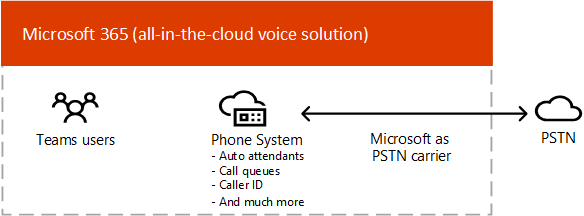

# チームのボイスソリューションを計画する 

この記事では、組織に適した Microsoft voice ソリューションを決定する方法について説明します。 この記事では、選択したソリューションの実装を可能にするコンテンツのロードマップについて説明します。 

通話プランには、最も簡単なソリューション電話システムが必要になることがあり &mdash; ます。 これは、次の図に示すように、プライベートな支店交換 (PBX) 機能と公衆交換電話網 (PSTN) への通話を提供する、Microsoft のすべてのクラウドソリューションです。 このソリューションを使用すると、Microsoft が PSTN キャリアになります。

「はい」を選択すると、通話プランを使用した電話システムは適切な解決策となります。

- 通話プランは、お住まいの地域でご利用いただけます。
- 現在の PSTN キャリアを保持する必要はありません。
- PSTN への Microsoft 管理のアクセスを使用する必要があります。

ただし、状況が複雑になることがあります。 たとえば、通話プランを利用できない場所にオフィスがある場合があります。 または、地理的な場所によって要件が異なる、複数の地域にわたる複雑な展開をサポートする組み合わせソリューションが必要になる場合もあります。 Microsoft は、次のソリューションの組み合わせをサポートしています。 

- 通話プラン付きの電話システム
- 直接ルーティングを使用する独自の PSTN キャリアを搭載した電話システム
- 直接ルーティングを使用する通話プランと電話システムの両方を使用する組み合わせのソリューション

## 何を読む必要がありますか?

**すべてに必須。** この記事の一部のセクションは、すべての組織に関連しています。 たとえば、すべてのユーザーが電話システムについての情報を読み、公衆交換電話網 (PSTN) に接続するためのオプションについて理解している必要があります。 

| すべてに必須 | 説明 |
| :------------|:-------|
| [**電話システム**](#phone-system) | Microsoft Teams で microsoft 365 クラウドの通話コントロールとプライベート支店 Exchange (PBX) 機能を有効にするための microsoft の技術。 |
| [**公衆交換電話網 (PSTN) 接続オプション**](#public-switched-telephone-network-connectivity-options) | 直接の電話会社として Microsoft を使用するか、直接ルーティングを使用して、独自のテレフォニーキャリアを Microsoft Teams に接続するかを選択することができます。 電話システムと PSTN の接続オプションを組み合わせると、世界中の電話に通話を発信することができます。|

**要件によって異なります。** この記事の一部のセクションは、既存の展開と要件に応じて関連しています。 たとえば、Location-Based のルーティングが必要なのは、市外バイパスを許可していない地理的な場所にいるユーザーによるルーティングのみです。

| 要件に応じて | 説明 |
| :------------|:-------|
| [**Microsoft からの電話番号**](#phone-numbers-from-microsoft) | Microsoft から電話番号を取得して管理する方法と、既存の電話番号を Microsoft に移行する方法について説明します。 Microsoft 通話プランの電話番号を取得する必要がある場合、既存の電話番号を移行する場合、サービス番号を取得する場合は、こちらを参照してください。 |
| [**ダイヤルプランと通話ルーティング**](#dial-plans-and-call-routing) | ダイヤルした電話番号を別の形式 (通常は164形式) に変換するダイヤルプランを設定および管理する方法について説明します。 ダイヤルプランについて理解する必要がある場合、および組織のダイヤルプランを指定する必要がある場合は、こちらを参照してください。|
| [**緊急通話**](#emergency-calling) | PSTN 接続オプションに応じて、緊急通話の管理と構成を行う方法につい &mdash; て説明します。 Microsoft 通話プランまたはダイレクトルーティングを使用していて、組織の緊急通話の管理方法を理解する必要がある場合は、このセクションをお読みください。 |
| [**ダイレクトルーティング用の位置情報に基づくルーティング**](#location-based-routing-for-direct-routing) |Location-Based ルーティング (LBR) を使用して、地理的な場所に基づいて Microsoft Teams ユーザーの有料電話のバイパスを制限する方法について説明します。 このセクションは、組織で有料のバイパスが許可されていない場所で直接ルーティングを使用している場合にお読みください。
| [**クラウド音声機能のネットワークトポロジ**](#network-topology-for-voice-features) | 組織で、直接ルーティングまたは動的な緊急通話のために Location-Based ルーティング (LBR) を展開している場合は、Microsoft Teams でこれらの機能を使用するためにネットワーク設定を構成する必要があります。 ダイレクトルーティング用に LBR を実装している場合、または、通話プランまたは直接ルーティングを使って動的な緊急通話を実装している場合は、このセクションをお読みください。 |
| [**既存のボイスソリューションを移行する**](#migrate-your-existing-voice-solution-to-teams) | 音声ソリューションを Teams に移行する際に考慮する必要があること。  既存のボイスソリューションから Teams に移行する場合は、このセクションをお読みください。 

> [!Important]
> この記事では、Microsoft Teams のボイスソリューションに焦点を当てています。 Skype for Business Online のソリューションはまだ使用できますが (「 [Microsoft telephony solutions](https://docs.microsoft.com/SkypeForBusiness/hybrid/msft-telephony-solutions)」で説明しています)、Skype For business online は2021年7月31日に廃止されることを理解しておくことが重要です。  その日を過ぎると、Skype for Business Online サービスにアクセスできなくなります。 さらに、 &mdash; skype For Business Server または Cloud Connector Edition と skype For Business Online のどちらを使用しても、オンプレミス環境間の PSTN 接続 &mdash; がサポートされなくなります。 この記事では、Teams voip ソリューションの概要について説明します。また、必要に応じてオンプレミスのテレフォニーネットワークを、直接ルーティングを使用してチームに接続する方法についても説明します。

## 電話システム

電話システムは、microsoft Teams を使用して Microsoft 365 または Office 365 クラウドの通話コントロールとプライベート支店 Exchange (PBX) 機能を有効にするための Microsoft の技術です。

電話システムは、Teams または Skype for Business クライアントと認定されたデバイスで動作します。 電話システムを使用すると、既存の PBX システムを、Microsoft 365 または Office 365 から直接配信される一連の機能に置き換えることができます。 

組織内のユーザー間の通話は電話システムの内部で処理され、公衆交換電話網 (PSTN) に流れることは決してありません。 これは、地理的にさまざまな場所にいる組織内のユーザー間の通話にも当てはまるため、このような長距離の社内通話にかかるコストが解消されます。

この記事では、次の電話システムの主要機能と機能について説明し、検討する必要がある展開の決定について説明します。

- [自動応答と呼び出しキュー](#auto-attendants-and-call-queues)
- [クラウド ボイスメール](#cloud-voicemail)
- [通話 ID](#calling-identity)

電話システムのすべての機能と、電話システムのセットアップ方法については、次の記事を参照してください。

- [電話システムで利用できる機能](here-s-what-you-get-with-phone-system.md)
- [組織で電話システムをセットアップする](setting-up-your-phone-system.md) 
  電話システムのライセンスを購入して割り当てる方法、電話番号を管理する方法、無料番号の通信クレジットを設定する方法について説明します。 

サポートされているデバイスを管理する方法については、「Microsoft Teams および[Teams Marketplace](https://www.microsoft.com/microsoft-365/microsoft-teams/across-devices?ms.url=officecomteamsdevices&rtc=1)[でデバイスを管理](devices/device-management.md)する」を参照してください。

### 自動応答と通話キュー

自動応答を使うと、発信者の入力に基づいて着信をルーティングするためのメニューオプションを設定できます。 通話キューは、発信者の待機領域です。 自動応答と通話キューを併用すると、発信者を組織内の適切なユーザーまたは部門に簡単にルーティングすることができます。

自動応答と通話キューの詳細については、次の記事を参照してください。

- [Teams の自動応答と通話キューを計画する](plan-auto-attendant-call-queue.md)
- [自動応答を設定する](create-a-phone-system-auto-attendant.md)
- [呼び出しキューを作成する](create-a-phone-system-call-queue.md) 
- [Contoso のケーススタディ: 自動応答と通話キュー](voice-case-study-call-queues.md) 
  架空の多国籍企業、Contoso が、ボイスソリューションの自動応答と通話キューを実装する方法について説明します。

### クラウド ボイスメール

Azure ボイスメールサービスを利用するクラウドボイスメールでは、Exchange メールボックスのみに対するボイスメールのデポジットがサポートされています。 サードパーティのメールシステムをサポートしていません。 

クラウド ボイスメールでは、組織内のすべてのユーザーに対してボイスメールの文字起こしが既定で有効になっています。 会社のニーズに応じて、特定のユーザーまたは組織全体の全ユーザーに対してボイスメールの文字起こしを無効にすることができます。

オンラインのみのユーザーの場合は、電話システムのライセンスが割り当てられた後、クラウドボイスメールが自動的に設定され、ユーザーに提供されます。 Exchange メールボックスを使用している電話システムのユーザーの場合は、追加の構成手順を実行する必要があります。 

クラウドボイスメールとその構成の詳細については、次の記事を参照してください。

- [クラウド ボイスメールのセットアップ](set-up-phone-system-voicemail.md)
- [組織でボイスメールポリシーを設定する](set-up-phone-system-voicemail.md#setting-voicemail-policies-in-your-organization)

### 通話 ID

既定で、すべての発信通話は、割り当てられた電話番号を通話 ID (発信者 ID) として使用します。 通話の受信者は、発信者をすばやく特定して、通話を承諾または拒否するかどうかを決定できます。 発信者番号認識を構成する方法、または発信者番号を変更またはブロックする方法については、「 [ユーザーに発信者番号を設定](set-the-caller-id-for-a-user.md)する」を参照してください。 

## 公衆交換電話のネットワーク接続オプション

電話システムには、組織のための包括的な PBX 機能が用意されています。 ただし、ユーザーが組織外から電話をかけることができるようにするには、電話システムを公衆交換電話網 (PSTN) に接続する必要があります。 電話システムを PSTN に接続するには、次のいずれかのオプションを選択します。

- [**通話プラン付きの電話システム**](#phone-system-with-calling-plan)。 PSTN キャリアとしての Microsoft とのクラウドソリューション。

- 直接ルーティングを使用して、オンプレミス環境を Teams に接続して、 [**独自の PSTN キャリアを搭載した電話システム**](#phone-system-with-own-pstn-carrier-with-direct-routing)。

また、さまざまなオプションを組み合わせて、複雑な環境のソリューションを設計したり、マルチステップ移行を管理したりできます (詳細については、後で移行する)。

### 通話プラン付きの電話システム 

この記事で既に説明したように、通話プランが含まれる電話システムは、Teams ユーザー向けの Microsoft のクラウド向けのボイスソリューションです。 これは、世界中の固定電話と携帯電話への通話を可能にするために、Microsoft 電話システムと公衆交換電話網 (PSTN) を接続する最も簡単なオプションです。 このオプションを使用すると、次の図に示すように、Microsoft が組織のプライベートブランチ Exchange (PBX) 機能を利用できるようになり、PSTN キャリアとして機能します。

「はい」を選択すると、通話プランを使用した電話システムは適切な解決策となります。

- 通話プランは、お住まいの地域でご利用いただけます。
- 現在の PSTN キャリアを保持する必要はありません。
- PSTN への Microsoft 管理のアクセスを使用する必要があります。

次のオプションを使用します。 

- 国内または国際通話プランを追加して Microsoft 電話システムを利用すると、世界中の電話に通話を発信できます (ライセンスされているサービスのレベルによって異なります)。

- &mdash;通話プランは Microsoft 365 または Office 365 から使用できないため、オンプレミス展開の展開またはメンテナンスは必要ありません。

- 注: 必要に応じて、サポートされているセッション境界コントローラー (SBC) と、SBC でサポートされているサードパーティ製の電話機器、およびその他のサードパーティ製の電話機器との相互運用性を実現するために、サポートされているユーザーを選ぶことができます。

このオプションをオンにするには、Microsoft 365 または Office 365 への接続を中断する必要があります。

通話プランの詳細については、次の記事を参照してください。

- [どの通話プランが適していますか?](calling-plan-landing-page.md)
- [通話プランを購入する方法](calling-plans-for-office-365.md)
- [通話プランが利用可能な国と地域](https://docs.microsoft.com/microsoftteams/country-and-region-availability-for-audio-conferencing-and-calling-plans/country-and-region-availability-for-audio-conferencing-and-calling-plans)
- [通話プランを設定する](set-up-calling-plans.md)

### 直接ルーティングを使用する独自の PSTN キャリアを搭載した電話システム

このオプションでは、次の図に示すように、直接ルーティングを使用して Microsoft 電話システムをテレフォニーネットワークに接続します。 

以下の質問に対して [はい] を選択した場合、直接ルーティングを使用する電話システムは適切なソリューションです。

- 電話システムで Teams を使用する場合。
- 現在の PSTN キャリアを保持する必要があります。
- 通話プランを通じて一部の通話を発信したり、通信事業者を通じてルーティングを組み合わせたりする必要がある場合。
- サードパーティの Pbx や機器との相互運用には、skype のオーバーヘッドポケットベル、アナログデバイスなど、お客様が対応している必要があります。

次のオプションを使用します。

- オンプレミスソフトウェアを追加しなくても、サポートされている SBC を Microsoft 電話システムに接続することができます。

- ほぼすべてのテレフォニーキャリアを Microsoft 電話システムと共に使用できます。

- このオプションの構成と管理を行うことができます。また、お客様の通信事業者またはパートナーによって構成および管理することもできます (お使いの電話会社またはパートナーがこのオプションを提供しているかどうかを尋ねます)。

- &mdash;サードパーティ PBX、アナログデバイス、Microsoft 電話システムなどのテレフォニー機器の間の相互運用性を構成することができ &mdash; ます。

このオプションには、次のものが必要です。

- Microsoft 365 または Office 365 への接続を中断します。

- サポートされている SBC の展開と保守。

- サードパーティの携帯電話会社との契約。
  (お客様がサードパーティ PBX、アナログデバイス、または通話システムを使用しているユーザー用のその他のテレフォニー機器への接続を提供するオプションとして展開されている場合を除く)。

直接ルーティングの詳細については、次の記事を参照してください。

- [電話システムのダイレクト ルーティング](direct-routing-landing-page.md)
- [ダイレクト ルーティングを計画する](direct-routing-plan.md)
- [ダイレクト ルーティングを構成する](direct-routing-configure.md)
- [直接ルーティングで使用するためのボイスルーティングポリシーを管理する](manage-voice-routing-policies.md)
- [ダイレクト ルーティングの場所に基づくルーティングを計画する](location-based-routing-plan.md)
- [ダイレクト ルーティングに対応する認定済みセッション ボーダー コントローラーのリスト](direct-routing-border-controllers.md)

## Microsoft からの電話番号

Microsoft には、2種類の電話番号が用意されています。 *加入者* (ユーザー) 番号は、組織内のユーザーに割り当てることができ、 *サービス* 番号は有料および有料サービスの電話番号として利用できます。 サービス番号は加入者番号よりも高い同時通話能力を備えており、電話会議、自動応答、通話キューなどのサービスに割り当てることができます。

次のことを決定する必要があります。

- Microsoft からの新しい電話番号が必要なのはどのユーザー ロケーションですか?
- どの種類の電話番号が必要ですか (サブスクライバーまたはサービス)? 
- どんな方法で既存の電話番号を Teams に移植しますか?

組織内の電話番号を管理する方法の詳細については、新しい番号を取得したり、既存の番号を移行したりするなど、次の記事を参照してください。

- [組織の電話番号を管理する](manage-phone-numbers-for-your-organization/manage-phone-numbers-for-your-organization.md) 
- [通話プランに使用される異なる種類の電話番号](different-kinds-of-phone-numbers-used-for-calling-plans.md)
- [ユーザー用の電話番号を取得する](getting-phone-numbers-for-your-users.md)
- [Microsoft Teams に電話番号を転送する](phone-number-calling-plans/transfer-phone-numbers-to-teams.md)

## ダイヤルプランと通話ルーティング

ダイヤルプランとは、ダイヤルした電話番号を別の形式 (通常は164形式) に変換する正規化ルールのセットです。

次のことを決定する必要があります。 

- 組織はダイヤル プランのカスタマイズを必要としているか?
- カスタマイズされたダイヤルプランが必要なユーザー
- 各ユーザーに割り当てるテナントのダイヤルプランを選択してください。

詳細については、次の記事を参照してください。 

- [ダイヤル プランについて](what-are-dial-plans.md)
- [テナントダイヤルプランの計画](what-are-dial-plans.md#planning-for-tenant-dial-plans)
- [ダイヤル プランを作成および管理する](create-and-manage-dial-plans.md)

## 緊急通話

緊急通話の構成方法は、PSTN 接続オプション (Microsoft 通話プランまたは直接ルーティング) によって異なります。 Microsoft 通話プランや電話システムのダイレクトルーティングの動的な緊急通話では、チームクライアントの現在の場所に基づいて緊急通話の構成とルーティングを行う機能が提供されます。 緊急通話の概念と用語の詳細と、動的な緊急通話の設定方法については、次の記事を参照してください。

- [緊急通話を管理する](what-are-emergency-locations-addresses-and-call-routing.md)
- [動的な緊急通話を計画して構成する](configure-dynamic-emergency-calling.md)
- [Contoso のケーススタディ: 緊急通話](voice-case-study-emergency-calling.md) 
  架空の多国籍企業 Contoso が組織の緊急通報を実装する方法について説明します。

## ダイレクトルーティングの Location-Based ルーティング

一部の国と地域では、公衆交換電話網 (PSTN) プロバイダーを迂回して長距離通話料金を削減することはできません。 ダイレクトルーティングの Location-Based ルーティングでは、地理的な場所に基づいて、Microsoft Teams ユーザーの有料のバイパスを制限することができます。 Location-Based ルーティング (LBR) の計画と構成の詳細については、次の記事を参照してください。

- [ダイレクト ルーティングの場所に基づくルーティングを計画する](location-based-routing-plan.md)
- [場所に基づくルーティングのネットワーク設定を構成する](location-based-routing-configure-network-settings.md)
- [ダイレクト ルーティングの場所に基づくルーティングを有効にする](location-based-routing-enable.md)
- [Contoso のケーススタディ: Location-Based ルーティング](voice-case-study-location-based-routing.md) 
  架空の多国籍企業 Contoso が組織のために Location-Based ルーティングを実装する方法について説明します。

## 音声機能のネットワークトポロジ

動的な緊急通話、または直接ルーティングの Location-Based ルーティングを展開する場合は、Microsoft Teams でこれらの機能を使用するためにネットワーク設定を構成する必要があります。 ネットワークの領域、ネットワークサイト、ネットワークサブネット、および信頼できる IP アドレスのネットワーク設定を構成する方法については、次の記事を参照してください。

- [Microsoft Teams のクラウド音声機能のネットワーク設定-概念と用語](cloud-voice-network-settings.md)
- [Microsoft Teams でクラウド音声機能のネットワークトポロジを管理する](manage-your-network-topology.md)

## 既存のボイスソリューションを Teams に移行する

チームにアップグレードしている組織の場合、最終的な目標は、すべてのユーザーを Teams Sonly モードに移動することです。 Teams での電話システムの使用は、ユーザーが TeamsOnly モードになっている場合にのみサポートされます。 Teams へのアップグレードに関する基本的な情報が必要な場合は、次の手順を実行します。

- [Microsoft Teams へのアップグレードを開始する](upgrade-start-here.md)
- [アップグレードのフレームワークについて](upgrade-framework.md)
- [Skype for Business から Teams へのアップグレード (IT 管理者向け)](upgrade-to-teams-on-prem-overview.md)

ボイスソリューションを移行する場合は、teams Sonly モードに移行するときに、次の4つの通話シナリオを行うことができます。

- [**Microsoft の通話プランを使用した、Skype For Business Online のユーザー**](upgrade-to-teams-on-prem-pstn-considerations.md#from-skype-for-business-online-with-microsoft-calling-plans)。 アップグレードすると、このユーザーには引き続き Microsoft 通話プランが設定されます。

- Skype for business **のオンプレミスまたはクラウドコネクタエディションによる [オンプレミス音声機能を備えた Skype For business Online のユーザー](upgrade-to-teams-on-prem-pstn-considerations.md#from-skype-for-business-online-with-on-premises-voice)** 。 このユーザーの Teams へのアップグレードは、その TeamsOnly ユーザーが確実に PSTN 機能を持てるようにするため、ユーザーのダイレクト ルーティングへの移行に合わせた調整が必要になります。

- **[エンタープライズ voip がオンプレミスの Skype for business のユーザー](upgrade-to-teams-on-prem-pstn-considerations.md#from-skype-for-business-server-on-premises-with-enterprise-voice-to-direct-routing)。オンラインに移行し、オンプレミスの PSTN 接続を維持し** ます。 このユーザーを Teams に移行するには、そのユーザーのオンプレミスの Skype for Business アカウントをクラウドに移行し、移行をそのユーザーのダイレクト ルーティングへの移行に合わせて調整する必要があります。 

- **[エンタープライズ voip がオンプレミスの Skype for business のユーザー](upgrade-to-teams-on-prem-pstn-considerations.md#from-skype-for-business-server-on-premises-with-enterprise-voice-to-microsoft-calling-plan)。オンラインに移行し、Microsoft の通話プランを使用** します。  このユーザーを Teams に移行するには、そのユーザーのオンプレミスの Skype for Business アカウントをクラウドに移行し、移行を A) Microsoft 通話プランへのユーザーの電話番号のポートに合わせて調整するか、B) 利用可能な地域から新しいサブスクライバー番号を割り当てる必要があります。

&mdash;ハイブリッド接続を設定する必要がある場合や、オンプレミスのボイス機能を使用してユーザーを直接ルーティングする方法について &mdash; は、次の記事を参照してください。

- [チームにアップグレードするときの PSTN の考慮事項 (IT 管理者向け)](upgrade-to-teams-on-prem-pstn-considerations.md)

- [Contoso ボイス移行のケーススタディ](voice-case-study-overview.md) 
  このケーススタディでは、架空の多国籍企業である Contoso が組織のために Teams のボイスソリューションを実装する方法について説明します。 次の記事が含まれています。

  - [Teams アップグレード計画](voice-case-study-migration-plan.md)
  - [電話システムと PSTN の接続オプション](voice-case-study-phone-system.md)
  - [位置に基づくルーティングの実装](voice-case-study-location-based-routing.md)
  - [緊急通話](voice-case-study-emergency-calling.md)
  - [自動応答と呼び出しキュー](voice-case-study-call-queues.md)
  - [電話会議](voice-case-study-audio-conferencing.md)

