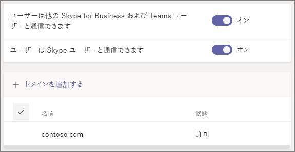

# ゲスト アクセスと外部アクセスを使用して、組織外の人々とコラボレーションする

組織外のユーザーとコミュニケーションや共同作業を行う必要がある場合、Microsoft Teams には次の 2 つのオプションがあります。

- **外部アクセス** - ユーザーが他の組織のユーザーを検索、通話、およびチャットできるようにするフェデレーションの一種です。 これらのユーザーは、ゲストとして招待されない限り、チームに追加できません。
- **ゲスト アクセス** - ゲスト アクセスでは、組織外のユーザーをチームに招待できます。 招待されたユーザーは、Azure Active Directory でゲスト アカウントを取得します。

Teams を使用すると、組織外のユーザーを会議に招待できます。 これには、外部アクセスまたはゲスト アクセスを構成する必要はありません。

## 外部アクセス (フェデレーション)

Teams、Skype for Business (オンラインまたはオンプレミス)、Skype を使用する組織外のユーザーを検索、電話、チャット、および会議を設定する必要がある場合は、外部アクセスを設定します。 

既定では、すべてのドメインに対して外部アクセスが有効になっています。 外部アクセスを制限するには、特定のドメインを許可またはブロックするか、またはオフにします。

外部アクセスを構成するには、「[外部アクセスの管理](manage-external-access.md)」を参照してください。 

>[!NOTE]
>Microsoft Teams の無料ライセンスでは、外部アクセスはサポートされていません。

## ゲスト アクセス

ゲスト アクセスを使用して、チャット、通話、会議、およびファイル上での共同作業が可能な、組織外のユーザーをチームに追加します。 ゲストには、ネイティブ チーム メンバーとほぼ同じ Teams 機能を使用できるように設定できます。

ゲストは組織の Azure Active Directory に B2B ユーザーとして追加され、ゲスト アカウントを使用して Teams にサインインする必要があります。 つまり、ゲストがお客様の組織にサインインするには、ゲスト自身の組織からサインアウトする必要がある場合があります。

Teams のゲスト アクセスを構成する方法については、「[チームでゲストと共同作業する](https://docs.microsoft.com/microsoft-365/solutions/collaborate-as-team)」を参照してください。

## 外部アクセスとゲスト アクセスの比較

次の表に、外部アクセス (フェデレーション) とゲストの使用の違いを示します。 いずれの場合も、組織外のユーザーは外部のユーザーとして識別されます。

### ユーザーが実行できる操作

| ユーザーは、次のことを実行できます | 外部アクセス ユーザー | ゲスト |
|---------|-----------------------|--------------------|
| 別の組織のユーザーとチャットする | はい | はい |
| 別の組織のユーザーに電話をかける | はい | はい |
| 別の組織のユーザーが通話またはチャットできるかどうかを確認する | はい | はい1 |
| 別の組織内のユーザーを検索する | はい2 | いいえ |
| ファイルを共有する | いいえ | はい |
| 別の組織のユーザーの不在メッセージを見る | いいえ | はい |
| 別の組織のユーザーをブロックする  | いいえ | はい |
| @メンションを使用する | はい3 | はい |

### 組織外のユーザーが実行できる操作

| 組織外のユーザーは、次のことを実行できます | 外部アクセス ユーザー | ゲスト |
|---------|-----------------------|--------------------|
| Teams のリソースにアクセスする | いいえ | はい |
| グループ チャットに追加される | いいえ | はい |
| 会議に招待される | はい | はい |
| プライベート通話をする | はい | はい5 |
| ダイヤルイン会議の参加者の電話番号を表示する | いいえ4 | はい |
| IP ビデオを使う | はい | はい5 |
| 画面共有を使う | はい3 | はい5 |
| 今すぐ会議を使う | いいえ | はい5 |
| 送信済みメッセージを編集する | はい3 | はい5 |
| 送信済みメッセージを削除する | はい3 | はい5 |
| 会話で Giphy を使用する | はい3 | はい5 |
| 会話でミームを使用する | はい3 | はい5 |
| 会話でステッカーを使用する | はい3 | はい5 |
| プレゼンスが表示される | Yes | はい |
| @メンションを使用する | はい3 | はい |

 

1 ユーザーがゲストとして追加され、ゲスト アカウントでサインインされている場合。 
2 メールまたはセッション開始プロトコル (SIP) アドレスのみ。 
3 2 つの異なる組織の Teams のみユーザーの Teams のみの 1:1 チャットでサポートされる。  
4 既定では、外部ユーザーはダイヤル インした参加者の電話番号は見ることができません。 これらの電話番号のプライバシーを維持したい場合は、**開始/終了のお知らせの種類** の **トーン** を選びます (これにより、数字が Teams によって読み上げられません)。 詳細については、「[Microsoft Teams で会議の入退室通知をオンまたはオフにする](turn-on-or-off-entry-and-exit-announcements-for-meetings-in-teams.md)」を参照してください。  
5 既定で許可されていますが、Teams 管理者がオフにすることができます

## 関連項目

[Teams での外部アクセス](manage-external-access.md)

[Teams でのゲスト アクセス](guest-access.md)

