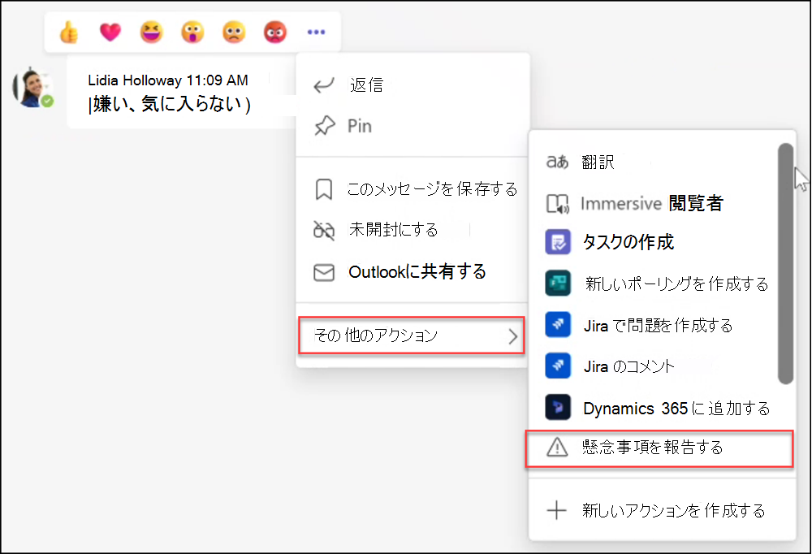
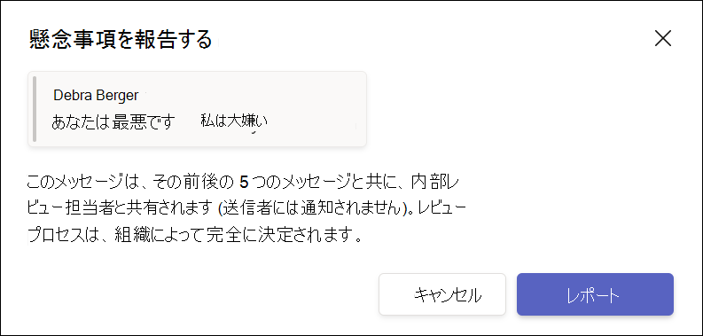

# Microsoft Teamsとの通信コンプライアンス

コミュニケーション コンプライアンスは、組織内の不適切なメッセージを検出、キャプチャ、および操作できるようにすることで、コミュニケーション リスクを最小限に抑えるMicrosoft 365のインサイダー リスク ソリューションです。

Microsoft Teamsでは、コミュニケーション コンプライアンスは、Teams チャネル、プライベート Teams チャネル、または 1:1 およびグループ チャットで[、次の種類](/microsoft-365/compliance/communication-compliance-feature-reference)の不適切なコンテンツを特定するのに役立ちます。

- 不快、冒涜、嫌がらせの言語
- 成人用、racy、および gory の画像
- 機密情報の共有

コミュニケーション コンプライアンスと組織のポリシーを構成する方法の詳細については、「[Microsoft 365のコミュニケーション コンプライアンス](/microsoft-365/compliance/communication-compliance)」を参照してください。 通信コンプライアンスを含むMicrosoft 365サブスクリプションの詳細については、「[Insider リスク ソリューション](/microsoft-365/compliance/insider-risk-solution-overview#communication-compliance)」を参照してください。

## Microsoft Teamsで通信コンプライアンスを使用する方法

コミュニケーション コンプライアンスとMicrosoft Teamsは緊密に統合されており、組織内のコミュニケーション リスクを最小限に抑えるのに役立ちます。 最初の通信コンプライアンス ポリシーを構成したら、アラートに自動的にフラグが設定される不適切なMicrosoft Teamsメッセージとコンテンツを積極的に管理できます。

### はじめに

Microsoft Teamsでのコミュニケーション コンプライアンスの使用を開始するには、Teams チャネルまたは 1:1 およびグループで不適切なユーザー アクティビティを識別するための定義済みポリシーまたはカスタム ポリシーの[計画](/microsoft-365/compliance/communication-compliance-plan)と作成から始まります。 構成プロセスの一部として、いくつかのアクセス許可と基本的な前提条件を [構成](/microsoft-365/compliance/communication-compliance-configure) する必要があることに注意してください。

Teams管理者は、次のレベルで通信コンプライアンス ポリシーを構成できます。

- **ユーザー レベル**: このレベルのポリシーは、個々のTeams ユーザーに適用されるか、組織内のすべてのTeams ユーザーに適用できます。 これらのポリシーは、これらのユーザーが 1:1 またはグループ チャットで送信できるメッセージを対象とします。 ユーザーのチャット通信は、ユーザーがメンバーであるすべてのMicrosoft Teamsで自動的に監視されます。
- **Teams レベル**: このレベルのポリシーは、プライベート チャネルを含むMicrosoft Teams チャネルに適用されます。 これらのポリシーは、Teams チャネルで送信されたメッセージのみを対象としています。

### Microsoft Teamsで懸念事項を報告する

>[!NOTE]
>ユーザーから報告されたメッセージは、2022 年 5 月から[、通信コンプライアンス](/microsoft-365/compliance/communication-compliance-configure#subscriptions-and-licensing)とMicrosoft Teamsのライセンスを付与された組織で利用できるようになります。 この機能は、2022 年 8 月 31 日までにライセンスを受けたすべての組織で使用できる必要があります。

Teams メッセージの *[懸念事項の報告*] オプションは既定で有効になっており、Teams [管理センター](/microsoftteams/manage-teams-in-modern-portal)のTeamsメッセージング ポリシーを使用して制御できます。 これにより、組織内のユーザーは、ポリシーのコミュニケーション コンプライアンス レビュー担当者によるレビューに不適切なメッセージを送信できます。 通信コンプライアンスにおけるユーザーから報告されたメッセージの詳細については、「 [コミュニケーション コンプライアンス ポリシー](/microsoft-365/compliance/communication-compliance-policies#user-reported-messages-policy)」を参照してください。

確認のためにメッセージを送信すると、ユーザーはMicrosoft Teamsで送信の確認を受け取ります。 チャットの他の参加者には、この通知は表示されません。

カスタム ポリシーを作成して割り当てる場合を除き、組織内のユーザーは自動的にグローバル ポリシーを取得します。 グローバル ポリシーの設定を編集するか、1 つ以上のカスタム ポリシーを作成して割り当てて、この機能を有効または無効にします。 詳細については、「[Teamsでのメッセージング ポリシーの管理](/microsoftteams/messaging-policies-in-teams)」を参照してください。

### Microsoft Teamsの不適切なメッセージに対する対応

ポリシーを構成し、Microsoft Teams メッセージの通信コンプライアンス アラートを受信したら、組織内のコンプライアンス レビュー担当者がこれらのメッセージに対して動作します。 また、組織で有効になっている場合は、ユーザーから報告されたメッセージも含まれます。 校閲者は、コミュニケーション コンプライアンス アラートを確認し、フラグが設定されたメッセージをMicrosoft Teamsのビューから削除することで、組織を保護するのに役立ちます。

削除されたメッセージとコンテンツは、メッセージまたはコンテンツが削除されたこと、および削除に適用できるポリシーを説明する閲覧者向けの通知に置き換えられます。 削除されたメッセージまたはコンテンツの送信者には、削除の状態も通知され、削除に関連するコンテキストの元のメッセージ コンテンツが提供されます。 送信者は、メッセージの削除に適用される特定のポリシー条件を表示することもできます。

送信者に表示されるポリシー ヒントの例:

送信者が表示するポリシー通知の例:

受信者が表示するポリシー ヒントの例:

