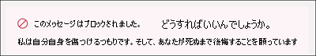
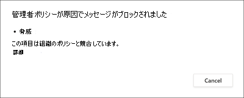
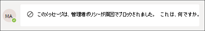

# Microsoft Teams のコミュニケーション コンプライアンス

コミュニケーション コンプライアンスは Microsoft 365 の Insider リスク ソリューションであり、組織内の不適切なメッセージの検出、取り込み、対応を支援することで、コミュニケーション リスクを最小限に抑えるのに役立ちます。

Microsoft Teams の場合、コミュニケーションコンプライアンスは、Teams チャネルまたは 1 対 1 およびグループ チャットで、次の種類の不適切なコンテンツを識別するのに役立ちます。

- 不快な言葉、不適切な言葉、嫌がらせをする言葉
- 成人向け、人種差別的な画像、およびゴリー画像
- 機密情報の共有

コミュニケーション コンプライアンスと組織のポリシーを構成する方法の詳細については [、Microsoft 365](/microsoft-365/compliance/communication-compliance)のコミュニケーション コンプライアンスを参照してください。

## Microsoft Teams でコミュニケーション コンプライアンスを使用する方法

コミュニケーション コンプライアンスと Microsoft Teams は緊密に統合され、組織内のコミュニケーション リスクを最小限に抑えるのに役立ちます。 最初のコミュニケーション コンプライアンス ポリシーを構成した後は、警告で自動的にフラグが付けられている不適切な Microsoft Teams のメッセージとコンテンツを積極的に管理できます。

### はじめに

Microsoft Teams のコミュニケーション コンプライアンスの使用を開始するには、Teams チャネルまたは 1 対 1 およびグループで不適切なユーザー アクティビティを特定するための事前に定義されたポリシーまたはカスタム ポリシーの計画と作成から始めます。 構成プロセスの一環として、いくつかのアクセス許可と基本的な前提条件を構成する必要があります。

Teams 管理者は、次のレベルでコミュニケーション コンプライアンス ポリシーを構成できます。

- **ユーザー レベル**: このレベルのポリシーは、個々の Teams ユーザーに適用するか、組織内のすべての Teams ユーザーに適用できます。 これらのポリシーは、これらのユーザーが 1 対 1 またはグループ チャットで送信できるメッセージに適用されます。 ユーザーのチャット通信は、ユーザーがメンバーであるすべての Microsoft Teams で自動的に監視されます。
- **チーム レベル**: このレベルのポリシーは、Microsoft チーム チャネルに適用されます。 これらのポリシーは、Teams チャネルで送信されたメッセージにのみ適用されます。

### Microsoft Teams で不適切なメッセージに対して行動する

ポリシーを構成し、Microsoft Teams メッセージの通信コンプライアンス警告を受け取った後は、組織内のコンプライアンスレビュー担当者がこれらのメッセージに対してアクションを実行する必要があります。 レビュー担当者は、コミュニケーション コンプライアンスの警告を確認し、Microsoft Teams のビューからフラグ付きメッセージを削除することで、組織を保護できます。

削除されたメッセージとコンテンツは、メッセージまたはコンテンツが削除され、削除に適用されるポリシーを説明する閲覧者向け通知に置き換えられる。 削除されたメッセージまたはコンテンツの送信者にも、削除の状態が通知され、削除に関連するコンテキストの元のメッセージ コンテンツが提供されます。 送信者は、メッセージの削除に適用される特定のポリシー条件を表示できます。

送信者が表示するポリシー ヒントの例:

送信者に表示されるポリシー条件通知の例:

受信者が表示するポリシー ヒントの例:

