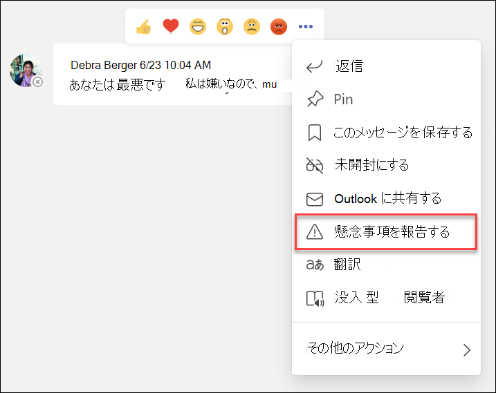

# Microsoft Teams との通信コンプライアンス

Microsoft Purview コミュニケーション コンプライアンスは Microsoft 365 のインサイダー リスク ソリューションであり、組織内の不適切なメッセージの検出、キャプチャ、および操作を支援することで、コミュニケーション リスクを最小限に抑えることができます。

Microsoft Teams の場合、コミュニケーション コンプライアンスは、Teams チャネル、プライベート Teams チャネル、または 1:1 およびグループ チャットで [、次の種類](/microsoft-365/compliance/communication-compliance-feature-reference) の不適切なコンテンツを特定するのに役立ちます。

- 不快、冒涜、嫌がらせの言語
- 成人用、racy、および gory の画像
- 機密情報の共有

コミュニケーション コンプライアンスと組織のポリシーを構成する方法の詳細については、「 [通信コンプライアンスの詳細](/microsoft-365/compliance/communication-compliance)」を参照してください。

## Microsoft Teams で通信コンプライアンスを使用する方法

コミュニケーション コンプライアンスと Microsoft Teams は緊密に統合されており、組織内のコミュニケーション リスクを最小限に抑えるのに役立ちます。 最初の通信コンプライアンス ポリシーを構成したら、アラートに自動的にフラグが設定される不適切な Microsoft Teams のメッセージとコンテンツを積極的に管理できます。

### はじめに

Microsoft Teams のコミュニケーション コンプライアンスの概要は、Teams チャネルまたは 1:1 およびグループで不適切なユーザー アクティビティを識別するための事前定義済みポリシーまたはカスタム ポリシーの [計画](/microsoft-365/compliance/communication-compliance-plan) と作成から始まります。 構成プロセスの一部として、いくつかのアクセス許可と基本的な前提条件を [構成](/microsoft-365/compliance/communication-compliance-configure) する必要があることに注意してください。

Teams 管理者は、次のレベルで通信コンプライアンス ポリシーを構成できます。

- **ユーザー レベル**: このレベルのポリシーは、個々の Teams ユーザーに適用されるか、組織内のすべての Teams ユーザーに適用される場合があります。 これらのポリシーは、これらのユーザーが 1:1 またはグループ チャットで送信できるメッセージを対象とします。 ユーザーのチャット通信は、ユーザーがメンバーであるすべての Microsoft Teams で自動的に監視されます。
- **Teams レベル**: このレベルのポリシーは、プライベート チャネルを含む Microsoft Teams チャネルに適用されます。 これらのポリシーは、Teams チャネルで送信されたメッセージのみを対象としています。

### Microsoft Teams で懸念事項を報告する

>[!NOTE]
>[コミュニケーション コンプライアンス](/microsoft-365/compliance/communication-compliance-configure#subscriptions-and-licensing)と Microsoft Teams のライセンスを取得し、使用している組織に対するユーザーから報告されたメッセージの可用性は、2022 年 5 月に開始されました。 この機能は 2022 年 8 月 31 日までに、2022 年 7 月までの通信コンプライアンスのライセンスを取得し、使用しているすべての組織で利用できるようになります。 2022 年 7 月以降に通信コンプライアンスの使用を開始する組織の場合、ユーザーから報告されたメッセージ ポリシーの可用性は、ライセンスの日付と通信コンプライアンスの最初の使用から最大 30 日かかる場合があります。

Teams の個人用およびグループ チャット メッセージの *懸念事項を報告* するオプションは既定で有効になっており、 [Teams 管理センター](/microsoftteams/manage-teams-in-modern-portal)の Teams メッセージング ポリシーを使用して制御できます。 これにより、組織内のユーザーは、ポリシーのコミュニケーション コンプライアンス レビュー担当者によるレビューに不適切な内部チャット メッセージを送信できます。 通信コンプライアンスにおけるユーザーから報告されたメッセージの詳細については、「 [コミュニケーション コンプライアンス ポリシー](/microsoft-365/compliance/communication-compliance-policies#user-reported-messages-policy)」を参照してください。

レビュー用のメッセージを送信すると、ユーザーは Microsoft Teams で提出の確認を受け取ります。 チャットの他の参加者には、この通知は表示されません。

カスタム ポリシーを作成して割り当てる場合を除き、組織内のユーザーは自動的にグローバル ポリシーを取得します。 グローバル ポリシーの設定を編集するか、1 つ以上のカスタム ポリシーを作成して割り当てて、この機能を有効または無効にします。 詳細については、「 [Teams でのメッセージング ポリシーの管理](/microsoftteams/messaging-policies-in-teams)」を参照してください。

### Microsoft Teams で不適切なメッセージに対処する

ポリシーを構成し、Microsoft Teams メッセージの通信コンプライアンス アラートを受け取った後は、組織内のコンプライアンス レビュー担当者がこれらのメッセージに対応します。 また、組織で有効になっている場合は、ユーザーから報告されたメッセージも含まれます。 校閲者は、コミュニケーション コンプライアンス アラートを確認し、フラグが設定されたメッセージを Microsoft Teams のビューから削除することで、組織を保護するのに役立ちます。

削除されたメッセージとコンテンツは、メッセージまたはコンテンツが削除されたこと、および削除に適用できるポリシーを説明する閲覧者向けの通知に置き換えられます。 削除されたメッセージまたはコンテンツの送信者には、削除の状態も通知され、削除に関連するコンテキストの元のメッセージ コンテンツが提供されます。 送信者は、メッセージの削除に適用される特定のポリシー条件を表示することもできます。

送信者に表示されるポリシー ヒントの例:

送信者が表示するポリシー通知の例:

受信者が表示するポリシー ヒントの例:

